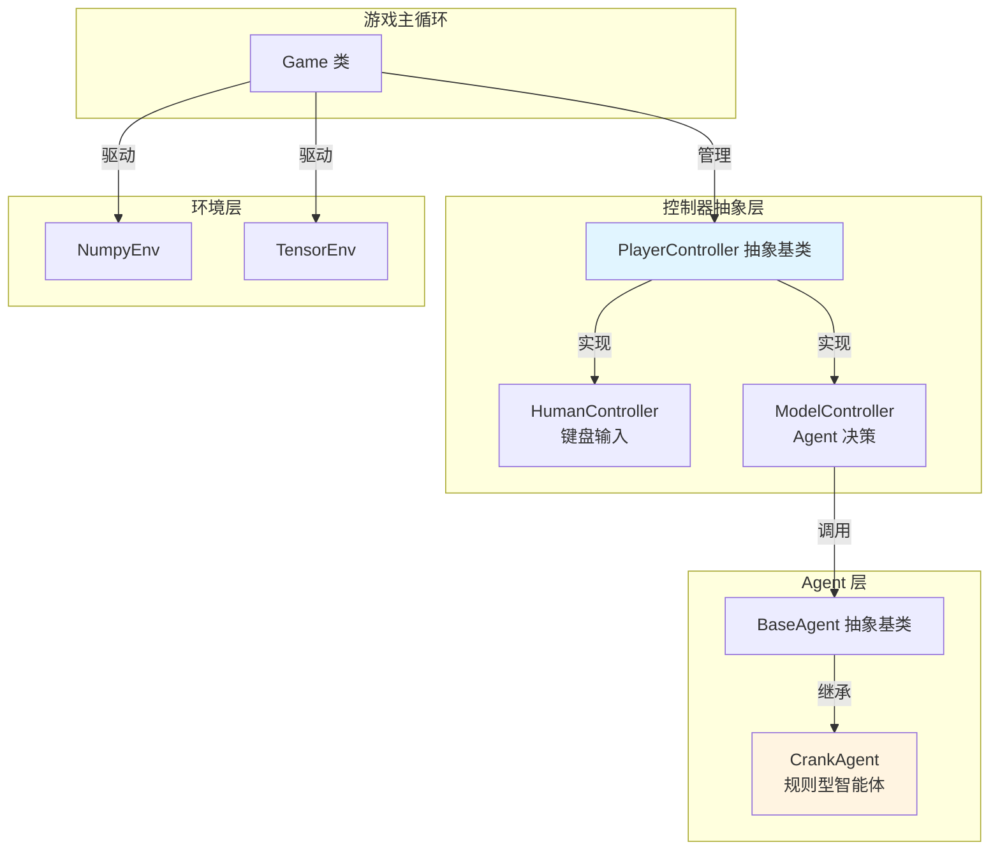
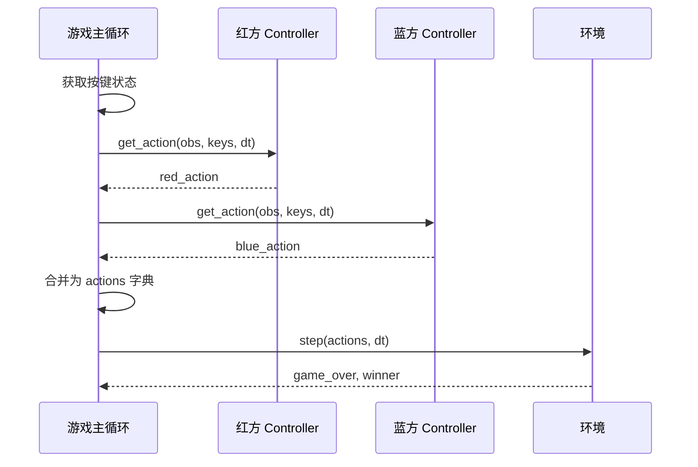
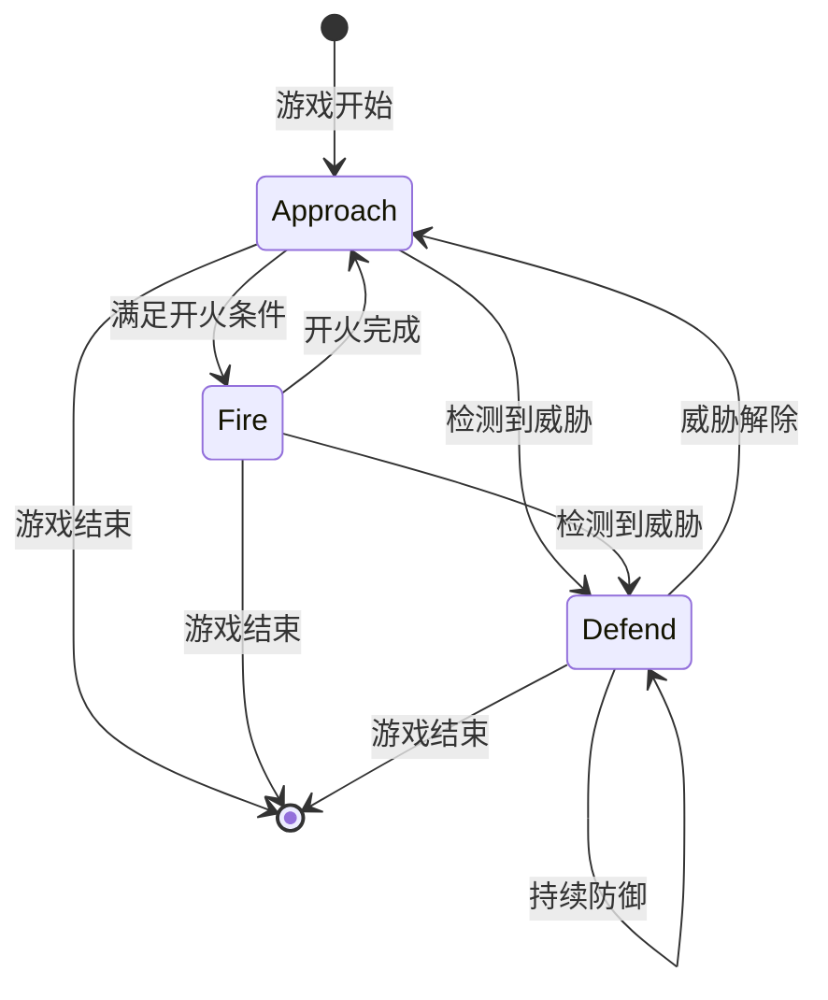
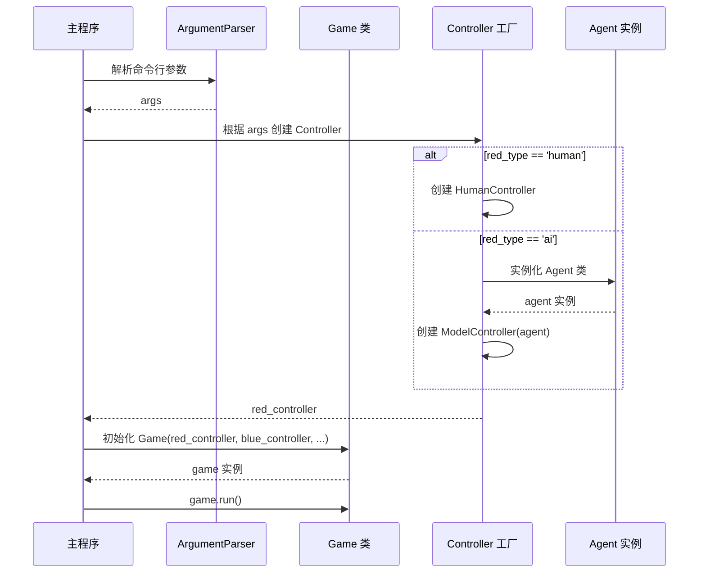
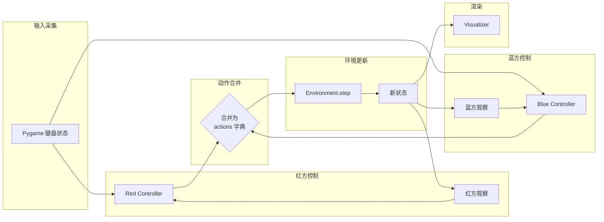
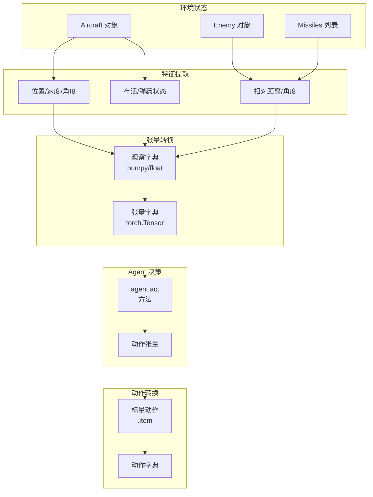

# 游戏控制接口重构与规则Agent实现

## 1. 需求背景

### 1.1 当前问题
MidrangeRL 当前的 `game_play.py` 存在以下设计问题：
- 游戏主循环与键盘输入处理紧密耦合，硬编码了人类玩家的控制逻辑
- 无法灵活切换红蓝双方的控制模式（人类玩家 vs AI Agent）
- `agents/rule_based` 目录为空，缺少冷启动阶段的基准 Agent
- 不支持通过命令行参数在游戏启动时配置双方的控制器类型

### 1.2 业务目标
1. **解耦控制逻辑**：将输入处理从游戏主循环中分离，引入 Controller 抽象层
2. **支持混合对战**：允许人机对战、人人对战、机机对战等多种组合
3. **提供规则基线**：实现基于状态机的中距空战战术 Agent，作为 RL 训练的对手和性能基准
4. **提升调试效率**：通过命令行参数快速切换控制模式，便于开发测试

### 1.3 用户场景
- **开发调试**：通过 `python game_play.py --red_type ai --blue_type human` 快速验证 Agent 行为
- **演示展示**：通过 `python game_play.py --red_type ai --blue_type ai` 展示 AI 对战效果
- **RL 训练**：规则 Agent 可作为 `train.py` 中的对手，提供更具挑战性的训练环境
- **性能测试**：规则 Agent 作为基准，评估学习型 Agent 的训练效果

## 2. 系统设计

### 2.1 架构概览



### 2.2 核心组件设计

#### 2.2.1 PlayerController 抽象基类

**职责定位**：
- 定义统一的控制接口，隔离输入来源（键盘 vs AI）
- 接收环境观察，返回符合环境 API 的动作字典
- 支持状态重置，确保跨 Episode 的状态一致性

**接口规范**：

| 方法名 | 输入参数 | 返回值 | 说明 |
|--------|---------|--------|------|
| `get_action` | `observation: dict`<br/>`keys: pygame.key.ScancodeWrapper`<br/>`dt: float` | `dict` | 返回动作字典，包含 `rudder`, `throttle_delta`, `fire` 三个键 |
| `reset` | 无 | `None` | 重置控制器内部状态（如边缘检测标志、Agent 内存等） |

**动作字典格式**：
```
{
    'rudder': float,          # 方向舵输入 [-1.0, 1.0]
    'throttle_delta': float,  # 油门变化量 [-1.0, 1.0]
    'fire': bool              # 开火指令
}
```

#### 2.2.2 HumanController 实现

**核心功能**：
- 监听 Pygame 键盘事件，将按键状态映射为动作值
- 实现舵量渐变逻辑（针对 tensor 后端）
- 实现开火边缘检测，防止单次按键触发多次发射

**键位映射表**：

| 功能 | 按键 | 动作值 |
|------|------|--------|
| 左转 | A | rudder = -1.0 |
| 右转 | D | rudder = 1.0 |
| 加速 | W | throttle_delta = 1.0 |
| 减速 | S | throttle_delta = -1.0 |
| 开火 | T | fire = True（边缘检测）|

**状态管理**：
- 维护上一帧的开火按键状态，用于边缘检测
- 维护当前舵量渐变值（tensor 后端）
- 区分不同后端的输入处理逻辑（numpy 已有内置冷却机制）

#### 2.2.3 ModelController 实现

**核心功能**：
- 将环境观察转换为 Agent 可识别的格式
- 调用 Agent 的 `act` 方法获取动作
- 将 Agent 输出的张量动作转换为游戏可用的字典格式

**观察空间转换**：

从环境渲染状态提取以下信息构建观察：

| 观察项 | 提取来源 | 数据类型 | 说明 |
|--------|---------|----------|------|
| x | `aircraft.x` | float | 当前飞机位置 x 坐标 |
| y | `aircraft.y` | float | 当前飞机位置 y 坐标 |
| angle | `aircraft.angle` | float | 当前飞机朝向角度 |
| speed | `aircraft.speed` | float | 当前飞机速度 |
| missiles | `aircraft.missiles` | int | 剩余导弹数量 |
| alive | `aircraft.alive` | bool | 存活状态 |
| enemy_distance | 计算值 | float | 与敌机的距离 |
| enemy_relative_angle | 计算值 | float | 敌机相对于己方的角度 |
| enemy_speed | `enemy.speed` | float | 敌机速度 |
| enemy_alive | `enemy.alive` | bool | 敌机存活状态 |

**张量适配策略**：
- 使用 `torch.tensor` 包装标量观察为 `[1]` 形状的张量（单环境）
- Agent 输出的 `[1]` 形状张量通过 `.item()` 提取标量值
- 对于布尔类型的 `fire` 动作，转换为 Python bool 类型

#### 2.2.4 Game 类重构

**重构策略**：
- 移除 `handle_input` 方法，改由 Controller 负责
- 新增 `red_controller` 和 `blue_controller` 成员变量
- 在主循环中分别调用双方 Controller 的 `get_action` 方法
- 合并双方动作为环境所需的完整动作字典

**初始化参数扩展**：

| 参数名 | 类型 | 默认值 | 说明 |
|--------|------|--------|------|
| `red_type` | str | 'human' | 红方控制类型：'human' 或 'ai' |
| `blue_type` | str | 'human' | 蓝方控制类型：'human' 或 'ai' |
| `red_agent_class` | class | None | 红方 Agent 类（当 red_type='ai' 时使用） |
| `blue_agent_class` | class | None | 蓝方 Agent 类（当 blue_type='ai' 时使用） |

**主循环逻辑流程**：



### 2.3 规则 Agent 设计

#### 2.3.1 CrankAgent 概述

**设计理念**：
基于经典中距空战战术的状态机 Agent，模拟真实飞行员的决策过程：
- **Approach（接敌）**：飞向敌机，缩短距离
- **Fire（开火）**：在合适时机发射导弹
- **Defend（防御）**：检测威胁并执行摆脱机动

**继承关系**：
- 继承自 `agents.base_agent.BaseAgent`
- 实现 `act` 和 `reset` 抽象方法
- 支持单环境和多环境运行（通过 `num_envs` 属性）

#### 2.3.2 状态机设计



**状态转换条件**：

| 当前状态 | 目标状态 | 转换条件 |
|----------|----------|----------|
| Approach | Fire | `distance < max_range * 0.8` 且 `heading_error < 30°` 且 `has_missiles` 且 `no_active_missiles` |
| Approach | Defend | `incoming_missile_detected` 或 `distance < min_safe_distance` |
| Fire | Approach | 发射完成（fire 指令下发后） |
| Fire | Defend | `incoming_missile_detected` 或 `distance < min_safe_distance` |
| Defend | Approach | `threat_cleared` |

#### 2.3.3 决策逻辑详解

**Approach 状态**：

目标：追踪敌机，调整朝向指向敌机

计算步骤：
1. 计算敌机相对角度 `target_angle = atan2(enemy_y - self_y, enemy_x - self_x)`
2. 计算航向误差 `heading_error = normalize_angle(target_angle - self_angle)`
3. 根据误差生成舵量：
   - 如果 `heading_error > threshold`，`rudder = 1.0`（右转）
   - 如果 `heading_error < -threshold`，`rudder = -1.0`（左转）
   - 否则 `rudder = clamp(heading_error / max_error, -1.0, 1.0)`（比例控制）
4. 油门策略：保持最大油门 `throttle_delta = 1.0`（追求速度优势）
5. 开火指令：`fire = False`

**Fire 状态**：

目标：在满足条件时发射导弹

开火条件判断：
1. 距离条件：`distance < max_range * 0.8`（避免在极限距离开火）
2. 角度条件：`abs(heading_error) < fire_angle_threshold`（机头对准敌机）
3. 弹药条件：`missiles > 0`
4. 冷却条件：场上没有己方高速飞行的导弹（避免浪费弹药）

动作生成：
- 如果满足所有条件：`fire = True`，并保持指向敌机的舵量
- 开火后立即转换回 Approach 状态
- 油门策略：保持最大油门

**Defend 状态**：

目标：摆脱敌方导弹威胁

威胁检测逻辑：
1. 遍历场上所有导弹
2. 判断导弹是否属于敌方（通过导弹的 `target` 属性或颜色标识）
3. 计算导弹与己方的距离和相对速度
4. 如果距离小于威胁距离阈值 `threat_distance`，判定为威胁

机动策略（置尾/Drag）：
1. 计算导弹到己方的向量方向 `missile_to_self_angle`
2. 目标朝向为远离导弹的方向：`escape_angle = missile_to_self_angle + 180°`
3. 生成转向舵量使机头指向逃逸方向
4. 油门策略：
   - 如果导弹距离很近（< 5000m），减速（`throttle_delta = -1.0`）增加导弹能量消耗
   - 如果导弹距离中等（5000m - 15000m），保持速度（`throttle_delta = 0.0`）
   - 如果导弹距离较远（> 15000m），加速（`throttle_delta = 1.0`）拉开距离
5. 开火指令：`fire = False`（防御状态不开火）

威胁解除条件：
- 所有威胁导弹距离超过安全距离 `safe_distance`
- 或所有威胁导弹速度低于失效阈值

#### 2.3.4 参数配置

**距离阈值**：

| 参数名 | 数值 | 单位 | 说明 |
|--------|------|------|------|
| `max_missile_range` | 25000 | 米 | 导弹最大射程估计值 |
| `fire_range_ratio` | 0.8 | 无量纲 | 开火距离比例（避免极限射程） |
| `threat_distance` | 20000 | 米 | 威胁检测距离 |
| `safe_distance` | 25000 | 米 | 安全距离（威胁解除阈值） |
| `min_safe_distance` | 8000 | 米 | 最小安全距离（强制防御） |

**角度阈值**：

| 参数名 | 数值 | 单位 | 说明 |
|--------|------|------|------|
| `fire_angle_threshold` | 30 | 度 | 开火允许的最大航向误差 |
| `heading_threshold` | 5 | 度 | 比例控制的死区 |
| `max_heading_error` | 45 | 度 | 用于归一化舵量的最大误差 |

**速度阈值**：

| 参数名 | 数值 | 单位 | 说明 |
|--------|------|------|------|
| `missile_effective_speed` | 150 | 米/秒 | 导弹有效速度阈值（低于此值视为失效） |

#### 2.3.5 多环境支持

**批量处理策略**：
- 观察输入为字典，每个键对应形状为 `[num_envs]` 的张量
- 内部状态（如当前状态机状态）维护为 `[num_envs]` 的张量或列表
- 决策逻辑通过向量化运算或循环处理每个环境

**状态重置机制**：
- `reset(env_mask)` 方法接收环境掩码参数
- 如果 `env_mask` 为 None，重置所有环境
- 否则仅重置 `env_mask` 为 True 的环境
- 重置操作包括：将状态机切换到 Approach，清空威胁记录

### 2.4 命令行接口设计

**参数定义**：

| 参数名 | 类型 | 默认值 | 可选值 | 说明 |
|--------|------|--------|--------|------|
| `--backend` | str | 'numpy' | 'numpy', 'tensor' | 环境后端类型 |
| `--red_type` | str | 'human' | 'human', 'ai' | 红方控制类型 |
| `--blue_type` | str | 'human' | 'human', 'ai' | 蓝方控制类型 |
| `--red_agent` | str | None | 'crank', ... | 红方 Agent 类型（当 red_type='ai' 时生效） |
| `--blue_agent` | str | None | 'crank', ... | 蓝方 Agent 类型（当 blue_type='ai' 时生效） |

**Agent 类型映射表**：

| 字符串标识 | Agent 类 | 导入路径 |
|-----------|----------|----------|
| 'crank' | CrankAgent | agents.rule_based.rule_agent |

**使用示例**：

```bash
# 人类 vs 规则 AI
python game_play.py --red_type human --blue_type ai --blue_agent crank

# 规则 AI vs 规则 AI
python game_play.py --red_type ai --blue_type ai --red_agent crank --blue_agent crank --backend tensor

# 默认人人对战
python game_play.py
```

## 3. 数据流设计

### 3.1 初始化流程



### 3.2 游戏循环数据流



### 3.3 观察空间数据流（ModelController）



## 4. 接口规范

### 4.1 PlayerController 接口

**抽象基类定义**：

```
类名：PlayerController
继承：ABC（抽象基类）

属性：
- env_backend: str  # 环境后端类型（'numpy' 或 'tensor'）

方法：
- __init__(self, env_backend: str = 'numpy')
  初始化控制器，设置环境后端类型

- get_action(self, observation: dict, keys: pygame.key.ScancodeWrapper, dt: float) -> dict
  [抽象方法] 根据观察和输入返回动作字典
  
  输入：
    - observation: dict，包含当前玩家和敌方的状态信息
    - keys: Pygame 按键状态对象
    - dt: float，时间步长（秒）
  
  输出：
    - dict，包含键：'rudder', 'throttle_delta', 'fire'

- reset(self) -> None
  [抽象方法] 重置控制器内部状态
```

### 4.2 HumanController 接口

**实现类定义**：

```
类名：HumanController
继承：PlayerController

属性：
- key_mapping: dict  # 键位映射配置
- prev_fire_key: bool  # 上一帧开火键状态（边缘检测）
- current_rudder: float  # 当前舵量（tensor 后端渐变）

方法：
- __init__(self, env_backend: str = 'numpy', key_mapping: dict = None)
  初始化人类控制器
  
  输入：
    - env_backend: 环境后端类型
    - key_mapping: 自定义键位映射（可选）
      默认映射：{
        'left': pygame.K_LEFT,
        'right': pygame.K_RIGHT,
        'up': pygame.K_UP,
        'down': pygame.K_DOWN,
        'fire': pygame.K_EQUALS
      }

- get_action(self, observation: dict, keys: pygame.key.ScancodeWrapper, dt: float) -> dict
  处理键盘输入并生成动作
  
  逻辑：
    1. 读取方向键状态，生成舵量输入
    2. 读取油门键状态，生成油门变化量
    3. 读取开火键，通过边缘检测判断是否开火
    4. 如果是 tensor 后端，应用舵量渐变逻辑
    5. 返回动作字典

- reset(self) -> None
  重置内部状态
  
  操作：
    - 将 prev_fire_key 设为 False
    - 将 current_rudder 设为 0.0
```

### 4.3 ModelController 接口

**实现类定义**：

```
类名：ModelController
继承：PlayerController

属性：
- agent: BaseAgent  # 受控的 Agent 实例
- device: torch.device  # 计算设备

方法：
- __init__(self, agent: BaseAgent, env_backend: str = 'numpy')
  初始化模型控制器
  
  输入：
    - agent: BaseAgent 实例
    - env_backend: 环境后端类型
  
  操作：
    - 保存 agent 引用
    - 设置 agent.num_envs = 1（单环境游戏）
    - 获取 agent 的设备

- get_action(self, observation: dict, keys: pygame.key.ScancodeWrapper, dt: float) -> dict
  调用 Agent 生成动作
  
  逻辑：
    1. 将 observation 转换为张量格式（如果需要）
    2. 调用 agent.act(observation)
    3. 将张量动作转换为标量字典
    4. 返回动作字典

- reset(self) -> None
  重置 Agent 内部状态
  
  操作：
    - 调用 agent.reset()

- _convert_obs_to_tensor(self, observation: dict) -> dict
  [私有方法] 将观察字典转换为张量格式
  
  输入：
    - observation: dict，包含标量或 numpy 数组
  
  输出：
    - dict，所有值为形状 [1] 的 torch.Tensor

- _convert_action_to_dict(self, action: dict) -> dict
  [私有方法] 将张量动作转换为标量字典
  
  输入：
    - action: dict，Agent 输出的张量动作
  
  输出：
    - dict，包含 Python 标量的动作字典
```

### 4.4 CrankAgent 接口

**实现类定义**：

```
类名：CrankAgent
继承：BaseAgent

属性：
- states: torch.Tensor  # 当前状态机状态 [num_envs]，枚举值：0=Approach, 1=Fire, 2=Defend
- threat_detected: torch.Tensor  # 威胁检测标志 [num_envs]
- last_fire_time: torch.Tensor  # 上次开火时间 [num_envs]（用于冷却判断）

常量：
- STATE_APPROACH = 0
- STATE_FIRE = 1
- STATE_DEFEND = 2
- MAX_MISSILE_RANGE = 25000.0
- FIRE_RANGE_RATIO = 0.8
- FIRE_ANGLE_THRESHOLD = 30.0
- THREAT_DISTANCE = 20000.0
- SAFE_DISTANCE = 25000.0
- MIN_SAFE_DISTANCE = 8000.0

方法：
- __init__(self, device: str = 'cpu')
  初始化规则 Agent
  
  输入：
    - device: 计算设备（规则 Agent 建议使用 'cpu'）
  
  操作：
    - 调用父类初始化
    - 初始化状态张量

- act(self, observation: dict) -> dict
  根据观察生成动作
  
  输入：
    - observation: dict，包含以下键（所有为 [num_envs] 张量）：
      - x, y, angle, speed, missiles, alive
      - enemy_distance, enemy_relative_angle, enemy_speed, enemy_alive
      - missiles_info（可选）：场上导弹信息，用于威胁检测
  
  输出：
    - dict，包含键：'rudder', 'throttle', 'fire'（所有为 [num_envs] 张量）
  
  逻辑：
    1. 检测威胁（调用 _detect_threats）
    2. 更新状态机（调用 _update_state）
    3. 根据当前状态执行对应决策：
       - Approach: _approach_logic
       - Fire: _fire_logic
       - Defend: _defend_logic
    4. 返回动作张量

- reset(self, env_mask: Optional[torch.Tensor] = None) -> None
  重置 Agent 状态
  
  输入：
    - env_mask: 可选，形状 [num_envs] 的布尔张量，指定要重置的环境
  
  操作：
    - 将指定环境的状态设为 STATE_APPROACH
    - 清空威胁检测标志
    - 重置开火时间

- _detect_threats(self, observation: dict) -> torch.Tensor
  [私有方法] 检测威胁
  
  输入：
    - observation: 观察字典
  
  输出：
    - torch.Tensor，形状 [num_envs]，布尔类型，表示是否检测到威胁

- _update_state(self, observation: dict, threat_detected: torch.Tensor) -> None
  [私有方法] 更新状态机
  
  输入：
    - observation: 观察字典
    - threat_detected: 威胁检测结果
  
  操作：
    - 根据当前状态和条件判断是否需要状态转换
    - 更新 self.states

- _approach_logic(self, observation: dict) -> dict
  [私有方法] Approach 状态决策
  
  输入：
    - observation: 观察字典
  
  输出：
    - dict，动作张量

- _fire_logic(self, observation: dict) -> dict
  [私有方法] Fire 状态决策
  
  输入：
    - observation: 观察字典
  
  输出：
    - dict，动作张量

- _defend_logic(self, observation: dict, threat_detected: torch.Tensor) -> dict
  [私有方法] Defend 状态决策
  
  输入：
    - observation: 观察字典
    - threat_detected: 威胁检测结果
  
  输出：
    - dict，动作张量

- _calculate_heading_error(self, self_angle: torch.Tensor, target_angle: torch.Tensor) -> torch.Tensor
  [私有方法] 计算航向误差
  
  输入：
    - self_angle: 己方朝向角度 [num_envs]
    - target_angle: 目标角度 [num_envs]
  
  输出：
    - torch.Tensor，归一化的航向误差 [-180, 180] 度

- _normalize_angle(self, angle: torch.Tensor) -> torch.Tensor
  [私有方法] 归一化角度到 [-180, 180] 度
  
  输入：
    - angle: 角度张量 [num_envs]
  
  输出：
    - torch.Tensor，归一化后的角度
```

## 5. 实现要点

### 5.1 文件组织

**新增文件**：

```
agents/rule_based/
├── __init__.py          # 导出 CrankAgent
└── rule_agent.py        # CrankAgent 实现

game_play.py              # 重构后的游戏主程序
```

**修改文件**：

```
game_play.py              # 引入 Controller 抽象层，重构主循环
```

### 5.2 关键实现细节

#### 5.2.1 观察空间构建（ModelController）

观察构建的核心挑战是从环境的渲染状态中提取 Agent 所需的结构化信息：

**提取策略**：
- 从 `env.get_render_state()` 获取 aircraft 和 missiles 对象
- 根据 `is_player1` 属性区分红蓝双方
- 计算相对量（距离、角度）使用几何公式：
  - 距离：`sqrt((x2-x1)^2 + (y2-y1)^2)`
  - 相对角度：`atan2(y2-y1, x2-x1)` 转换为度数

**导弹信息组织**（用于威胁检测）：
- 遍历 missiles 列表，根据导弹的 `target` 属性或颜色判断归属
- 对于威胁导弹（目标为己方），提取：
  - 位置 (x, y)
  - 速度 (speed)
  - 距离（计算值）
- 组织为嵌套字典或张量列表

#### 5.2.2 状态机转换逻辑（CrankAgent）

状态转换需要考虑优先级，避免状态震荡：

**转换优先级**（从高到低）：
1. 威胁检测 → Defend（最高优先级，生存第一）
2. 距离过近 → Defend（避免近距离缠斗）
3. 开火条件满足 → Fire（攻击时机）
4. 默认 → Approach（基础状态）

**防抖动机制**：
- 状态转换设置最小持续时间（如 Defend 状态至少保持 3 秒）
- 威胁解除后不立即切换，需确认安全持续一段时间

#### 5.2.3 威胁检测实现（CrankAgent）

威胁检测需要判断导弹的归属和危险程度：

**导弹归属判断**：
- 方案 1：通过导弹的 `target` 属性判断（如果环境提供）
- 方案 2：通过导弹的颜色属性判断（与发射者一致）
- 方案 3：通过导弹的初始位置判断（靠近哪方飞机）

**危险程度评估**：
- 距离因素：距离越近，威胁越高
- 速度因素：高速导弹更危险
- 相对角度：正面来袭比侧面更危险

**综合威胁分数**：
```
threat_score = distance_weight * normalized_distance 
             + speed_weight * normalized_speed 
             + angle_weight * normalized_angle
```
如果 `threat_score > threshold`，则判定为威胁

#### 5.2.4 多环境批量处理（CrankAgent）

**向量化运算示例**（Approach 状态舵量计算）：

```
计算流程（伪代码）：
1. 计算所有环境的目标角度
   target_angles = torch.atan2(enemy_y - self_y, enemy_x - self_x) * 180 / pi

2. 计算航向误差
   heading_errors = normalize_angle(target_angles - self_angles)

3. 批量判断并生成舵量
   rudders = torch.zeros(num_envs)
   rudders[heading_errors > threshold] = 1.0
   rudders[heading_errors < -threshold] = -1.0
   
   # 对于在死区内的，使用比例控制
   in_deadzone = torch.abs(heading_errors) <= threshold
   rudders[in_deadzone] = torch.clamp(
       heading_errors[in_deadzone] / max_error, -1.0, 1.0
   )

4. 返回批量动作
   return {'rudder': rudders, ...}
```

**循环处理备选方案**：
如果逻辑过于复杂难以向量化，可使用循环逐环境处理：
```
for env_idx in range(num_envs):
    obs_single = {k: v[env_idx] for k, v in observation.items()}
    action_single = self._process_single_env(obs_single, env_idx)
    actions['rudder'][env_idx] = action_single['rudder']
    ...
```

#### 5.2.5 后端兼容性处理

**numpy 后端特殊处理**：
- numpy 后端的 `step` 方法返回 `(game_over, winner)`，而非标准 Gym 格式
- numpy 后端已有内置的发射冷却机制，无需在 Controller 中做边缘检测
- numpy 后端的渲染状态直接包含 Python 对象，无需张量转换

**tensor 后端特殊处理**：
- tensor 后端需要批量处理（虽然游戏中 num_envs=1）
- 渲染状态可能来自张量，需要 `.item()` 提取标量
- 开火需要边缘检测，避免单帧触发多次

**统一接口设计原则**：
- Controller 的 `get_action` 接口保持一致，屏蔽后端差异
- 内部根据 `env_backend` 属性分支处理
- 动作输出格式统一为 Python 字典，由 Game 类负责后续转换

### 5.3 错误处理

**异常情况处理表**：

| 异常场景 | 检测方法 | 处理策略 |
|----------|---------|----------|
| Agent 类型不存在 | 命令行解析时检查字符串 | 抛出 ValueError，提示可用类型 |
| Agent 实例化失败 | try-except 包裹实例化 | 打印错误信息，回退到人类控制 |
| 观察格式不匹配 | 检查 observation 字典键 | 填充默认值或抛出 KeyError |
| Agent 返回非法动作 | 检查动作范围和类型 | Clamp 到合法范围，记录警告 |
| 环境后端不支持 | Game 初始化时检查 backend 参数 | 抛出 ValueError |

**日志记录策略**：
- 使用 Python logging 模块
- 关键事件：状态机转换、威胁检测、开火决策
- 调试信息：观察值、动作值、内部状态

## 6. 测试验证

### 6.1 单元测试范围

**PlayerController 测试**：
- HumanController 键位映射正确性
- HumanController 边缘检测有效性
- ModelController 观察转换准确性
- ModelController 动作转换准确性

**CrankAgent 测试**：
- 状态机初始状态为 Approach
- Approach 状态正确追踪敌机
- Fire 状态在满足条件时开火
- Defend 状态检测威胁并执行机动
- 状态转换逻辑符合预期
- 多环境批量处理正确性

### 6.2 集成测试场景

**游戏模式测试**：

| 测试场景 | 命令 | 验证点 |
|---------|------|--------|
| 人人对战 | `python game_play.py` | 双方均响应键盘输入 |
| 人机对战（AI 蓝方） | `python game_play.py --blue_type ai --blue_agent crank` | 蓝方自动决策，红方手动控制 |
| 人机对战（AI 红方） | `python game_play.py --red_type ai --red_agent crank` | 红方自动决策，蓝方手动控制 |
| 机机对战 | `python game_play.py --red_type ai --blue_type ai --red_agent crank --blue_agent crank` | 双方自动对战，无需人工干预 |
| Tensor 后端 | `python game_play.py --backend tensor --red_type ai --red_agent crank` | 使用 GPU 后端，Agent 正常工作 |

**行为测试**：

| 测试项 | 初始条件 | 预期行为 | 观察方法 |
|--------|---------|---------|----------|
| Approach 行为 | 距离 > 20km，无威胁 | 朝敌机方向飞行，保持最大油门 | 观察轨迹和朝向 |
| Fire 行为 | 距离约 18km，机头对准敌机 | 发射导弹，场上出现己方导弹 | 观察导弹发射事件 |
| Defend 行为 | 敌方导弹接近（< 15km） | 改变航向远离导弹，调整油门 | 观察机动轨迹 |
| 状态转换 | Fire 完成后 | 切换回 Approach 状态 | 日志记录状态变化 |

### 6.3 性能测试

**帧率测试**：
- 人人对战：目标 60 FPS
- 人机对战：目标 60 FPS（Agent 决策不应显著影响性能）
- 机机对战：目标 60 FPS

**Agent 决策延迟**：
- CrankAgent.act 方法单次调用时间 < 1ms
- 即使在多环境模式（num_envs=1000），决策时间 < 50ms

## 7. 性能优化设计

### 7.1 批量运行性能目标

**设计目标**：
CrankAgent 必须支持在 RL 训练模式下高效批量运行，作为对手智能体或基线智能体。

**性能指标**：

| 环境数量 | 目标延迟（GPU） | 目标延迟（CPU） | 吞吐量（steps/sec） |
|---------|---------------|---------------|-------------------|
| 1 | < 0.1ms | < 0.5ms | 10000+ |
| 100 | < 0.5ms | < 10ms | 200000+ |
| 1000 | < 2ms | < 100ms | 500000+ |
| 10000 | < 10ms | < 1s | 1000000+ |

**性能优势分析**：
- **无神经网络开销**：规则 Agent 不需要矩阵乘法和激活函数
- **计算复杂度**：O(N) 线性复杂度，N 为环境数量
- **显存占用**：仅存储状态张量，无模型参数和梯度
- **并行效率**：GPU 利用率高，适合大批量并行

### 7.2 向量化实现策略

#### 7.2.1 核心原则

**完全向量化**：
- 避免 Python 循环，所有逻辑使用张量操作
- 利用 PyTorch 的广播机制处理批量数据
- 使用布尔掩码实现条件分支

**示例：批量航向误差计算**

```
流程描述（非代码）：

输入：
- self_angle: [num_envs] 己方朝向
- enemy_x, enemy_y: [num_envs] 敌方位置
- self_x, self_y: [num_envs] 己方位置

步骤 1：批量计算目标角度
  dx = enemy_x - self_x  # [num_envs]
  dy = enemy_y - self_y  # [num_envs]
  target_angle = atan2(dy, dx) * 180 / pi  # [num_envs]

步骤 2：批量计算航向误差并归一化到 [-180, 180]
  error = target_angle - self_angle  # [num_envs]
  error = (error + 180) % 360 - 180  # [num_envs]

步骤 3：批量生成舵量（使用掩码避免循环）
  rudder = zeros(num_envs)
  
  # 大误差：满舵
  mask_right = error > heading_threshold
  rudder[mask_right] = 1.0
  
  mask_left = error < -heading_threshold
  rudder[mask_left] = -1.0
  
  # 小误差：比例控制
  mask_prop = abs(error) <= heading_threshold
  rudder[mask_prop] = clamp(error[mask_prop] / max_error, -1, 1)

输出：
  rudder: [num_envs] 批量舵量
```

#### 7.2.2 状态机批量管理

**状态张量表示**：
```
self.states: LongTensor [num_envs]
  值域：{0: Approach, 1: Fire, 2: Defend}
  
self.threat_detected: BoolTensor [num_envs]
  表示每个环境是否检测到威胁
  
self.last_fire_time: FloatTensor [num_envs]
  记录每个环境上次开火的时间戳
```

**批量状态转换**：
```
流程描述：

输入：
- states: [num_envs] 当前状态
- distance: [num_envs] 与敌机距离
- threat_detected: [num_envs] 威胁标志

步骤 1：创建转换掩码
  should_defend = threat_detected | (distance < min_safe_distance)
  can_fire = (distance < fire_range) & (abs(heading_error) < fire_threshold) & (missiles > 0)
  
步骤 2：按优先级批量更新状态
  # 优先级 1：威胁 → Defend
  states[should_defend] = STATE_DEFEND
  
  # 优先级 2：开火条件 → Fire（仅对 Approach 状态）
  can_transition_to_fire = (states == STATE_APPROACH) & can_fire & ~should_defend
  states[can_transition_to_fire] = STATE_FIRE
  
  # 优先级 3：Fire 完成 → Approach
  fire_complete = (states == STATE_FIRE) & ~can_fire
  states[fire_complete] = STATE_APPROACH
  
  # 优先级 4：威胁解除 → Approach
  threat_clear = (states == STATE_DEFEND) & ~should_defend
  states[threat_clear] = STATE_APPROACH

输出：
  更新后的 states: [num_envs]
```

#### 7.2.3 威胁检测优化

**挑战**：
导弹数量不固定，需要动态判断每个导弹对每个环境的威胁。

**高效实现方案**：

方案 A：广播距离矩阵（推荐，适合导弹数 < 100）
```
输入：
- aircraft_x, aircraft_y: [num_envs] 己方位置
- missile_x, missile_y: [num_missiles] 导弹位置
- missile_target: [num_missiles] 导弹目标（0=红方, 1=蓝方）
- player_id: scalar，己方 ID（0 或 1）

步骤 1：筛选威胁导弹
  threat_mask = (missile_target == player_id)  # [num_missiles]
  threat_missiles_x = missile_x[threat_mask]  # [num_threats]
  threat_missiles_y = missile_y[threat_mask]

步骤 2：计算距离矩阵（利用广播）
  # aircraft: [num_envs, 1], missiles: [1, num_threats]
  dx = aircraft_x.unsqueeze(1) - threat_missiles_x.unsqueeze(0)  # [num_envs, num_threats]
  dy = aircraft_y.unsqueeze(1) - threat_missiles_y.unsqueeze(0)
  distances = sqrt(dx**2 + dy**2)  # [num_envs, num_threats]

步骤 3：批量判断威胁
  has_threat = (distances < threat_distance).any(dim=1)  # [num_envs]
  min_threat_dist = distances.min(dim=1).values  # [num_envs] 最近威胁距离

输出：
  has_threat: [num_envs] 布尔张量
  min_threat_dist: [num_envs] 最小威胁距离（用于调整防御策略）
```

方案 B：分环境处理（备选，适合导弹数 > 100）
```
使用 for 循环逐环境处理，但内部仍然向量化：

for env_idx in range(num_envs):
    env_threats = threat_missiles[threat_missiles的target对应该环境]
    distances = calculate_distances_vectorized(aircraft[env_idx], env_threats)
    has_threat[env_idx] = (distances < threshold).any()

权衡：牺牲少量并行性，但避免大矩阵内存爆炸
```

#### 7.2.4 动作生成批量化

**分状态批量决策**：
```
输入：
- states: [num_envs] 当前状态
- observation: dict，所有值为 [num_envs] 张量

步骤 1：初始化动作张量
  rudder = zeros(num_envs)
  throttle = ones(num_envs)  # 默认全油门
  fire = zeros(num_envs, dtype=bool)

步骤 2：为每种状态批量计算动作
  # Approach 状态
  mask_approach = (states == STATE_APPROACH)
  if mask_approach.any():
      rudder[mask_approach] = calculate_approach_rudder(observation, mask_approach)
      throttle[mask_approach] = 1.0
  
  # Fire 状态
  mask_fire = (states == STATE_FIRE)
  if mask_fire.any():
      rudder[mask_fire] = calculate_approach_rudder(observation, mask_fire)  # 保持指向
      fire[mask_fire] = True
      throttle[mask_fire] = 1.0
  
  # Defend 状态
  mask_defend = (states == STATE_DEFEND)
  if mask_defend.any():
      rudder[mask_defend] = calculate_defend_rudder(observation, mask_defend)
      throttle[mask_defend] = calculate_defend_throttle(min_threat_dist[mask_defend])

步骤 3：组装动作字典
  actions = {
      'rudder': rudder,
      'throttle': throttle,
      'fire': fire
  }

输出：
  actions: dict，所有值为 [num_envs] 张量
```

### 7.3 性能监控与分析

**关键指标**：

| 指标名称 | 测量方法 | 目标值 |
|---------|---------|-------|
| act 方法延迟 | time.perf_counter() | < 2ms @ 1000 envs |
| 状态转换开销 | 分段计时 | < 0.3ms @ 1000 envs |
| 威胁检测开销 | 分段计时 | < 0.5ms @ 1000 envs |
| 动作生成开销 | 分段计时 | < 0.5ms @ 1000 envs |
| GPU 显存占用 | torch.cuda.memory_allocated | < 10MB @ 1000 envs |

**性能测试工具**：

```
功能描述：

创建性能基准测试脚本 benchmark_crank_agent.py：

1. 测试不同环境数量下的 act 延迟
   - 环境数：1, 10, 100, 1000, 10000
   - 每个配置运行 1000 次取平均
   
2. 测试不同导弹数量下的威胁检测性能
   - 导弹数：0, 10, 50, 100
   - 记录威胁检测子模块耗时
   
3. 对比 CPU vs GPU 性能
   - 相同配置在两种设备上运行
   - 找到 CPU/GPU 切换的临界点
   
4. 输出性能报告
   - 延迟分布直方图
   - 吞吐量曲线（steps/sec vs num_envs）
   - 瓶颈分析（哪个子模块最慢）
```

**性能调优建议**：

| 瓶颈场景 | 优化手段 |
|---------|----------|
| 威胁检测慢（导弹多） | 使用空间分区（如网格索引）减少距离计算 |
| 状态转换慢 | 预计算转换条件，合并掩码操作 |
| CPU-GPU 传输慢 | 确保观察和动作始终在同一设备，避免跨设备拷贝 |
| 三角函数慢 | 使用查找表或近似算法（如果精度允许） |

### 7.4 训练集成建议

**作为对手 Agent 使用**：
```
场景：训练学习型 Agent 对抗 CrankAgent

配置示例（描述性）：

env = MidrangeRLEnv(num_envs=1000, device='cuda')
learning_agent = PPOAgent(...)  # 被训练的智能体
opponent_agent = CrankAgent(device='cuda')  # 规则对手

训练循环：
for episode in range(num_episodes):
    obs = env.reset()
    
    while not done:
        # 学习 Agent 决策（红方）
        p1_action = learning_agent.act(obs['p1'])
        
        # 规则 Agent 决策（蓝方）
        p2_action = opponent_agent.act(obs['p2'])  # 批量决策，<2ms
        
        # 合并动作
        actions = merge_actions(p1_action, p2_action)
        
        # 环境步进
        obs, rewards, dones, infos = env.step(actions)
        
        # 仅更新学习 Agent（对手不参与训练）
        learning_agent.update(rewards['p1'])

性能优势：
- CrankAgent 不占用训练显存（无梯度）
- 决策速度不会成为训练瓶颈
- 可与神经网络 Agent 混合使用
```

**作为基线 Agent 评估**：
```
场景：评估学习 Agent 是否超越规则基线

评估流程：
1. 让学习 Agent 与 CrankAgent 对战 N 局
2. 统计胜率、平均回报、生存时间等指标
3. 如果学习 Agent 胜率 > 60%，认为训练成功

批量评估（1000 环境并行）：
- 单次评估耗时：约 10-30 秒（取决于回合长度）
- 吞吐量：约 30000-100000 steps/sec
- 远高于人类测试效率
```

### 7.5 与神经网络 Agent 的性能对比

**理论对比**：

| 指标 | CrankAgent | 典型 RL Agent（如 PPO） |
|------|-----------|------------------------|
| 前向传播时间 | ~0.002ms/env | ~0.1ms/env（小网络）|
| 显存占用 | ~10KB/env | ~1MB/env（含激活值）|
| 批量效率 | 线性扩展 | 受显存限制 |
| 最大并行数 | 10000+（GPU） | 1000-5000（GPU）|
| 训练开销 | 无 | 高（需反向传播）|

**实测预期**（基于规则计算特性）：
- CrankAgent 批量决策速度预计比神经网络 Agent 快 **10-50 倍**
- 在 1000 环境并行训练中，CrankAgent 作为对手的开销可忽略不计（< 5% 总时间）

## 8. 风险与限制

### 8.1 已知限制

**CrankAgent 战术简化**：
- 未实现复杂的能量管理策略（如爬升、俯冲）
- 未实现协同战术（仅支持单机对单机）
- 未实现高级机动（如桶滚、剪刀机动）
- 开火策略较为简单，未考虑导弹飞行时间预测

**观察信息有限**：
- 当前设计假设 Agent 可获取全部战场信息（全知视角）
- 真实场景需考虑传感器范围、隐身、电子对抗等因素

**多环境支持的局限性**：
- game_play.py 始终为单环境（num_envs=1）
- CrankAgent 的多环境批量处理在游戏中未充分测试

### 7.2 后续改进方向

**战术层面**：
- 实现更复杂的状态机（如 Crank 机动、Notch 机动）
- 增加威胁优先级排序，处理多导弹威胁
- 实现导弹拦截窗口计算（考虑目标机动）

**技术层面**：
- 支持从配置文件加载 Agent 参数，便于调优
- 实现 Agent 性能统计（胜率、击杀数、生存时间）
- 支持 Agent 热加载，便于调试

**用户体验**：
- 添加图形化的控制器选择界面（替代命令行参数）
- 显示 Agent 当前状态和决策依据（可视化调试）
- 支持回放和慢动作分析

## 8. 验收标准

### 8.1 功能验收

**必须满足**：
- 可通过命令行参数切换红蓝双方的控制类型
- HumanController 正确响应键盘输入，与重构前行为一致
- ModelController 能够驱动任意 BaseAgent 子类
- CrankAgent 继承自 BaseAgent，正确实现 act 和 reset 方法
- CrankAgent 在游戏中能够自主决策，表现出合理的战术行为
- 机机对战能够稳定运行，直到一方胜利或平局

### 8.2 性能验收

**必须满足**：
- 游戏帧率在人机对战和机机对战中保持 >= 50 FPS
- CrankAgent.act 单次调用时间 < 5ms（CPU 模式）

### 8.3 代码质量验收

**必须满足**：
- 所有新增代码包含文档字符串（类、方法级别）
- 关键逻辑添加行内注释
- 遵循项目现有的代码风格（PEP 8）
- 无明显的代码重复（DRY 原则）

### 8.4 用户体验验收

**必须满足**：
- 命令行帮助信息清晰，易于理解
- 错误提示友好，能够指导用户修正
- 游戏启动无明显延迟（< 3 秒）
- AI 决策不产生明显的卡顿感

### 8.5 性能验收（新增）

**批量运行性能**（关键验收项）：
- 1000 环境并行 act 延迟 < 5ms（GPU）
- 10000 环境并行 act 延迟 < 50ms（GPU）
- 100 环境并行 act 延迟 < 20ms（CPU）
- 作为对手 Agent 时，训练吞吐量下降 < 10%
- 显存占用增量 < 50MB @ 1000 环境

**向量化实现验收**：
- 决策逻辑中无 Python 循环（遍历环境）
- 所有张量操作支持批量维度 [num_envs, ...]
- 通过性能基准测试验证线性扩展性

### 8.2 性能相关风险

**潜在性能瓶颈**：
- 威胁检测在导弹数量 > 200 时可能变慢（距离矩阵过大）
- CPU 模式下批量处理性能显著低于 GPU（但仍优于神经网络）
- 极大批量（num_envs > 10000）可能受限于显存带宽

**缓解措施**：
- 实现自适应算法选择（根据导弹数选择威胁检测方案）
- 提供性能配置选项（如简化威胁检测精度换取速度）
- 在性能测试中验证实际瓶颈并针对性优化

## 9. 实施计划

### 9.1 开发阶段

**阶段 1：Controller 抽象层实现**（优先级：高）
- 定义 PlayerController 抽象基类
- 实现 HumanController，迁移现有键盘处理逻辑
- 实现 ModelController 框架（暂不依赖具体 Agent）
- 验证人人对战功能不受影响

**阶段 2：Game 类重构**（优先级：高）
- 修改 Game 初始化接口，支持传入 Controller
- 重构主循环，移除 handle_input，改用 Controller.get_action
- 实现命令行参数解析和 Controller 工厂函数
- 验证人人对战、人机对战（使用 dummy agent）

**阶段 3：CrankAgent 实现**（优先级：中）
- 实现 CrankAgent 基础框架（继承 BaseAgent）
- **实现完全向量化的决策逻辑**（关键性能要求）
- 实现 Approach 状态逻辑（批量航向计算）
- 实现 Fire 状态逻辑（批量条件判断）
- 实现 Defend 状态逻辑（批量威胁检测和机动）
- 实现批量状态机转换逻辑

**阶段 4：威胁检测与完善**（优先级：中）
- 实现导弹归属判断
- 实现威胁检测算法
- 完善 Defend 状态的机动策略
- 调试状态转换逻辑，避免震荡

**阶段 5：性能测试与优化**（优先级：高）
- **编写性能基准测试**（benchmark_crank_agent.py）
- **测试批量决策性能**（1, 100, 1000, 10000 环境）
- **对比 CPU vs GPU 性能**
- **验证训练集成性能**（作为对手 Agent 的开销）
- 识别并优化性能瓶颈
- 编写单元测试
- 执行集成测试场景
- 文档完善

### 9.2 测试阶段

**单元测试**：
- Controller 功能测试
- Agent 逻辑测试（Mock 环境）

**集成测试**：
- 各种游戏模式组合测试
- 长时间运行稳定性测试

**用户测试**：
- 用户在游戏模式下测试 CrankAgent 可用性
- 收集反馈，调整战术参数

## 10. 附录

### 10.1 术语表

| 术语 | 英文 | 说明 |
|------|------|------|
| 控制器 | Controller | 抽象输入来源，统一人类和 AI 的控制接口 |
| 规则 Agent | Rule-based Agent | 基于预定义规则和状态机的智能体 |
| 学习 Agent | Learning Agent | 基于强化学习训练的智能体 |
| 状态机 | State Machine | 用有限状态和转换规则描述行为的模型 |
| 比例导引 | Proportional Navigation | 导弹制导算法，使视线角速度与期望成正比 |
| 视线角速度 | LOS Rate | Line of Sight Rate，弹目连线的角度变化率 |
| 置尾 | Drag Maneuver | 防御机动，使导弹追尾消耗能量 |
| Crank | Crank Maneuver | 侧向机动，保持雷达锁定的同时增加导弹飞行距离 |
| 边缘检测 | Edge Detection | 检测按键从未按下到按下的瞬间，避免重复触发 |

### 10.2 参考资料

**项目内部文档**：
- `agents/base_agent.py`：Agent 抽象基类定义
- `env_gym/base_env.py`：环境接口定义
- `env_numpy/numpy_env.py`：NumPy 环境实现
- `config.py`：物理参数配置

**外部资源**：
- 比例导引算法：经典制导律理论
- 空战战术：BVR（Beyond Visual Range）战术手册
- Pygame 文档：键盘事件处理
- PyTorch 文档：张量操作

### 10.3 配置参考

**CrankAgent 默认参数**（可配置）：

```python
CRANK_AGENT_CONFIG = {
    # 距离阈值（米）
    'max_missile_range': 25000,
    'fire_range_ratio': 0.8,
    'threat_distance': 20000,
    'safe_distance': 25000,
    'min_safe_distance': 8000,
    
    # 角度阈值（度）
    'fire_angle_threshold': 30,
    'heading_threshold': 5,
    'max_heading_error': 45,
    
    # 速度阈值（米/秒）
    'missile_effective_speed': 150,
    
    # 状态机参数
    'defend_min_duration': 3.0,  # 防御状态最小持续时间（秒）
    'fire_cooldown': 2.0,        # 开火冷却时间（秒）
}
```

**键位配置（HumanController）**：

```python
# 红方默认键位
RED_KEY_MAPPING = {
    'left': pygame.K_a,
    'right': pygame.K_d,
    'up': pygame.K_w,
    'down': pygame.K_s,
    'fire': pygame.K_t,
}

# 蓝方默认键位
BLUE_KEY_MAPPING = {
    'left': pygame.K_LEFT,
    'right': pygame.K_RIGHT,
    'up': pygame.K_UP,
    'down': pygame.K_DOWN,
    'fire': pygame.K_EQUALS,
}
```
