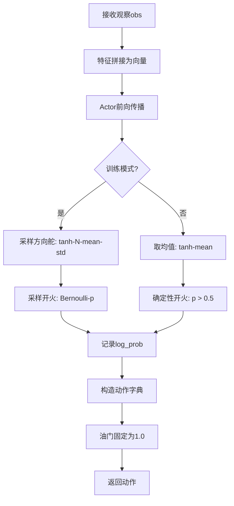
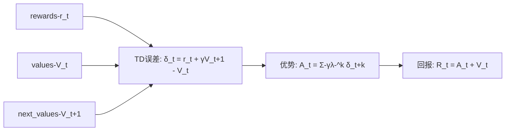
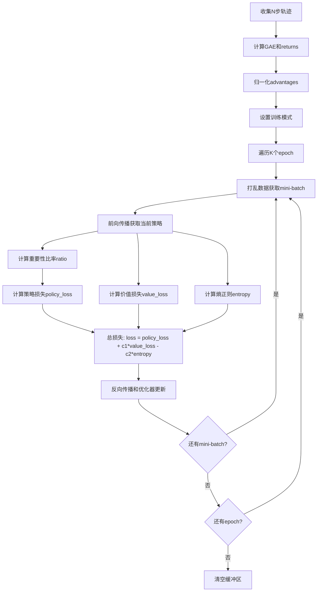
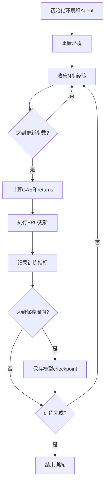
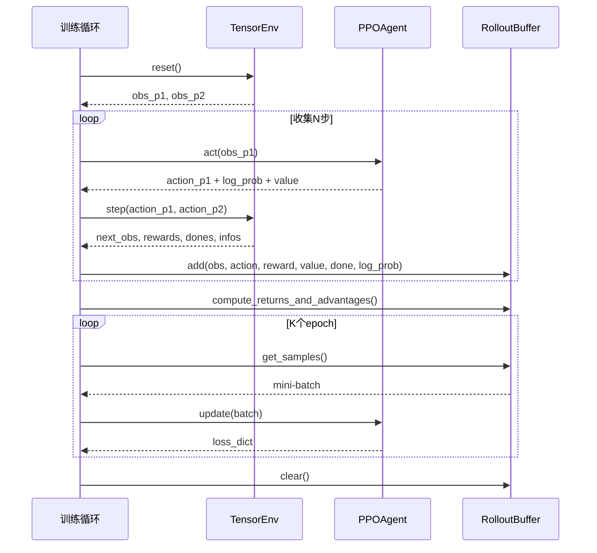

# PPO基础智能体实现设计文档

## 需求概述

在已有的GPU驱动RL训练环境基础上，实现一个最简单的PPO（Proximal Policy Optimization）智能体，用于验证RL训练流程的完整性和稳定性。训练对手使用已实现的CrankAgent规则智能体（基于状态机的空战战术Agent）。本设计以实用性和简洁性为核心原则，确保训练流程能正常运行而不崩溃。

## 设计目标

- 实现符合BaseAgent接口规范的PPO智能体
- 设计结构简单的Actor-Critic神经网络
- 油门控制简化为满油门（固定值1.0）
- 完善train.py脚本，实现完整的PPO训练循环
- 支持多环境并行训练
- 与现有TensorEnv环境无缝集成
- 对抗训练使用CrankAgent作为规则对手

## 系统架构

### 模块划分

```
agents/learned/
├── __init__.py          # 模块导出
├── ppo_agent.py         # PPO智能体实现
└── networks.py          # Actor-Critic网络定义
```

## 核心组件设计

### 对手智能体特性

本次训练使用已实现的CrankAgent作为对手（控制P2），其特性如下：

| 特性 | 说明 |
|-----|------|
| 战术类型 | 三状态状态机：Approach（追踪）、Fire（开火）、Defend（防御） |
| 实现方式 | 完全向量化，支持高性能批量运行 |
| 开火策略 | 距离<最大射程80% 且 航向误差<30° 时发射 |
| 防御触发 | 敌方距离<18km 时执行逃逸机动 |
| 单发发射 | 通过冷却时间（10秒）确保导弹逐发发射 |
| 性能优势 | 比神经网络Agent快10-50倍，适合作为稳定对手 |

**训练意义：** CrankAgent提供稳定且有威胁性的对手，能够有效测试PPO智能体的学习能力，避免训练初期因对手过弱导致的虚假收敛。

### 1. Actor-Critic网络架构

#### 网络输入

基于TensorEnv的观察空间，输入特征维度为10：

| 特征名称 | 维度 | 说明 |
|---------|------|------|
| x | 1 | 己方归一化x坐标 [0,1] |
| y | 1 | 己方归一化y坐标 [0,1] |
| angle | 1 | 己方归一化角度 [0,1] |
| speed | 1 | 己方归一化速度 [0,2] |
| missiles | 1 | 己方归一化导弹数 [0,1] |
| alive | 1 | 己方存活状态 {0,1} |
| enemy_distance | 1 | 敌方归一化距离 [0,1] |
| enemy_relative_angle | 1 | 敌方相对角度 [-1,1] |
| enemy_speed | 1 | 敌方归一化速度 [0,2] |
| enemy_alive | 1 | 敌方存活状态 {0,1} |

#### Actor网络结构

采用三层全连接网络：

| 层级 | 输入维度 | 输出维度 | 激活函数 | 说明 |
|-----|---------|---------|---------|------|
| 输入层 | 10 | - | - | 观察特征 |
| 隐藏层1 | 10 | 128 | ReLU | 特征提取 |
| 隐藏层2 | 128 | 64 | ReLU | 特征组合 |
| 方向舵输出 | 64 | 2 | - | 均值与对数标准差 |
| 开火输出 | 64 | 1 | Sigmoid | 开火概率 |

**动作空间说明：**
- **rudder（方向舵）**：使用连续高斯分布策略
  - 输出：均值mean ∈ [-∞, +∞]，对数标准差log_std ∈ [-∞, +∞]
  - 采样：action = tanh(N(mean, exp(log_std))) ∈ [-1, 1]
  - 使用tanh压缩确保动作范围合法
  
- **throttle（油门）**：固定为1.0（满油门）
  - 简化控制，聚焦于方向舵和开火决策
  
- **fire（开火）**：使用伯努利分布
  - 输出：概率p ∈ [0, 1]
  - 采样：action = Bernoulli(p)

#### Critic网络结构

采用三层全连接网络：

| 层级 | 输入维度 | 输出维度 | 激活函数 | 说明 |
|-----|---------|---------|---------|------|
| 输入层 | 10 | - | - | 观察特征 |
| 隐藏层1 | 10 | 128 | ReLU | 特征提取 |
| 隐藏层2 | 128 | 64 | ReLU | 特征组合 |
| 价值输出 | 64 | 1 | - | 状态价值V(s) |

### 2. PPO智能体设计

#### 类结构

PPOAgent继承自BaseAgent，实现以下核心职责：

| 方法名称 | 输入 | 输出 | 职责 |
|---------|------|------|------|
| __init__ | device, learning_rate, gamma, epsilon等 | - | 初始化网络和优化器 |
| act | observation字典 | action字典 | 根据当前策略选择动作 |
| reset | env_mask可选 | - | 重置内部状态 |
| compute_gae | rewards, values, dones, next_values | advantages, returns | 计算广义优势估计 |
| update | rollout_buffer | loss_dict | 执行PPO策略更新 |

#### 关键属性

| 属性名称 | 类型 | 说明 |
|---------|------|------|
| actor | ActorNetwork | 策略网络 |
| critic | CriticNetwork | 价值网络 |
| optimizer | torch.optim.Adam | 联合优化器 |
| gamma | float | 折扣因子，默认0.99 |
| gae_lambda | float | GAE参数，默认0.95 |
| clip_epsilon | float | PPO裁剪系数，默认0.2 |
| value_loss_coef | float | 价值损失权重，默认0.5 |
| entropy_coef | float | 熵正则化权重，默认0.01 |

#### 动作采样流程



#### GAE计算流程

广义优势估计（Generalized Advantage Estimation）用于平衡偏差和方差：



**计算公式：**
- TD误差：δ_t = r_t + γ * V(s_t+1) * (1 - done_t) - V(s_t)
- 优势函数：A_t = Σ_{k=0}^{∞} (γλ)^k * δ_{t+k}
- 目标回报：R_t = A_t + V(s_t)

### 3. 经验缓冲区设计

#### RolloutBuffer结构

用于存储轨迹数据并进行批量更新：

| 字段名称 | 形状 | 数据类型 | 说明 |
|---------|------|---------|------|
| observations | [buffer_size, num_envs, obs_dim] | float32 | 观察序列 |
| actions_rudder | [buffer_size, num_envs] | float32 | 方向舵动作 |
| actions_fire | [buffer_size, num_envs] | bool | 开火动作 |
| log_probs | [buffer_size, num_envs] | float32 | 动作对数概率 |
| rewards | [buffer_size, num_envs] | float32 | 奖励序列 |
| values | [buffer_size, num_envs] | float32 | 状态价值 |
| dones | [buffer_size, num_envs] | bool | 终止标志 |
| advantages | [buffer_size, num_envs] | float32 | 优势估计（计算得出） |
| returns | [buffer_size, num_envs] | float32 | 目标回报（计算得出） |

#### 缓冲区操作

| 方法 | 职责 |
|-----|------|
| add | 添加单步转换数据 |
| compute_returns_and_advantages | 计算GAE和目标回报 |
| get_samples | 获取打乱的训练批次 |
| clear | 清空缓冲区 |

### 4. PPO更新流程设计

#### 更新步骤



#### 损失函数定义

**策略损失（PPO-Clip）：**

```
ratio = π_θ(a|s) / π_θ_old(a|s)
L_CLIP = -E[min(ratio * A, clip(ratio, 1-ε, 1+ε) * A)]
```

**价值损失：**

```
L_VF = E[(V_θ(s) - R)²]
```

可选裁剪版本：
```
V_clipped = V_old + clip(V_θ(s) - V_old, -ε, ε)
L_VF = E[max((V_θ(s) - R)², (V_clipped - R)²)]
```

**熵正则化：**

```
L_ENT = E[H(π_θ(·|s))]
其中 H = -Σ π(a|s) log π(a|s)
```

**总损失：**

```
L_total = L_CLIP + c1 * L_VF - c2 * L_ENT
```

其中 c1=value_loss_coef, c2=entropy_coef

### 5. train.py脚本完善

#### 训练循环增强

train.py当前是骨架实现，需要增强以下功能：

| 功能模块 | 现有状态 | 待实现内容 |
|---------|---------|--------|
| Agent注册表 | 只有PlaceholderAgent | 添加PPOAgent和CrankAgent注册 |
| 训练循环 | 简单step循环 | 集成PPO的收集-更新周期 |
| 经验收集 | 无存储机制 | 添加RolloutBuffer |
| 模型保存 | 无 | 添加定期checkpoint保存 |
| 日志记录 | 简单打印 | 添加训练指标记录 |

**注册表配置：**
- 'ppo' → PPOAgent（被训练的RL智能体）
- 'rule_based' → CrankAgent（规则对手，从agents.rule_based导入）
- 'placeholder' → PlaceholderAgent（保留用于测试）

#### 增强后的训练流程



#### 新增命令行参数

| 参数名称 | 类型 | 默认值 | 说明 |
|---------|------|--------|------|
| --learning-rate | float | 3e-4 | 学习率 |
| --n-steps | int | 2048 | 每次更新收集的步数 |
| --batch-size | int | 64 | mini-batch大小 |
| --n-epochs | int | 10 | 每次更新的epoch数 |
| --gamma | float | 0.99 | 折扣因子 |
| --gae-lambda | float | 0.95 | GAE参数 |
| --clip-epsilon | float | 0.2 | PPO裁剪系数 |
| --value-loss-coef | float | 0.5 | 价值损失权重 |
| --entropy-coef | float | 0.01 | 熵正则化权重 |
| --save-interval | int | 1000 | 保存模型的步数间隔 |
| --log-interval | int | 100 | 日志输出的步数间隔 |

#### 训练指标记录

每个日志周期记录以下指标：

| 指标名称 | 说明 |
|---------|------|
| episode_return | 平均回合回报 |
| episode_length | 平均回合长度 |
| policy_loss | 策略损失 |
| value_loss | 价值损失 |
| entropy | 策略熵 |
| approx_kl | 近似KL散度 |
| clip_fraction | 被裁剪的比率比例 |
| learning_rate | 当前学习率 |
| win_rate | P1胜率 |

## 接口适配说明

### 与BaseAgent接口对齐

PPOAgent必须完全符合agents/base_agent.py中定义的接口规范：

| 接口方法 | BaseAgent要求 | PPOAgent实现策略 |
|---------|--------------|------------------|
| act(observation) | 返回{rudder, throttle, fire} | 策略网络采样+固定油门 |
| reset(env_mask) | 重置内部状态 | 清空隐藏状态（如有RNN） |
| train() | 设置训练模式 | 调用actor.train()和critic.train() |
| eval() | 设置评估模式 | 调用actor.eval()和critic.eval() |
| to(device) | 迁移到指定设备 | 迁移actor、critic和缓冲区 |

### 与TensorEnv数据流对接



### 观察空间预处理

TensorEnv返回的观察已归一化，PPOAgent直接使用：

| 观察键 | TensorEnv提供形状 | 网络输入处理 |
|-------|------------------|-------------|
| obs['p1'][key] | [num_envs] | 拼接为[num_envs, 10] |

**预处理步骤：**
1. 按顺序提取10个特征：x, y, angle, speed, missiles, alive, enemy_distance, enemy_relative_angle, enemy_speed, enemy_alive
2. 堆叠为张量：obs_vector = torch.stack([obs[key] for key in keys], dim=-1)
3. 输入网络

## 超参数配置建议

### 网络超参数

| 参数 | 推荐值 | 调整考虑 |
|-----|-------|---------|
| 隐藏层维度 | 128, 64 | 可根据收敛情况增减 |
| 学习率 | 3e-4 | 不稳定时降低 |
| 批次大小 | 64 | GPU内存允许时增大 |

### PPO超参数

| 参数 | 推荐值 | 调整考虑 |
|-----|-------|---------|
| n_steps | 2048 | 更长轨迹有助于策略稳定 |
| n_epochs | 10 | 过高可能过拟合 |
| gamma | 0.99 | 关注长期回报 |
| gae_lambda | 0.95 | 平衡偏差和方差 |
| clip_epsilon | 0.2 | 限制策略更新幅度 |
| value_loss_coef | 0.5 | 价值网络收敛慢时增大 |
| entropy_coef | 0.01 | 探索不足时增大 |

## 实现优先级

### 阶段一：核心网络和智能体

1. 实现ActorNetwork和CriticNetwork类
2. 实现PPOAgent的act方法（策略采样）
3. 实现PPOAgent的reset方法
4. 在train.py的AGENT_REGISTRY中注册PPOAgent
5. 确保CrankAgent已注册为'rule_based'对手

**验收标准：** 能够通过命令行启动训练，PPOAgent对抗CrankAgent时不报错地执行act

### 阶段二：经验收集和GAE计算

1. 实现RolloutBuffer类
2. 实现compute_gae方法
3. 修改training_loop收集经验到缓冲区
4. 在训练循环中调用compute_gae

**验收标准：** 缓冲区能正确存储和计算优势估计

### 阶段三：PPO更新机制

1. 实现update方法（策略和价值损失）
2. 实现mini-batch采样和多epoch训练
3. 集成到training_loop

**验收标准：** 损失函数正常计算且能反向传播更新

### 阶段四：训练增强和持久化

1. 添加模型保存和加载功能
2. 增强日志输出（训练指标）
3. 添加tensorboard支持（可选）
4. 实现学习率衰减（可选）

**验收标准：** 训练过程稳定，能保存和恢复模型

## 注意事项

### 与现有代码一致性

1. **奖励来源**：TensorEnv内部已实现基础奖励（胜负、生存、导弹使用），train.py中的reward_fn作为额外奖励叠加，PPOAgent使用合并后的total_reward
2. **设备管理**：所有tensor操作统一在self.device上进行，与env保持一致
3. **批量维度**：所有张量第一维为num_envs，确保向量化操作
4. **动作格式**：严格遵循BaseAgent接口，返回{rudder, throttle, fire}字典，每项为[num_envs]形状的tensor

### 潜在问题和缓解策略

| 问题 | 表现 | 缓解策略 |
|-----|------|---------|
| 策略崩溃 | 损失突增，agent不动或乱动 | 降低学习率，减小clip_epsilon |
| 探索不足 | 胜率不提升，策略单一 | 增大entropy_coef，调整初始log_std |
| 价值过拟合 | value_loss不降，策略震荡 | 降低value_loss_coef，使用价值裁剪 |
| 内存溢出 | CUDA OOM | 减小num_envs或n_steps或batch_size |
| 数值不稳定 | NaN或Inf | 添加梯度裁剪，检查归一化 |

### 简化设计的权衡

本设计为了快速验证RL流程，做出以下简化：

| 简化内容 | 影响 | 后续可优化方向 |
|---------|------|------------|
| 油门固定满油门 | 减少动作空间，可能错失部分战术 | 改为连续动作或离散多档位 |
| 无RNN结构 | 无法利用历史信息 | 引入LSTM层处理时序依赖 |
| 单一网络结构 | 特征提取能力有限 | 引入注意力机制或CNN |
| 无导弹信息 | 缺少威胁感知 | 在观察空间中增加导弹位置速度 |
| 无课程学习 | 训练初期可能难以收敛 | 设计分阶段奖励或对手难度递增 |

### 对抗CrankAgent的训练考虑

由于CrankAgent提供稳定且有威胁性的对抗，需要特别关注：

| 考虑项 | 说明 | 应对策略 |
|---------|------|----------|
| 初期胜率低 | PPO无经验时对CrankAgent胜率<10% | 正常现象，关注胜率上升趋势而非绝对值 |
| 导弹管理 | CrankAgent单发发射，导弹使用效率高 | PPO需学会在合适时机开火，避免浪费 |
| 防御机动 | CrankAgent距离过近时会逃逸 | PPO需学会追踪和预测敌机机动 |
| 性能差异 | CrankAgent执行速度极快 | 训练时CrankAgent不参与梯度计算，开销小 |
| 策略固定 | CrankAgent行为模式固定 | 避免过拟合到特定对手，后续可引入多样化对手 |

## 测试验证

### 单元测试目标

| 测试项 | 验证内容 |
|-------|---------|
| 网络形状 | 输入输出维度正确 |
| 动作采样 | 动作范围合法，概率有效 |
| GAE计算 | 优势估计数值正确 |
| 损失计算 | 损失为标量且可反向传播 |
| 缓冲区操作 | 存储和采样无错误 |

### 集成测试目标

| 测试项 | 验证内容 |
|-------|------|
| 训练启动 | 无异常完成数百步 |
| 多环境兼容 | 不同num_envs均可运行 |
| 设备迁移 | CPU和CUDA均可训练 |
| 对抗CrankAgent | 与规则对手训练时无异常，能观察到胜率变化 |

### 最小可行验证

最简验证：运行以下命令，训练1000步不崩溃且损失有下降趋势

```bash
python train.py --agent ppo --opponent rule_based \
                --reward zero --num-envs 8 \
                --n-steps 256 --max-steps 1000
```

预期结果：
- 训练循环正常执行
- 策略损失和价值损失在合理范围（-100到100）
- 无NaN或Inf出现
- 能够完成至少一次完整的update

## 文件清单

本设计涉及以下文件的创建和修改：

### 新增文件

| 文件路径 | 职责 |
|---------|------|
| agents/learned/__init__.py | 导出PPOAgent和网络类 |
| agents/learned/networks.py | 定义ActorNetwork和CriticNetwork |
| agents/learned/ppo_agent.py | 实现PPOAgent类和RolloutBuffer |

### 修改文件

| 文件路径 | 修改内容 |
|---------|---------|
| train.py | 注册PPOAgent，增强训练循环，添加经验收集和PPO更新逻辑 |
| agents/__init__.py | 导出PPOAgent（可选，便于导入） |

### 预期文件结构

```
agents/
├── learned/
│   ├── __init__.py           【新增】导出PPOAgent
│   ├── networks.py           【新增】Actor和Critic网络
│   └── ppo_agent.py          【新增】PPOAgent实现
├── rule_based/
│   ├── __init__.py
│   └── rule_agent.py
├── __init__.py               【可选修改】
└── base_agent.py
```
| train.py | 注册PPOAgent，增强训练循环，添加经验收集和PPO更新逻辑 |
| agents/__init__.py | 导出PPOAgent（可选，便于导入） |

### 预期文件结构

```
agents/
├── learned/
│   ├── __init__.py           【新增】导出PPOAgent
│   ├── networks.py           【新增】Actor和Critic网络
│   └── ppo_agent.py          【新增】PPOAgent实现
├── rule_based/
│   ├── __init__.py
│   └── rule_agent.py
├── __init__.py               【可选修改】
└── base_agent.py
```
│   ├── __init__.py
│   └── rule_agent.py
├── __init__.py               【可选修改】
└── base_agent.py
```
│   └── ppo_agent.py          【新增】PPOAgent实现
├── rule_based/
│   ├── __init__.py
│   └── rule_agent.py
├── __init__.py               【可选修改】
└── base_agent.py
```
│   ├── __init__.py
│   └── rule_agent.py
├── __init__.py               【可选修改】
└── base_agent.py
```
