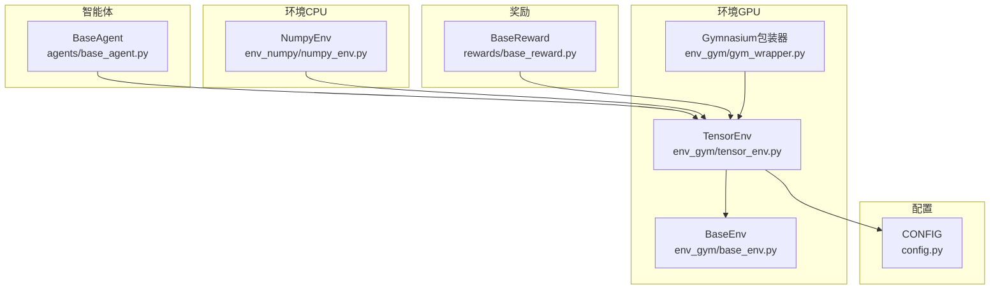
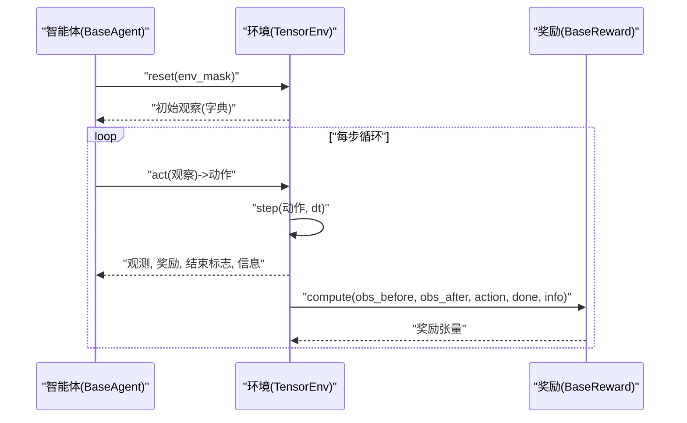
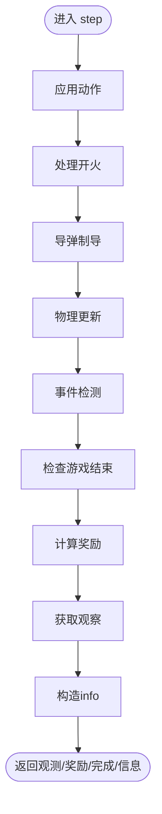
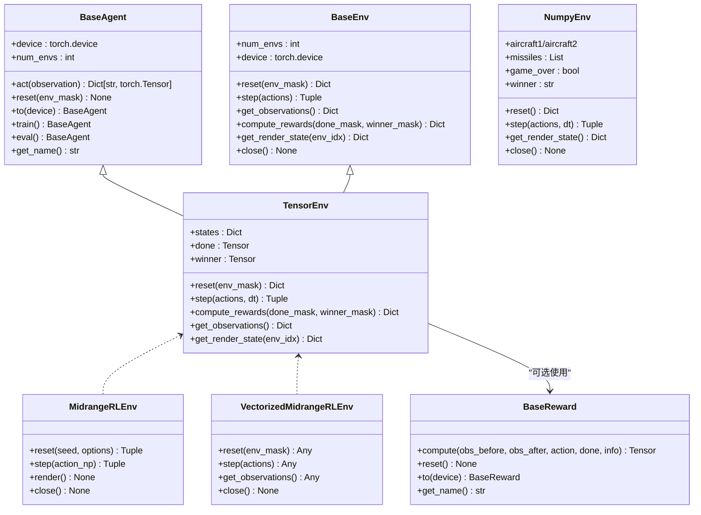

# API参考

<cite>
**本文引用的文件**
- [agents/base_agent.py](file://agents/base_agent.py)
- [env_gym/base_env.py](file://env_gym/base_env.py)
- [env_gym/tensor_env.py](file://env_gym/tensor_env.py)
- [env_numpy/numpy_env.py](file://env_numpy/numpy_env.py)
- [rewards/base_reward.py](file://rewards/base_reward.py)
- [env_gym/gym_wrapper.py](file://env_gym/gym_wrapper.py)
- [config.py](file://config.py)
- [README.md](file://README.md)
</cite>

## 目录
1. [简介](#简介)
2. [项目结构](#项目结构)
3. [核心组件](#核心组件)
4. [架构总览](#架构总览)
5. [详细组件分析](#详细组件分析)
6. [依赖关系分析](#依赖关系分析)
7. [性能与并发特性](#性能与并发特性)
8. [故障排查指南](#故障排查指南)
9. [结论](#结论)

## 简介
本API参考面向智能体、环境与奖励系统的开发者，聚焦以下核心接口：
- 智能体：agents/base_agent.py中的BaseAgent抽象类及其公共方法（如act、reset、to、train、eval等）的签名、参数类型、返回值与用途说明。
- 环境：env_gym/tensor_env.py与env_numpy/numpy_env.py中的Environment类（分别对应GPU加速的TensorEnv与CPU的NumpyEnv），详述step(action, dt)、reset(env_mask)、get_observations()、compute_rewards(done_mask, winner_mask)、get_render_state(env_idx)等方法的输入输出格式与状态转换逻辑。
- 奖励：rewards/base_reward.py中的BaseReward抽象类，说明compute(obs_before, obs_after, action, done, info)的调用时机与奖励计算规范。
- 类型注解、异常处理与线程安全性：给出明确的类型约束、错误处理建议与线程安全注意事项，帮助开发者正确集成。

## 项目结构
项目采用按领域分层的组织方式：
- agents：智能体抽象与实现（当前提供BaseAgent抽象类）
- env_gym：RL训练环境（GPU加速、多环境并行、Gymnasium兼容）
- env_numpy：可视化游戏环境（CPU、稳定）
- rewards：奖励系统抽象与实现
- env_gym/gym_wrapper.py：Gymnasium兼容包装器
- config.py：统一配置参数
- README.md：快速开始与使用示例

图表来源
- [agents/base_agent.py](file://agents/base_agent.py#L13-L118)
- [env_gym/base_env.py](file://env_gym/base_env.py#L12-L96)
- [env_gym/tensor_env.py](file://env_gym/tensor_env.py#L206-L772)
- [env_numpy/numpy_env.py](file://env_numpy/numpy_env.py#L49-L365)
- [rewards/base_reward.py](file://rewards/base_reward.py#L12-L103)
- [env_gym/gym_wrapper.py](file://env_gym/gym_wrapper.py#L15-L181)
- [config.py](file://config.py#L7-L52)

章节来源
- [README.md](file://README.md#L64-L96)

## 核心组件
- BaseAgent：统一智能体接口，定义act(observation)与reset(env_mask)，并提供设备切换(to)、训练/评估模式(train/eval)等通用能力。
- BaseEnv：统一环境接口，定义reset、step、get_observations、compute_rewards、get_render_state等标准方法。
- TensorEnv：基于张量的高性能环境实现，支持多环境并行、统一实体槽位、完整RL接口（奖励、观察空间）。
- NumpyEnv：基于NumPy的CPU环境，用于可视化与验证，接口与TensorEnv保持兼容。
- BaseReward：奖励系统抽象，定义compute(obs_before, obs_after, action, done, info)的计算规范。
- Gymnasium包装器：将TensorEnv包装为标准Gymnasium接口，便于RL框架集成。

章节来源
- [agents/base_agent.py](file://agents/base_agent.py#L13-L118)
- [env_gym/base_env.py](file://env_gym/base_env.py#L12-L96)
- [env_gym/tensor_env.py](file://env_gym/tensor_env.py#L206-L772)
- [env_numpy/numpy_env.py](file://env_numpy/numpy_env.py#L49-L365)
- [rewards/base_reward.py](file://rewards/base_reward.py#L12-L103)
- [env_gym/gym_wrapper.py](file://env_gym/gym_wrapper.py#L15-L181)

## 架构总览
下图展示智能体、环境与奖励之间的交互关系，以及Gymnasium包装器如何桥接底层TensorEnv。

图表来源
- [agents/base_agent.py](file://agents/base_agent.py#L46-L82)
- [env_gym/tensor_env.py](file://env_gym/tensor_env.py#L351-L417)
- [rewards/base_reward.py](file://rewards/base_reward.py#L28-L52)

## 详细组件分析

### 智能体接口：BaseAgent
- 类型注解与字段
  - device: torch.device
  - num_envs: int（通过@property/@num_envs.setter管理）
- 方法清单与说明
  - act(observation) -> Dict[str, torch.Tensor]
    - 输入：observation字典，包含己方与敌方的归一化状态（位置、角度、速度、导弹数量、存活状态等）
    - 输出：动作字典，包含rudder、throttle、fire三类张量，形状为[num_envs]
    - 用途：根据观察返回合法动作，与环境接口完全一致
  - reset(env_mask: Optional[torch.Tensor] = None) -> None
    - 用途：在环境重置时清理智能体的历史记忆（如RNN隐藏状态）
    - 参数：env_mask可选，指定需要重置的环境掩码；None表示全部重置
  - to(device: Union[str, torch.device]) -> 'BaseAgent'
    - 用途：将智能体移动到指定设备（支持链式调用）
  - train() -> 'BaseAgent'
    - 用途：设置为训练模式（用于RL智能体）
  - eval() -> 'BaseAgent'
    - 用途：设置为评估模式（用于RL智能体）
  - get_name() -> str
    - 用途：返回智能体类名，便于日志与调试
  - __repr__() -> str
    - 用途：打印智能体基本信息（设备、并行环境数）

类型注解要点
- 输入输出均为张量，支持批量（num_envs维度）
- 动作空间严格限定范围：rudder∈[-1,1]，throttle∈[0,1]，fire为布尔张量

异常与边界
- 未显式抛出异常；若传入非法设备字符串，to()内部会构造torch.device，失败将抛出异常
- reset()中env_mask为None时，表示重置全部环境

线程安全
- 未提供线程安全保证；建议在单线程环境中使用，或在外部加锁

章节来源
- [agents/base_agent.py](file://agents/base_agent.py#L13-L118)

### 环境接口：BaseEnv
- 方法清单与说明
  - reset(env_mask: Optional[torch.Tensor] = None) -> Dict[str, torch.Tensor]
    - 返回初始观察字典
  - step(actions: Dict[str, torch.Tensor]) -> Tuple[Dict[str, torch.Tensor], Dict[str, torch.Tensor], torch.Tensor, Dict[str, Any]]
    - 输入：动作字典（p1/p2的rudder/throttle/fire）
    - 输出：(observations, rewards, dones, infos)
  - get_observations() -> Dict[str, torch.Tensor]
    - 返回当前观察字典
  - compute_rewards(done_mask: torch.Tensor, winner_mask: Optional[torch.Tensor] = None) -> Dict[str, torch.Tensor]
    - 计算并返回双方奖励
  - get_render_state(env_idx: int = 0) -> Dict[str, Any]
    - 返回渲染所需的状态（子类需实现）
  - 属性：num_envs(int)、device(torch.device)
  - close() -> None：释放资源

类型注解要点
- 所有张量均位于同一设备（由具体实现决定）
- 返回的观测与奖励均支持批量

异常与边界
- get_render_state默认抛出NotImplementedError，子类需实现

章节来源
- [env_gym/base_env.py](file://env_gym/base_env.py#L12-L96)

### 环境实现：TensorEnv（GPU加速，多环境并行）
- 关键字段与配置
  - _num_envs、max_entities、_device、battlefield_size、hit_radius_sq、self_destruct_speed_sq、initial_missiles、missile_launch_offset
  - reward_config：包含各类奖励权重
  - states：统一实体槽位的状态张量字典
  - done、winner：完成标志与胜者掩码
- 方法清单与说明
  - reset(env_mask: Optional[torch.Tensor] = None) -> Dict[str, torch.Tensor]
    - 重置指定环境或全部环境的状态，返回初始观察
  - step(actions, dt=1/60.0) -> Tuple[Dict[str, torch.Tensor], Dict[str, torch.Tensor], torch.Tensor, Dict[str, Any]]
    - 应用动作、处理开火、导弹制导、物理更新、事件检测、游戏结束判定、奖励计算、观察获取与info构造
    - 返回：(observations, rewards, dones, infos)
  - compute_rewards(done_mask, winner_mask=None) -> Dict[str, torch.Tensor]
    - 基于胜负与生存状态计算奖励
  - get_observations() -> Dict[str, torch.Tensor]
    - 返回归一化后的相对观察（p1/p2各一份）
  - get_render_state(env_idx: int = 0) -> Dict[str, Any]
    - 返回渲染状态（飞机1/2、导弹列表、game_over、winner）
- 状态转换逻辑（step内部流程）
  - 动作应用：将p1/p2的rudder、throttle、fire写入states
  - 开火处理：检查可发射条件，分配槽位，初始化导弹状态
  - 导弹制导：计算LOS角速度与rudder命令
  - 物理更新：计算加速度、速度、位置与角度
  - 事件检测：碰撞命中、自毁
  - 结束判定：双方存活、弹药耗尽、在途导弹
  - 奖励计算：胜负、生存、弹药消耗
  - 观察与info：构造观测与信息字典

图表来源
- [env_gym/tensor_env.py](file://env_gym/tensor_env.py#L351-L417)

类型注解要点
- 所有张量位于同一设备（由构造函数指定）
- 观测字典键值均为张量，形状为[num_envs,...]
- 奖励字典键为'p1'/'p2'，值为张量[num_envs]

异常与边界
- 若传入动作类型不匹配，to_tensor内部会尝试转换，失败将抛出异常
- 弹药耗尽但仍有开火请求时，仅消耗弹药不发射

线程安全
- 未提供线程安全保证；建议在单线程环境中使用，或在外部加锁

章节来源
- [env_gym/tensor_env.py](file://env_gym/tensor_env.py#L206-L772)

### 环境实现：NumpyEnv（CPU，可视化验证）
- 关键字段与配置
  - config、battlefield_size、initial_distance_ratio
  - aircraft1/aircraft2、missiles、game_over、winner
  - 发射冷却、游戏时间
- 方法清单与说明
  - reset() -> Dict[str, Any]
    - 重置到初始状态，返回渲染状态
  - step(actions, dt=1/60.0) -> Tuple[bool, Optional[str]]
    - 应用动作、处理开火、更新物理、制导、碰撞、轨迹、结束判定
    - 返回：(game_over, winner)
  - get_render_state() -> Dict[str, Any]
    - 返回渲染状态（飞机1/2、导弹列表、game_over、winner）
  - close() -> None：关闭环境
- 状态转换逻辑（step内部流程）
  - 应用动作：渐变式舵量/油门控制
  - 开火处理：冷却时间检查与导弹创建
  - 物理更新：飞机与导弹状态演进
  - 制导更新：LOS角度与rudder计算
  - 碰撞与自毁：命中与低速自毁
  - 轨迹更新：按间隔记录轨迹点
  - 结束判定：双方存活、弹药耗尽且无在途导弹

类型注解要点
- 返回值为Python原生类型（字典、元组、布尔、字符串），便于可视化
- 与TensorEnv保持接口兼容，便于验证

异常与边界
- 游戏结束后继续step将直接返回当前结果

线程安全
- 未提供线程安全保证；建议在单线程环境中使用

章节来源
- [env_numpy/numpy_env.py](file://env_numpy/numpy_env.py#L49-L365)

### 奖励系统：BaseReward
- 方法清单与说明
  - compute(obs_before, obs_after, action, done, info) -> torch.Tensor
    - 输入：step前后的观察、执行的动作、完成标志、环境信息
    - 输出：标量奖励张量[num_envs]
  - reset() -> None：重置内部状态（如有）
  - to(device: str) -> 'BaseReward'：移动到指定设备
  - get_name() -> str：返回类名
- 调用时机
  - 在环境step之后、返回观测/奖励之前调用（具体取决于实现）
  - 也可由自定义训练循环在合适时机调用

类型注解要点
- obs_before/obs_after：张量形状为[num_envs,...]
- action：与环境动作格式一致
- done：布尔张量[num_envs]
- info：字典，通常包含winner、p1_alive、p2_alive

异常与边界
- compute为抽象方法，子类必须实现
- reset默认为空实现，子类可覆盖

线程安全
- 未提供线程安全保证；建议在单线程环境中使用

章节来源
- [rewards/base_reward.py](file://rewards/base_reward.py#L12-L103)

### Gymnasium包装器：MidrangeRLEnv 与 VectorizedMidrangeRLEnv
- MidrangeRLEnv
  - 作用：将TensorEnv包装为标准Gymnasium接口
  - reset(seed, options) -> (obs_np, info)
  - step(action_np) -> (obs_np, rewards_np, dones_np, False, info)
  - render()、close()
  - 观察与动作空间：spaces.Dict + spaces.Box/spaces.MultiBinary
- VectorizedMidrangeRLEnv
  - 作用：向量化包装器，直接转发reset/step/get_observations/close至底层TensorEnv
  - 适合多环境并行训练

类型注解要点
- Gymnasium期望numpy数组，包装器内部进行tensor与numpy的转换
- 返回的obs_np为p1的观察字典（np.ndarray）

异常与边界
- seed设置会同步随机种子，确保可复现性
- render()目前为占位实现

章节来源
- [env_gym/gym_wrapper.py](file://env_gym/gym_wrapper.py#L15-L181)

## 依赖关系分析
- BaseAgent依赖typing（Dict、Any、Optional、Union）、torch、numpy
- TensorEnv继承BaseEnv，依赖torch、math、typing
- NumpyEnv依赖math、collections.deque、typing
- BaseReward依赖abc、typing、torch
- Gymnasium包装器依赖gymnasium、spaces、torch、numpy
- 配置来自config.py，统一了物理参数与游戏参数

图表来源
- [agents/base_agent.py](file://agents/base_agent.py#L13-L118)
- [env_gym/base_env.py](file://env_gym/base_env.py#L12-L96)
- [env_gym/tensor_env.py](file://env_gym/tensor_env.py#L206-L772)
- [env_numpy/numpy_env.py](file://env_numpy/numpy_env.py#L49-L365)
- [rewards/base_reward.py](file://rewards/base_reward.py#L12-L103)
- [env_gym/gym_wrapper.py](file://env_gym/gym_wrapper.py#L15-L181)

## 性能与并发特性
- 并发与并行
  - TensorEnv支持多环境并行（num_envs>1），通过统一实体槽位与张量运算提升吞吐
  - Gymnasium包装器提供向量化包装器VectorizedMidrangeRLEnv，便于多环境并行训练
- 设备与内存
  - TensorEnv默认在GPU上运行（device='cuda'），NumpyEnv在CPU上运行
  - 张量操作集中在GPU，减少主机与设备间的拷贝
- 计算复杂度
  - 步骤复杂度与环境数量、实体数量线性相关
  - 物理与制导计算在张量层面并行化
- 线程安全
  - 未提供线程安全保证；建议在单线程环境中使用，或在外部加锁

[本节为通用性能讨论，无需特定文件来源]

## 故障排查指南
- 环境重置后未得到预期观察
  - 检查reset()调用是否传入正确的env_mask
  - 确认设备一致（TensorEnv与智能体设备需匹配）
- 动作无效或越界
  - 确保rudder∈[-1,1]、throttle∈[0,1]、fire为布尔张量
  - 检查动作字典键是否与环境期望一致（p1/p2的rudder/throttle/fire）
- 奖励计算异常
  - 确认compute()的输入张量形状与设备一致
  - 检查done与info是否正确传递
- Gymnasium接口问题
  - 确认动作与观察空间定义与包装器一致
  - 检查seed设置与随机种子同步
- 可视化与渲染
  - NumpyEnv的get_render_state()返回Python对象，便于可视化模块使用
  - TensorEnv的get_render_state()返回可渲染实体集合，便于图形界面

章节来源
- [env_gym/tensor_env.py](file://env_gym/tensor_env.py#L340-L417)
- [env_gym/gym_wrapper.py](file://env_gym/gym_wrapper.py#L76-L121)
- [env_numpy/numpy_env.py](file://env_numpy/numpy_env.py#L96-L176)

## 结论
本API参考系统性梳理了智能体、环境与奖励的核心接口，明确了类型注解、输入输出格式、状态转换逻辑与调用时机。TensorEnv提供了高性能的GPU并行RL训练接口，NumpyEnv用于CPU可视化验证，BaseReward为奖励计算提供抽象规范，Gymnasium包装器则便于与主流RL框架集成。开发者可据此正确集成与扩展，构建稳定的中距空战强化学习系统。