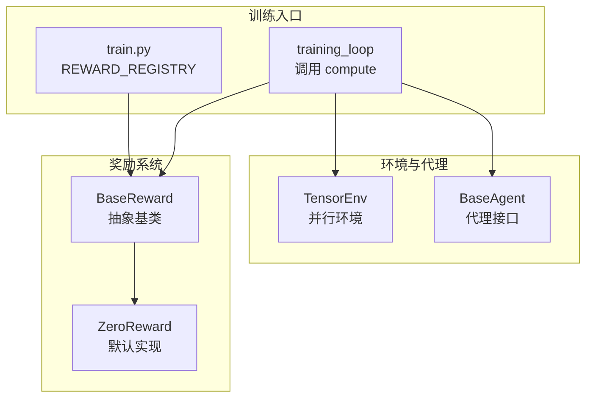
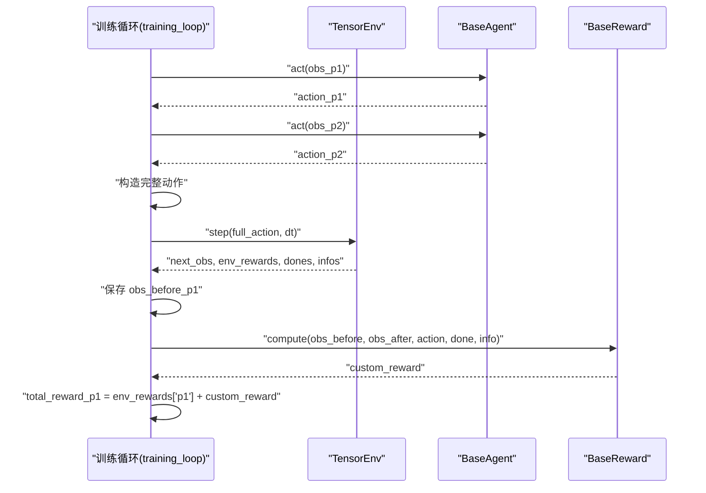
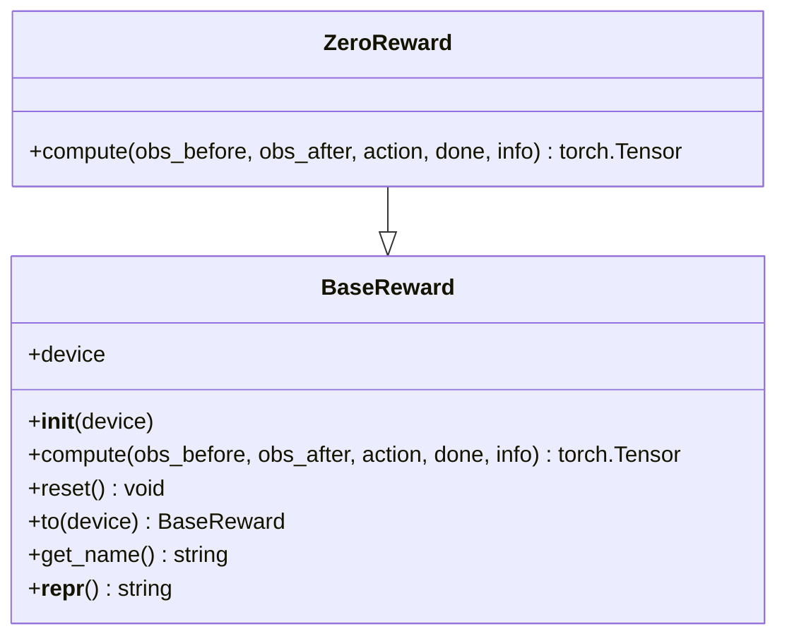
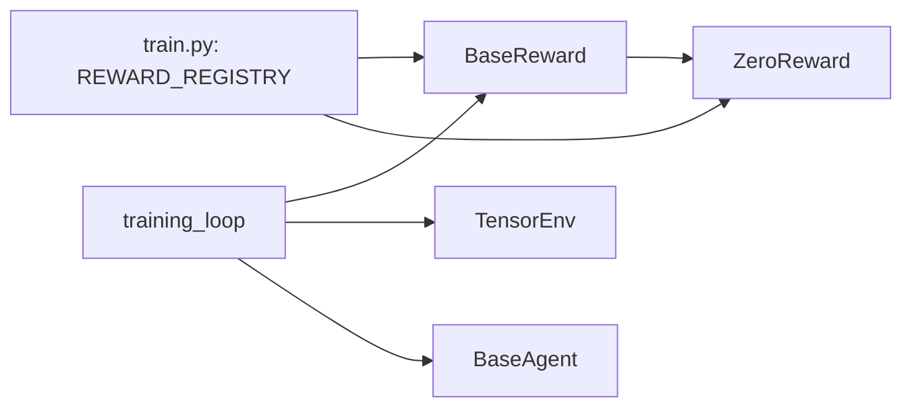

# 奖励基类架构

<cite>
**本文引用的文件**
- [rewards/base_reward.py](file://rewards/base_reward.py)
- [rewards/__init__.py](file://rewards/__init__.py)
- [rewards/presets/__init__.py](file://rewards/presets/__init__.py)
- [train.py](file://train.py)
- [env_gym/tensor_env.py](file://env_gym/tensor_env.py)
- [agents/base_agent.py](file://agents/base_agent.py)
</cite>

## 目录
1. [简介](#简介)
2. [项目结构](#项目结构)
3. [核心组件](#核心组件)
4. [架构概览](#架构概览)
5. [详细组件分析](#详细组件分析)
6. [依赖关系分析](#依赖关系分析)
7. [性能考量](#性能考量)
8. [故障排查指南](#故障排查指南)
9. [结论](#结论)

## 简介
本文围绕奖励系统的核心抽象基类 BaseReward 展开，系统阐述其设计理念、实现机制与扩展方式。重点包括：
- 设备管理的设计意图与实现
- compute 方法的参数设计及其在强化学习训练循环中的语义
- reset 方法对有状态奖励函数的支持
- to 方法的设备迁移能力
- get_name 与 __repr__ 在调试与日志记录中的作用
- 如何继承 BaseReward 创建自定义奖励函数及 abstractmethod 的约束意义
- 通过统一接口支持多环境并行计算（batched operation）
- 与 REWARD_REGISTRY 的集成方式

## 项目结构
奖励系统位于 rewards 包中，采用“抽象基类 + 具体实现”的分层设计：
- rewards/base_reward.py：定义 BaseReward 抽象基类与 ZeroReward 默认实现
- rewards/__init__.py：导出核心接口
- rewards/presets/__init__.py：预留预设组合模块（后续扩展）

训练入口 train.py 中通过 REWARD_REGISTRY 实现奖励函数的注册与实例化，并在训练循环中调用奖励函数进行批处理计算。

图表来源
- [rewards/base_reward.py](file://rewards/base_reward.py#L12-L80)
- [train.py](file://train.py#L40-L43)
- [train.py](file://train.py#L161-L167)
- [train.py](file://train.py#L170-L279)

章节来源
- [rewards/base_reward.py](file://rewards/base_reward.py#L1-L103)
- [rewards/__init__.py](file://rewards/__init__.py#L1-L10)
- [rewards/presets/__init__.py](file://rewards/presets/__init__.py#L1-L12)
- [train.py](file://train.py#L1-L279)

## 核心组件
- BaseReward 抽象基类：定义统一的奖励接口，确保所有奖励函数具备相同的输入输出契约，支持多环境并行计算。
- ZeroReward：默认实现，始终返回零奖励，便于测试与基线对比。
- REWARD_REGISTRY：训练入口中对奖励函数类型的注册表，支持按字符串键创建实例。

章节来源
- [rewards/base_reward.py](file://rewards/base_reward.py#L12-L80)
- [rewards/base_reward.py](file://rewards/base_reward.py#L82-L103)
- [train.py](file://train.py#L40-L43)
- [train.py](file://train.py#L161-L167)

## 架构概览
BaseReward 通过统一接口屏蔽了具体奖励逻辑的差异，使训练循环能够以一致的方式处理不同奖励函数。训练循环在每一步执行前保存 step 前观察，执行环境 step 后，调用奖励函数的 compute 方法，得到标量奖励张量并与环境奖励合并。

图表来源
- [train.py](file://train.py#L224-L261)
- [train.py](file://train.py#L252-L258)
- [env_gym/tensor_env.py](file://env_gym/tensor_env.py#L1-L200)
- [agents/base_agent.py](file://agents/base_agent.py#L13-L118)
- [rewards/base_reward.py](file://rewards/base_reward.py#L28-L52)

## 详细组件分析

### BaseReward 抽象基类
- 设计理念
  - 统一接口：接收 step 前后状态与环境信息，返回标量奖励张量，支持多环境并行。
  - 可扩展性：通过抽象方法约束子类实现，同时提供通用工具方法（reset、to、get_name、__repr__）。
- 关键方法
  - __init__(device): 初始化设备，支持字符串或 torch.device；为后续张量运算提供设备上下文。
  - compute(...): 抽象方法，强制子类实现；参数包含 obs_before、obs_after、action、done、info，返回 [num_envs] 的标量奖励张量。
  - reset(): 可选重置内部状态（如累计计数器），在环境重置时调用。
  - to(device): 将奖励函数迁移到指定设备，返回 self 支持链式调用。
  - get_name(): 返回类名，便于日志与调试。
  - __repr__(): 输出包含类名与设备信息的字符串表示。

图表来源
- [rewards/base_reward.py](file://rewards/base_reward.py#L12-L80)
- [rewards/base_reward.py](file://rewards/base_reward.py#L82-L103)

章节来源
- [rewards/base_reward.py](file://rewards/base_reward.py#L12-L80)

### 参数设计与语义说明（compute）
- obs_before：step 前的观察字典，形状为 [num_envs, ...]，包含各实体的状态张量。
- obs_after：step 后的观察字典，形状为 [num_envs, ...]，用于比较前后状态变化。
- action：执行的动作字典，形状为 [num_envs, ...]，用于评估动作效果。
- done：布尔张量，形状为 [num_envs]，指示哪些环境已结束。
- info：环境返回的额外信息字典，通常包含：
  - winner：胜利者 [num_envs]，0=平局，1=P1，2=P2
  - p1_alive：P1 存活状态 [num_envs]
  - p2_alive：P2 存活状态 [num_envs]
- 返回值：标量奖励张量，形状为 [num_envs]，与并行环境数量对齐。

这些参数共同构成奖励计算的完整上下文，使奖励函数能够基于状态变化、动作与终止信号做出决策。

章节来源
- [rewards/base_reward.py](file://rewards/base_reward.py#L28-L52)

### 设备管理（__init__ 与 to）
- __init__ 设计意图
  - 将传入的设备字符串标准化为 torch.device，确保张量运算在正确设备上执行。
  - 为子类提供统一的设备上下文，避免在 compute 中重复判断设备。
- to 方法
  - 将奖励函数迁移到指定设备，返回 self 支持链式调用，便于在训练中动态切换设备。
  - 与训练入口中的 create_reward 结合，实现奖励函数与环境、代理在同一设备上的协同。

章节来源
- [rewards/base_reward.py](file://rewards/base_reward.py#L20-L26)
- [rewards/base_reward.py](file://rewards/base_reward.py#L62-L72)
- [train.py](file://train.py#L161-L167)

### 有状态奖励函数支持（reset）
- reset 方法提供可选的内部状态清理机制，适用于需要累积统计或缓存中间结果的奖励函数。
- 在训练循环中，每当检测到 done 时，会调用 reward_fn.reset() 清理状态，确保新回合的独立性。

章节来源
- [rewards/base_reward.py](file://rewards/base_reward.py#L54-L60)
- [train.py](file://train.py#L217-L217)

### 调试与日志（get_name 与 __repr__）
- get_name 返回类名，便于在日志中识别奖励函数类型。
- __repr__ 输出包含类名与设备信息的字符串，有助于快速定位问题与验证设备一致性。

章节来源
- [rewards/base_reward.py](file://rewards/base_reward.py#L74-L79)

### 批量计算（Batched Operation）
- compute 的输入与输出均以 [num_envs, ...] 的张量形式呈现，天然支持多环境并行计算。
- 训练循环在每一步中对所有并行环境统一调用 compute，得到长度为 [num_envs] 的奖励向量，随后与环境奖励合并。

章节来源
- [rewards/base_reward.py](file://rewards/base_reward.py#L28-L52)
- [train.py](file://train.py#L252-L258)

### 与 REWARD_REGISTRY 的集成
- REWARD_REGISTRY 是训练入口中的奖励函数注册表，键为字符串标识，值为 BaseReward 的子类。
- create_reward 根据用户选择的奖励类型键，实例化对应奖励函数并传入设备参数，确保奖励函数与训练设备一致。

章节来源
- [train.py](file://train.py#L40-L43)
- [train.py](file://train.py#L161-L167)

### 自定义奖励函数示例与最佳实践
- 继承 BaseReward 并实现 compute 方法，确保返回 [num_envs] 的标量奖励张量。
- 若存在内部状态，重写 reset 方法并在训练循环中调用。
- 使用 to(device) 在训练过程中迁移设备，保持与环境和代理的一致性。
- 使用 get_name/__repr__ 提升日志可读性与调试效率。

章节来源
- [rewards/base_reward.py](file://rewards/base_reward.py#L12-L80)
- [train.py](file://train.py#L161-L167)

## 依赖关系分析
- BaseReward 依赖 torch 张量与 typing 注解，确保跨设备与类型安全。
- ZeroReward 继承 BaseReward，提供默认实现。
- 训练入口 train.py 通过 REWARD_REGISTRY 与 create_reward 实现奖励函数的动态创建与设备绑定。
- 训练循环 training_loop 调用 BaseReward.compute，形成完整的奖励计算链路。

图表来源
- [rewards/base_reward.py](file://rewards/base_reward.py#L12-L80)
- [rewards/base_reward.py](file://rewards/base_reward.py#L82-L103)
- [train.py](file://train.py#L40-L43)
- [train.py](file://train.py#L161-L167)
- [train.py](file://train.py#L170-L279)

章节来源
- [rewards/base_reward.py](file://rewards/base_reward.py#L1-L103)
- [train.py](file://train.py#L1-L279)

## 性能考量
- 批量计算：compute 的输入输出均为张量，避免 Python 循环，充分利用 GPU 并行优势。
- 设备一致性：通过 to(device) 与 create_reward 确保奖励函数与环境、代理在同一设备上运行，减少数据传输开销。
- 状态清理：在 episode 结束时调用 reset，避免状态泄漏导致的内存增长与计算偏差。

## 故障排查指南
- 设备不匹配：若出现张量设备不一致错误，检查 create_reward 与 to(device) 的调用顺序，确保奖励函数与环境、代理在同一设备。
- 形状不匹配：确认 compute 的输入张量形状与 num_envs 一致，避免在奖励函数内部做错误的维度假设。
- 未实现抽象方法：继承 BaseReward 时必须实现 compute，否则会在实例化时报错。
- 日志定位：使用 __repr__ 输出的设备信息快速定位问题；在 verbose 模式下观察 episode 统计与胜负分布。

章节来源
- [rewards/base_reward.py](file://rewards/base_reward.py#L20-L26)
- [rewards/base_reward.py](file://rewards/base_reward.py#L62-L72)
- [train.py](file://train.py#L161-L167)
- [train.py](file://train.py#L266-L279)

## 结论
BaseReward 通过抽象基类的形式，为奖励系统提供了统一、可扩展且高性能的接口。其设备管理、批量计算与状态清理机制，使其能够无缝融入多环境并行的强化学习训练流程。配合 REWARD_REGISTRY 的注册与实例化机制，开发者可以便捷地扩展自定义奖励函数，并在训练中获得良好的可观测性与可维护性。