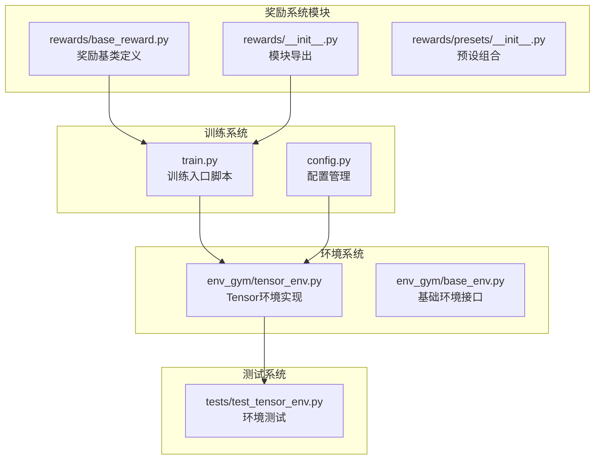
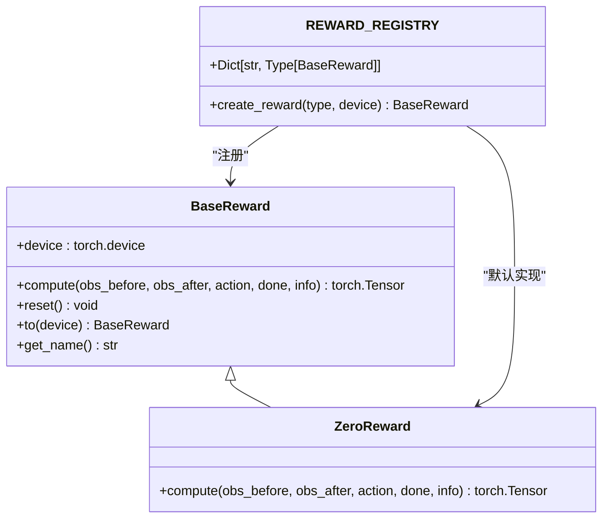
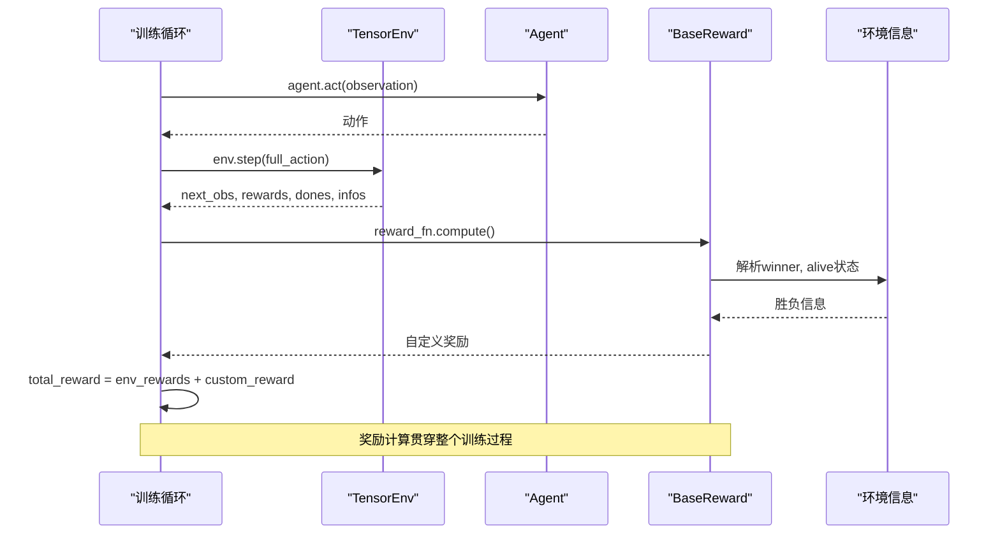
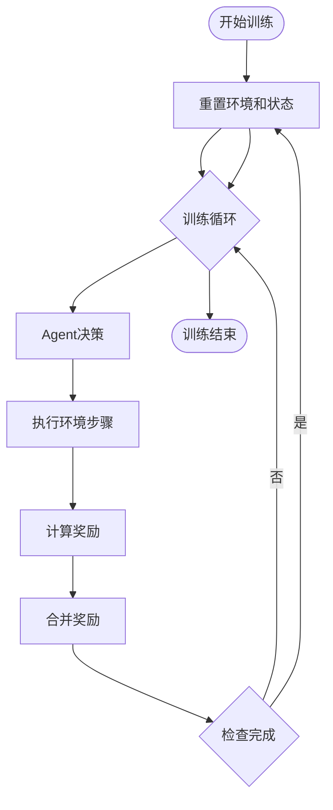
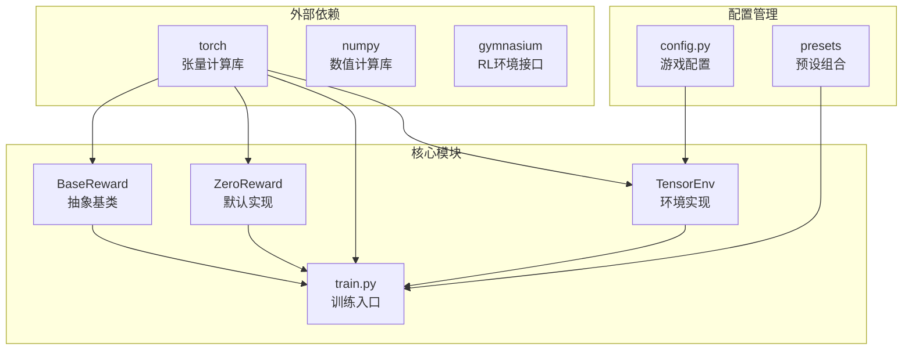

# 奖励系统

<cite>
**本文档引用的文件**
- [rewards/base_reward.py](file://rewards/base_reward.py)
- [rewards/__init__.py](file://rewards/__init__.py)
- [rewards/presets/__init__.py](file://rewards/presets/__init__.py)
- [train.py](file://train.py)
- [README.md](file://README.md)
- [config.py](file://config.py)
- [env_gym/tensor_env.py](file://env_gym/tensor_env.py)
- [tests/test_tensor_env.py](file://tests/test_tensor_env.py)
</cite>

## 目录
1. [简介](#简介)
2. [项目结构](#项目结构)
3. [核心组件](#核心组件)
4. [架构概览](#架构概览)
5. [详细组件分析](#详细组件分析)
6. [依赖关系分析](#依赖关系分析)
7. [性能考量](#性能考量)
8. [故障排除指南](#故障排除指南)
9. [结论](#结论)

## 简介

midrangeRL是一个中距空战AI强化学习平台，专门设计用于开发和测试空战策略。该系统的核心特性包括统一的实体槽位系统、多环境并行处理以及完整的RL接口。奖励系统作为强化学习训练的关键组成部分，在整个框架中扮演着至关重要的角色。

本项目采用模块化设计，奖励系统通过抽象基类定义了标准化的奖励计算接口，支持稀疏性、可解释性和训练稳定性等设计原则。系统提供了灵活的注册机制，允许开发者轻松扩展自定义奖励函数。

## 项目结构

项目采用清晰的模块化组织结构，主要分为以下几个核心部分：

**图表来源**
- [rewards/base_reward.py](file://rewards/base_reward.py#L1-L103)
- [train.py](file://train.py#L1-L374)
- [env_gym/tensor_env.py](file://env_gym/tensor_env.py#L1-L200)

**章节来源**
- [README.md](file://README.md#L64-L95)
- [rewards/__init__.py](file://rewards/__init__.py#L1-L10)

## 核心组件

### 奖励基类设计

奖励系统的核心是`BaseReward`抽象基类，它定义了所有奖励函数必须实现的统一接口。该设计遵循以下关键原则：

#### 接口标准化
- **输入参数**：接收step前后的观察状态、执行的动作、完成标志和环境信息
- **输出格式**：返回标量奖励张量，支持批量操作
- **设备兼容**：自动处理CUDA和CPU设备切换

#### 设计原则详解

**稀疏性原则**
- 奖励信号应该在关键时刻才出现，避免过度频繁的奖励
- 通过精确的触发条件确保奖励的指导性
- 减少不必要的计算开销，提高训练效率

**可解释性原则**
- 奖励函数的行为应该清晰可预测
- 提供明确的逻辑分支和决策依据
- 便于调试和性能分析

**训练稳定性原则**
- 奖励尺度应该适中，避免过大或过小的数值
- 确保奖励信号的一致性和连续性
- 防止奖励黑客行为的发生

**章节来源**
- [rewards/base_reward.py](file://rewards/base_reward.py#L12-L80)

### 注册表系统

系统采用注册表模式管理奖励函数，提供了灵活的扩展机制：

**图表来源**
- [rewards/base_reward.py](file://rewards/base_reward.py#L12-L103)
- [train.py](file://train.py#L38-L44)

**章节来源**
- [train.py](file://train.py#L38-L44)

## 架构概览

奖励系统在整个训练流程中发挥着关键作用，其架构设计体现了模块化和可扩展性的特点：

**图表来源**
- [train.py](file://train.py#L250-L262)
- [env_gym/tensor_env.py](file://env_gym/tensor_env.py#L1-L200)

### 数据流分析

奖励系统的数据流具有以下特征：

1. **输入数据**：包含step前后的观察状态、动作执行情况和环境终止标志
2. **处理逻辑**：根据环境提供的信息计算相应的奖励值
3. **输出结果**：返回标量奖励张量，与环境奖励进行组合

**章节来源**
- [train.py](file://train.py#L250-L262)

## 详细组件分析

### BaseReward 抽象基类

`BaseReward`类定义了奖励系统的核心接口规范：

#### 核心方法详解

**compute方法**
- 接收完整的状态信息用于奖励计算
- 返回与环境并行度匹配的奖励张量
- 支持复杂的条件判断和数学运算

**reset方法**
- 用于清理奖励函数的内部状态
- 在环境重置时自动调用
- 确保奖励计算的独立性

**to方法**
- 设备迁移功能，支持CUDA和CPU切换
- 返回自身实例，支持链式调用
- 确保计算资源的有效利用

**章节来源**
- [rewards/base_reward.py](file://rewards/base_reward.py#L28-L79)

### ZeroReward 默认实现

`ZeroReward`作为最简单的奖励函数，体现了"无奖励"的概念：

#### 实现特点
- 始终返回零奖励张量
- 用于基准测试和调试
- 确保奖励系统的完整性

**章节来源**
- [rewards/base_reward.py](file://rewards/base_reward.py#L82-L103)

### 训练集成机制

奖励系统与训练循环的集成体现了良好的架构设计：

#### 训练循环中的应用

**图表来源**
- [train.py](file://train.py#L170-L327)

**章节来源**
- [train.py](file://train.py#L170-L327)

## 依赖关系分析

奖励系统与其他模块的依赖关系体现了清晰的分层架构：

**图表来源**
- [rewards/base_reward.py](file://rewards/base_reward.py#L7-L9)
- [train.py](file://train.py#L13-L25)

### 关键依赖关系

**torch依赖**
- 张量操作和设备管理
- 数学运算和向量化处理
- GPU加速支持

**环境依赖**
- TensorEnv提供奖励计算所需的环境信息
- 配置系统提供游戏参数
- 测试系统验证奖励函数正确性

**章节来源**
- [train.py](file://train.py#L13-L25)
- [config.py](file://config.py#L1-L52)

## 性能考量

奖励系统的性能优化主要体现在以下几个方面：

### 计算效率优化

**向量化处理**
- 所有奖励计算都基于张量操作
- 支持批量环境并行处理
- 避免Python循环，充分利用GPU计算能力

**内存管理**
- 使用张量的clone()方法避免数据污染
- 合理的内存分配和释放策略
- 防止内存泄漏和过度占用

**设备优化**
- 自动检测和使用GPU加速
- CPU和GPU之间的高效数据传输
- 设备切换的透明处理

### 训练稳定性保障

**数值稳定性**
- 使用适当的数值范围和精度
- 防止溢出和下溢问题
- 稳定的梯度传播

**奖励尺度控制**
- 合理的奖励幅度设置
- 避免过大的奖励值影响训练
- 保持奖励信号的相对一致性

## 故障排除指南

### 常见问题及解决方案

**奖励函数未生效**
- 检查奖励函数是否正确继承BaseReward
- 确认注册表中已正确注册新奖励函数
- 验证训练参数中选择了正确的奖励类型

**设备相关错误**
- 确保奖励函数和环境在同一设备上
- 检查CUDA可用性和驱动版本
- 验证张量设备属性设置

**性能问题**
- 检查是否有不必要的张量复制操作
- 确保奖励计算逻辑的向量化
- 监控内存使用情况，避免内存泄漏

**章节来源**
- [train.py](file://train.py#L161-L168)

### 调试技巧

**日志输出**
- 利用get_name()方法获取奖励函数名称
- 在compute方法中添加必要的调试信息
- 监控奖励值的分布和变化趋势

**单元测试**
- 编写针对奖励函数的测试用例
- 验证边界条件和异常情况
- 确保奖励函数在各种状态下都能正常工作

## 结论

midrangeRL的奖励系统展现了现代强化学习框架的最佳实践。通过抽象基类的设计，系统实现了奖励函数的标准化和模块化；通过注册表机制，提供了灵活的扩展能力；通过与训练循环的深度集成，确保了奖励系统在整个强化学习流程中的重要作用。

该系统的设计充分考虑了稀疏性、可解释性和训练稳定性等关键因素，为开发高质量的空战AI奠定了坚实的基础。随着项目的进一步发展，奖励系统将继续演进，为更复杂的游戏场景和训练需求提供支持。

未来的发展方向包括：
- 扩展更多预设的奖励组合策略
- 实现动态奖励塑形技术
- 加强奖励黑客的防护机制
- 提供更丰富的奖励函数类型

这些改进将进一步提升系统的实用性和可靠性，为强化学习研究和应用提供更好的支撑。