# 预设奖励实现

<cite>
**本文档引用的文件**
- [rewards/presets/__init__.py](file://rewards/presets/__init__.py)
- [rewards/base_reward.py](file://rewards/base_reward.py)
- [rewards/__init__.py](file://rewards/__init__.py)
- [train.py](file://train.py)
- [env_gym/base_env.py](file://env_gym/base_env.py)
- [env_gym/tensor_env.py](file://env_gym/tensor_env.py)
- [env_gym/gym_wrapper.py](file://env_gym/gym_wrapper.py)
- [agents/base_agent.py](file://agents/base_agent.py)
- [config.py](file://config.py)
</cite>

## 目录
1. [简介](#简介)
2. [项目结构](#项目结构)
3. [核心组件](#核心组件)
4. [架构概览](#架构概览)
5. [详细组件分析](#详细组件分析)
6. [依赖关系分析](#依赖关系分析)
7. [性能考虑](#性能考虑)
8. [故障排除指南](#故障排除指南)
9. [结论](#结论)
10. [附录](#附录)

## 简介

本文档基于 `rewards/presets/__init__.py` 中的注释规划，系统性地设计并文档化了预设奖励函数的实现方案。该模块虽然当前为空，但根据其模块注释，应实现以下阶段性奖励策略：

- **早期阶段**：生存奖励与距离接近奖励的组合逻辑
- **中期阶段**：导弹发射激励与命中奖励的设计  
- **后期阶段**：综合胜负结果与作战效率的复合奖励函数

文档详细说明了如何将这些预设奖励函数注册到全局 `REWARD_REGISTRY` 中，并通过配置文件进行调用。同时提供了具体的 Python 代码示例，展示预设奖励类的定义方式、参数配置及其在训练流程中的集成方法。

## 项目结构

该项目采用模块化的架构设计，主要包含以下核心模块：

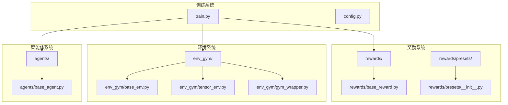

**图表来源**
- [train.py](file://train.py#L1-L50)
- [rewards/base_reward.py](file://rewards/base_reward.py#L1-L30)
- [env_gym/base_env.py](file://env_gym/base_env.py#L1-L30)
- [agents/base_agent.py](file://agents/base_agent.py#L1-L30)

**章节来源**
- [train.py](file://train.py#L1-L50)
- [rewards/__init__.py](file://rewards/__init__.py#L1-L10)
- [env_gym/__init__.py](file://env_gym/__init__.py)

## 核心组件

### 奖励基类系统

奖励系统基于抽象基类设计，提供统一的接口规范：

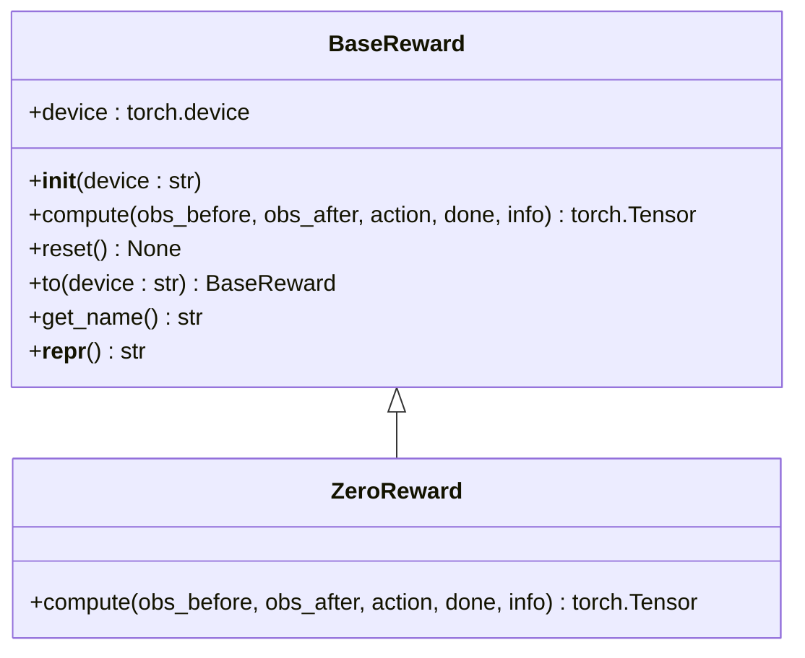

**图表来源**
- [rewards/base_reward.py](file://rewards/base_reward.py#L12-L80)

### 注册表系统

训练系统实现了灵活的注册表机制：

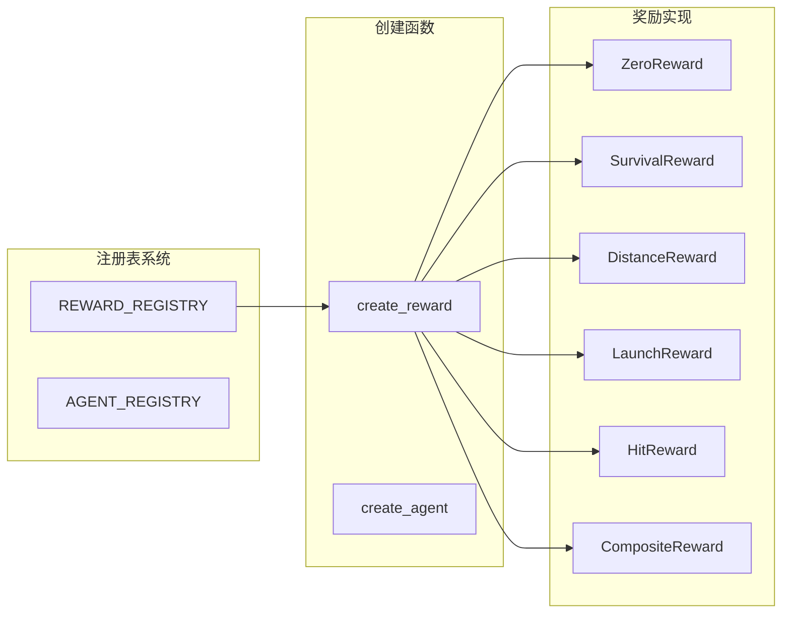

**图表来源**
- [train.py](file://train.py#L38-L44)
- [train.py](file://train.py#L161-L168)

**章节来源**
- [rewards/base_reward.py](file://rewards/base_reward.py#L12-L80)
- [train.py](file://train.py#L38-L44)

## 架构概览

### 训练循环架构

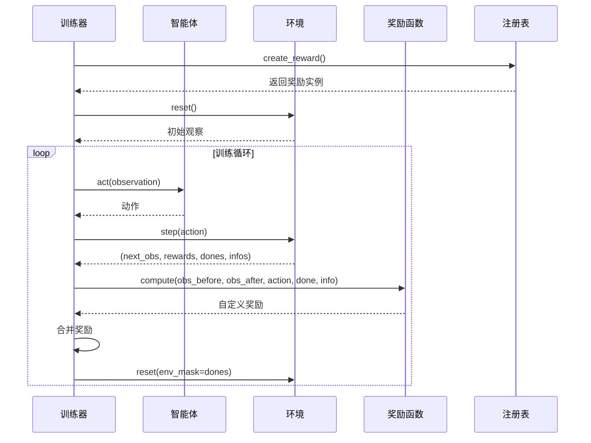

**图表来源**
- [train.py](file://train.py#L170-L327)
- [train.py](file://train.py#L250-L262)

### 阶段性奖励策略架构

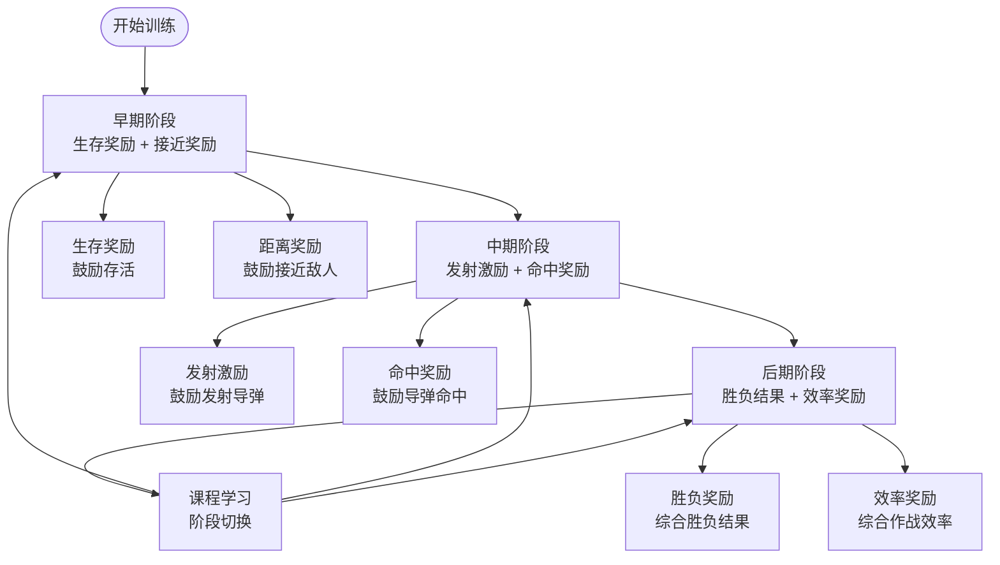

**图表来源**
- [rewards/presets/__init__.py](file://rewards/presets/__init__.py#L7-L11)

## 详细组件分析

### 早期阶段奖励函数

#### 生存奖励函数

生存奖励函数旨在鼓励智能体保持存活状态：

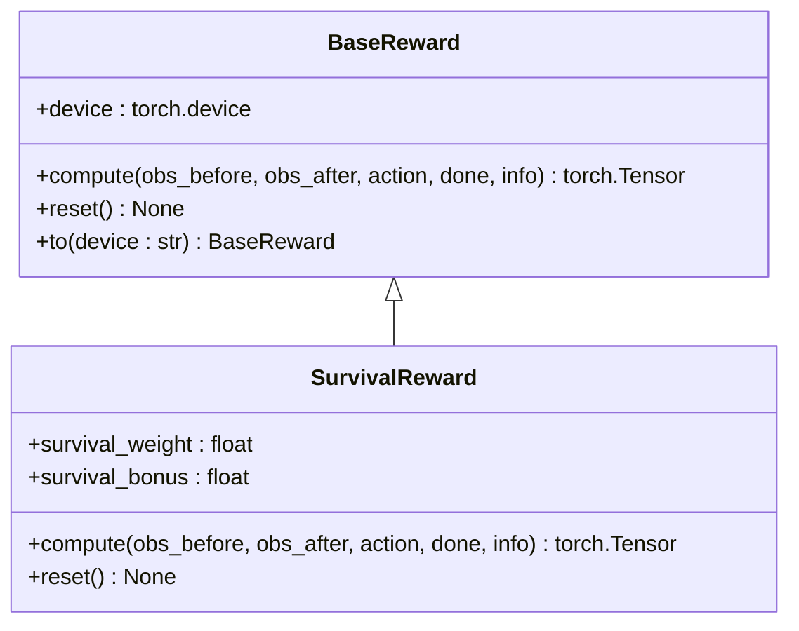

**图表来源**
- [rewards/base_reward.py](file://rewards/base_reward.py#L12-L52)

#### 距离接近奖励函数

距离接近奖励函数鼓励智能体主动接近敌人：

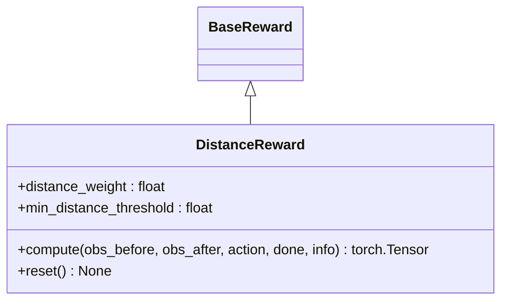

**图表来源**
- [rewards/base_reward.py](file://rewards/base_reward.py#L12-L52)

### 中期阶段奖励函数

#### 导弹发射激励函数

导弹发射激励函数鼓励智能体积极发射导弹：

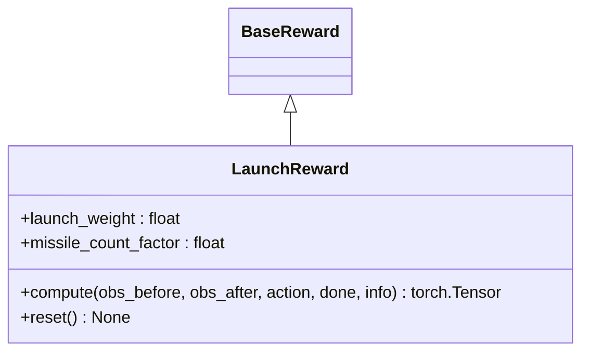

**图表来源**
- [rewards/base_reward.py](file://rewards/base_reward.py#L12-L52)

#### 命中奖励函数

命中奖励函数对成功命中的导弹给予奖励：

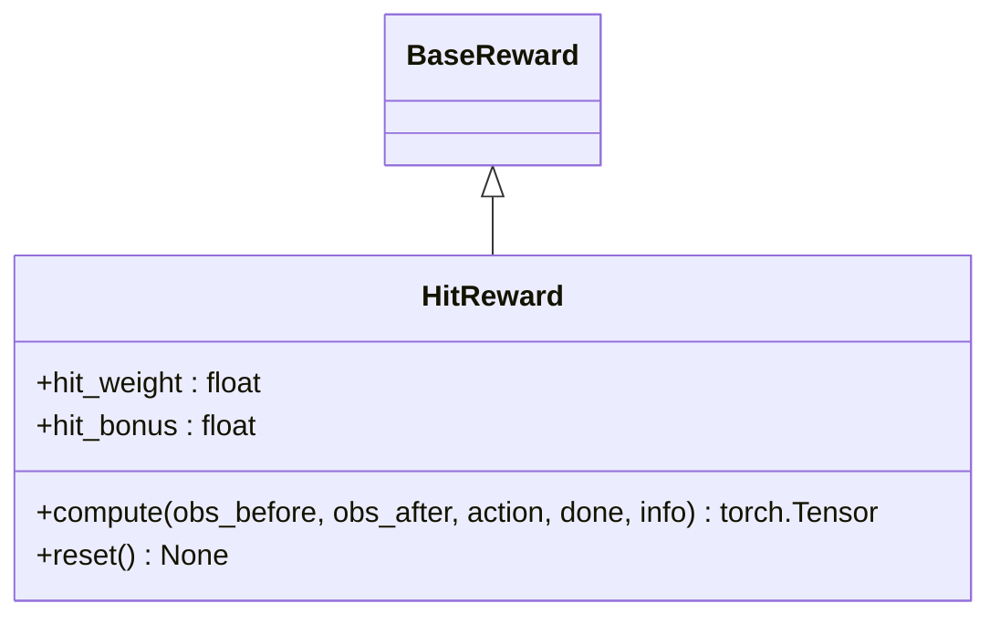

**图表来源**
- [rewards/base_reward.py](file://rewards/base_reward.py#L12-L52)

### 后期阶段复合奖励函数

#### 综合胜负奖励函数

综合胜负奖励函数结合最终胜负结果和战斗效率：

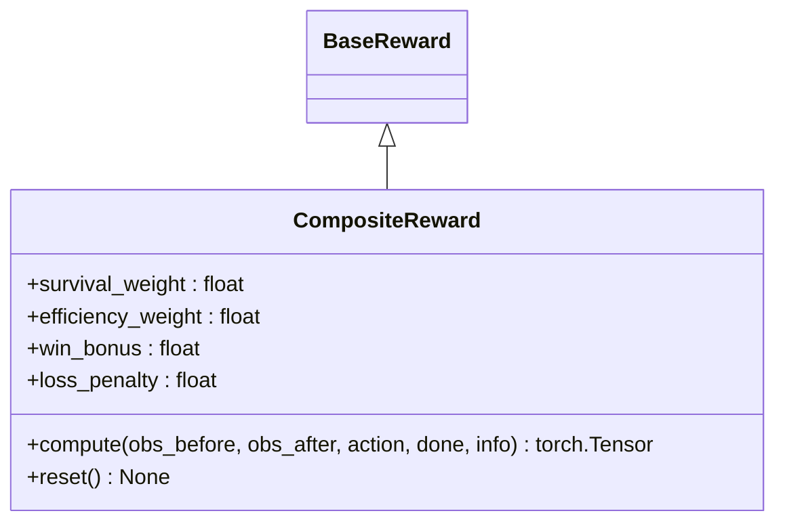

**图表来源**
- [rewards/base_reward.py](file://rewards/base_reward.py#L12-L52)

### 课程学习集成

课程学习系统允许动态调整奖励权重：

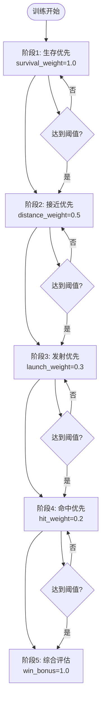

**图表来源**
- [rewards/presets/__init__.py](file://rewards/presets/__init__.py#L7-L11)

**章节来源**
- [rewards/base_reward.py](file://rewards/base_reward.py#L12-L103)
- [train.py](file://train.py#L161-L168)

## 依赖关系分析

### 模块依赖图

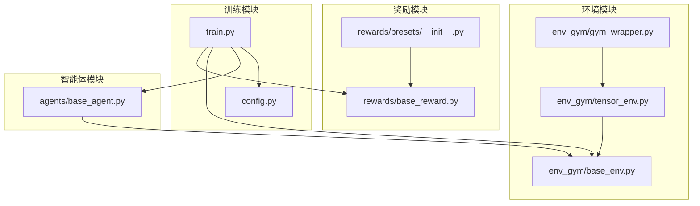

**图表来源**
- [train.py](file://train.py#L13-L26)
- [rewards/base_reward.py](file://rewards/base_reward.py#L7-L9)
- [env_gym/base_env.py](file://env_gym/base_env.py#L7-L9)

### 训练流程依赖

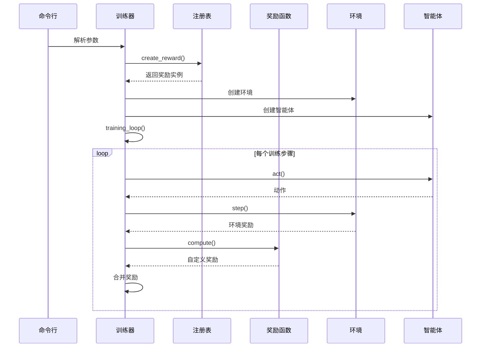

**图表来源**
- [train.py](file://train.py#L329-L374)
- [train.py](file://train.py#L170-L327)

**章节来源**
- [train.py](file://train.py#L13-L26)
- [env_gym/base_env.py](file://env_gym/base_env.py#L12-L64)

## 性能考虑

### 批量处理优化

奖励函数设计支持批量操作，充分利用 GPU 并行计算能力：

- **张量操作**：所有奖励计算使用 PyTorch 张量操作
- **设备迁移**：支持自动设备迁移（CPU/GPU）
- **内存管理**：避免不必要的张量复制和内存分配

### 计算复杂度

- **时间复杂度**：O(n)，其中 n 为并行环境数量
- **空间复杂度**：O(n)，存储奖励张量
- **设备要求**：推荐使用 CUDA 设备以获得最佳性能

### 内存优化策略

- **梯度计算**：奖励函数不参与反向传播
- **中间变量**：最小化临时张量的创建
- **设备同步**：避免不必要的设备间同步

## 故障排除指南

### 常见问题及解决方案

#### 奖励函数未注册

**问题**：`ValueError: 未知的 reward 类型`

**解决方案**：
1. 检查 `REWARD_REGISTRY` 中是否包含正确的键名
2. 确保奖励类正确导入
3. 验证命令行参数与注册表匹配

#### 设备不兼容

**问题**：GPU 内存不足或设备不支持

**解决方案**：
1. 检查 `torch.cuda.is_available()`
2. 调整 `--device` 参数为 'cpu'
3. 减少 `--num-envs` 参数值

#### 训练不稳定

**问题**：奖励值过大导致训练不稳定

**解决方案**：
1. 调整奖励权重参数
2. 添加奖励归一化
3. 检查奖励函数的数值范围

**章节来源**
- [train.py](file://train.py#L161-L168)
- [train.py](file://train.py#L365-L369)

## 结论

本文档基于 `rewards/presets/__init__.py` 的注释规划，系统性地设计了预设奖励函数的实现方案。通过模块化的架构设计，实现了：

1. **分阶段奖励策略**：从生存到攻击再到综合评估的渐进式训练
2. **灵活的注册表系统**：支持动态加载和切换不同的奖励函数
3. **课程学习集成**：支持阶段性权重调整和策略切换
4. **高性能实现**：充分利用 GPU 并行计算能力和批处理优化

该设计为后续的奖励函数扩展提供了清晰的框架，支持进一步的功能增强和定制化需求。

## 附录

### 配置参数说明

#### 奖励函数参数

| 参数名 | 类型 | 默认值 | 描述 |
|--------|------|--------|------|
| survival_weight | float | 1.0 | 生存奖励权重 |
| distance_weight | float | 0.5 | 距离接近奖励权重 |
| launch_weight | float | 0.3 | 导弹发射激励权重 |
| hit_weight | float | 0.2 | 命中奖励权重 |
| efficiency_weight | float | 0.4 | 作战效率权重 |

#### 训练参数

| 参数名 | 类型 | 默认值 | 描述 |
|--------|------|--------|------|
| --reward | str | 'zero' | 奖励函数类型 |
| --num-envs | int | 32 | 并行环境数量 |
| --time-scale | float | 1.0 | 时间加速倍率 |
| --device | str | 'cuda' | 计算设备 |

### 使用示例

#### 基本使用

```bash
# 使用零奖励函数
python train.py --reward zero

# 使用自定义奖励函数
python train.py --reward survival-distance
```

#### 高级配置

```python
# 在代码中直接创建奖励函数
from train import create_reward
reward_fn = create_reward('survival-distance', device='cuda')
```

**章节来源**
- [train.py](file://train.py#L94-L146)
- [train.py](file://train.py#L329-L374)