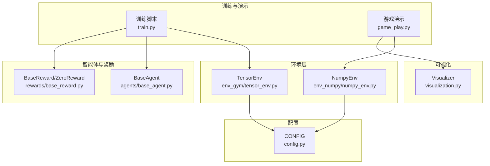
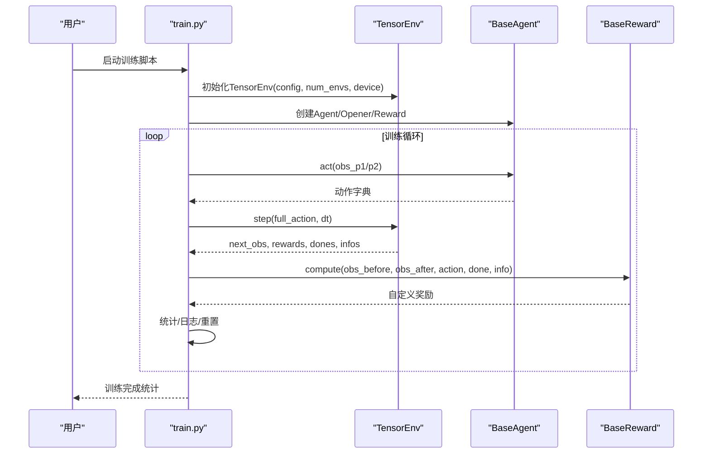
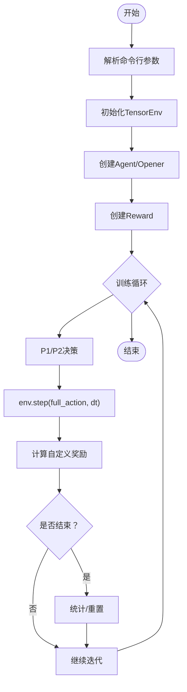
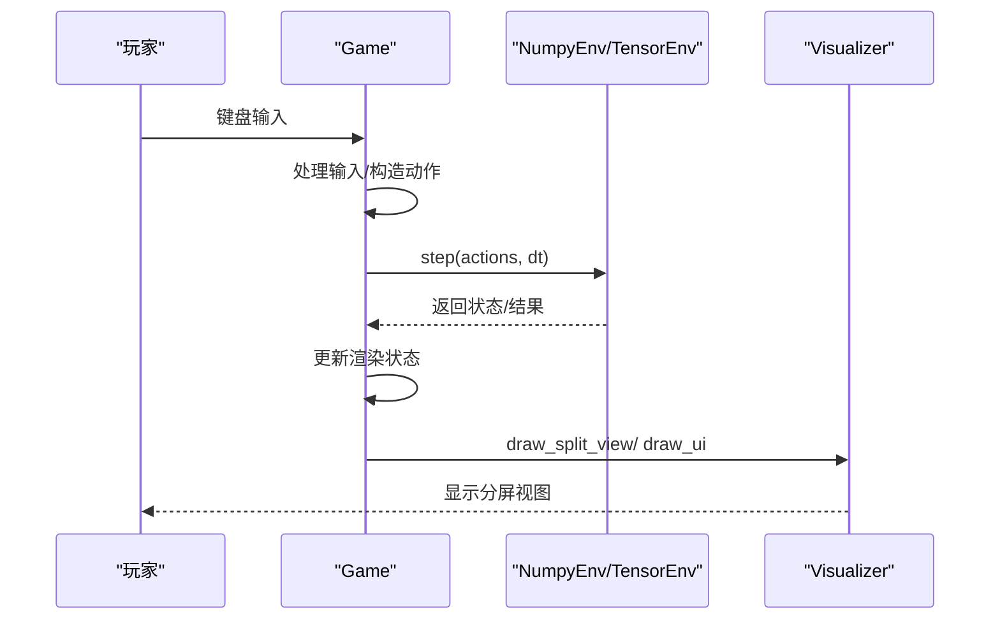
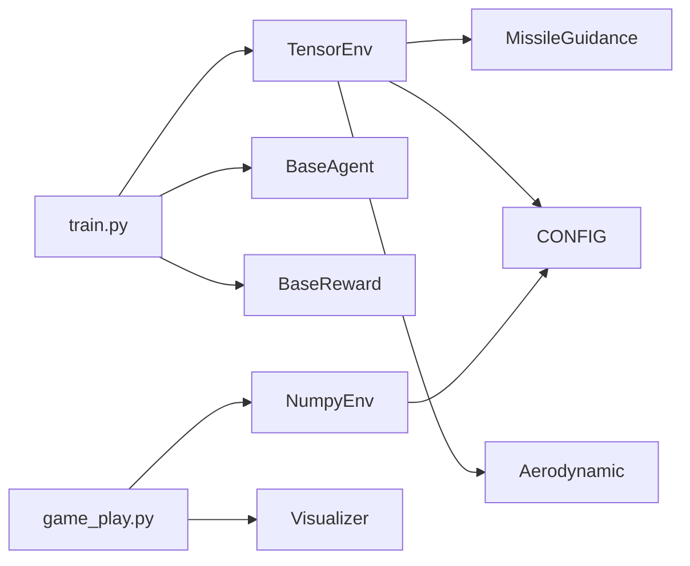
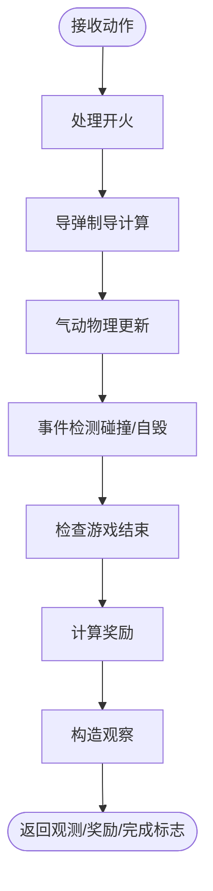

# 快速开始

<cite>
**本文引用的文件列表**
- [README.md](file://README.md)
- [train.py](file://train.py)
- [game_play.py](file://game_play.py)
- [config.py](file://config.py)
- [env_gym/tensor_env.py](file://env_gym/tensor_env.py)
- [env_numpy/numpy_env.py](file://env_numpy/numpy_env.py)
- [visualization.py](file://visualization.py)
- [agents/base_agent.py](file://agents/base_agent.py)
- [rewards/base_reward.py](file://rewards/base_reward.py)
- [tests/test_tensor_env.py](file://tests/test_tensor_env.py)
</cite>

## 目录
1. [简介](#简介)
2. [项目结构](#项目结构)
3. [核心组件](#核心组件)
4. [架构总览](#架构总览)
5. [详细组件分析](#详细组件分析)
6. [依赖关系分析](#依赖关系分析)
7. [性能注意事项](#性能注意事项)
8. [故障排查指南](#故障排查指南)
9. [结论](#结论)
10. [附录](#附录)

## 简介
本项目是一个中距空战AI强化学习平台，提供两种运行方式：
- 强化学习训练：基于GPU并行的Tensor环境，支持多环境同时运行，适合大规模RL训练。
- 交互式游戏：基于PyGame的2D可视化界面，支持手动操控与分屏视图，便于教学与演示。

本快速入门将指导你：
- 配置运行环境与安装依赖（PyTorch、PyGame、NumPy）
- 运行训练脚本与游戏演示
- 理解train.py的执行流程与game_play.py的交互方式
- 解决常见安装与运行问题

## 项目结构
项目采用“功能分层 + 模块化”的组织方式：
- env_gym：GPU加速的RL训练环境（多环境并行）
- env_numpy：CPU稳定的可视化游戏环境
- agents/rewards：抽象的智能体与奖励接口
- visualization.py：PyGame可视化模块
- config.py：统一配置参数
- tests：环境与训练流程的基础测试

图表来源
- [train.py](file://train.py#L1-L374)
- [game_play.py](file://game_play.py#L1-L331)
- [env_gym/tensor_env.py](file://env_gym/tensor_env.py#L1-L772)
- [env_numpy/numpy_env.py](file://env_numpy/numpy_env.py#L1-L365)
- [visualization.py](file://visualization.py#L1-L280)
- [config.py](file://config.py#L1-L52)
- [agents/base_agent.py](file://agents/base_agent.py#L1-L118)
- [rewards/base_reward.py](file://rewards/base_reward.py#L1-L103)

章节来源
- [README.md](file://README.md#L64-L95)

## 核心组件
- 训练入口：train.py
  - 解析命令行参数（agent/opponent/reward/并行数/时间加速/设备/训练步数等）
  - 初始化TensorEnv、Agent、Reward
  - 主训练循环：决策→执行→奖励→统计→日志
- 游戏演示：game_play.py
  - 初始化PyGame与Visualizer
  - 处理键盘输入，构造动作字典
  - 执行环境step，更新渲染状态，绘制分屏视图
- 环境实现：
  - TensorEnv（GPU并行）：统一实体槽位、多环境并行、奖励与观察空间
  - NumpyEnv（CPU）：稳定的游戏逻辑，用于可视化演示
- 可视化：visualization.py
  - 分屏视图、网格、轨迹、速度矢量、UI状态栏
- 配置：config.py
  - 游戏窗口、视图、物理参数、导弹与飞机参数

章节来源
- [train.py](file://train.py#L70-L147)
- [game_play.py](file://game_play.py#L58-L121)
- [env_gym/tensor_env.py](file://env_gym/tensor_env.py#L206-L275)
- [env_numpy/numpy_env.py](file://env_numpy/numpy_env.py#L49-L95)
- [visualization.py](file://visualization.py#L8-L51)
- [config.py](file://config.py#L7-L52)

## 架构总览
下面的序列图展示了训练与游戏两条主线的调用关系与数据流。

图表来源
- [train.py](file://train.py#L170-L327)
- [env_gym/tensor_env.py](file://env_gym/tensor_env.py#L351-L417)
- [agents/base_agent.py](file://agents/base_agent.py#L46-L82)
- [rewards/base_reward.py](file://rewards/base_reward.py#L28-L52)

## 详细组件分析

### 训练脚本 train.py 执行流程
- 参数解析：支持agent/opponent/reward/并行数/time-scale/device/max-steps/episode-max-steps/seed/verbose等
- 环境初始化：从config复制配置，创建TensorEnv（num_envs/device）
- Agent与Reward注册：当前占位Agent与ZeroReward
- 主循环：
  - 分别让P1/P2 Agent决策，构造完整动作字典
  - 执行env.step，得到next_obs、rewards、dones、infos
  - 计算自定义奖励并与环境奖励合并
  - 处理episode结束：统计胜负、重置完成的环境与Agent状态
  - 日志输出：每1000步打印胜率与总局数
  - 强制重置：超过单局最大步数时重置
- 结束：打印最终统计并关闭环境

图表来源
- [train.py](file://train.py#L170-L327)

章节来源
- [train.py](file://train.py#L70-L147)
- [train.py](file://train.py#L329-L374)

### 游戏演示 game_play.py 使用方法
- 初始化：创建Game实例，选择后端（numpy/tensor），初始化Visualizer与环境
- 输入处理：键盘映射（红方WASD/开火T，蓝方方向键/开火=），支持边缘检测与渐变控制
- 环境步进：调用env.step，处理返回值（numpy返回(game_over, winner)，tensor返回(dones, infos)）
- 渲染：调用Visualizer.draw_split_view与draw_ui，支持分屏与UI状态栏
- 视图切换：按键V切换视图模式（常规/时空图）

图表来源
- [game_play.py](file://game_play.py#L122-L317)
- [visualization.py](file://visualization.py#L163-L264)

章节来源
- [game_play.py](file://game_play.py#L58-L121)
- [game_play.py](file://game_play.py#L265-L331)
- [visualization.py](file://visualization.py#L163-L264)

### 环境实现对比
- env_gym/TensorEnv（GPU并行）
  - 多环境并行：num_envs维张量，统一实体槽位
  - 观察空间：归一化的相对位置与状态
  - 奖励：生存/胜负/弹药消耗等
  - 制导与物理：导弹制导、气动模型、碰撞检测
- env_numpy/NumpyEnv（CPU稳定）
  - 单环境，面向可视化演示
  - 发射冷却、轨迹维护、碰撞检测
  - 与TensorEnv保持接口兼容

章节来源
- [env_gym/tensor_env.py](file://env_gym/tensor_env.py#L206-L275)
- [env_gym/tensor_env.py](file://env_gym/tensor_env.py#L627-L686)
- [env_numpy/numpy_env.py](file://env_numpy/numpy_env.py#L49-L95)
- [env_numpy/numpy_env.py](file://env_numpy/numpy_env.py#L133-L176)

### 可视化模块 visualization.py
- 分屏视图：左右两个正方形视口，分别跟随红蓝双方视角
- 网格与箭头：地面网格、远距离目标指示箭头
- 实体绘制：飞机/导弹符号、速度矢量、标签（马赫数/G负载）
- UI状态栏：顶部显示双方状态，底部显示操作提示与视图模式

章节来源
- [visualization.py](file://visualization.py#L8-L51)
- [visualization.py](file://visualization.py#L163-L264)

## 依赖关系分析
- 运行依赖
  - PyTorch：Tensor环境与GPU加速
  - NumPy：CPU环境与数值计算
  - PyGame：2D可视化与交互
  - gymnasium（可选）：Gymnasium兼容包装器
- 模块耦合
  - train.py依赖TensorEnv、Agent、Reward
  - game_play.py依赖NumpyEnv与Visualizer
  - TensorEnv依赖Aerodynamic/MissileGuidance模块
  - 所有模块共享config.py中的统一配置

图表来源
- [train.py](file://train.py#L13-L26)
- [game_play.py](file://game_play.py#L17-L19)
- [env_gym/tensor_env.py](file://env_gym/tensor_env.py#L15-L37)
- [env_numpy/numpy_env.py](file://env_numpy/numpy_env.py#L12-L14)
- [config.py](file://config.py#L47-L52)

章节来源
- [README.md](file://README.md#L53-L62)
- [README.md](file://README.md#L96-L104)

## 性能注意事项
- GPU优先：TensorEnv默认使用CUDA，若无GPU或CUDA不可用，自动回退到CPU
- 并行规模：num_envs越大，吞吐越高，但显存占用也越大
- 时间加速：time_scale可放大dt，提升训练速度，但需平衡稳定性
- 观察空间：归一化后的张量有利于深度学习模型训练

章节来源
- [train.py](file://train.py#L116-L120)
- [env_gym/tensor_env.py](file://env_gym/tensor_env.py#L209-L218)

## 故障排查指南

### 安装与依赖
- PyTorch安装
  - 若CUDA版本不匹配，建议安装与显卡驱动匹配的PyTorch版本
  - 可使用官方安装命令，确保选择正确的CUDA版本
- PyGame显示异常
  - Windows下常见问题：字体缺失或中文字体加载失败
  - 解决方案：确保系统存在常用中文字体，或允许程序回退到默认字体
- NumPy版本
  - 确保NumPy版本与项目兼容，避免因版本差异导致的数值计算问题

章节来源
- [README.md](file://README.md#L11-L15)
- [game_play.py](file://game_play.py#L28-L56)

### 训练运行问题
- CUDA不可用
  - 现象：报错或无法使用GPU
  - 解决：train.py会自动回退到CPU；也可手动指定device=cpu
- 训练卡住或无输出
  - 检查num_envs与设备内存，适当降低并行数
  - 检查time_scale是否过大导致不稳定
- 环境重置异常
  - 确保dones掩码正确传递给env.reset(env_mask=dones)

章节来源
- [train.py](file://train.py#L116-L120)
- [train.py](file://train.py#L282-L288)

### 游戏演示问题
- PyGame窗口无响应
  - 确认事件循环正常处理QUIT与KEYDOWN事件
  - 检查键盘映射是否冲突（如同时按下多个方向键）
- 视图显示异常
  - 确认窗口尺寸与视口比例匹配
  - 切换视图模式（V键）查看是否恢复正常

章节来源
- [game_play.py](file://game_play.py#L274-L283)
- [visualization.py](file://visualization.py#L265-L267)

## 结论
通过本快速入门，你可以在5分钟内完成环境配置、安装依赖、运行训练与游戏演示，并理解核心组件的职责与交互。建议先用game_play.py熟悉玩法，再用train.py进行RL训练。遇到问题时，优先检查CUDA与PyGame相关依赖，以及num_envs与time_scale的设置。

## 附录

### 命令行示例与预期输出
- 安装依赖
  - 示例命令：pip install torch pygame numpy gymnasium
- 试玩
  - 示例命令：python game_play.py
  - 预期：出现分屏视图，红方WASD控制，蓝方方向键控制，V切换视图，ESC退出
- RL训练
  - 示例命令：python train.py --num-envs 32 --device cuda --time-scale 1.0 --max-steps 10000
  - 预期：每1000步打印P1胜率与总局数，训练结束后输出最终统计

章节来源
- [README.md](file://README.md#L17-L31)
- [train.py](file://train.py#L329-L374)

### 关键流程图：TensorEnv内部物理与制导

图表来源
- [env_gym/tensor_env.py](file://env_gym/tensor_env.py#L351-L417)
- [env_gym/tensor_env.py](file://env_gym/tensor_env.py#L419-L556)
- [env_gym/tensor_env.py](file://env_gym/tensor_env.py#L593-L625)