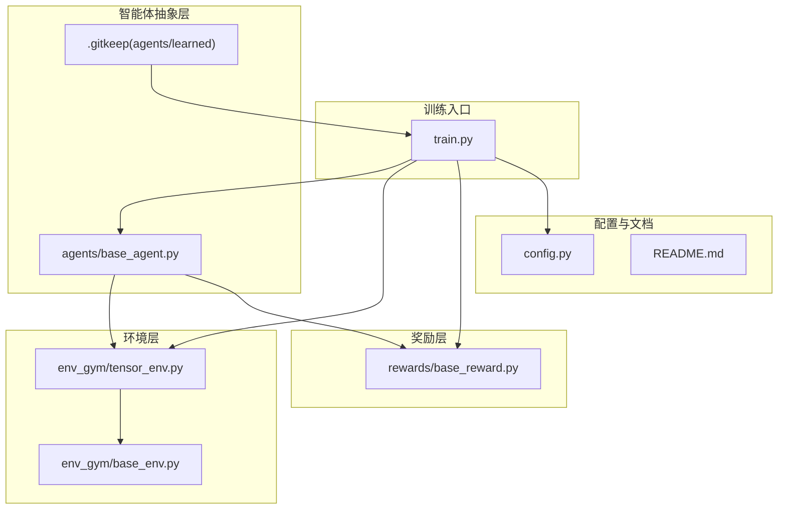
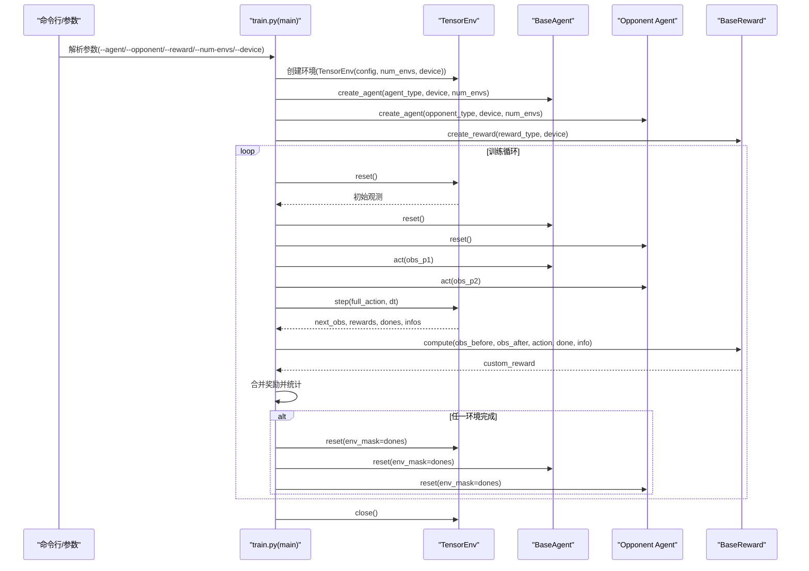
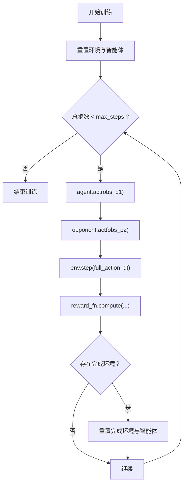
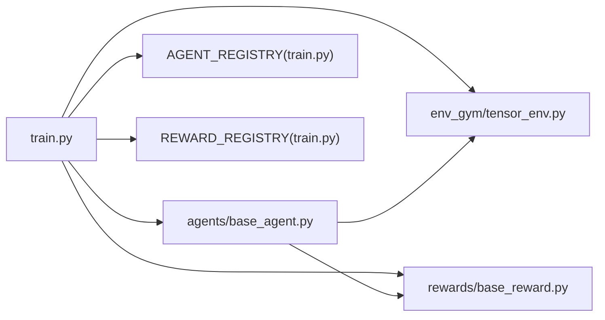

# 学习型智能体

<cite>
**本文引用的文件**
- [agents/base_agent.py](file://agents/base_agent.py)
- [agents/learned/.gitkeep](file://agents/learned/.gitkeep)
- [train.py](file://train.py)
- [config.py](file://config.py)
- [README.md](file://README.md)
- [env_gym/tensor_env.py](file://env_gym/tensor_env.py)
- [env_gym/base_env.py](file://env_gym/base_env.py)
- [rewards/base_reward.py](file://rewards/base_reward.py)
- [agents/__init__.py](file://agents/__init__.py)
- [agents/rule_based/__init__.py](file://agents/rule_based/__init__.py)
</cite>

## 目录
1. [简介](#简介)
2. [项目结构](#项目结构)
3. [核心组件](#核心组件)
4. [架构总览](#架构总览)
5. [详细组件分析](#详细组件分析)
6. [依赖关系分析](#依赖关系分析)
7. [性能考量](#性能考量)
8. [故障排查指南](#故障排查指南)
9. [结论](#结论)
10. [附录](#附录)

## 简介
本指南面向希望在本项目中开发“学习型智能体”的开发者，围绕 agents/learned 目录的存在（由 .gitkeep 标识）说明其用途：用于存放基于深度强化学习的智能体实现。我们将系统讲解如何继承 agents/base_agent.py 中的 BaseAgent 抽象基类来构建神经网络策略，包括：
- 定义网络架构（如 MLP、RNN）
- 实现 act() 方法以执行前向推理
- 在 reset() 中管理隐藏状态等内部状态
- 将 PyTorch 模型集成到智能体中，并处理设备（CUDA/CPU）迁移
- 利用 train() 和 eval() 方法切换模型模式以支持训练与评估
- 注册新学习型智能体到全局 AGENT_REGISTRY
- 展示在 train.py 中配置和调用学习型智能体进行训练的完整流程
- 讨论模型检查点保存、加载及超参数配置的最佳实践

## 项目结构
该项目采用模块化组织方式，核心训练入口位于 train.py，环境与奖励接口分别位于 env_gym 与 rewards 目录，智能体抽象基类位于 agents/base_agent.py。agents/learned 目录目前为空，但通过 .gitkeep 文件保留目录以便后续提交模型权重。

图表来源
- [train.py](file://train.py#L1-L374)
- [agents/base_agent.py](file://agents/base_agent.py#L1-L118)
- [agents/learned/.gitkeep](file://agents/learned/.gitkeep#L1-L3)
- [env_gym/tensor_env.py](file://env_gym/tensor_env.py#L1-L200)
- [env_gym/base_env.py](file://env_gym/base_env.py#L1-L96)
- [rewards/base_reward.py](file://rewards/base_reward.py#L1-L103)
- [config.py](file://config.py#L1-L52)
- [README.md](file://README.md#L1-L115)

章节来源
- [README.md](file://README.md#L64-L95)
- [agents/learned/.gitkeep](file://agents/learned/.gitkeep#L1-L3)
- [train.py](file://train.py#L1-L374)

## 核心组件
- BaseAgent 抽象基类：定义统一的智能体接口，包括 act()、reset()、train()、eval()、to() 等方法，以及设备与并行环境数的管理。
- TensorEnv 环境：提供 GPU 加速的多环境并行接口，支持批量观察、动作与奖励计算。
- BaseReward 奖励函数：定义统一的奖励接口 compute()，支持批量计算与设备迁移。
- AGENT_REGISTRY：训练入口 train.py 中的智能体注册表，用于按名称创建智能体实例。
- config.py：集中管理游戏与物理参数，供环境与智能体使用。

章节来源
- [agents/base_agent.py](file://agents/base_agent.py#L13-L118)
- [env_gym/tensor_env.py](file://env_gym/tensor_env.py#L1-L200)
- [rewards/base_reward.py](file://rewards/base_reward.py#L12-L80)
- [train.py](file://train.py#L28-L68)
- [config.py](file://config.py#L7-L52)

## 架构总览
下图展示了训练循环中智能体与环境、奖励之间的交互关系，以及设备与并行环境的传递路径。

图表来源
- [train.py](file://train.py#L170-L327)
- [env_gym/tensor_env.py](file://env_gym/tensor_env.py#L1-L200)
- [agents/base_agent.py](file://agents/base_agent.py#L46-L82)
- [rewards/base_reward.py](file://rewards/base_reward.py#L28-L52)

## 详细组件分析

### BaseAgent 抽象基类与学习型智能体继承
- 统一接口：act(observation) 返回动作字典；reset(env_mask) 用于清理内部状态（如 RNN 隐藏状态）。
- 设备与并行：device 字段与 to() 方法支持 CUDA/CPU 迁移；num_envs 与 num_envs setter 支持批量推理。
- 模式切换：train()/eval() 为 RL 智能体提供模式切换钩子，便于 Dropout/BatchNorm 等行为控制。
- 观察空间约定：observation 字典包含归一化的位置、角度、速度、导弹数量、存活状态等，便于神经网络输入。

建议实现要点
- 在 __init__ 中构建神经网络（如 MLP/RNN），并确保参数与设备一致。
- 在 act() 中执行前向推理，输出动作字典，张量设备与 self.device 一致。
- 在 reset() 中重置隐藏状态（如 LSTM/GRU 的 h0/c0），并支持 env_mask 的部分重置。
- 使用 train()/eval() 切换模型训练/评估模式，必要时在子类中覆写以适配具体算法。

章节来源
- [agents/base_agent.py](file://agents/base_agent.py#L13-L118)

### 在 agents/learned 目录中实现学习型智能体
- 目录用途：agents/learned 用于存放训练得到的模型参数与实现文件，.gitkeep 保证目录被 Git 追踪。
- 实现步骤
  - 新建文件 agents/learned/my_rl_agent.py，定义 MyRLAgent(BaseAgent)。
  - 在 __init__ 中构建网络（如 MLP/RNN），并调用 super().__init__(device)。
  - 实现 act()：将 observation 转换为张量，执行前向推理，输出动作字典。
  - 实现 reset()：重置隐藏状态，支持 env_mask。
  - 可选：覆写 train()/eval() 以适配具体算法。
  - 将 MyRLAgent 注册到 AGENT_REGISTRY（见下一节）。

章节来源
- [agents/learned/.gitkeep](file://agents/learned/.gitkeep#L1-L3)
- [agents/base_agent.py](file://agents/base_agent.py#L13-L118)

### 将 PyTorch 模型集成到智能体并处理设备迁移
- 设备一致性：确保模型参数、输入张量与 self.device 一致；使用 to() 在构造后或运行时迁移。
- 输入预处理：将 observation 字典中的张量移动到 self.device，避免设备不匹配。
- 前向推理：在 act() 中执行前向推理，输出动作张量（rudder、throttle、fire）。
- 模式切换：在 train()/eval() 中调用模型的 train()/eval()，以启用/禁用 Dropout/BatchNorm 等行为。

章节来源
- [agents/base_agent.py](file://agents/base_agent.py#L27-L94)
- [train.py](file://train.py#L150-L158)

### 在 train.py 中注册与调用学习型智能体
- 注册表 AGENT_REGISTRY：在 train.py 中维护字符串到智能体类的映射，新增智能体需在此注册。
- 创建智能体：create_agent() 根据 agent_type 从 AGENT_REGISTRY 获取类，实例化时传入 device 与 num_envs。
- 训练循环：training_loop() 中调用 agent.act() 与 opponent.act()，并将动作合并后传入 env.step()。

最佳实践
- 在注册表中添加新智能体类名与类本身。
- 确保智能体类的 __init__(device) 与 BaseAgent 一致。
- 在 main() 中解析 --agent/--opponent/--device 等参数并传给 create_agent()。

章节来源
- [train.py](file://train.py#L28-L68)
- [train.py](file://train.py#L150-L158)
- [train.py](file://train.py#L329-L374)

### 训练流程与数据流（结合 BaseAgent 与 TensorEnv）
- 初始化：创建 TensorEnv(config, num_envs, device)，并创建 agent 与 reward。
- 循环步骤：
  - 重置环境与智能体
  - agent.act(obs_p1) 与 opponent.act(obs_p2)
  - 合并动作并执行 env.step()
  - 计算自定义奖励 reward_fn.compute(...)
  - 统计胜负并按需重置
- 设备与并行：所有张量与模型均在 args.device 上，num_envs 控制并行度。

图表来源
- [train.py](file://train.py#L170-L327)
- [agents/base_agent.py](file://agents/base_agent.py#L71-L82)
- [env_gym/tensor_env.py](file://env_gym/tensor_env.py#L1-L200)

### 网络架构与实现建议（MLP/RNN）
- MLP：适合静态观察空间，将归一化特征拼接为向量，通过若干线性层输出动作分布或确定性动作。
- RNN/LSTM/GRU：适合时序观察（如历史状态、隐藏状态），在 reset() 中管理 h0/c0，在 act() 中逐步更新隐藏状态。
- 注意事项：确保输入维度与 observation 字典一致；输出动作范围与 BaseAgent 约定一致（rudder∈[-1,1]，throttle∈[0,1]，fire 为布尔）。

章节来源
- [agents/base_agent.py](file://agents/base_agent.py#L46-L68)

### 模型检查点保存、加载与超参数配置
- 检查点保存：在训练循环中定期保存模型权重（如每 N 步或每若干 episode），包含优化器状态与超参数。
- 检查点加载：从上次断点恢复训练，确保设备与并行数与保存时一致。
- 超参数配置：通过命令行参数（--max-steps、--episode-max-steps、--seed、--device、--num-envs）与 config.py 参数共同决定训练行为。
- 建议：将超参数写入日志文件，便于复现实验；在 train.py 中增加 --checkpoint-path 与 --resume-from 参数。

章节来源
- [train.py](file://train.py#L70-L147)
- [config.py](file://config.py#L7-L52)

## 依赖关系分析
- train.py 依赖 BaseAgent、TensorEnv、BaseReward 与 AGENT_REGISTRY/REWARD_REGISTRY。
- BaseAgent 与 BaseReward 分别定义了智能体与奖励的统一接口，确保训练循环解耦。
- TensorEnv 提供 GPU 加速的多环境并行，与智能体的 act() 输出格式保持一致。

图表来源
- [train.py](file://train.py#L23-L43)
- [agents/base_agent.py](file://agents/base_agent.py#L13-L118)
- [env_gym/tensor_env.py](file://env_gym/tensor_env.py#L1-L200)
- [rewards/base_reward.py](file://rewards/base_reward.py#L12-L80)

章节来源
- [train.py](file://train.py#L23-L43)
- [agents/base_agent.py](file://agents/base_agent.py#L13-L118)
- [env_gym/base_env.py](file://env_gym/base_env.py#L12-L96)
- [rewards/base_reward.py](file://rewards/base_reward.py#L12-L80)

## 性能考量
- 设备选择：优先使用 CUDA（若可用），否则回退到 CPU；通过 --device 控制。
- 并行度：--num-envs 控制并行环境数量，提升样本收集效率；注意显存与内存占用。
- 数据类型与设备一致性：确保 observation、动作与模型参数在同一设备上，避免频繁迁移。
- 模式切换：在训练与评估之间正确切换 train()/eval()，以减少不必要的计算开销。

章节来源
- [train.py](file://train.py#L116-L120)
- [train.py](file://train.py#L103-L114)
- [agents/base_agent.py](file://agents/base_agent.py#L96-L110)

## 故障排查指南
- 设备不匹配：若出现“Expected all tensors to be on the same device”错误，请确认智能体与环境的 device 一致，并在构造后调用 to(device)。
- 观察空间不匹配：检查 observation 字典键名与形状是否符合 BaseAgent 约定。
- 模式问题：若模型在推理时表现异常，确认是否正确调用了 eval()。
- 注册失败：若 --agent/--opponent 无法识别，请检查 AGENT_REGISTRY 中是否已注册对应类名。

章节来源
- [agents/base_agent.py](file://agents/base_agent.py#L27-L94)
- [train.py](file://train.py#L150-L158)

## 结论
通过继承 BaseAgent 并在 agents/learned 目录中实现学习型智能体，可以快速接入 train.py 的训练框架。遵循统一接口、设备一致性与模式切换规范，即可高效地构建基于深度强化学习的智能体，并在 GPU 加速的多环境并行环境中进行训练与评估。

## 附录
- 命令行参数参考
  - --agent/-a：被训练的智能体类型（需在 AGENT_REGISTRY 中注册）
  - --opponent/-o：对手智能体类型
  - --reward/-r：奖励函数类型
  - --num-envs/-n：并行环境数量
  - --time-scale/-t：时间加速倍率
  - --device/-d：计算设备（cuda/cpu）
  - --max-steps：最大训练步数
  - --episode-max-steps：单局最大步数
  - --seed：随机种子
  - --verbose/-v：详细输出

章节来源
- [train.py](file://train.py#L70-L147)