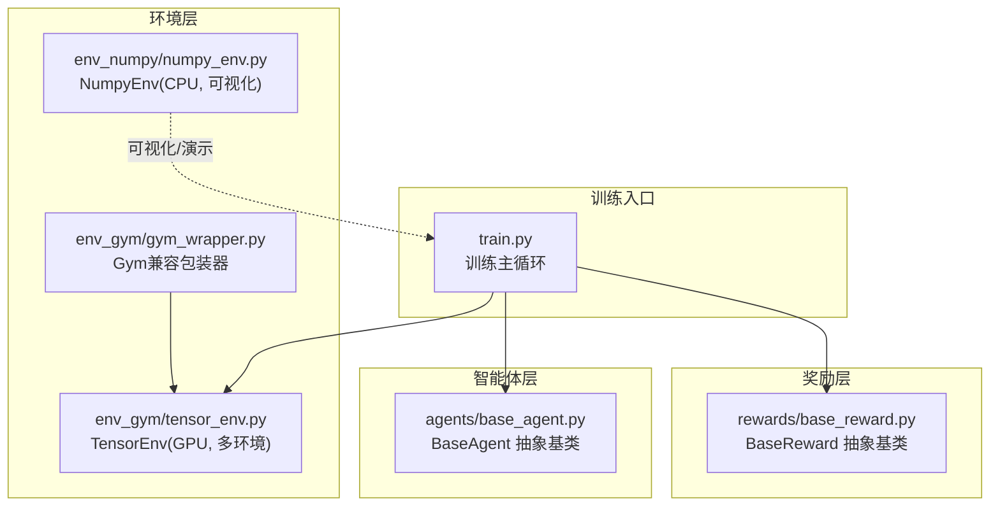
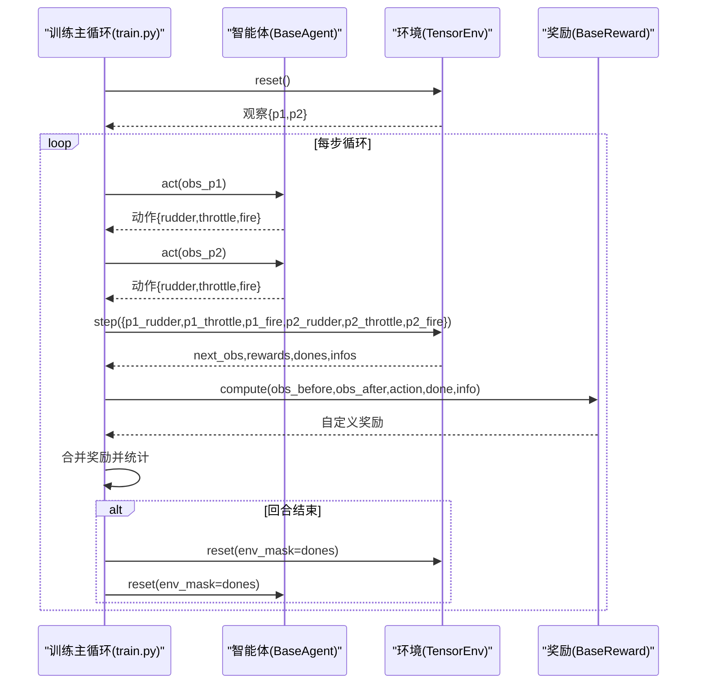
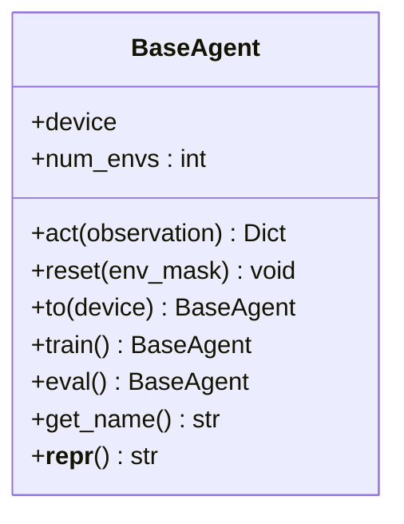
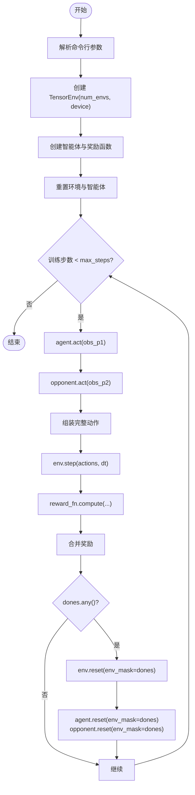
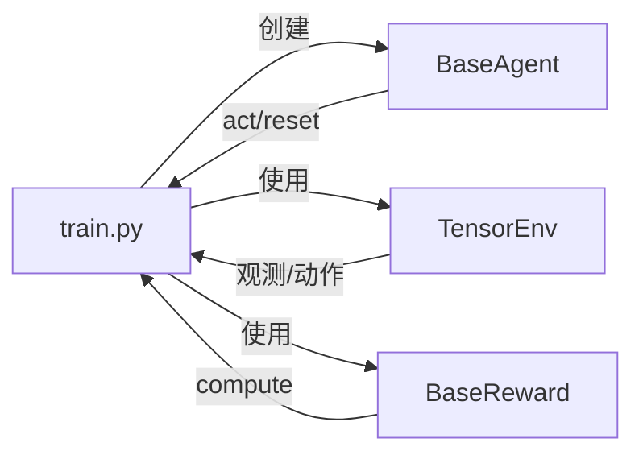

# 智能体基类架构

<cite>
**本文引用的文件列表**
- [agents/base_agent.py](file://agents/base_agent.py)
- [train.py](file://train.py)
- [env_gym/tensor_env.py](file://env_gym/tensor_env.py)
- [env_gym/gym_wrapper.py](file://env_gym/gym_wrapper.py)
- [env_numpy/numpy_env.py](file://env_numpy/numpy_env.py)
- [rewards/base_reward.py](file://rewards/base_reward.py)
- [README.md](file://README.md)
</cite>

## 目录
1. [简介](#简介)
2. [项目结构](#项目结构)
3. [核心组件](#核心组件)
4. [架构总览](#架构总览)
5. [详细组件分析](#详细组件分析)
6. [依赖关系分析](#依赖关系分析)
7. [性能考量](#性能考量)
8. [故障排查指南](#故障排查指南)
9. [结论](#结论)

## 简介
本文件围绕智能体基类 BaseAgent 的设计与实现展开，重点解释其作为所有智能体统一接口的核心职责，包括：
- 统一的观察输入与动作输出契约
- 观察数据结构与归一化机制
- 动作格式与物理意义（方向舵、油门、开火）
- 多环境并行训练支持（num_envs 属性）
- 设备管理与辅助方法（to()、train()、eval()）
- 与 env_gym 和 env_numpy 双后端的兼容性
- 在训练流程 train.py 中的调用时序

## 项目结构
该项目采用“双后端”架构：
- env_gym：面向强化学习训练的高性能 GPU 环境，支持多环境并行
- env_numpy：面向可视化与演示的 CPU 环境，便于交互与调试
- agents：智能体抽象与实现（本文件聚焦 BaseAgent）
- rewards：奖励函数抽象与实现
- train.py：训练入口与主循环

图表来源
- [train.py](file://train.py#L170-L327)
- [agents/base_agent.py](file://agents/base_agent.py#L13-L118)
- [env_gym/tensor_env.py](file://env_gym/tensor_env.py#L206-L772)
- [env_gym/gym_wrapper.py](file://env_gym/gym_wrapper.py#L15-L181)
- [env_numpy/numpy_env.py](file://env_numpy/numpy_env.py#L49-L365)
- [rewards/base_reward.py](file://rewards/base_reward.py#L12-L103)

章节来源
- [README.md](file://README.md#L64-L95)

## 核心组件
本节聚焦 BaseAgent 抽象基类的设计要点与契约规范。

- 统一接口设计原则
  - 输入：环境观察（支持张量与 NumPy）
  - 输出：合法动作（与 env_gym 接口一致）
  - 批量操作：支持多环境并行
- 动作空间格式
  - rudder: [-1.0, 1.0]（方向舵）
  - throttle: [0.0, 1.0]（油门）
  - fire: bool（开火）
- 观察输入数据结构（归一化）
  - 己方状态：x, y, angle, speed, missiles, alive
  - 敌方相对状态：enemy_distance, enemy_relative_angle, enemy_speed, enemy_alive
- 关键抽象方法
  - act(observation): 根据观察返回动作
  - reset(env_mask): 重置内部状态（如 RNN 隐藏状态）
- 设备与批量支持
  - device: 计算设备（'cuda' 或 'cpu'）
  - num_envs: 并行环境数量
  - to(device): 设备迁移
  - train()/eval(): 模式切换（用于 RL agent）

章节来源
- [agents/base_agent.py](file://agents/base_agent.py#L13-L118)

## 架构总览
BaseAgent 作为智能体统一接口，贯穿训练主循环。训练流程中，训练主循环会：
- 初始化 TensorEnv（多环境并行）
- 创建两个智能体（P1/P2）与奖励函数
- 在每步循环中调用 agent.act() 获取动作
- 将动作与对手动作组合后传入 env.step()
- 使用奖励函数计算自定义奖励并与环境奖励合并
- 在回合结束时重置完成的环境与智能体状态

图表来源
- [train.py](file://train.py#L170-L327)
- [agents/base_agent.py](file://agents/base_agent.py#L46-L82)
- [env_gym/tensor_env.py](file://env_gym/tensor_env.py#L351-L417)
- [rewards/base_reward.py](file://rewards/base_reward.py#L28-L60)

## 详细组件分析

### BaseAgent 抽象基类
- 设计目标
  - 为规则智能体与强化学习智能体提供统一接口
  - 明确观察与动作的数据结构与范围
  - 支持多环境并行与设备迁移
- 关键属性与方法
  - device: 设备对象
  - num_envs: 并行环境数（可读写）
  - act(observation): 抽象方法，返回动作字典
  - reset(env_mask): 抽象方法，重置内部状态
  - to(device): 设备迁移
  - train()/eval(): 模式切换（默认空实现，供 RL agent 扩展）
  - get_name()/__repr__: 调试与日志标识

图表来源
- [agents/base_agent.py](file://agents/base_agent.py#L13-L118)

章节来源
- [agents/base_agent.py](file://agents/base_agent.py#L13-L118)

### 观察输入与归一化机制
- 观察结构（以 TensorEnv 为例）
  - 己方状态：x, y, angle, speed, missiles, alive
  - 敌方相对状态：enemy_distance, enemy_relative_angle, enemy_speed, enemy_alive
- 归一化策略
  - 位置：除以战场尺寸
  - 角度：除以 360 或归一至 [-1, 1]
  - 速度：除以典型上限（如 400）
  - 弹药：除以初始弹药数
  - 存活状态：布尔转浮点
- 归一化目的
  - 保证不同环境与不同规模的数值在统一尺度上
  - 有利于神经网络训练稳定

章节来源
- [env_gym/tensor_env.py](file://env_gym/tensor_env.py#L627-L685)

### 动作输出格式与物理意义
- 动作字典包含三要素
  - rudder: [-1.0, 1.0]，表示方向舵偏转
  - throttle: [0.0, 1.0]，表示推进力比例
  - fire: bool，表示是否开火
- 与环境接口一致性
  - BaseAgent 的动作格式与 TensorEnv 的动作键名一致
  - 便于在训练主循环中直接拼装完整动作字典

章节来源
- [agents/base_agent.py](file://agents/base_agent.py#L21-L25)
- [train.py](file://train.py#L224-L239)

### 多环境并行与 num_envs 属性
- num_envs 的作用
  - 表示智能体期望处理的并行环境数量
  - 观察与动作张量的首个维度均为 [num_envs]
- 在训练中的体现
  - 训练主循环通过 AGENT_REGISTRY 创建智能体实例并设置 num_envs
  - TensorEnv 的 reset/step/get_observations 等均按 [num_envs, ...] 维度处理

章节来源
- [agents/base_agent.py](file://agents/base_agent.py#L36-L44)
- [train.py](file://train.py#L150-L158)
- [env_gym/tensor_env.py](file://env_gym/tensor_env.py#L209-L212)

### 设备管理与辅助方法
- device 管理
  - BaseAgent 与 TensorEnv 均使用 torch.device
  - 支持 'cuda'/'cpu' 字符串或 torch.device 对象
- 辅助方法
  - to(device): 将智能体迁移到指定设备
  - train()/eval(): 为 RL agent 提供模式切换（默认空实现）
- 在训练中的使用
  - 训练主循环根据命令行参数设置设备
  - 智能体与环境均在相同设备上运行

章节来源
- [agents/base_agent.py](file://agents/base_agent.py#L27-L34)
- [agents/base_agent.py](file://agents/base_agent.py#L84-L110)
- [train.py](file://train.py#L353-L357)

### 与 env_gym 的兼容性
- TensorEnv
  - 多环境并行，GPU 加速
  - 观察与动作均以张量形式提供
  - 与 BaseAgent 的观察/动作契约完全一致
- Gymnasium 兼容包装器
  - 将 TensorEnv 包装为标准 Gymnasium 接口
  - 保持观察与动作空间定义与 TensorEnv 一致
  - 支持单环境模式与向量化模式

章节来源
- [env_gym/tensor_env.py](file://env_gym/tensor_env.py#L206-L772)
- [env_gym/gym_wrapper.py](file://env_gym/gym_wrapper.py#L15-L181)

### 与 env_numpy 的兼容性
- NumpyEnv
  - CPU 环境，用于可视化与演示
  - 动作格式与 TensorEnv 保持一致（p1_rudder/p1_throttle/p1_fire 等）
  - 适合在 game_play.py 中进行交互与调试
- 双后端差异
  - env_gym：GPU 并行，适合大规模 RL 训练
  - env_numpy：CPU 稳定，适合人类玩家与可视化

章节来源
- [env_numpy/numpy_env.py](file://env_numpy/numpy_env.py#L49-L365)
- [README.md](file://README.md#L96-L104)

### 在训练流程中的调用时序
- 参数解析与环境创建
  - 解析命令行参数（agent/opponent/reward/num_envs/device 等）
  - 创建 TensorEnv（多环境并行）
  - 创建智能体与奖励函数实例
- 主循环
  - reset 环境与智能体
  - agent.act(obs_p1) 与 opponent.act(obs_p2)
  - 组装完整动作并执行 env.step()
  - 计算自定义奖励并与环境奖励合并
  - 回合结束后重置完成的环境与智能体状态
  - 定期输出统计信息

图表来源
- [train.py](file://train.py#L70-L147)
- [train.py](file://train.py#L150-L168)
- [train.py](file://train.py#L170-L327)

章节来源
- [train.py](file://train.py#L170-L327)

### 如何继承 BaseAgent 创建新智能体
- 步骤
  - 继承 BaseAgent
  - 实现 act(observation)：返回动作字典（rudder/throttle/fire）
  - 实现 reset(env_mask)：清理内部状态（如 RNN 隐藏状态）
  - 可选：覆盖 train()/eval() 以适配 RL 模式
  - 可选：在 __init__ 中初始化模型参数并设置 device
- 示例路径
  - 占位智能体 PlaceholderAgent 的实现展示了最小实现样例
  - 可参考 train.py 中的注册与创建流程

章节来源
- [train.py](file://train.py#L49-L67)
- [train.py](file://train.py#L150-L158)

### 调试与日志：__repr__ 与 get_name 的应用
- get_name()
  - 返回类名，便于在日志中识别智能体类型
- __repr__()
  - 输出设备与并行环境数，便于快速确认配置
- 在训练主循环中的使用
  - 打印智能体、对手与奖励函数的名称与配置

章节来源
- [agents/base_agent.py](file://agents/base_agent.py#L112-L118)
- [train.py](file://train.py#L204-L206)

## 依赖关系分析
- BaseAgent 与训练主循环
  - 训练主循环通过 AGENT_REGISTRY 创建智能体实例
  - 通过 agent.act() 与 env.step() 的交互形成闭环
- BaseAgent 与环境
  - TensorEnv 提供符合 BaseAgent 契约的观察与动作接口
  - Gym 包装器将 TensorEnv 暴露为 Gymnasium 接口
- BaseAgent 与奖励函数
  - BaseReward 提供统一的奖励计算接口
  - 训练主循环在每步计算自定义奖励并与环境奖励合并

图表来源
- [train.py](file://train.py#L150-L168)
- [agents/base_agent.py](file://agents/base_agent.py#L46-L82)
- [env_gym/tensor_env.py](file://env_gym/tensor_env.py#L351-L417)
- [rewards/base_reward.py](file://rewards/base_reward.py#L28-L60)

章节来源
- [train.py](file://train.py#L150-L168)
- [agents/base_agent.py](file://agents/base_agent.py#L46-L82)
- [env_gym/tensor_env.py](file://env_gym/tensor_env.py#L351-L417)
- [rewards/base_reward.py](file://rewards/base_reward.py#L28-L60)

## 性能考量
- 多环境并行
  - TensorEnv 以 [num_envs, ...] 的张量形状处理状态与动作，充分利用 GPU 并行
  - 建议合理设置 num_envs，避免显存不足
- 设备一致性
  - 确保智能体与环境在同一设备上，避免频繁设备间传输
- 归一化收益
  - 统一的归一化策略有助于提升学习稳定性与收敛速度
- 模式切换
  - train()/eval() 默认空实现，RL 智能体可在子类中加入 Dropout/BatchNorm 等逻辑

## 故障排查指南
- 观察/动作维度不匹配
  - 确认 num_envs 与观察/动作张量首维一致
  - 检查智能体 act() 返回的动作键名与环境期望一致
- 设备不一致
  - 确认智能体与环境的 device 设置一致
  - 使用 agent.to(device) 与 env.to(device) 进行迁移
- 回合重置异常
  - 检查 env_mask 参数传递是否正确
  - 确保智能体 reset(env_mask) 与环境 reset(env_mask) 同步调用
- 奖励计算问题
  - 确认 reward_fn.compute() 的输入格式与训练主循环提供的 obs_before/obs_after/action/done/info 一致

章节来源
- [agents/base_agent.py](file://agents/base_agent.py#L46-L82)
- [train.py](file://train.py#L282-L287)
- [rewards/base_reward.py](file://rewards/base_reward.py#L28-L60)

## 结论
BaseAgent 作为统一接口，明确了观察与动作的数据契约，提供了设备管理与多环境并行支持，并与 env_gym 的 TensorEnv 保持完全一致的接口。在训练主循环中，它与 TensorEnv、BaseReward 协同工作，形成稳定的 RL 训练骨架。通过合理的归一化、设备一致性与并行配置，可以有效提升训练效率与稳定性；通过 get_name/__repr__ 等工具，便于调试与日志记录。