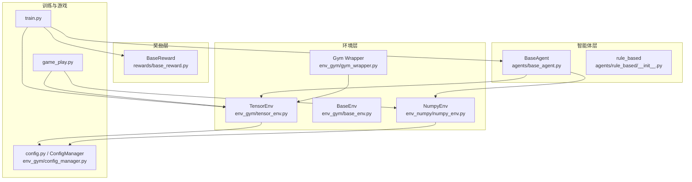
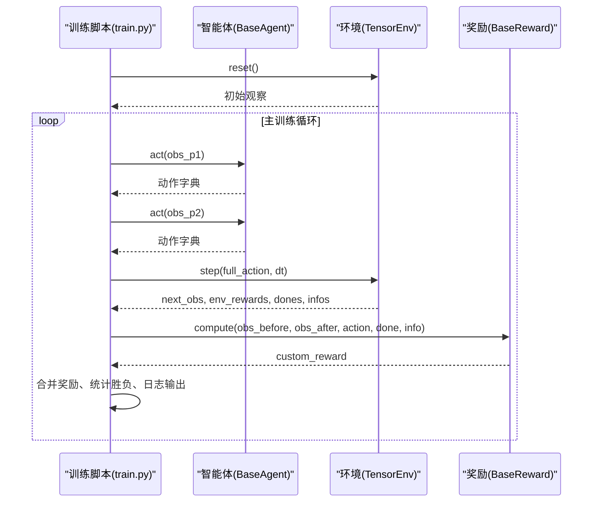
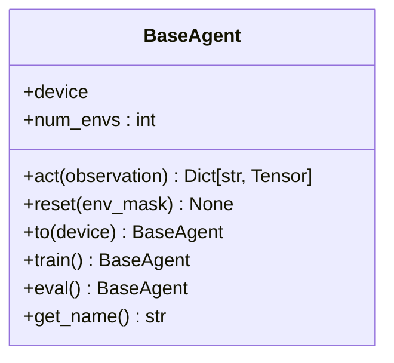
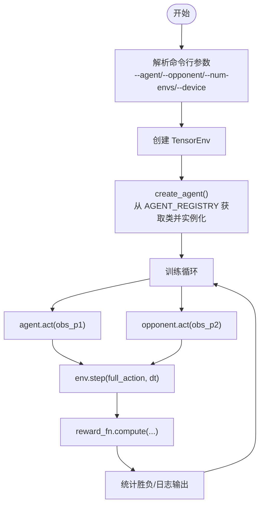
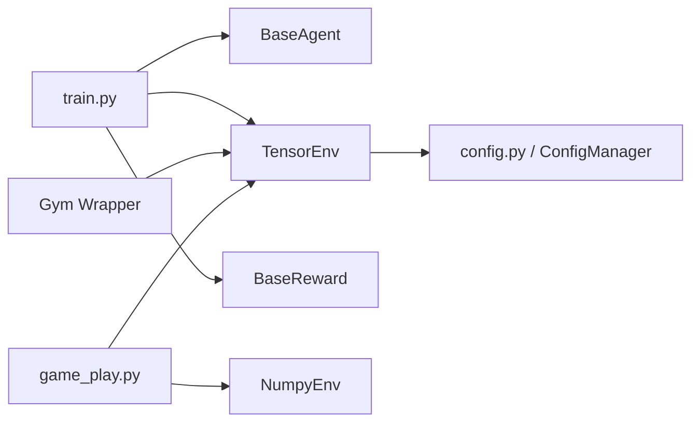

# 智能体系统

<cite>
**本文引用的文件**
- [agents/base_agent.py](file://agents/base_agent.py)
- [agents/__init__.py](file://agents/__init__.py)
- [agents/rule_based/__init__.py](file://agents/rule_based/__init__.py)
- [train.py](file://train.py)
- [game_play.py](file://game_play.py)
- [env_gym/tensor_env.py](file://env_gym/tensor_env.py)
- [env_gym/base_env.py](file://env_gym/base_env.py)
- [env_gym/gym_wrapper.py](file://env_gym/gym_wrapper.py)
- [env_gym/config_manager.py](file://env_gym/config_manager.py)
- [env_numpy/numpy_env.py](file://env_numpy/numpy_env.py)
- [rewards/base_reward.py](file://rewards/base_reward.py)
- [config.py](file://config.py)
- [README.md](file://README.md)
</cite>

## 目录
1. [简介](#简介)
2. [项目结构](#项目结构)
3. [核心组件](#核心组件)
4. [架构总览](#架构总览)
5. [详细组件分析](#详细组件分析)
6. [依赖关系分析](#依赖关系分析)
7. [性能考量](#性能考量)
8. [故障排查指南](#故障排查指南)
9. [结论](#结论)
10. [附录](#附录)

## 简介
本文件面向“智能体系统”的深入开发文档，重点围绕 agents/base_agent.py 中定义的统一 Agent 基类接口设计展开，解释智能体如何通过 act() 方法与环境交互、状态管理机制与动作输出格式；并结合当前仓库现状，给出规则型智能体（rule_based）的实现思路与在基准测试中的作用；说明学习型智能体的扩展方式（继承基类并实现自定义策略网络）；提供注册新智能体到 AGENT_REGISTRY 的示例路径与在训练脚本中调用不同智能体的方法；最后讨论智能体性能评估指标与调试技巧。

## 项目结构
该项目采用模块化组织，核心模块如下：
- agents：智能体抽象与实现（当前包含基类与规则型占位模块）
- env_gym：RL训练环境（GPU加速、多环境并行）
- env_numpy：可视化游戏环境（CPU、稳定）
- rewards：奖励函数抽象与实现
- train.py：训练脚本骨架（包含 AGENT_REGISTRY 与训练循环）
- game_play.py：交互式游戏主程序
- config.py 与 env_gym/config_manager.py：配置管理
- README.md：快速开始与特性说明

图表来源
- [agents/base_agent.py](file://agents/base_agent.py#L13-L118)
- [agents/rule_based/__init__.py](file://agents/rule_based/__init__.py#L1-L8)
- [env_gym/tensor_env.py](file://env_gym/tensor_env.py#L206-L772)
- [env_gym/base_env.py](file://env_gym/base_env.py#L12-L96)
- [env_gym/gym_wrapper.py](file://env_gym/gym_wrapper.py#L15-L181)
- [env_numpy/numpy_env.py](file://env_numpy/numpy_env.py#L49-L200)
- [rewards/base_reward.py](file://rewards/base_reward.py#L12-L103)
- [train.py](file://train.py#L28-L374)
- [game_play.py](file://game_play.py#L58-L331)
- [config.py](file://config.py#L1-L52)
- [env_gym/config_manager.py](file://env_gym/config_manager.py#L11-L102)

章节来源
- [README.md](file://README.md#L64-L96)

## 核心组件
- BaseAgent（统一接口基类）
  - act(observation)：接收观察字典，返回动作字典（rudder、throttle、fire）
  - reset(env_mask)：重置内部状态（如RNN隐藏状态）
  - to(device)/train()/eval()：设备切换与模式设置
  - num_envs 属性：支持批量并行环境
- TensorEnv（RL训练环境）
  - 多环境并行、统一实体槽位系统、完整的RL接口（观察、奖励、终止）
  - 提供 step(actions, dt)、reset(env_mask)、compute_rewards()、get_observations()
- BaseReward（奖励函数抽象）
  - compute(obs_before, obs_after, action, done, info)：返回标量奖励张量
- AGENT_REGISTRY（训练脚本中的智能体注册表）
  - 通过字符串键映射到智能体类，便于命令行选择与动态创建

章节来源
- [agents/base_agent.py](file://agents/base_agent.py#L13-L118)
- [env_gym/tensor_env.py](file://env_gym/tensor_env.py#L206-L772)
- [rewards/base_reward.py](file://rewards/base_reward.py#L12-L103)
- [train.py](file://train.py#L28-L168)

## 架构总览
智能体与环境的交互遵循以下流程：训练循环中，agent.act() 基于当前观察生成动作，随后将动作打包为完整动作字典传递给环境，环境执行一步并返回新的观察、奖励、完成标志与信息。训练脚本据此统计胜负与胜率等指标。

图表来源
- [train.py](file://train.py#L170-L327)
- [env_gym/tensor_env.py](file://env_gym/tensor_env.py#L351-L417)
- [rewards/base_reward.py](file://rewards/base_reward.py#L28-L52)

## 详细组件分析

### 统一智能体接口设计（BaseAgent）
- 设计原则
  - 输入：环境 observation（支持 tensor 与 numpy）
  - 输出：合法 action（与 env_gym 接口完全一致）
  - 支持批量操作（多环境并行）
- 动作空间格式
  - rudder: 方向舵 [-1.0, 1.0]，throttle: 油门 [0.0, 1.0]，fire: bool
- 观察空间字段（来自 TensorEnv 的 get_observations）
  - 己方：x, y, angle, speed, missiles, alive
  - 敌方相对：enemy_distance, enemy_relative_angle, enemy_speed, enemy_alive
- 关键方法
  - act(observation): 返回动作字典，形状为 [num_envs]
  - reset(env_mask): 重置 agent 内部状态（如 RNN 隐藏状态）
  - to(device)/train()/eval(): 设备切换与模式设置
  - num_envs 属性：控制并行环境数量

图表来源
- [agents/base_agent.py](file://agents/base_agent.py#L13-L118)

章节来源
- [agents/base_agent.py](file://agents/base_agent.py#L13-L118)

### 规则型智能体（rule_based）实现逻辑与行为策略
- 当前现状
  - rule_based 模块目前为空，预留实现位置
  - 训练脚本中 AGENT_REGISTRY 也标注为 TODO，尚未注册具体规则智能体
- 实现建议
  - 继承 BaseAgent，实现 act() 与 reset()
  - 可基于观察字段设计规则策略（如接近敌方时开火、保持安全距离等）
  - 可在 reset() 中清理历史状态（若存在）
- 在基准测试中的作用
  - 作为不可训练的基线，用于冷启动与对比
  - 便于验证环境接口与训练循环的正确性

章节来源
- [agents/rule_based/__init__.py](file://agents/rule_based/__init__.py#L1-L8)
- [train.py](file://train.py#L28-L68)

### 学习型智能体扩展方式
- 继承 BaseAgent
  - 实现 act()：将 observation 转换为张量，前向网络得到动作分布或确定性动作
  - 实现 reset()：重置内部状态（如 RNN 隐藏状态）
- 设备与模式
  - 使用 to(device) 将模型与数据移动到目标设备
  - 使用 train()/eval() 控制训练/推理模式
- 批量并行
  - act() 的输入与输出均支持 [num_envs] 的批量形状，确保与 TensorEnv 的并行接口兼容

章节来源
- [agents/base_agent.py](file://agents/base_agent.py#L27-L110)

### 注册新智能体到 AGENT_REGISTRY 与在训练脚本中调用
- 注册步骤
  - 在 agents/rule_based 下新增智能体类（或在 learn 目录下实现学习型智能体）
  - 在 train.py 中将智能体类加入 AGENT_REGISTRY 字典
  - 通过命令行 --agent/--opponent 选择智能体类型
- 示例路径
  - 注册占位智能体示例：[train.py](file://train.py#L66-L67)
  - 创建智能体工厂：[train.py](file://train.py#L150-L158)
  - 参数解析与选择：[train.py](file://train.py#L70-L147)

图表来源
- [train.py](file://train.py#L70-L327)

章节来源
- [train.py](file://train.py#L28-L168)

### 智能体与环境交互的数据流
- 观察空间
  - TensorEnv.get_observations() 返回 p1/p2 的观察字典，包含归一化位置、角度、速度、导弹数、存活状态及敌方相对信息
- 动作空间
  - 训练脚本将两个智能体的动作合并为完整动作字典，传递给 env.step()
- 奖励与信息
  - 环境返回 env_rewards，训练脚本再叠加自定义奖励 reward_fn.compute()

章节来源
- [env_gym/tensor_env.py](file://env_gym/tensor_env.py#L627-L685)
- [train.py](file://train.py#L220-L261)

### 状态管理机制
- 智能体状态
  - reset(env_mask)：用于在部分环境完成时重置 agent 的内部状态（如 RNN 隐藏状态）
  - num_envs：控制并行环境数量，影响张量形状
- 环境状态
  - TensorEnv 内部维护统一的状态字典（x, y, vx, vy, throttle, rudder, is_active, is_missile, alive 等）
  - reset(env_mask) 支持选择性重置某些环境

章节来源
- [agents/base_agent.py](file://agents/base_agent.py#L71-L82)
- [env_gym/tensor_env.py](file://env_gym/tensor_env.py#L340-L349)

### 动作输出格式
- 统一格式
  - rudder: [-1.0, 1.0] 张量 [num_envs]
  - throttle: [0.0, 1.0] 张量 [num_envs]
  - fire: bool 张量 [num_envs]
- 训练脚本中的使用
  - 将 p1/p2 的动作合并为完整动作字典，传入 env.step()

章节来源
- [agents/base_agent.py](file://agents/base_agent.py#L21-L68)
- [train.py](file://train.py#L232-L239)

## 依赖关系分析
- 智能体依赖环境接口
  - BaseAgent 与 TensorEnv 遵循统一的接口契约（观察/动作/奖励/终止）
- 训练脚本耦合
  - AGENT_REGISTRY 与 REWARD_REGISTRY 提供了可插拔的扩展点
  - Gym Wrapper 将 TensorEnv 包装为 Gymnasium 接口，便于 RL 生态集成
- 配置管理
  - config.py 与 ConfigManager 提供统一配置来源，保证训练与可视化的一致性

图表来源
- [train.py](file://train.py#L18-L26)
- [env_gym/gym_wrapper.py](file://env_gym/gym_wrapper.py#L15-L181)
- [env_numpy/numpy_env.py](file://env_numpy/numpy_env.py#L49-L200)
- [config.py](file://config.py#L1-L52)
- [env_gym/config_manager.py](file://env_gym/config_manager.py#L11-L102)

章节来源
- [train.py](file://train.py#L18-L26)
- [env_gym/gym_wrapper.py](file://env_gym/gym_wrapper.py#L15-L181)
- [env_numpy/numpy_env.py](file://env_numpy/numpy_env.py#L49-L200)

## 性能考量
- 并行环境数量（num_envs）
  - 增大并行环境可提升样本收集效率，但需平衡显存与带宽
- 设备选择（device）
  - GPU 训练显著提升吞吐，CPU 适合调试与可视化
- 动作与观察张量化
  - 统一使用张量接口，避免频繁 CPU/GPU 数据传输
- 环境步进参数（dt）
  - 时间加速倍率（time_scale）影响仿真速度与稳定性

章节来源
- [train.py](file://train.py#L103-L140)
- [env_gym/tensor_env.py](file://env_gym/tensor_env.py#L351-L417)

## 故障排查指南
- 常见问题
  - 动作形状不匹配：确认 act() 返回的动作张量形状与 num_envs 一致
  - 设备不一致：确保智能体与环境在同一设备上（使用 to(device)）
  - 环境重置时机：在 episode 结束时调用 agent.reset(env_mask)，避免状态泄漏
  - 奖励异常：检查自定义奖励函数的输入与输出形状，确保与 done/infos 一致
- 调试技巧
  - 使用 verbose 输出中间结果（如胜负统计）
  - 逐步打印 obs_before/obs_after/action/dones/info，定位异常
  - 将智能体设为占位 Agent（PlaceholderAgent）进行骨架测试

章节来源
- [train.py](file://train.py#L266-L327)
- [train.py](file://train.py#L49-L67)

## 结论
本项目以统一的 BaseAgent 接口为核心，构建了可扩展的智能体体系：规则型智能体作为基线与冷启动方案，学习型智能体通过继承基类并实现策略网络接入训练循环。训练脚本通过 AGENT_REGISTRY 与 REWARD_REGISTRY 提供灵活的组合方式，配合 TensorEnv 的高性能并行与 Gym Wrapper 的生态兼容，形成从开发到部署的完整闭环。后续可在 rule_based 中实现具体规则智能体，并在 learned 目录中扩展学习型智能体，以支撑更丰富的基准测试与研究场景。

## 附录
- 快速开始
  - 安装依赖与试玩：参见 [README.md](file://README.md#L11-L27)
  - RL 训练示例：参见 [README.md](file://README.md#L28-L62)
- 环境对比
  - env_numpy（CPU、稳定）与 env_gym（GPU、并行）特性对比：参见 [README.md](file://README.md#L96-L104)