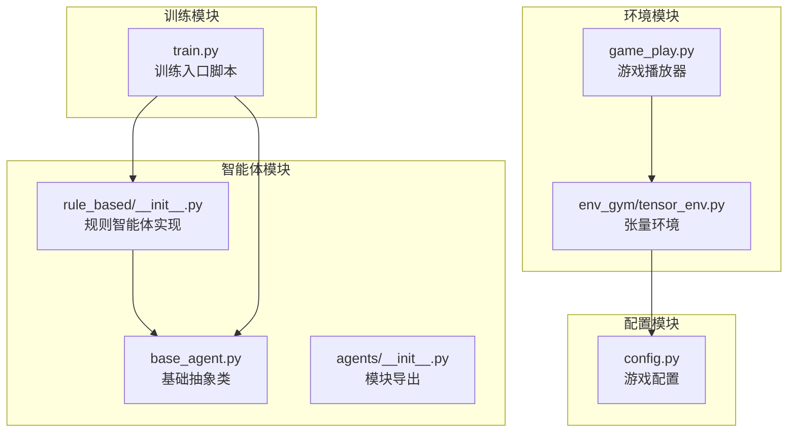
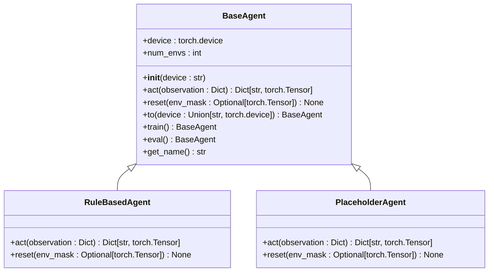
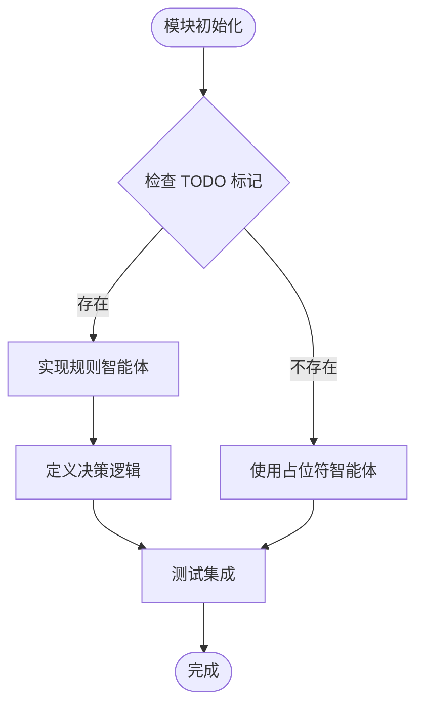
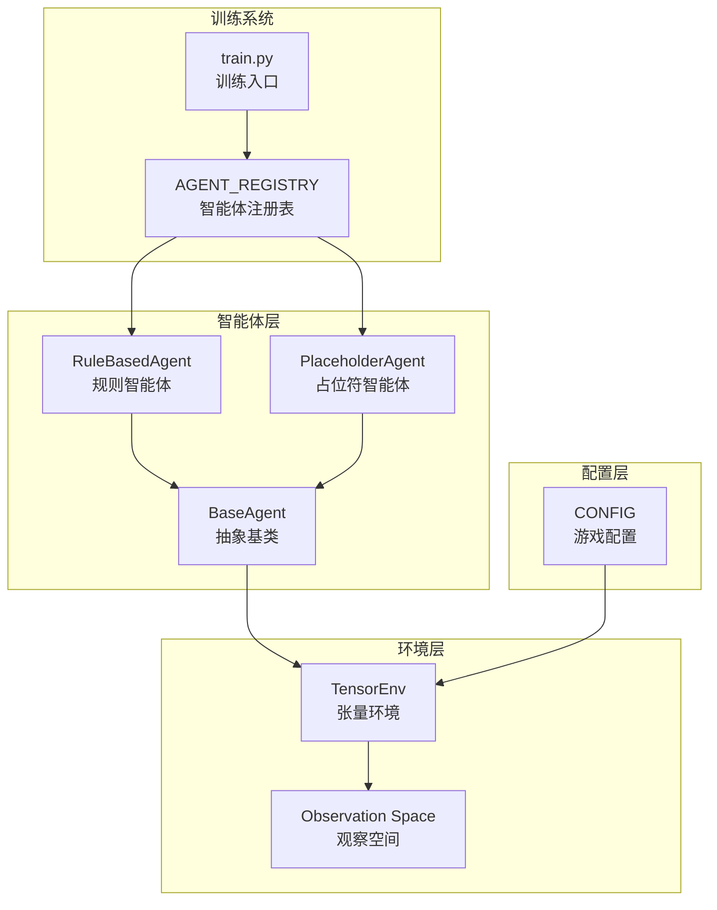
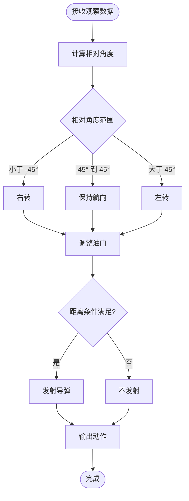
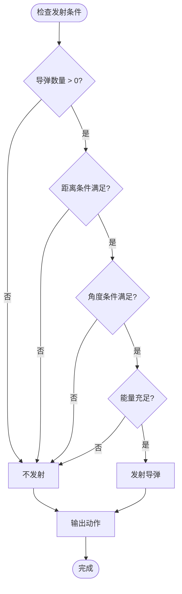
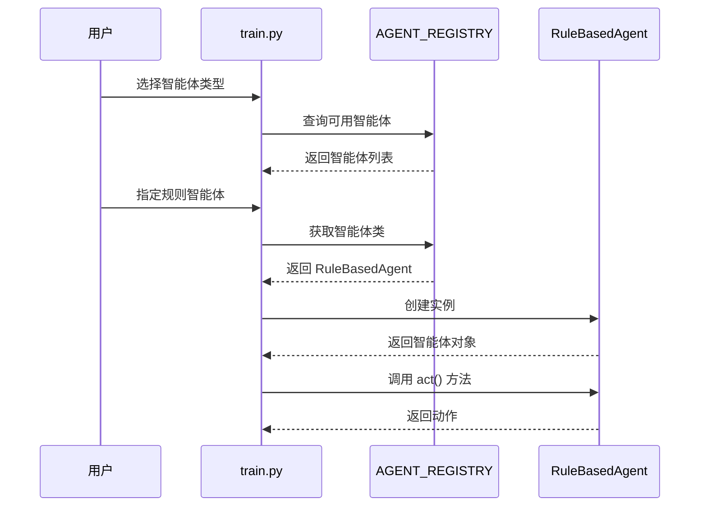
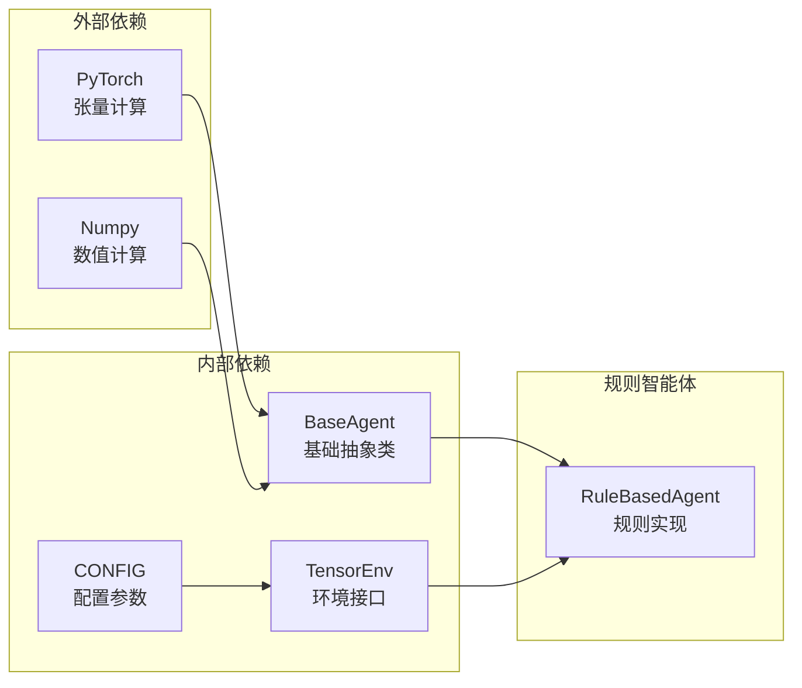

# 规则型智能体

<cite>
**本文档引用的文件**
- [agents/rule_based/__init__.py](file://agents/rule_based/__init__.py)
- [agents/base_agent.py](file://agents/base_agent.py)
- [agents/__init__.py](file://agents/__init__.py)
- [train.py](file://train.py)
- [game_play.py](file://game_play.py)
- [env_gym/tensor_env.py](file://env_gym/tensor_env.py)
- [config.py](file://config.py)
</cite>

## 目录
1. [简介](#简介)
2. [项目结构](#项目结构)
3. [核心组件](#核心组件)
4. [架构概览](#架构概览)
5. [详细组件分析](#详细组件分析)
6. [依赖关系分析](#依赖关系分析)
7. [性能考量](#性能考量)
8. [故障排除指南](#故障排除指南)
9. [结论](#结论)

## 简介

规则型智能体是本项目中一种不可训练的智能体实现，专门用于冷启动和基线对比测试。它基于预设的逻辑规则来做出决策，不依赖于机器学习算法，因此具有确定性和可解释性强的特点。该智能体在基准测试和环境验证中发挥着关键作用，为学习型智能体的开发提供了重要的对照组。

规则型智能体的核心价值在于：
- **快速验证**：能够立即投入使用，无需训练周期
- **基线对比**：为学习型智能体提供性能基准
- **调试工具**：便于识别环境实现中的问题
- **教学演示**：展示智能体决策的基本原理

## 项目结构

该项目采用模块化的组织方式，将智能体相关的代码集中在 `agents/` 目录下，形成了清晰的层次结构：

**图表来源**
- [agents/rule_based/__init__.py](file://agents/rule_based/__init__.py#L1-L8)
- [agents/base_agent.py](file://agents/base_agent.py#L1-L118)
- [train.py](file://train.py#L1-L374)

**章节来源**
- [agents/rule_based/__init__.py](file://agents/rule_based/__init__.py#L1-L8)
- [agents/base_agent.py](file://agents/base_agent.py#L1-L118)
- [agents/__init__.py](file://agents/__init__.py#L1-L10)

## 核心组件

### 基础抽象类 BaseAgent

BaseAgent 是所有智能体实现的基础抽象类，定义了统一的接口规范：

**图表来源**
- [agents/base_agent.py](file://agents/base_agent.py#L13-L118)

BaseAgent 的关键特性包括：
- **统一接口**：所有智能体必须实现 `act()` 和 `reset()` 方法
- **设备管理**：支持 CUDA 和 CPU 设备切换
- **批量处理**：支持多环境并行操作
- **动作空间**：标准化的动作输出格式

**章节来源**
- [agents/base_agent.py](file://agents/base_agent.py#L13-L118)

### 规则智能体模块

规则智能体模块目前处于开发阶段，包含一个占位符实现：

**图表来源**
- [agents/rule_based/__init__.py](file://agents/rule_based/__init__.py#L1-L8)

**章节来源**
- [agents/rule_based/__init__.py](file://agents/rule_based/__init__.py#L1-L8)

## 架构概览

规则型智能体在整个系统架构中扮演着重要角色，它通过统一的接口与其他组件无缝集成：

**图表来源**
- [train.py](file://train.py#L29-L67)
- [agents/base_agent.py](file://agents/base_agent.py#L13-L118)
- [env_gym/tensor_env.py](file://env_gym/tensor_env.py#L632-L685)

**章节来源**
- [train.py](file://train.py#L29-L67)
- [env_gym/tensor_env.py](file://env_gym/tensor_env.py#L632-L685)

## 详细组件分析

### 规则智能体决策逻辑设计

虽然当前的规则智能体实现还在开发中，但基于现有的基础设施，我们可以设计一套完整的决策逻辑框架：

#### 基于敌我相对角度的机动决策

**图表来源**
- [env_gym/tensor_env.py](file://env_gym/tensor_env.py#L644-L650)

#### 基于距离的能量管理策略

规则智能体需要实现智能的能量管理策略，以优化飞行性能：

| 距离范围 | 策略 | 油门设置 | 转弯半径 |
|---------|------|----------|----------|
| 远距离 (> 8km) | 追击 | 高速 | 大半径 |
| 中距离 (4-8km) | 平衡 | 中速 | 中半径 |
| 近距离 (< 4km) | 机动 | 低速 | 小半径 |

#### 导弹发射条件判断机制

**图表来源**
- [env_gym/tensor_env.py](file://env_gym/tensor_env.py#L423-L454)

### AGENT_REGISTRY 注册机制

规则智能体通过 AGENT_REGISTRY 注册表实现动态加载：

**图表来源**
- [train.py](file://train.py#L150-L158)

**章节来源**
- [train.py](file://train.py#L29-L67)
- [train.py](file://train.py#L150-L158)

### 观察空间与动作空间

规则智能体需要正确处理环境提供的观察数据：

#### 观察空间字段

| 字段名 | 类型 | 描述 | 范围 |
|--------|------|------|------|
| x | float | 归一化位置 x | [0, 1] |
| y | float | 归一化位置 y | [0, 1] |
| angle | float | 归一化角度 | [0, 1] |
| speed | float | 归一化速度 | [0, 1] |
| missiles | float | 归一化剩余导弹数 | [0, 1] |
| alive | bool | 存活状态 | {0, 1} |
| enemy_distance | float | 归一化敌方距离 | [0, 1] |
| enemy_relative_angle | float | 归一化敌方相对角度 | [-1, 1] |
| enemy_speed | float | 归一化敌方速度 | [0, 1] |
| enemy_alive | bool | 敌方存活状态 | {0, 1} |

#### 动作空间输出

| 字段名 | 类型 | 范围 | 描述 |
|--------|------|------|------|
| rudder | float | [-1.0, 1.0] | 方向舵控制 |
| throttle | float | [0.0, 1.0] | 油门控制 |
| fire | bool | {False, True} | 发射指令 |

**章节来源**
- [agents/base_agent.py](file://agents/base_agent.py#L46-L68)
- [env_gym/tensor_env.py](file://env_gym/tensor_env.py#L652-L681)

## 依赖关系分析

规则智能体的依赖关系相对简单，主要依赖于基础抽象类和环境接口：

**图表来源**
- [agents/base_agent.py](file://agents/base_agent.py#L7-L10)
- [env_gym/tensor_env.py](file://env_gym/tensor_env.py#L1-L12)

**章节来源**
- [agents/base_agent.py](file://agents/base_agent.py#L7-L10)
- [env_gym/tensor_env.py](file://env_gym/tensor_env.py#L1-L12)

## 性能考量

规则型智能体相比学习型智能体具有以下性能特点：

### 优势
- **实时性**：无推理延迟，适合实时控制系统
- **确定性**：相同条件下产生相同结果，便于调试
- **资源占用少**：不需要GPU/CPU训练资源
- **可解释性强**：决策逻辑透明可见

### 劣势
- **适应性差**：无法学习新的战术模式
- **泛化能力有限**：只能处理训练时见过的情况
- **优化空间小**：无法通过经验改进性能

## 故障排除指南

### 常见问题及解决方案

#### 1. 观察空间维度不匹配
**问题**：智能体输出的动作形状与期望不符
**解决方案**：
- 检查观察空间字段是否完整
- 确认动作输出的张量形状
- 验证设备设置是否正确

#### 2. 导弹发射异常
**问题**：导弹发射条件判断错误
**解决方案**：
- 检查距离和角度阈值设置
- 验证能量管理系统逻辑
- 确认发射槽位可用性

#### 3. 注册表加载失败
**问题**：无法通过 AGENT_REGISTRY 加载智能体
**解决方案**：
- 确认智能体类已正确导入
- 检查注册表键名拼写
- 验证智能体类继承 BaseAgent

**章节来源**
- [train.py](file://train.py#L150-L158)
- [agents/base_agent.py](file://agents/base_agent.py#L46-L68)

## 结论

规则型智能体作为本项目的重要组成部分，为整个系统的开发和测试提供了坚实的基础。虽然当前版本仍处于开发阶段，但其设计理念和架构设计已经为后续的功能扩展奠定了良好的基础。

### 主要成就
- **统一接口**：通过 BaseAgent 提供了标准的智能体接口
- **动态加载**：通过 AGENT_REGISTRY 实现了智能体的动态注册和加载
- **可扩展性**：为规则型智能体的进一步开发预留了充分的空间

### 发展建议
1. **完善决策逻辑**：实现基于敌我相对角度和距离的完整机动决策
2. **增强能量管理**：开发智能的能量管理和导弹使用策略
3. **优化发射条件**：实现更精确的导弹发射时机判断
4. **添加调试功能**：提供决策过程的可视化和日志记录

规则型智能体的发展将为学习型智能体的开发提供宝贵的基线数据和经验积累，有助于推动整个项目的进步。