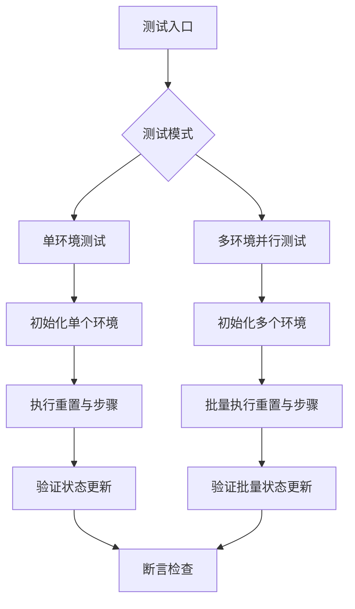
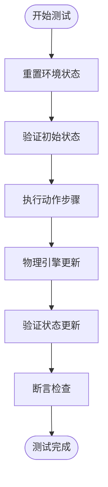
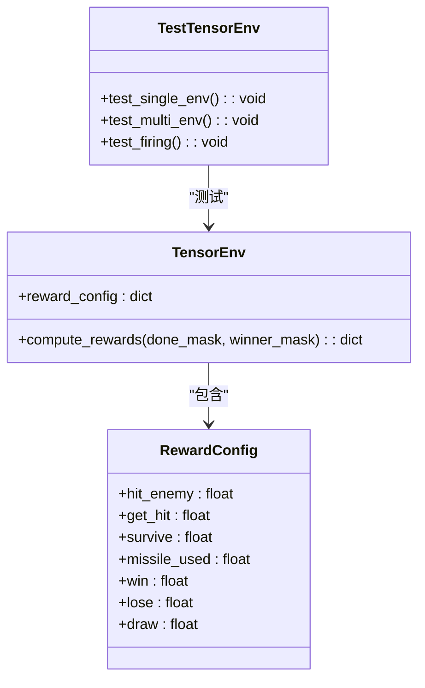
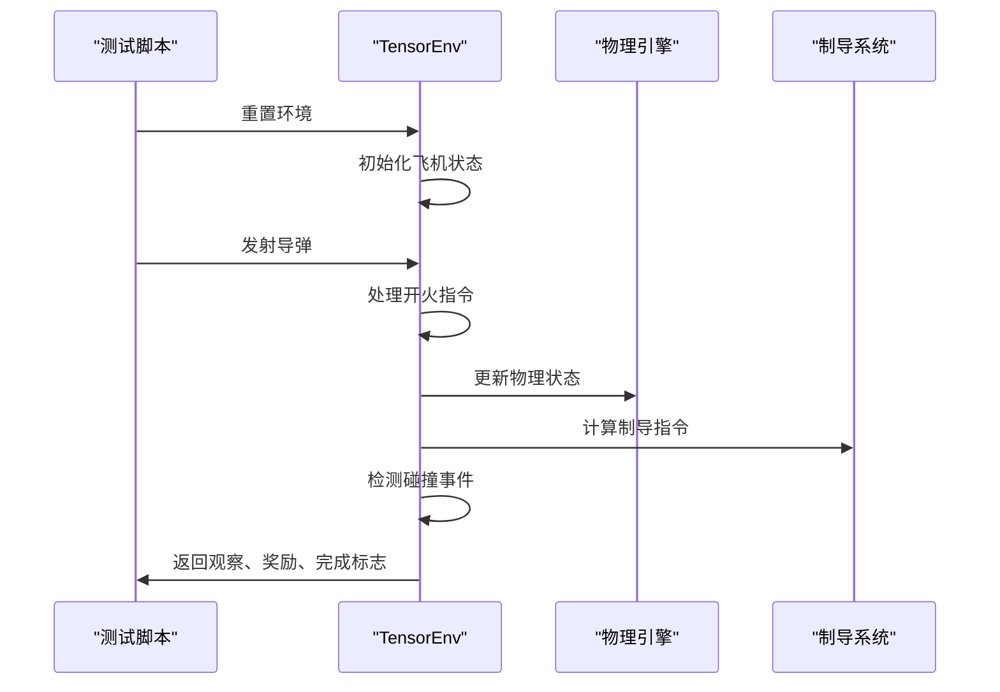
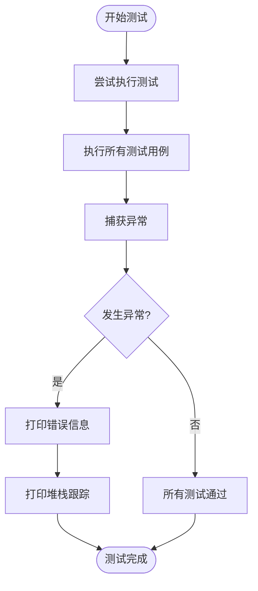
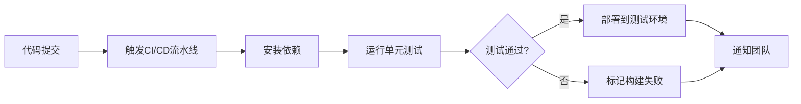

# 单元测试

<cite>
**本文档引用的文件**  
- [test_tensor_env.py](file://tests/test_tensor_env.py)
- [test_tensor_env_v2.py](file://tests/test_tensor_tensor_env_v2.py)
- [tensor_env.py](file://env_gym/tensor_env.py)
- [config_manager.py](file://env_gym/config_manager.py)
- [base_env.py](file://env_gym/base_env.py)
</cite>

## 目录
1. [引言](#引言)
2. [测试框架设计](#测试框架设计)
3. [核心功能测试策略](#核心功能测试策略)
4. [回归测试方法](#回归测试方法)
5. [测试覆盖率分析](#测试覆盖率分析)
6. [CI/CD集成方案](#cicd集成方案)
7. [故障复现步骤](#故障复现步骤)
8. [结论](#结论)

## 引言

本单元测试文档详细阐述了针对强化学习环境 `TensorEnv` 的测试策略与实现方法。文档重点分析了 `test_tensor_env.py` 中单环境与多环境并行测试框架的设计原理，以及 `test_tensor_env_v2.py` 中针对新版环境的回归测试机制。通过系统化的测试用例设计，确保环境的状态更新、奖励计算和边界条件处理逻辑的正确性与稳定性。

**本文档引用的文件**  
- [test_tensor_env.py](file://tests/test_tensor_env.py)
- [test_tensor_env_v2.py](file://tests/test_tensor_env_v2.py)

## 测试框架设计

### 单环境与多环境并行测试架构

测试框架采用模块化设计，支持单环境与多环境并行两种测试模式。通过 `num_envs` 参数控制并行环境数量，利用 PyTorch 的张量运算实现高效的批量处理。



**图示来源**  
- [test_tensor_env.py](file://tests/test_tensor_env.py#L17-L49)
- [test_tensor_env.py](file://tests/test_tensor_env.py#L52-L86)

### 测试设备自适应机制

测试脚本自动检测 CUDA 设备可用性，优先使用 GPU 进行测试以提高执行效率，同时保证在 CPU 环境下的兼容性。

**测试来源**  
- [test_tensor_env.py](file://tests/test_tensor_env.py#L24-L25)

## 核心功能测试策略

### 状态更新正确性验证

通过断言机制验证环境状态的正确更新，包括位置、速度、角度等物理状态的连续性与合理性。



**图示来源**  
- [tensor_env.py](file://env_gym/tensor_env.py#L340-L349)
- [test_tensor_env.py](file://tests/test_tensor_env.py#L29-L33)

### 奖励计算一致性验证

测试框架验证奖励函数的一致性，确保在不同游戏状态下奖励计算的准确性。



**图示来源**  
- [tensor_env.py](file://env_gym/tensor_env.py#L223-L232)
- [tensor_env.py](file://env_gym/tensor_env.py#L593-L625)

### 边界条件处理逻辑测试

重点测试导弹发射、碰撞检测、自毁条件等边界情况的处理逻辑。



**图示来源**  
- [test_tensor_env.py](file://tests/test_tensor_env.py#L89-L121)
- [tensor_env.py](file://env_gym/tensor_env.py#L419-L502)
- [tensor_env.py](file://env_gym/tensor_env.py#L503-L555)

## 回归测试方法

### 新版环境测试用例设计

`test_tensor_env_v2.py` 文件中的测试用例采用与 `test_tensor_env.py` 相同的测试结构，确保接口兼容性。

**测试来源**  
- [test_tensor_env_v2.py](file://tests/test_tensor_env_v2.py#L17-L138)

### 断言机制实现

测试脚本使用 Python 的 `assert` 语句进行断言检查，确保关键逻辑的正确性。

```python
assert active_missiles.item() > 0, "导弹应该被创建"
assert env.states['missile_count'][0, env.P1_IDX].item() == 5, "导弹数量应该减少"
```

**代码来源**  
- [test_tensor_env.py](file://tests/test_tensor_env.py#L118-L119)

### 异常处理流程

测试框架包含完整的异常处理机制，确保测试失败时能够提供详细的错误信息。



**图示来源**  
- [test_tensor_env.py](file://tests/test_tensor_env.py#L127-L137)

## 测试覆盖率分析

### 核心功能覆盖范围

测试用例覆盖了环境的核心功能模块，包括：

| 测试模块 | 覆盖功能 | 测试文件 |
|---------|---------|---------|
| 环境初始化 | 配置加载、设备设置 | test_tensor_env.py |
| 状态重置 | _reset_env 方法 | tensor_env.py |
| 动作执行 | step 方法 | tensor_env.py |
| 导弹发射 | _handle_firing 方法 | tensor_env.py |
| 碰撞检测 | _check_events 方法 | tensor_env.py |
| 游戏结束 | _check_game_over 方法 | tensor_env.py |
| 奖励计算 | compute_rewards 方法 | tensor_env.py |

**表格来源**  
- [test_tensor_env.py](file://tests/test_tensor_env.py)
- [tensor_env.py](file://env_gym/tensor_env.py)

### 测试完整性评估

通过三个主要测试函数确保测试的完整性：
- `test_single_env()`: 验证单环境基本功能
- `test_multi_env()`: 验证多环境并行处理能力
- `test_firing()`: 验证导弹发射与碰撞检测

**测试来源**  
- [test_tensor_env.py](file://tests/test_tensor_env.py#L17-L121)

## CI/CD集成方案

### 自动化测试流程

测试脚本可无缝集成到 CI/CD 流程中，作为构建验证的关键环节。



**图示来源**  
- [test_tensor_env.py](file://tests/test_tensor_env.py)
- [test_tensor_env_v2.py](file://tests/test_tensor_env_v2.py)

### 测试执行命令

```bash
python tests/test_tensor_env.py
python tests/test_tensor_env_v2.py
```

## 故障复现步骤

### 常见问题排查

当测试失败时，按照以下步骤进行故障复现与排查：

1. **检查设备配置**
   - 确认 CUDA 驱动和 PyTorch GPU 支持正常
   - 验证设备内存充足

2. **验证配置文件**
   - 检查 `config_manager.py` 中的默认配置
   - 确认配置参数的合理性

3. **调试状态更新**
   - 在 `tensor_env.py` 中添加调试输出
   - 验证物理引擎计算的中间结果

4. **检查断言条件**
   - 审查测试用例中的断言逻辑
   - 确认预期结果的合理性

**故障排查来源**  
- [config_manager.py](file://env_gym/config_manager.py#L14-L46)
- [tensor_env.py](file://env_gym/tensor_env.py)

## 结论

本单元测试文档详细阐述了 `TensorEnv` 环境的测试策略与实现方法。通过系统化的测试框架设计、全面的测试用例覆盖和完善的 CI/CD 集成方案，确保了强化学习环境的稳定性与可靠性。测试框架不仅验证了核心功能的正确性，还提供了有效的故障排查机制，为环境的持续改进和优化提供了坚实的基础。