# 可视化调试

<cite>
**本文引用的文件**
- [visualization.py](file://visualization.py)
- [game_play.py](file://game_play.py)
- [config.py](file://config.py)
- [env_numpy/numpy_env.py](file://env_numpy/numpy_env.py)
- [README.md](file://README.md)
</cite>

## 目录
1. [简介](#简介)
2. [项目结构](#项目结构)
3. [核心组件](#核心组件)
4. [架构总览](#架构总览)
5. [详细组件分析](#详细组件分析)
6. [依赖关系分析](#依赖关系分析)
7. [性能考量](#性能考量)
8. [故障排查指南](#故障排查指南)
9. [结论](#结论)

## 简介
本文件面向算法与工程调试需求，围绕 visualization.py 中 Visualizer 类的双视口分屏渲染机制进行深入解析，重点说明：
- 通过世界坐标到屏幕坐标的变换实现玩家中心锚定的动态视图
- 核心绘制方法 _draw_grid、_draw_trail、_draw_aircraft_symbol 的工作原理
- UI 状态面板中速度矢量、G 载荷、导弹数量的实时显示逻辑
- 结合 game_play.py 的事件循环，解释键盘输入处理与视图模式切换（常规/时空图）的交互流程

目标是为算法调试提供直观的状态监控手段，帮助快速定位坐标变换、实体渲染、输入响应与状态面板显示的问题。

## 项目结构
项目采用“可视化游戏 + 环境后端”的双层结构：
- game_play.py：游戏主循环、事件处理、输入映射、渲染调度
- visualization.py：双视口分屏渲染、坐标变换、UI 状态面板
- env_numpy/numpy_env.py：CPU 端环境，提供 get_render_state 供可视化使用
- config.py：全局配置，包含窗口尺寸、视图范围、网格间距、玩家锚点等

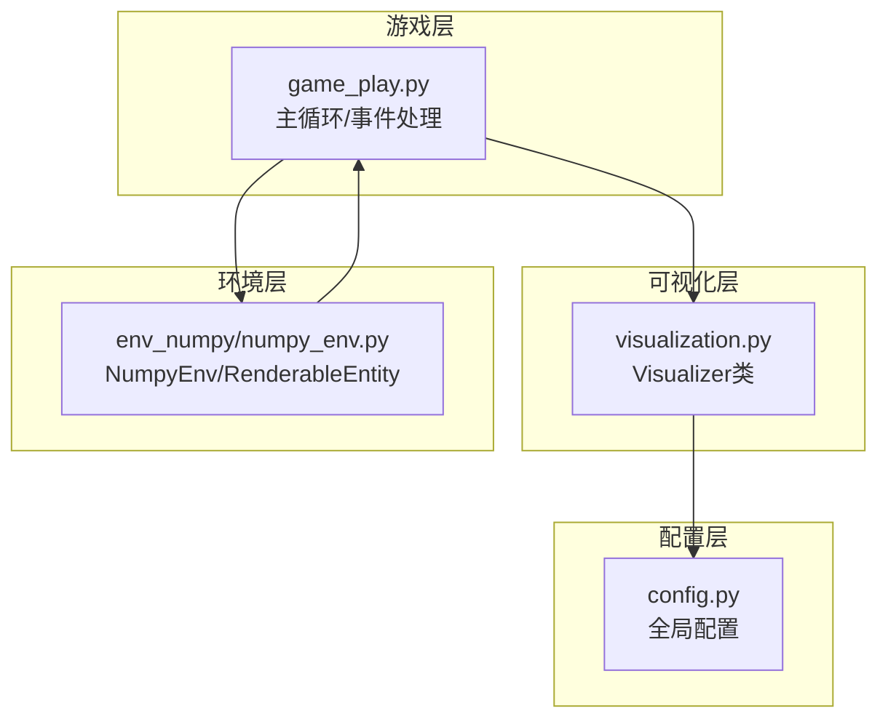

图表来源
- [game_play.py](file://game_play.py#L58-L331)
- [visualization.py](file://visualization.py#L8-L280)
- [env_numpy/numpy_env.py](file://env_numpy/numpy_env.py#L1-L365)
- [config.py](file://config.py#L1-L52)

章节来源
- [README.md](file://README.md#L64-L74)
- [config.py](file://config.py#L7-L18)

## 核心组件
- Visualizer：负责双视口分屏渲染、坐标变换、网格/轨迹/实体绘制、UI 状态面板、视图模式切换
- Game：封装事件循环、输入处理、环境交互、渲染状态更新与调用 Visualizer
- NumpyEnv/RenderableEntity：提供渲染所需的状态数据（位置、速度、角度、轨迹、导弹数量等）

章节来源
- [visualization.py](file://visualization.py#L8-L280)
- [game_play.py](file://game_play.py#L58-L331)
- [env_numpy/numpy_env.py](file://env_numpy/numpy_env.py#L16-L47)

## 架构总览
双视口分屏渲染的关键流程：
- 游戏主循环接收输入，驱动环境执行一步，获取渲染状态
- Visualizer 在两个视口中分别以各自玩家为中心进行绘制
- 世界坐标通过 _world_to_screen 变换到屏幕坐标，实现玩家中心锚定
- UI 状态面板实时显示速度、舵量、油门、角速度、导弹数量等

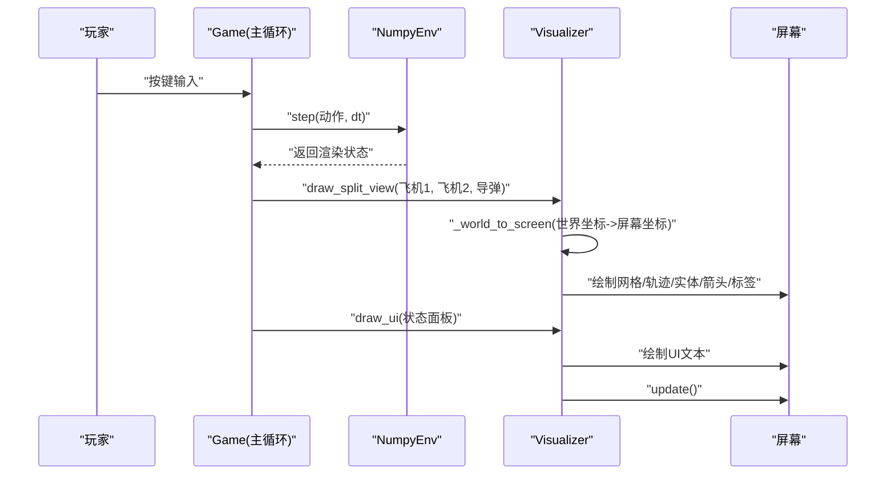

图表来源
- [game_play.py](file://game_play.py#L265-L318)
- [visualization.py](file://visualization.py#L163-L280)
- [env_numpy/numpy_env.py](file://env_numpy/numpy_env.py#L348-L360)

## 详细组件分析

### Visualizer 类与双视口分屏渲染
- 双视口布局：窗口分为上下三段，中间战斗区域等分为左右两个正方形视口，每个视口独立渲染
- 视图参数：视口宽高、顶部/底部面板高度、世界覆盖范围、网格间距、玩家锚点比例
- 坐标变换：_world_to_screen 实现世界坐标到屏幕坐标的线性映射，并以玩家锚点为中心进行偏移
- 视图模式：支持常规模式与“时空图”占位模式，可通过 UI 指示与快捷键切换

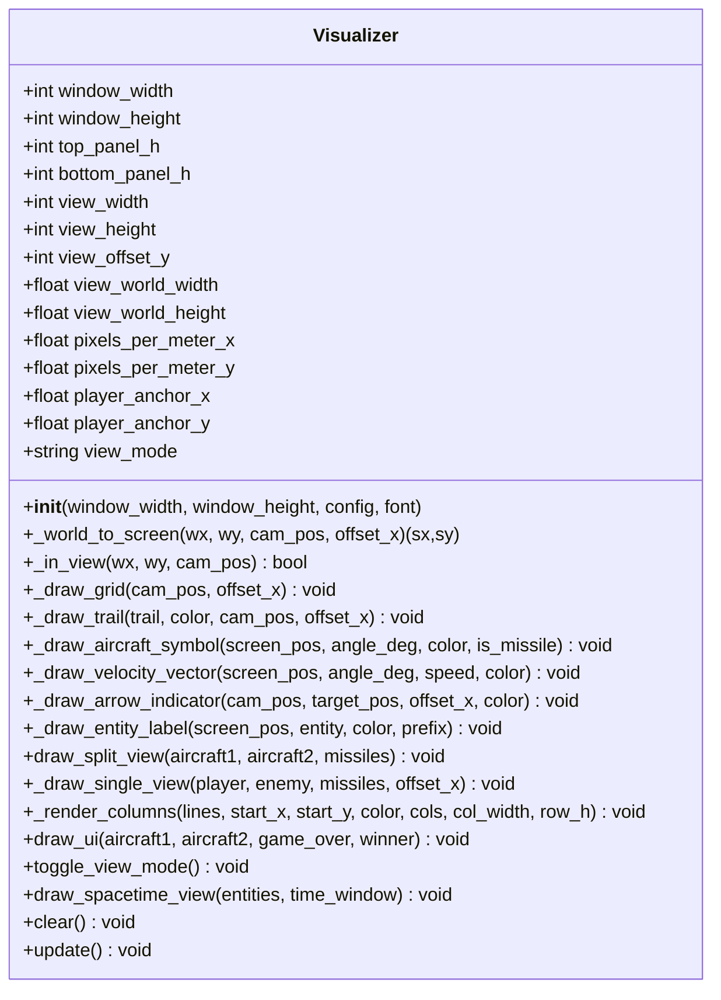

图表来源
- [visualization.py](file://visualization.py#L8-L280)

章节来源
- [visualization.py](file://visualization.py#L8-L51)
- [visualization.py](file://visualization.py#L53-L66)
- [visualization.py](file://visualization.py#L163-L199)
- [visualization.py](file://visualization.py#L210-L264)

### 坐标变换与玩家中心锚定
- _world_to_screen(dx, dy, cam_pos, offset_x)：以相机位置 cam_pos 为基准，计算相对位移 dx/dy，乘以像素/米比例，再叠加玩家锚点偏移，得到屏幕坐标
- 锚点 player_anchor_x/y：由视口宽度与锚点比例计算，确保玩家在视口内的固定位置
- _in_view：判断世界坐标是否在当前视口范围内，用于裁剪绘制与箭头指示

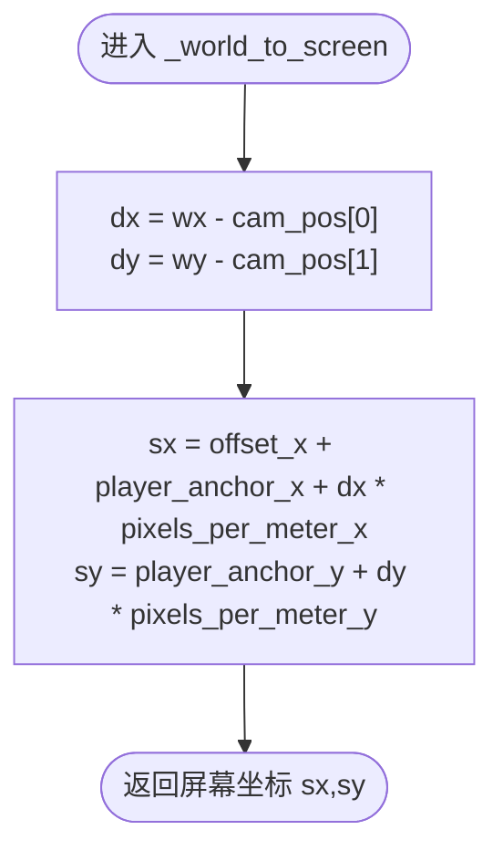

图表来源
- [visualization.py](file://visualization.py#L53-L58)

章节来源
- [visualization.py](file://visualization.py#L53-L66)

### 核心绘制方法详解

#### _draw_grid：网格绘制
- 以相机位置为中心，计算当前视口内网格起点与终点
- 按 grid_spacing 步进绘制竖直线与水平线
- 绘制完成后画出视口矩形边框

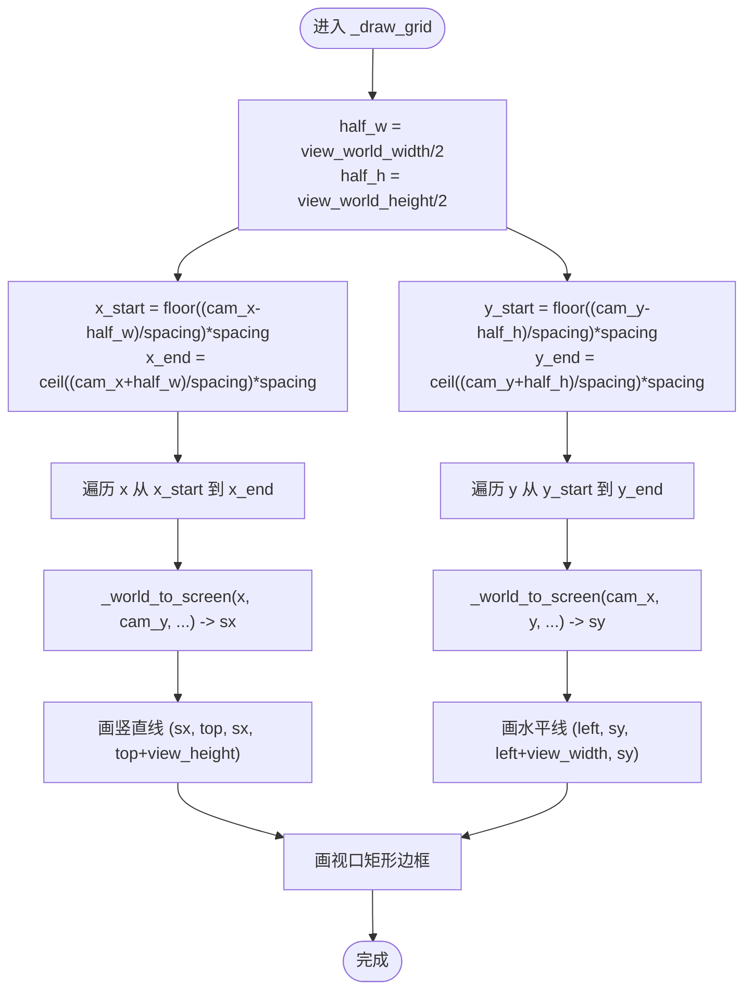

图表来源
- [visualization.py](file://visualization.py#L68-L86)

章节来源
- [visualization.py](file://visualization.py#L68-L86)

#### _draw_trail：轨迹绘制
- 遍历轨迹点，先用 _in_view 判断是否在当前视口内
- 对在视口内的点进行 _world_to_screen 转换，连接相邻两点绘制轨迹线段

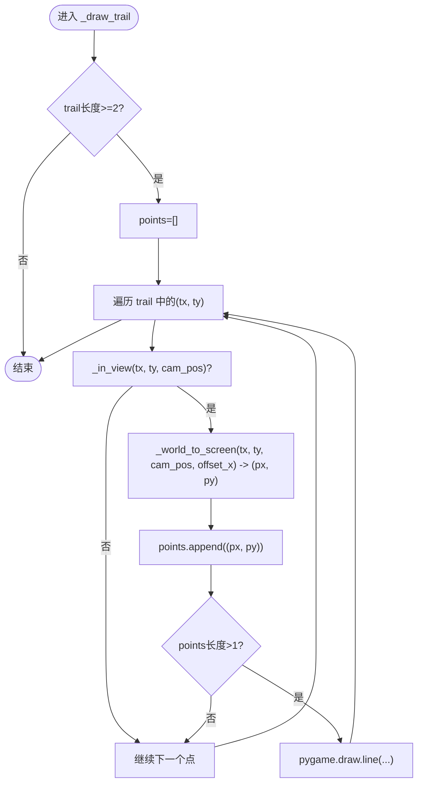

图表来源
- [visualization.py](file://visualization.py#L87-L98)

章节来源
- [visualization.py](file://visualization.py#L87-L98)

#### _draw_aircraft_symbol：实体符号绘制
- 若为导弹（is_missile=True），绘制三角形表示导弹朝向
- 否则绘制圆形表示飞机
- 通过 screen_pos 和 angle_deg 控制朝向与大小

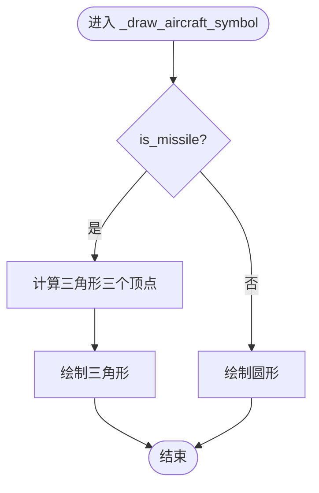

图表来源
- [visualization.py](file://visualization.py#L99-L113)

章节来源
- [visualization.py](file://visualization.py#L99-L113)

#### 速度矢量与标签绘制
- _draw_velocity_vector：从实体屏幕中心出发，按速度/比例计算末端点，绘制速度矢量线
- _draw_entity_label：在实体附近绘制 Mach 与 G 载荷标签（从实体属性读取）

章节来源
- [visualization.py](file://visualization.py#L114-L161)

### UI 状态面板与实时显示
- draw_ui 提取飞机状态（速度、舵量、油门、角速度、导弹数量），按红/蓝两列渲染
- 顶部状态栏：红方与蓝方状态分别渲染
- 底部操作提示与视图模式指示
- 游戏结束时显示获胜者信息

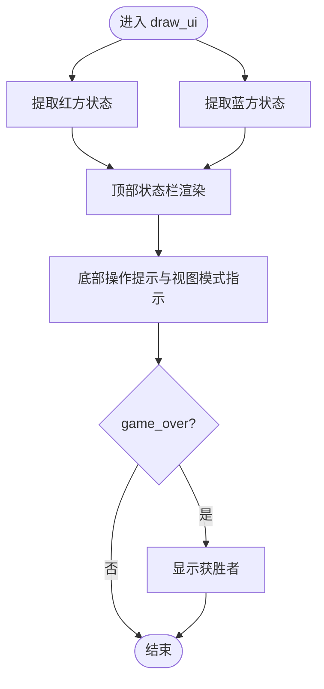

图表来源
- [visualization.py](file://visualization.py#L210-L264)

章节来源
- [visualization.py](file://visualization.py#L210-L264)

### 双视口绘制流程
- draw_split_view：清屏后分别绘制左/右视口
- _draw_single_view：以当前玩家为中心，绘制网格、自身/敌机/导弹的轨迹、符号、速度矢量与标签；若敌机/导弹不在视口内，则绘制指向箭头

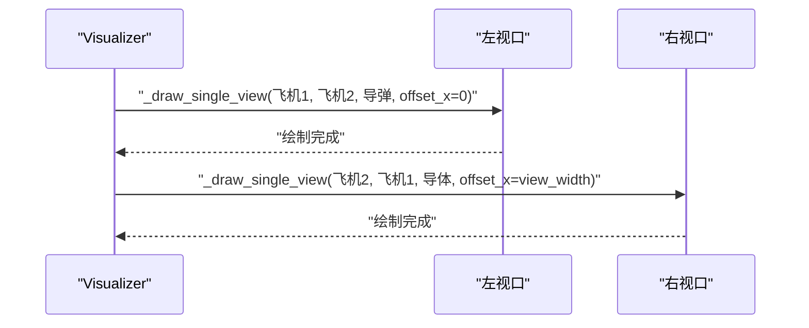

图表来源
- [visualization.py](file://visualization.py#L163-L199)

章节来源
- [visualization.py](file://visualization.py#L163-L199)

### 键盘输入处理与视图模式切换
- game_play.py 的 handle_input 将键盘映射为动作字典（舵量、油门、开火），并处理边缘检测与渐变
- 主循环监听 KEYDOWN 事件，当按下 V 时调用 visualizer.toggle_view_mode() 切换视图模式
- UI 层通过 draw_ui 显示当前视图模式

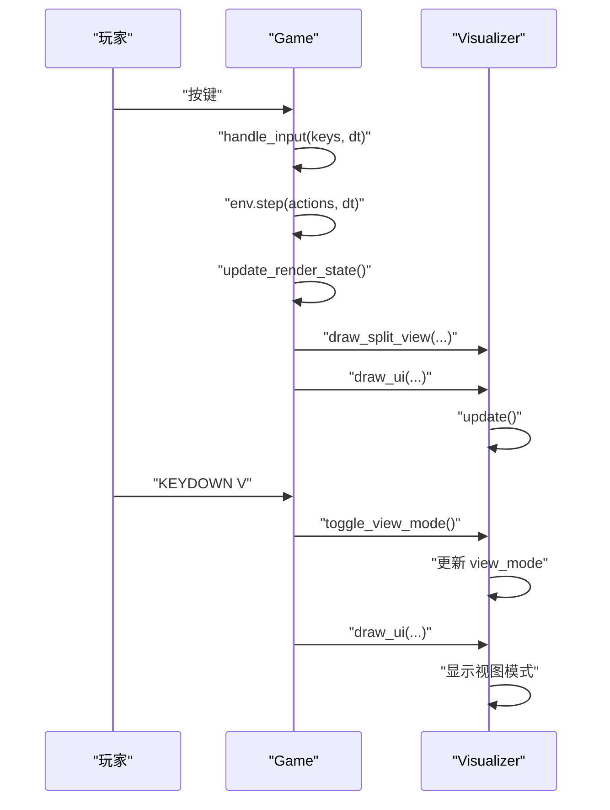

图表来源
- [game_play.py](file://game_play.py#L122-L220)
- [game_play.py](file://game_play.py#L274-L283)
- [visualization.py](file://visualization.py#L265-L267)
- [visualization.py](file://visualization.py#L250-L253)

章节来源
- [game_play.py](file://game_play.py#L122-L220)
- [game_play.py](file://game_play.py#L274-L283)
- [visualization.py](file://visualization.py#L265-L267)
- [visualization.py](file://visualization.py#L250-L253)

## 依赖关系分析
- game_play.py 依赖 visualization.Visualizer 与 env_numpy.NumpyEnv
- visualization.py 依赖 pygame 进行绘制与显示
- config.py 提供视图范围、网格间距、锚点等参数
- env_numpy/numpy_env.py 提供 RenderableEntity 与 get_render_state

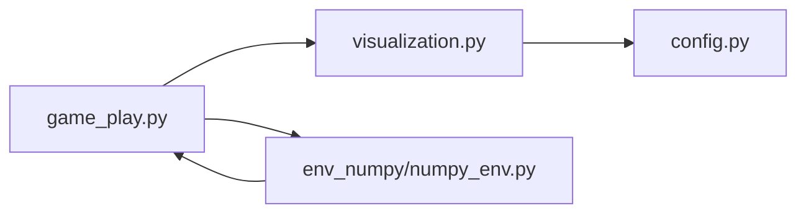

图表来源
- [game_play.py](file://game_play.py#L17-L79)
- [visualization.py](file://visualization.py#L1-L280)
- [config.py](file://config.py#L1-L52)
- [env_numpy/numpy_env.py](file://env_numpy/numpy_env.py#L1-L365)

章节来源
- [game_play.py](file://game_play.py#L17-L79)
- [env_numpy/numpy_env.py](file://env_numpy/numpy_env.py#L1-L365)

## 性能考量
- 坐标变换与裁剪：_in_view 与 _world_to_screen 为 O(1) 操作，整体绘制复杂度与轨迹点数线性相关
- 轨迹维护：NumpyEnv 中轨迹按固定间隔更新，避免每帧复制大量点
- UI 文本渲染：字体缩放与 blit 操作开销较小，建议避免频繁重建字体对象
- 视图模式切换：toggle_view_mode 仅更新状态，draw_spacetime_view 为占位实现，不影响常规渲染性能

## 故障排查指南
- 视图不跟随玩家：检查 _world_to_screen 的 cam_pos 是否为当前玩家位置，锚点计算是否正确
- 轨迹不显示：确认 _in_view 判断与 _world_to_screen 转换一致，轨迹点是否在视口范围内
- 实体符号不显示：核对 is_missile 参数与绘制分支，确保 screen_pos 有效
- UI 数值异常：检查 RenderableEntity 是否包含所需属性（speed、rudder、throttle、turn_rate、missiles、g_load、mach 等）
- 键盘输入无效：确认主循环事件类型与按键键值匹配，handle_input 返回的动作字典字段名一致

章节来源
- [visualization.py](file://visualization.py#L53-L66)
- [visualization.py](file://visualization.py#L87-L113)
- [visualization.py](file://visualization.py#L210-L264)
- [game_play.py](file://game_play.py#L122-L220)
- [env_numpy/numpy_env.py](file://env_numpy/numpy_env.py#L16-L47)

## 结论
本文基于代码级分析，系统梳理了 Visualizer 的双视口分屏渲染机制、坐标变换与实体绘制、UI 状态面板与输入处理流程。通过锚定玩家中心的动态视图与清晰的 UI 信息展示，为算法调试提供了直观、可靠的可视化手段。建议在调试过程中重点关注：
- 坐标变换的一致性与裁剪逻辑
- 轨迹更新与渲染频率的平衡
- UI 数据源的完整性与命名一致性
- 键盘事件与视图模式切换的联动