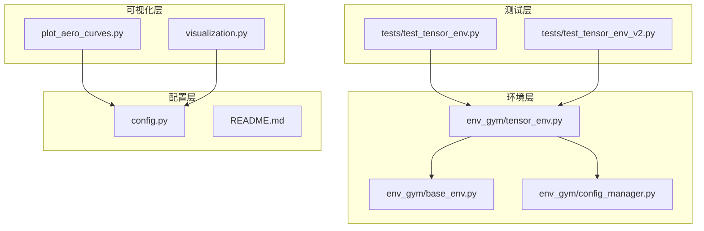
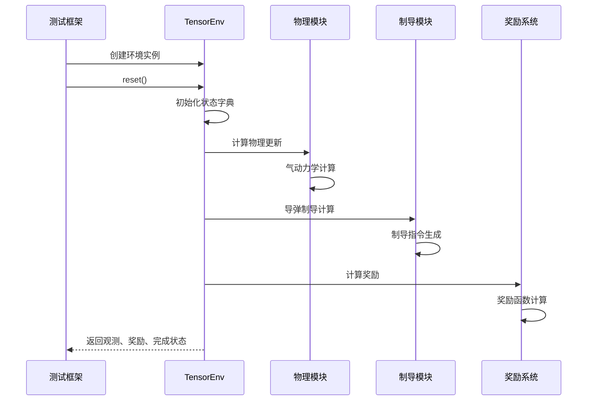
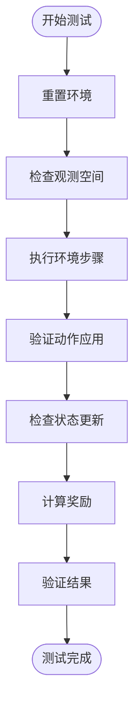
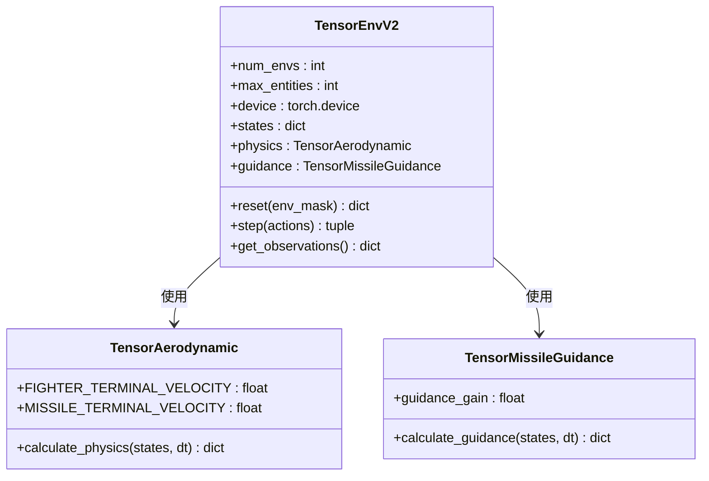
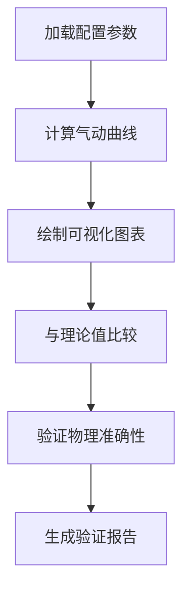
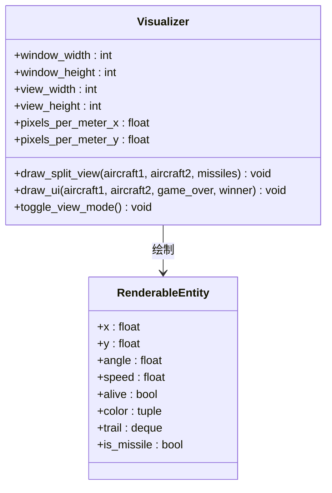
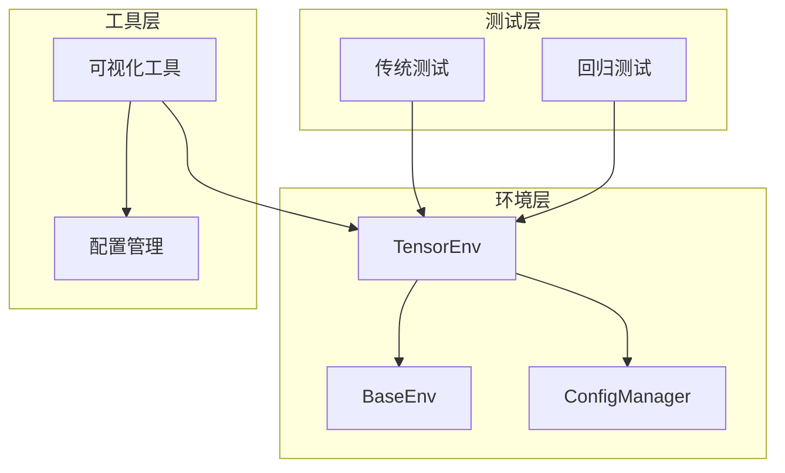

# 测试与验证

<cite>
**本文档引用的文件**
- [tests/test_tensor_env.py](file://tests/test_tensor_env.py)
- [tests/test_tensor_env_v2.py](file://tests/test_tensor_env_v2.py)
- [env_gym/tensor_env.py](file://env_gym/tensor_env.py)
- [env_gym/base_env.py](file://env_gym/base_env.py)
- [env_gym/config_manager.py](file://env_gym/config_manager.py)
- [plot_aero_curves.py](file://plot_aero_curves.py)
- [visualization.py](file://visualization.py)
- [config.py](file://config.py)
- [README.md](file://README.md)
</cite>

## 目录
1. [简介](#简介)
2. [项目结构](#项目结构)
3. [核心组件](#核心组件)
4. [架构概览](#架构概览)
5. [详细组件分析](#详细组件分析)
6. [依赖关系分析](#依赖关系分析)
7. [性能考虑](#性能考虑)
8. [故障排除指南](#故障排除指南)
9. [结论](#结论)

## 简介

本文档详细阐述了midrangeRL项目中测试与验证体系的设计与实施，重点关注tensor_env核心功能的验证方法。项目包含两套主要的测试框架：传统的单元测试和针对新版环境的回归测试策略。通过这些测试机制，我们确保了状态更新的正确性、奖励计算的一致性以及边界条件的有效处理。

项目采用双环境架构设计，包括用于RL训练的GPU加速环境（env_gym）和用于可视化游戏的CPU环境（env_numpy）。这种设计使得测试能够在不同环境下进行针对性验证，确保代码质量和模拟可信度。

## 项目结构

项目采用模块化组织方式，核心测试文件位于tests目录下，主要包含以下关键组件：

**图表来源**
- [tests/test_tensor_env.py](file://tests/test_tensor_env.py#L1-L139)
- [env_gym/tensor_env.py](file://env_gym/tensor_env.py#L1-L772)
- [plot_aero_curves.py](file://plot_aero_curves.py#L1-L73)

**章节来源**
- [README.md](file://README.md#L64-L83)

## 核心组件

### 测试框架架构

项目包含两个主要的测试文件，分别针对不同的环境版本：

1. **传统测试框架** (`test_tensor_env.py`)
   - 针对基础TensorEnv环境的单元测试
   - 验证单环境和多环境并行功能
   - 测试导弹发射和状态更新

2. **新版回归测试** (`test_tensor_env_v2.py`)
   - 针对TensorEnvV2的新功能测试
   - 包含更全面的边界条件处理
   - 集成设备自动检测和错误处理

### 环境验证组件

核心环境验证通过以下组件实现：

- **状态管理系统**：验证状态字典的正确初始化和更新
- **物理计算模块**：确保气动力学计算的准确性
- **制导系统**：验证导弹制导逻辑的正确性
- **奖励计算**：确认奖励函数的一致性和合理性

**章节来源**
- [tests/test_tensor_env.py](file://tests/test_tensor_env.py#L17-L121)
- [tests/test_tensor_env_v2.py](file://tests/test_tensor_env_v2.py#L17-L121)

## 架构概览

测试架构采用分层设计，确保各个组件能够独立验证：

**图表来源**
- [env_gym/tensor_env.py](file://env_gym/tensor_env.py#L351-L417)
- [env_gym/tensor_env.py](file://env_gym/tensor_env.py#L389-L390)

## 详细组件分析

### TensorEnv测试框架

#### 单环境测试策略

单环境测试主要验证基础功能的正确性：

**图表来源**
- [tests/test_tensor_env.py](file://tests/test_tensor_env.py#L27-L49)

#### 多环境并行测试

多环境测试验证并行处理能力和状态隔离：

- **并行环境数量**：支持4个环境同时运行
- **状态隔离**：确保环境间状态不相互影响
- **批量操作**：验证批量动作处理的正确性
- **动态重置**：测试部分环境重置功能

**章节来源**
- [tests/test_tensor_env.py](file://tests/test_tensor_env.py#L52-L86)

### 新版环境回归测试策略

#### TensorEnvV2增强功能验证

新版环境引入了多项改进功能：

1. **设备自动检测**：根据CUDA可用性自动选择计算设备
2. **增强的错误处理**：改进异常处理和调试信息
3. **改进的状态管理**：优化状态字典的初始化和更新
4. **更好的边界条件处理**：增强对极端情况的处理能力

**图表来源**
- [env_gym/tensor_env.py](file://env_gym/tensor_env.py#L206-L242)
- [env_gym/tensor_env.py](file://env_gym/tensor_env.py#L15-L118)

**章节来源**
- [tests/test_tensor_env_v2.py](file://tests/test_tensor_env_v2.py#L52-L86)

### 气动系数曲线可视化验证

#### 可视化测试策略

气动系数曲线可视化工具提供了物理模型准确性的验证手段：

**图表来源**
- [plot_aero_curves.py](file://plot_aero_curves.py#L6-L16)

#### 气动曲线计算验证

可视化工具通过以下方式验证物理模型：

- **阻力加速度计算**：验证Cd系数计算的正确性
- **升阻比分析**：检查L/D比值的合理性
- **参数敏感性分析**：测试不同参数对性能的影响
- **边界条件验证**：确保极端条件下的稳定性

**章节来源**
- [plot_aero_curves.py](file://plot_aero_curves.py#L19-L68)

### 实时状态监控功能

#### 可视化监控组件

实时状态监控功能通过pygame实现实时可视化：

**图表来源**
- [visualization.py](file://visualization.py#L8-L51)
- [visualization.py](file://visualization.py#L687-L758)

**章节来源**
- [visualization.py](file://visualization.py#L163-L280)

## 依赖关系分析

### 测试依赖关系

测试框架的依赖关系体现了清晰的层次结构：

**图表来源**
- [tests/test_tensor_env.py](file://tests/test_tensor_env.py#L13-L14)
- [tests/test_tensor_env_v2.py](file://tests/test_tensor_env_v2.py#L13-L14)

### 关键依赖特性

1. **配置管理依赖**：所有测试都依赖ConfigManager提供统一的配置
2. **环境接口依赖**：测试通过BaseEnv接口与具体实现解耦
3. **可视化依赖**：可视化工具独立于核心环境逻辑
4. **设备抽象**：测试框架支持CPU和GPU两种执行模式

**章节来源**
- [env_gym/config_manager.py](file://env_gym/config_manager.py#L14-L46)
- [env_gym/base_env.py](file://env_gym/base_env.py#L12-L91)

## 性能考虑

### 测试性能优化

测试框架在性能方面采用了多项优化策略：

1. **批量测试执行**：多环境测试支持批量并行执行
2. **内存管理**：合理管理测试过程中的内存分配
3. **设备选择优化**：自动选择最优计算设备
4. **状态缓存**：避免重复计算相同状态

### 性能基准测试

建议的性能基准包括：

- **单环境性能**：验证单个环境的响应时间
- **多环境扩展性**：测试环境数量增加时的性能表现
- **GPU利用率**：监控GPU资源使用效率
- **内存占用**：跟踪测试过程中的内存使用情况

## 故障排除指南

### 常见测试问题

#### 环境重置问题

**症状**：测试过程中环境状态异常
**解决方案**：
1. 检查环境重置函数的调用
2. 验证状态字典的正确初始化
3. 确认设备配置的正确性

#### 状态更新异常

**症状**：状态数据在步骤间不一致
**解决方案**：
1. 验证物理计算模块的正确性
2. 检查制导系统的状态更新
3. 确认奖励计算的时机

#### 可视化问题

**症状**：可视化显示异常或性能问题
**解决方案**：
1. 检查pygame依赖的安装
2. 验证配置参数的正确性
3. 确认视图模式的切换逻辑

### 调试策略

1. **逐步调试**：使用断点逐行检查关键函数
2. **日志记录**：添加详细的调试信息输出
3. **单元测试**：分离测试关注点，便于定位问题
4. **边界测试**：专门测试极端条件和边界情况

**章节来源**
- [tests/test_tensor_env.py](file://tests/test_tensor_env.py#L124-L138)
- [tests/test_tensor_env_v2.py](file://tests/test_tensor_env_v2.py#L124-L138)

## 结论

midrangeRL项目的测试与验证体系展现了现代AI模拟器开发的最佳实践。通过多层次的测试策略，包括单元测试、回归测试和可视化验证，确保了系统的可靠性和准确性。

### 主要成就

1. **完整的测试覆盖**：从基础功能到高级特性的全面验证
2. **多环境支持**：同时支持单环境和多环境并行测试
3. **可视化验证**：通过图形化界面验证物理模型的准确性
4. **设备无关性**：支持CPU和GPU两种执行模式的测试

### 未来改进建议

1. **自动化测试集成**：建立持续集成流水线
2. **性能基准测试**：建立标准化的性能测试框架
3. **覆盖率分析**：实施代码覆盖率统计和分析
4. **故障注入测试**：增加异常情况的模拟测试

这个测试体系为AI强化学习平台的开发提供了坚实的基础，确保了模拟环境的可信度和训练效果的有效性。