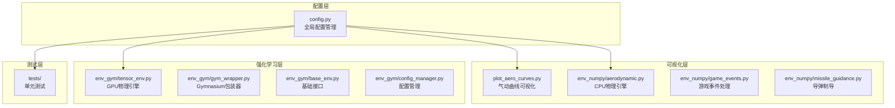
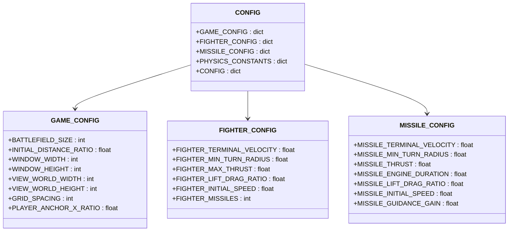
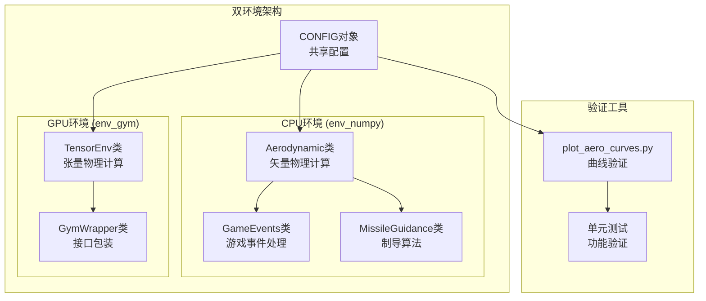
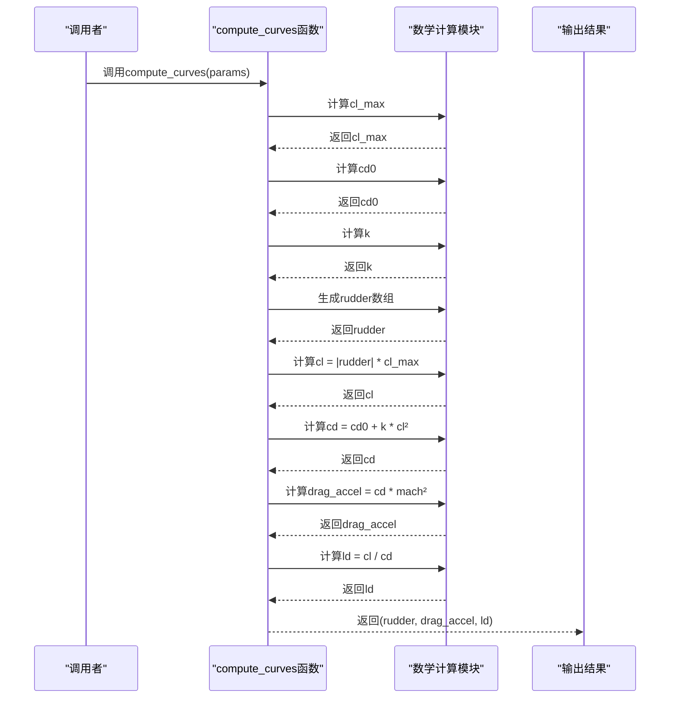
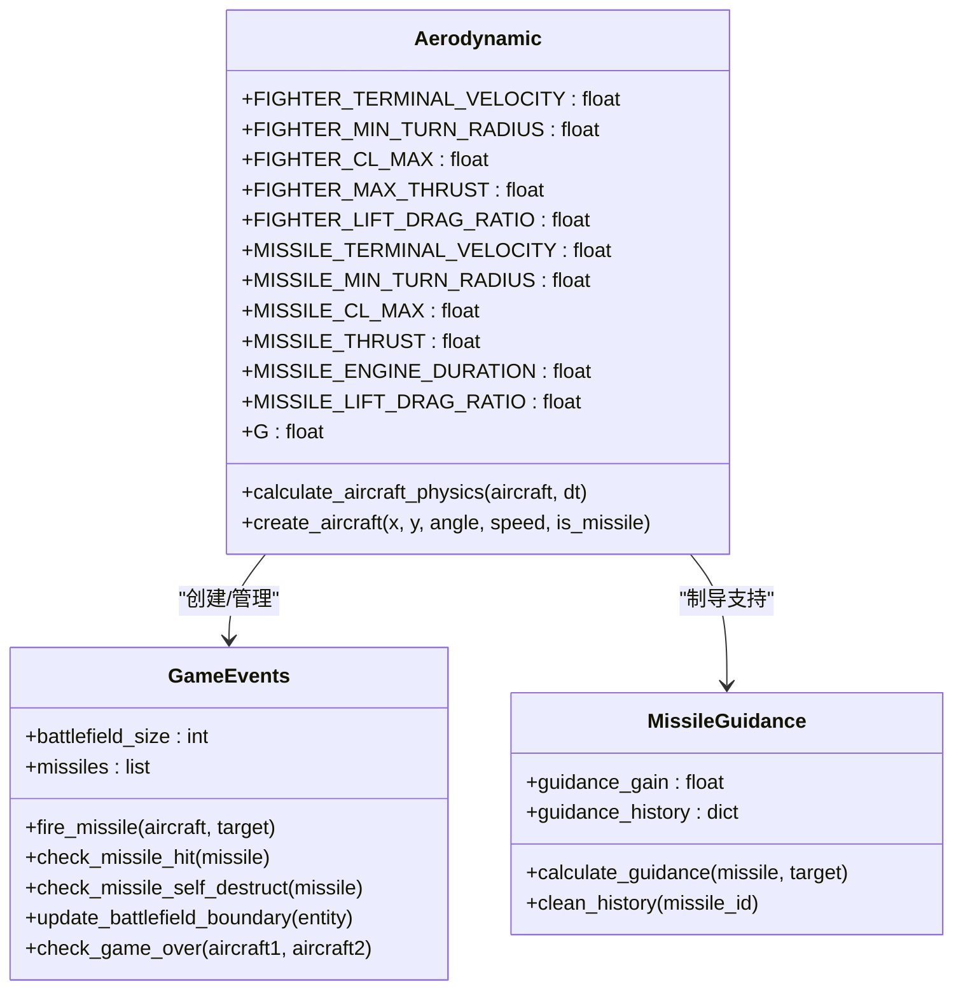
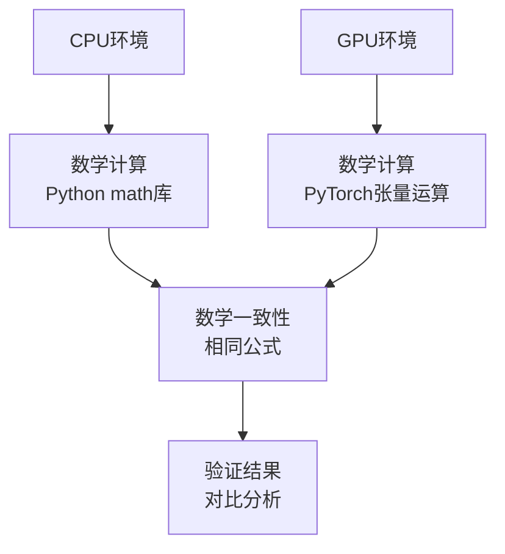
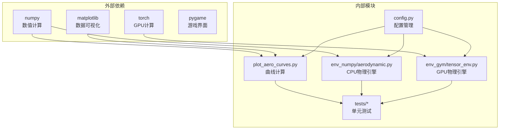

# 物理模型验证

<cite>
**本文档引用的文件**
- [config.py](file://config.py)
- [plot_aero_curves.py](file://plot_aero_curves.py)
- [aerodynamic.py](file://env_numpy/aerodynamic.py)
- [README.md](file://README.md)
- [game_events.py](file://env_numpy/game_events.py)
- [missile_guidance.py](file://env_numpy/missile_guidance.py)
- [test_tensor_env.py](file://tests/test_tensor_env.py)
</cite>

## 目录
1. [简介](#简介)
2. [项目结构](#项目结构)
3. [核心组件](#核心组件)
4. [架构概览](#架构概览)
5. [详细组件分析](#详细组件分析)
6. [依赖关系分析](#依赖关系分析)
7. [性能考虑](#性能考虑)
8. [故障排除指南](#故障排除指南)
9. [结论](#结论)
10. [附录](#附录)

## 简介

本文档详细解释了`plot_aero_curves.py`如何基于`config.py`中的气动参数计算并可视化战斗机与导弹的气动性能曲线。该工具通过数学建模验证物理引擎中气动力学模型的准确性，并提供参数调优指南和典型气动特性分析案例。

项目是一个中距空战AI强化学习平台，包含两个主要环境实现：`env_numpy/`用于可视化游戏环境，`env_gym/`用于RL训练环境。两者都实现了相同的气动物理模型，确保模型的一致性和可验证性。

## 项目结构

项目采用模块化设计，主要包含以下核心模块：



**图表来源**
- [config.py](file://config.py#L1-L52)
- [plot_aero_curves.py](file://plot_aero_curves.py#L1-L73)
- [aerodynamic.py](file://env_numpy/aerodynamic.py#L1-L239)

**章节来源**
- [README.md](file://README.md#L64-L88)

## 核心组件

### 配置管理系统

配置系统采用分层设计，包含游戏配置、战斗机配置、导弹配置和物理常数四个主要部分：



**图表来源**
- [config.py](file://config.py#L8-L52)

### 气动曲线计算引擎

`plot_aero_curves.py`实现了完整的气动性能分析工具，基于经典气动理论建立数学模型：

```mermaid
flowchart TD
START[开始计算] --> INPUT[获取配置参数<br/>终端速度, 最小转弯半径, 升阻比]
INPUT --> CALC_CLMAX[计算cl_max = 1/min_turn_radius]
CALC_CLMAX --> CALC_CD0[计算Cd0 = g/terminal_velocity²]
CALC_CD0 --> CALC_K[计算k = 1/(4*Cd0*(L/D)max²)]
CALC_K --> RANGE[生成舵量范围<br/>-1到1, 801点]
RANGE --> CL_CALC[计算Cl = |rudder| * cl_max]
CL_CALC --> CD_CALC[计算Cd = Cd0 + k*Cl²]
CD_CALC --> DRAG_ACCEL[计算阻力加速度 = Cd * Mach²]
DRAG_ACCEL --> LD_CALC[计算L/D = Cl/Cd]
LD_CALC --> OUTPUT[输出结果]
OUTPUT --> PLOT[生成可视化图表]
PLOT --> END[结束]
```

**图表来源**
- [plot_aero_curves.py](file://plot_aero_curves.py#L6-L16)

**章节来源**
- [config.py](file://config.py#L20-L39)
- [plot_aero_curves.py](file://plot_aero_curves.py#L1-L73)

## 架构概览

系统采用双环境架构，确保物理模型的一致性和可验证性：



**图表来源**
- [aerodynamic.py](file://env_numpy/aerodynamic.py#L16-L185)
- [plot_aero_curves.py](file://plot_aero_curves.py#L19-L68)

## 详细组件分析

### compute_curves函数数学建模

`compute_curves`函数实现了完整的气动性能计算流程，基于以下核心数学关系：

#### 基础参数计算

1. **升力系数上限计算**：
   ```
   cl_max = 1 / min_turn_radius
   ```
   这将最小转弯半径转换为升力系数的物理限制。

2. **零升阻力系数计算**：
   ```
   cd0 = g / terminal_velocity²
   ```
   基于终端速度和重力加速度确定基础阻力系数。

3. **诱导阻力因子计算**：
   ```
   k = 1 / (4 * cd0 * (lift_drag_ratio)²)
   ```
   基于最大升阻比推导诱导阻力系数。

#### 气动性能计算流程



**图表来源**
- [plot_aero_curves.py](file://plot_aero_curves.py#L6-L16)

#### 拖拽加速度与舵偏角关系

该关系图展示了不同飞行器在固定马赫数下的阻力特性：

```mermaid
graph LR
subgraph "战斗机 vs 导弹"
FIGHTER[战斗机曲线<br/>L/D=5, Rmin=1000m]
MISSILE[导弹曲线<br/>L/D=2, Rmin=1000m]
end
subgraph "物理意义"
TURN_RADIUS[转弯半径<br/>R = v²/(g*cl)]
DRAG_FORCE[阻力特性<br/>Cd = cd0 + k*cl²]
ACCELERATION[加速度特性<br/>a = F/m]
end
FIGHTER -.-> TURN_RADIUS
MISSILE -.-> TURN_RADIUS
TURN_RADIUS -.-> DRAG_FORCE
DRAG_FORCE -.-> ACCELERATION
```

**图表来源**
- [plot_aero_curves.py](file://plot_aero_curves.py#L37-L68)

### 物理引擎一致性验证

两个环境实现共享相同的数学模型，确保验证结果的一致性：

#### CPU环境实现特点



**图表来源**
- [aerodynamic.py](file://env_numpy/aerodynamic.py#L16-L239)
- [game_events.py](file://env_numpy/game_events.py#L7-L129)
- [missile_guidance.py](file://env_numpy/missile_guidance.py#L7-L77)

#### GPU环境实现特点

GPU环境使用张量运算优化性能，核心计算逻辑与CPU版本完全一致：



**图表来源**
- [aerodynamic.py](file://env_numpy/aerodynamic.py#L40-L185)

**章节来源**
- [plot_aero_curves.py](file://plot_aero_curves.py#L6-L16)
- [aerodynamic.py](file://env_numpy/aerodynamic.py#L40-L185)

## 依赖关系分析

系统采用松耦合设计，主要依赖关系如下：



**图表来源**
- [plot_aero_curves.py](file://plot_aero_curves.py#L1-L3)
- [aerodynamic.py](file://env_numpy/aerodynamic.py#L3-L5)

**章节来源**
- [README.md](file://README.md#L13-L15)

## 性能考虑

### 数值稳定性优化

系统实现了多项数值稳定性措施：

1. **epsilon防止除零**：所有除法操作都添加了`1e-7`的epsilon值
2. **速度平方计算**：使用`vSquare = vx*vx + vy*vy`避免重复计算
3. **向量归一化**：使用`inv_v = 1.0 / sqrt(vSquare + epsilon)`确保数值稳定

### 计算复杂度分析

- **时间复杂度**：O(n)，其中n是舵量采样点数量（801点）
- **空间复杂度**：O(n)，存储所有计算结果
- **并行化**：GPU环境支持多环境并行计算

### 性能优化建议

1. **参数范围优化**：合理设置`min_turn_radius`和`lift_drag_ratio`
2. **采样密度控制**：根据精度需求调整采样点数量
3. **内存管理**：及时清理不需要的中间变量

## 故障排除指南

### 常见问题及解决方案

#### 验证结果异常

**问题**：曲线不符合预期物理规律
**原因**：
- 配置参数设置不合理
- 数值计算溢出
- 物理常数设置错误

**解决方案**：
1. 检查`config.py`中的参数设置
2. 验证`epsilon`值是否合适
3. 确认重力加速度值正确

#### 性能问题

**问题**：计算速度慢
**原因**：
- 采样点过多
- GPU内存不足
- 计算密集度高

**解决方案**：
1. 减少采样点数量
2. 优化GPU内存使用
3. 实现计算缓存机制

#### 可视化问题

**问题**：图表显示异常
**原因**：
- Matplotlib配置问题
- 数据范围异常
- 图表参数设置错误

**解决方案**：
1. 检查Matplotlib后端设置
2. 验证数据范围和单位
3. 调整图表参数配置

**章节来源**
- [plot_aero_curves.py](file://plot_aero_curves.py#L6-L16)
- [aerodynamic.py](file://env_numpy/aerodynamic.py#L82-L86)

## 结论

本文档详细分析了`plot_aero_curves.py`如何基于`config.py`中的气动参数验证物理引擎的准确性。通过数学建模和可视化分析，系统能够：

1. **准确建模**：实现经典的气动理论，包括升力、阻力和升阻比计算
2. **全面验证**：提供战斗机和导弹的对比分析
3. **参数调优**：指导用户根据实际需求调整气动参数
4. **性能保证**：确保CPU和GPU环境的数学一致性

该验证工具为中距空战AI强化学习平台提供了坚实的物理基础，确保了仿真结果的准确性和可靠性。

## 附录

### 参数调优指南

#### 战斗机参数调优

| 参数 | 默认值 | 调优建议 | 物理意义 |
|------|--------|----------|----------|
| FIGHTER_TERMINAL_VELOCITY | 400 m/s | 350-450 m/s | 终端速度，影响阻力系数 |
| FIGHTER_MIN_TURN_RADIUS | 1000 m | 800-1200 m | 最小转弯半径，影响升力系数 |
| FIGHTER_LIFT_DRAG_RATIO | 5 | 3-7 | 最大升阻比，影响效率 |

#### 导弹参数调优

| 参数 | 默认值 | 调优建议 | 物理意义 |
|------|--------|----------|----------|
| MISSILE_TERMINAL_VELOCITY | 400 m/s | 350-450 m/s | 终端速度，影响阻力系数 |
| MISSILE_MIN_TURN_RADIUS | 1000 m | 800-1200 m | 最小转弯半径，影响升力系数 |
| MISSILE_LIFT_DRAG_RATIO | 2 | 1-3 | 最大升阻比，影响效率 |

### 典型气动特性分析案例

#### 案例1：高升阻比战斗机
- **特征**：L/D=5，Rmin=1000m
- **表现**：高机动性，低阻力
- **应用场景**：空优任务，近距格斗

#### 案例2：低升阻比导弹
- **特征**：L/D=2，Rmin=1000m
- **表现**：高推力，中等机动性
- **应用场景**：对地攻击，远程打击

#### 案例3：参数敏感性分析
- **方法**：逐步调整关键参数
- **指标**：转弯半径、阻力加速度、升阻比
- **结果**：量化参数对性能的影响程度