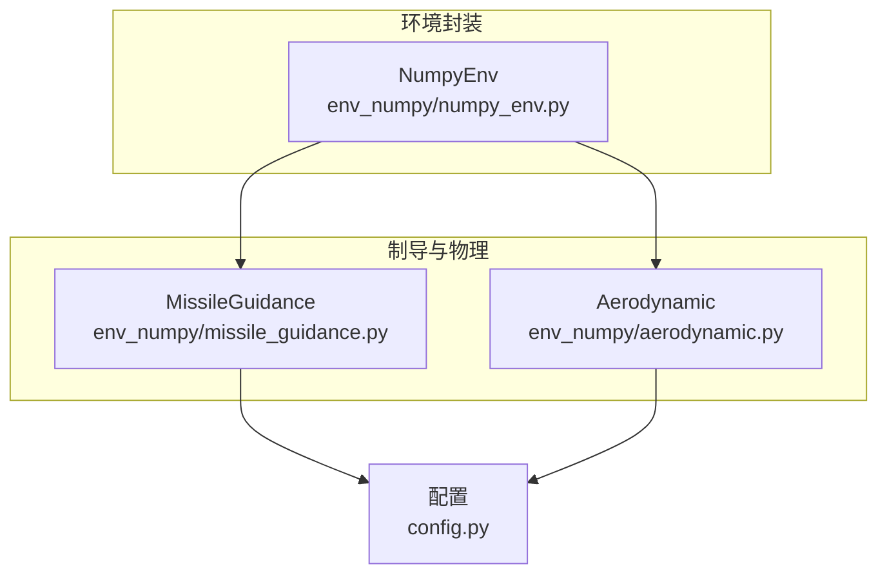
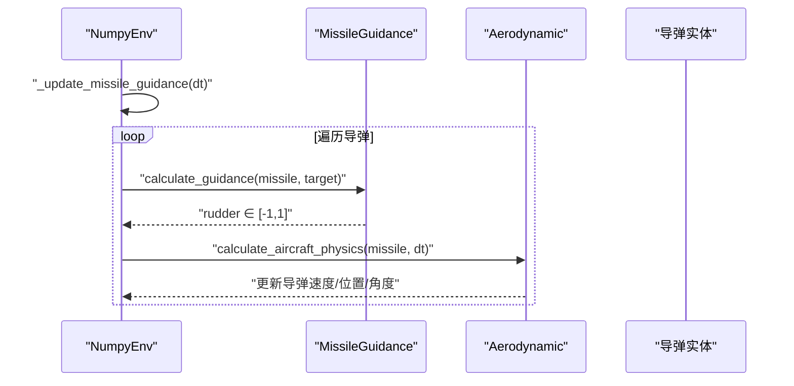
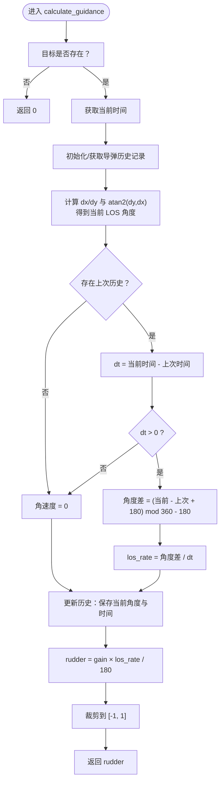
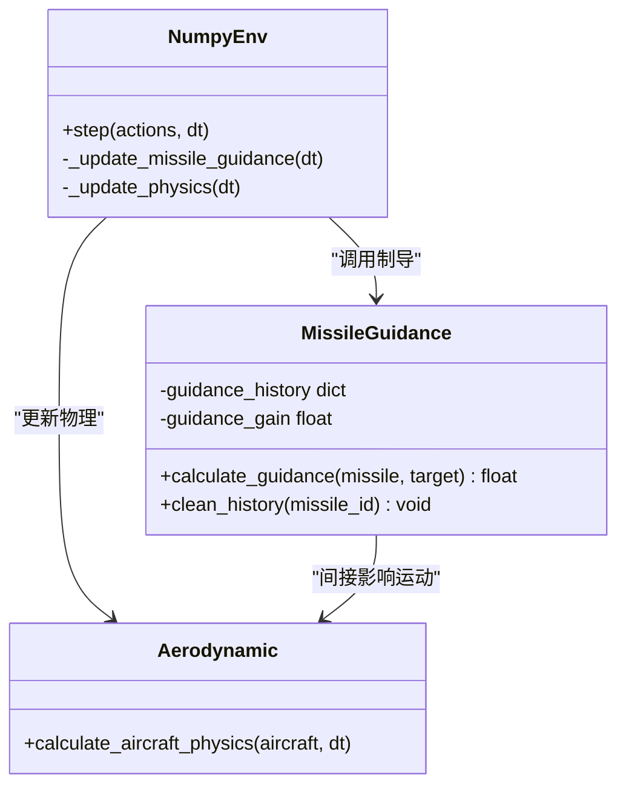
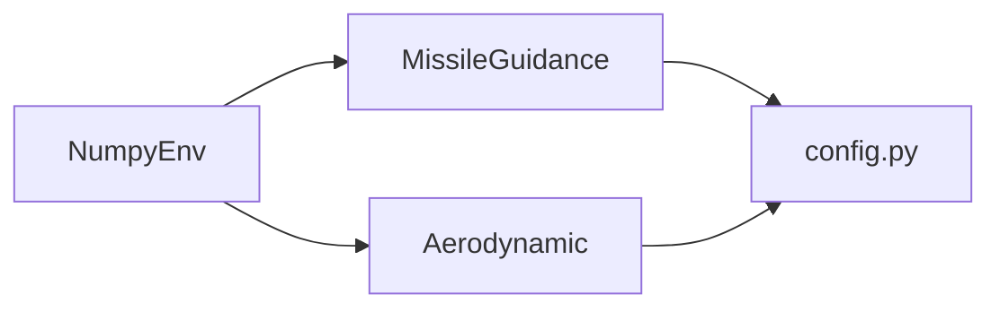

# 导弹制导

<cite>
**本文引用的文件列表**
- [missile_guidance.py](file://env_numpy/missile_guidance.py)
- [numpy_env.py](file://env_numpy/numpy_env.py)
- [aerodynamic.py](file://env_numpy/aerodynamic.py)
- [config.py](file://config.py)
- [README.md](file://README.md)
</cite>

## 目录
1. [简介](#简介)
2. [项目结构](#项目结构)
3. [核心组件](#核心组件)
4. [架构总览](#架构总览)
5. [详细组件分析](#详细组件分析)
6. [依赖关系分析](#依赖关系分析)
7. [性能考量](#性能考量)
8. [故障排查指南](#故障排查指南)
9. [结论](#结论)
10. [附录](#附录)

## 简介
本文件围绕导弹制导系统中的比例导引法（Proportional Navigation，PN）实现进行深入解析，重点聚焦于 MissileGuidance 类的 calculate_guidance 方法。内容涵盖：
- 如何通过视线角速度（LOS Rate）生成舵量指令
- 弹目连线角度的 atan2 计算与角度差处理（避免360度跳变）
- 时间差分法求角速度
- guidance_gain 增益系数对控制响应与稳定性的影响
- guidance_history 字典如何存储每个导弹的历史 los_angle 与时间戳以支持连续导引
- clean_history 方法在导弹销毁后的资源清理作用
- guidance_gain 参数调优实践建议
- 结合代码示例展示如何在规则型智能体中集成该制导逻辑

## 项目结构
本项目采用“双环境”架构：
- env_gym：面向强化学习训练的GPU并行环境
- env_numpy：面向可视化演示的CPU环境，包含导弹制导与气动力学模块

导弹制导逻辑位于 env_numpy/missile_guidance.py，与气动力学 aerodynamic.py、环境封装 numpy_env.py 协同工作；全局配置位于 config.py。

图表来源
- [numpy_env.py](file://env_numpy/numpy_env.py#L74-L74)
- [missile_guidance.py](file://env_numpy/missile_guidance.py#L1-L77)
- [aerodynamic.py](file://env_numpy/aerodynamic.py#L1-L239)
- [config.py](file://config.py#L1-L52)

章节来源
- [README.md](file://README.md#L64-L88)
- [config.py](file://config.py#L30-L39)

## 核心组件
- MissileGuidance：实现比例导引法，负责计算导弹的舵量指令
- NumpyEnv：封装环境状态与更新流程，调用制导模块更新导弹舵量
- Aerodynamic：提供物理/气动模型，将舵量转化为加速度与角速度
- 配置模块：提供 MISSILE_GUIDANCE_GAIN 等关键参数

章节来源
- [missile_guidance.py](file://env_numpy/missile_guidance.py#L7-L68)
- [numpy_env.py](file://env_numpy/numpy_env.py#L282-L288)
- [aerodynamic.py](file://env_numpy/aerodynamic.py#L40-L185)
- [config.py](file://config.py#L30-L39)

## 架构总览
导弹制导在每一步环境中被调用，流程如下：
- NumpyEnv.step 中触发 _update_missile_guidance
- 对每个活跃导弹，调用 MissileGuidance.calculate_guidance 获取 rudder
- 将 rudder 传递给 Aerodynamic.calculate_aircraft_physics，驱动导弹运动

图表来源
- [numpy_env.py](file://env_numpy/numpy_env.py#L282-L288)
- [missile_guidance.py](file://env_numpy/missile_guidance.py#L17-L68)
- [aerodynamic.py](file://env_numpy/aerodynamic.py#L40-L185)

## 详细组件分析

### MissileGuidance 类与比例导引法
MissileGuidance.calculate_guidance 的核心流程：
- 输入校验：若目标为空，返回默认舵量
- 历史管理：按导弹对象 id 创建/复用历史记录，保存 last_los_angle 与 last_time
- 弹目连线角度：使用 atan2(dy, dx) 计算当前视线角度（单位：度）
- 角度差处理：通过模运算消除360度跳变，得到平滑的角度变化量
- 时间差分：dt = 当前时间 - 上次时间，计算角速度（度/秒）
- 制导指令：rudder = guidance_gain × los_rate / 180，再裁剪至 [-1, 1]
- 更新历史：保存当前角度与时间

图表来源
- [missile_guidance.py](file://env_numpy/missile_guidance.py#L17-L68)

章节来源
- [missile_guidance.py](file://env_numpy/missile_guidance.py#L17-L68)

### guidance_history 与 clean_history
- guidance_history：以导弹对象 id 为键，存储每个导弹的 last_los_angle 与 last_time，用于连续导引
- clean_history：在导弹销毁或生命周期结束时删除对应历史，防止内存泄漏与历史污染

章节来源
- [missile_guidance.py](file://env_numpy/missile_guidance.py#L14-L15)
- [missile_guidance.py](file://env_numpy/missile_guidance.py#L70-L77)

### 与环境与物理模块的集成
- NumpyEnv._update_missile_guidance：遍历活跃导弹，调用 calculate_guidance 设置导弹 rudder
- Aerodynamic.calculate_aircraft_physics：将 rudder 转换为法向加速度与角速度，更新导弹速度与位置

图表来源
- [numpy_env.py](file://env_numpy/numpy_env.py#L282-L288)
- [missile_guidance.py](file://env_numpy/missile_guidance.py#L17-L68)
- [aerodynamic.py](file://env_numpy/aerodynamic.py#L40-L185)

章节来源
- [numpy_env.py](file://env_numpy/numpy_env.py#L282-L288)
- [aerodynamic.py](file://env_numpy/aerodynamic.py#L40-L185)

### 比例导引法参数与调优建议
- guidance_gain：直接影响 rudder 与 los_rate 的比例关系。增大增益可提升响应速度，但也可能引入高频振荡与不稳定；减小增益可增强稳定性，但响应变慢
- 建议调优策略：
  - 从配置中的 MISSILE_GUIDANCE_GAIN 出发，结合仿真观察收敛行为
  - 若出现振荡，逐步降低增益；若响应迟缓，适度提高
  - 结合 dt 与目标机动特性，确保 dt 足够小以获得更准确的角速度估计
- 代码路径参考：
  - 增益来源：[config.py](file://config.py#L38-L38)
  - 制导计算：[missile_guidance.py](file://env_numpy/missile_guidance.py#L65-L66)

章节来源
- [config.py](file://config.py#L38-L38)
- [missile_guidance.py](file://env_numpy/missile_guidance.py#L65-L66)

### 在规则型智能体中集成制导逻辑
- 规则型智能体通常不涉及深度学习，但可直接调用 MissileGuidance.calculate_guidance 来生成导弹的 rudder
- 集成步骤（以 NumpyEnv 为例）：
  - 在导弹发射后，为导弹实体设置 target
  - 在每一步环境中，调用 calculate_guidance(missile, missile.target) 获取 rudder
  - 将 rudder 交给 Aerodynamic.calculate_aircraft_physics 驱动导弹运动
- 代码路径参考：
  - 导弹发射与目标绑定：[numpy_env.py](file://env_numpy/numpy_env.py#L257-L270)
  - 制导更新：[numpy_env.py](file://env_numpy/numpy_env.py#L282-L288)
  - 制导计算：[missile_guidance.py](file://env_numpy/missile_guidance.py#L17-L68)

章节来源
- [numpy_env.py](file://env_numpy/numpy_env.py#L257-L270)
- [numpy_env.py](file://env_numpy/numpy_env.py#L282-L288)
- [missile_guidance.py](file://env_numpy/missile_guidance.py#L17-L68)

## 依赖关系分析
- MissileGuidance 依赖：
  - Python 标准库：math、time、numpy
  - 配置模块：读取 MISSILE_GUIDANCE_GAIN
- NumpyEnv 依赖：
  - MissileGuidance：用于更新导弹舵量
  - Aerodynamic：用于物理更新
- Aerodynamic 依赖：
  - 配置模块：读取导弹/飞机的气动参数

图表来源
- [missile_guidance.py](file://env_numpy/missile_guidance.py#L1-L77)
- [numpy_env.py](file://env_numpy/numpy_env.py#L74-L74)
- [aerodynamic.py](file://env_numpy/aerodynamic.py#L17-L39)
- [config.py](file://config.py#L30-L39)

章节来源
- [missile_guidance.py](file://env_numpy/missile_guidance.py#L1-L77)
- [numpy_env.py](file://env_numpy/numpy_env.py#L74-L74)
- [aerodynamic.py](file://env_numpy/aerodynamic.py#L17-L39)
- [config.py](file://config.py#L30-L39)

## 性能考量
- 计算复杂度：每次制导计算为 O(1)，主要开销在 atan2 与时间差分
- 历史存储：guidance_history 以 id 为键，按导弹数量线性增长；可通过 clean_history 及时清理
- 数值稳定性：角度差处理避免了跨 360 度跳变导致的角速度突变；dt > 0 的判断避免了除零与无效更新
- 与物理耦合：rudder 通过 Aerodynamic 转换为加速度与角速度，最终影响导弹轨迹；增益过大可能导致角速度/加速度过大，引发数值不稳定

章节来源
- [missile_guidance.py](file://env_numpy/missile_guidance.py#L48-L66)
- [aerodynamic.py](file://env_numpy/aerodynamic.py#L130-L176)

## 故障排查指南
- 现象：导弹不动或响应迟缓
  - 检查 dt 是否过大，导致角速度估计不准
  - 检查增益是否过小
  - 检查目标是否正确设置
- 现象：导弹出现高频振荡或发散
  - 降低增益，观察系统稳定性
  - 确认角度差处理是否生效（避免 360 度跳变）
- 现象：导弹销毁后内存占用持续上升
  - 确保在导弹销毁时调用 clean_history 删除对应历史
- 现象：不同平台/设备表现差异
  - 检查 time.time() 的精度与系统时钟一致性
  - 确保 dt 以秒为单位且足够小

章节来源
- [missile_guidance.py](file://env_numpy/missile_guidance.py#L48-L66)
- [missile_guidance.py](file://env_numpy/missile_guidance.py#L70-L77)
- [numpy_env.py](file://env_numpy/numpy_env.py#L295-L312)

## 结论
MissileGuidance 通过比例导引法将视线角速度转换为舵量指令，配合历史记录与角度差处理，实现了稳定而高效的制导。合理设置增益与 dt，可在响应速度与稳定性之间取得平衡；在规则型智能体中，可直接复用该制导模块以快速构建可控的导弹行为。

## 附录
- 关键参数与路径
  - 增益来源：[config.py](file://config.py#L38-L38)
  - 制导计算：[missile_guidance.py](file://env_numpy/missile_guidance.py#L65-L66)
  - 导弹发射与目标绑定：[numpy_env.py](file://env_numpy/numpy_env.py#L257-L270)
  - 制导更新入口：[numpy_env.py](file://env_numpy/numpy_env.py#L282-L288)