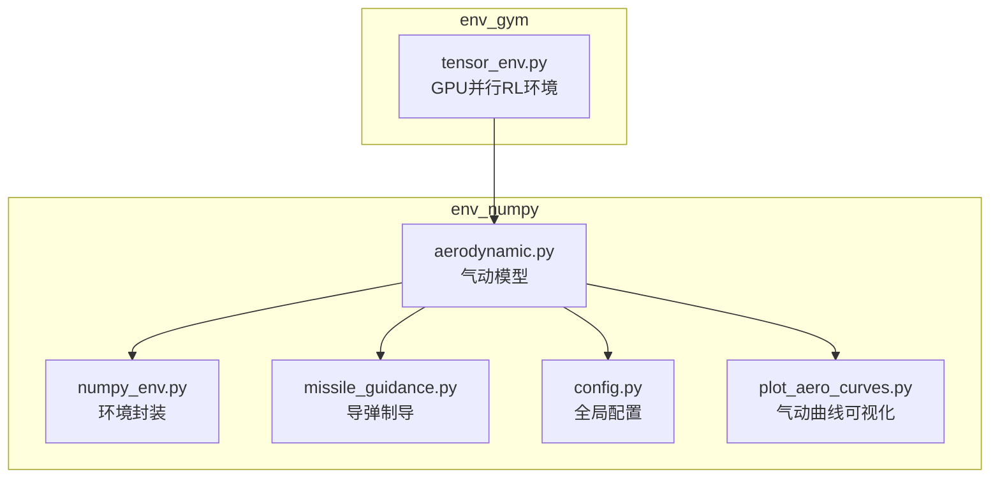
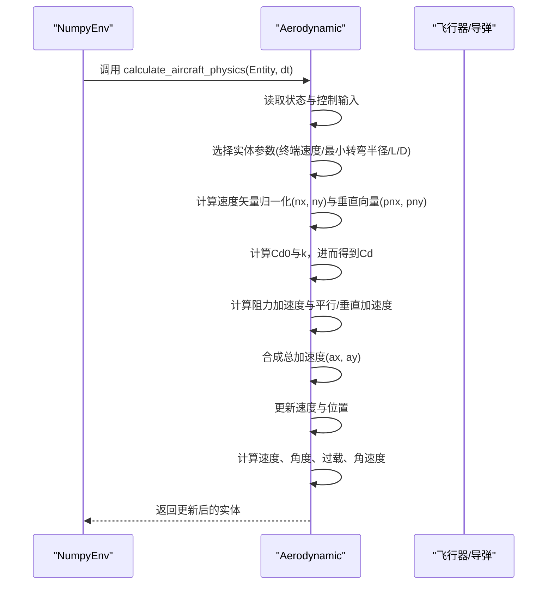
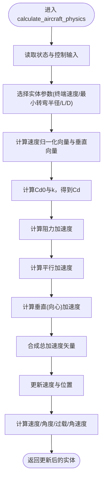
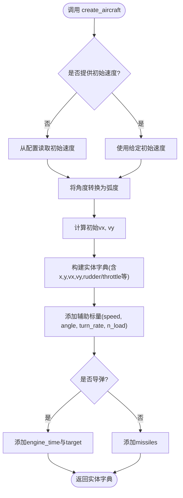
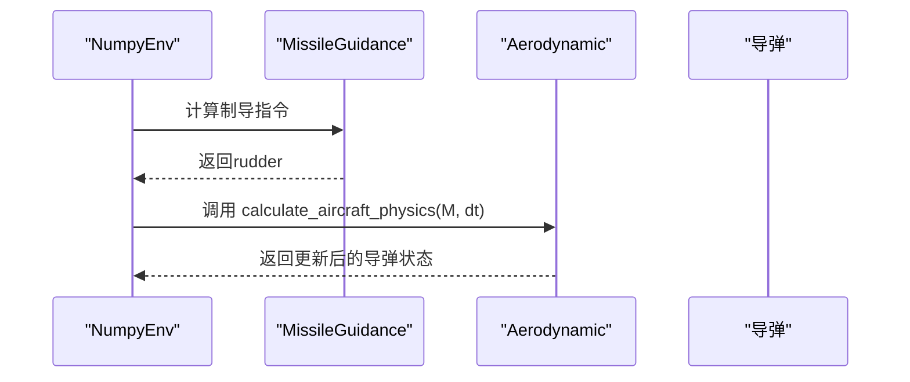
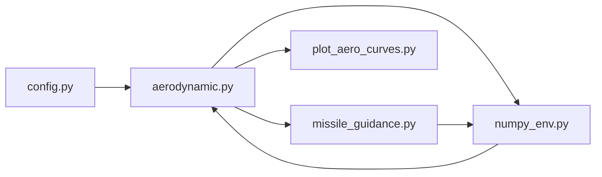

# 气动模型

<cite>
**本文引用的文件**
- [aerodynamic.py](file://env_numpy/aerodynamic.py)
- [numpy_env.py](file://env_numpy/numpy_env.py)
- [config.py](file://config.py)
- [missile_guidance.py](file://env_numpy/missile_guidance.py)
- [plot_aero_curves.py](file://plot_aero_curves.py)
- [README.md](file://README.md)
</cite>

## 目录
1. [简介](#简介)
2. [项目结构](#项目结构)
3. [核心组件](#核心组件)
4. [架构总览](#架构总览)
5. [详细组件分析](#详细组件分析)
6. [依赖关系分析](#依赖关系分析)
7. [性能考量](#性能考量)
8. [故障排查指南](#故障排查指南)
9. [结论](#结论)
10. [附录](#附录)

## 简介
本文件系统性阐述气动模型的实现机制，聚焦于Aerodynamic类如何基于矢量计算飞机与导弹的物理运动。内容涵盖：
- 速度矢量分解与归一化方向向量
- 阻力系数Cd的构成（静阻项Cd0与诱导阻力项）
- 升力与法向加速度的近似关系及与舵量的关系
- 向心加速度、角速度与过载（g-load）的计算逻辑
- 关键公式推导（如k = 1/(4*Cd0*(L/D)^2)的来源）
- create_aircraft方法的飞行器初始化流程
- 参数调优建议与数值稳定性措施（如epsilon防除零）
- 在自定义智能体中调用该模块的方法示例

## 项目结构
本项目围绕“可视化环境”与“强化学习环境”两条主线展开，其中气动模型位于env_numpy子模块中，与导弹制导、环境封装协同工作。

图表来源
- [aerodynamic.py](file://env_numpy/aerodynamic.py#L1-L239)
- [numpy_env.py](file://env_numpy/numpy_env.py#L1-L365)
- [missile_guidance.py](file://env_numpy/missile_guidance.py#L1-L77)
- [config.py](file://config.py#L1-L52)
- [plot_aero_curves.py](file://plot_aero_curves.py#L1-L73)
- [README.md](file://README.md#L64-L88)

章节来源
- [README.md](file://README.md#L64-L88)

## 核心组件
- Aerodynamic类：负责计算飞机/导弹的矢量运动学与气动状态，包括速度、位置、过载、角速度等。
- NumpyEnv：封装环境接口，协调输入、物理更新、制导与碰撞检测。
- MissileGuidance：提供比例导引的制导指令，驱动导弹的rudder输入。
- 配置系统：集中管理飞行器参数与物理常数。

章节来源
- [aerodynamic.py](file://env_numpy/aerodynamic.py#L16-L186)
- [numpy_env.py](file://env_numpy/numpy_env.py#L49-L281)
- [missile_guidance.py](file://env_numpy/missile_guidance.py#L7-L68)
- [config.py](file://config.py#L20-L52)

## 架构总览
气动模型在每一步时间片内完成以下流程：
- 读取当前状态（位置、速度、控制输入、实体类型）
- 选择实体参数（战斗机/导弹）
- 计算速度矢量的归一化方向与垂直方向向量
- 计算阻力系数Cd0与诱导阻力系数k（基于L/D_max）
- 计算总阻力加速度
- 分解加速度：平行于速度方向（推力-阻力）与垂直于速度方向（向心加速度）
- 合成总加速度矢量，更新速度与位置
- 计算并存储速度、角度、过载、角速度等辅助标量

图表来源
- [numpy_env.py](file://env_numpy/numpy_env.py#L272-L281)
- [aerodynamic.py](file://env_numpy/aerodynamic.py#L40-L185)

## 详细组件分析

### Aerodynamic类与calculate_aircraft_physics方法
- 速度矢量分解与归一化
  - 速度平方vSquare与逆速度inv_v用于避免除零，随后得到单位速度向量(ny, ny)。
  - 垂直方向向量(pnx, pny)通过速度向量旋转90°得到，左转为正。
- 阻力系数构成
  - 静阻项：Cd0 = G / V_terminal^2
  - 诱导阻力项：k = 1 / (4*Cd0*(L/D)_max^2)，Cd = Cd0 + k*Cl^2
  - Cl在此处通过Cl_intermediate = |rudder| * cl_max近似，其中cl_max = 1/R_min
- 加速度分解与合成
  - 平行加速度：thrust_accel - drag_accel
  - 垂直（向心）加速度：v^2 * cl_max * rudder
  - 总加速度矢量：ax = nx*parallel + pnx*centripetal；ay = ny*parallel + pny*centripetal
- 状态更新
  - 速度与位置使用新速度积分，提高数值稳定性
  - 计算速度、角度、过载（n_load/g_load）、角速度（turn_rate）

图表来源
- [aerodynamic.py](file://env_numpy/aerodynamic.py#L40-L185)

章节来源
- [aerodynamic.py](file://env_numpy/aerodynamic.py#L40-L185)

### 关键公式推导与物理含义
- k = 1/(4*Cd0*(L/D)^2)的来源
  - 基于L/D = Cl/(Cd0 + k*Cl^2)，对Cl求导令其为0，得到最大L/D条件下的Cl与k的关系，从而推导出k的表达式。
  - lift_drag_ratio即(L/D)_max，用于估算k。
- cl_max为何表示1/Rmin而非传统升力系数
  - 在该模型中，cl_max直接参与向心加速度a_c = v^2/R的计算，因此以1/Rmin形式出现，简化了与舵量的耦合关系。
- 法向加速度与舵量的关系
  - 通过Cl_intermediate = |rudder| * cl_max近似升力系数，进而影响Cd与向心加速度。
- 过载与角速度
  - 过载n_load = (v^2/Rmin)*|rudder|/g
  - 角速度ω = v/R = v*cl_max*rudder（单位：度/秒）

章节来源
- [aerodynamic.py](file://env_numpy/aerodynamic.py#L96-L176)

### create_aircraft方法与初始化流程
- 输入：初始位置(x, y)、初始角度(angle)、初始速度(speed，默认来自配置)、是否导弹(is_missile)
- 输出：包含矢量速度vx, vy与控制输入throttle/rudder、状态标志等的字典
- 初始化要点：
  - 将角度转换为速度矢量：vx = cos(angle)*speed，vy = sin(angle)*speed
  - 飞机：包含throttle、missiles等；导弹：包含engine_time、target等
  - 初始辅助标量：speed、angle、turn_rate、n_load等

图表来源
- [aerodynamic.py](file://env_numpy/aerodynamic.py#L187-L239)

章节来源
- [aerodynamic.py](file://env_numpy/aerodynamic.py#L187-L239)

### 与导弹制导的协作
- 导弹的rudder由MissileGuidance根据视线角速度（LOS rate）计算的比例导引给出
- 制导指令经归一化后作为Aerodynamic的输入，驱动导弹的向心加速度与角速度

图表来源
- [numpy_env.py](file://env_numpy/numpy_env.py#L272-L289)
- [missile_guidance.py](file://env_numpy/missile_guidance.py#L17-L68)

章节来源
- [numpy_env.py](file://env_numpy/numpy_env.py#L272-L289)
- [missile_guidance.py](file://env_numpy/missile_guidance.py#L17-L68)

## 依赖关系分析
- Aerodynamic依赖配置系统提供终端速度、最小转弯半径、L/D、重力常数等参数
- NumpyEnv在每步调用Aerodynamic更新所有实体状态，并在导弹存在时调用MissileGuidance
- plot_aero_curves.py用于绘制不同实体的阻力加速度与L/D随rudder变化的曲线，辅助参数调优

图表来源
- [config.py](file://config.py#L20-L52)
- [aerodynamic.py](file://env_numpy/aerodynamic.py#L16-L38)
- [numpy_env.py](file://env_numpy/numpy_env.py#L72-L74)
- [missile_guidance.py](file://env_numpy/missile_guidance.py#L7-L14)
- [plot_aero_curves.py](file://plot_aero_curves.py#L6-L16)

章节来源
- [config.py](file://config.py#L20-L52)
- [aerodynamic.py](file://env_numpy/aerodynamic.py#L16-L38)
- [numpy_env.py](file://env_numpy/numpy_env.py#L72-L74)
- [missile_guidance.py](file://env_numpy/missile_guidance.py#L7-L14)
- [plot_aero_curves.py](file://plot_aero_curves.py#L6-L16)

## 性能考量
- 数值稳定性
  - 使用epsilon（如1e-7）防止除零与开方运算中的数值问题
  - 速度平方与逆速度的组合确保在极低速度下也能稳定计算
- 计算复杂度
  - 每帧O(1)复杂度，主要为向量运算与少量标量计算
- 并行化
  - 在env_gym中，Aerodynamic的等价逻辑以张量形式实现，支持大规模并行

章节来源
- [aerodynamic.py](file://env_numpy/aerodynamic.py#L82-L86)
- [plot_aero_curves.py](file://plot_aero_curves.py#L7-L10)

## 故障排查指南
- 速度异常或发散
  - 检查终端速度与L/D参数是否合理；确认推力与阻力平衡
  - 确认epsilon是否生效，避免v≈0时的数值不稳定
- 过载过大或角速度异常
  - 检查rudder输入范围与cl_max（1/R_min）设置
  - 确认速度矢量归一化是否正确
- 导弹未命中目标
  - 检查制导增益与目标跟踪逻辑；确认engine_time与rudder是否正确传递

章节来源
- [aerodynamic.py](file://env_numpy/aerodynamic.py#L82-L185)
- [missile_guidance.py](file://env_numpy/missile_guidance.py#L17-L68)

## 结论
该气动模型通过矢量分解与归一化方向向量，将推力、阻力与向心加速度在速度平面内合成，实现了对飞机与导弹运动的高效建模。通过将cl_max定义为1/R_min，模型将舵量与最小转弯半径直接耦合，简化了升力与法向加速度的近似关系。配合配置系统与制导模块，该模型既可用于可视化演示，也可作为强化学习训练的基础。

## 附录

### 参数调优建议
- terminal_velocity
  - 影响Cd0 = G/Vt^2，进而影响阻力大小与最大速度
  - 建议与真实飞行器的终端速度一致，或通过仿真校准
- lift_drag_ratio
  - 决定k = 1/(4*Cd0*(L/D)^2)，影响诱导阻力与最大L/D
  - 提高L/D可降低诱导阻力，提升机动效率
- throttle/rudder
  - throttle控制推力加速度；rudder控制向心加速度与角速度
  - 建议在训练初期使用较小的rudder上限，逐步放宽
- engine_time（导弹）
  - 控制发动机工作时长，影响导弹的初始加速阶段

章节来源
- [aerodynamic.py](file://env_numpy/aerodynamic.py#L22-L35)
- [config.py](file://config.py#L21-L39)

### 数值稳定性措施
- epsilon防除零：在速度归一化、阻力系数计算与过载计算中均加入epsilon
- 速度积分：使用更新后的速度进行位置积分，减少数值误差累积
- 输入限幅：在环境侧对rudder与throttle进行限幅，避免极端输入

章节来源
- [aerodynamic.py](file://env_numpy/aerodynamic.py#L82-L86)
- [numpy_env.py](file://env_numpy/numpy_env.py#L180-L234)

### 在自定义智能体中的调用示例
- 使用NumpyEnv
  - 在每步环境中，将p1_rudder/p1_throttle等动作写入aircraft1/aircraft2
  - 调用env.step(actions, dt)，内部会调用Aerodynamic.update_physics
- 使用TensorEnv（GPU并行）
  - 通过张量接口传入动作张量，内部调用等价的矢量物理计算
  - 可直接读取n_load、turn_rate、g_load等辅助标量用于奖励与观察

章节来源
- [numpy_env.py](file://env_numpy/numpy_env.py#L133-L176)
- [README.md](file://README.md#L28-L62)