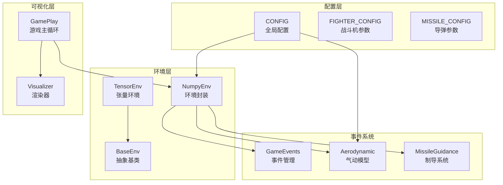
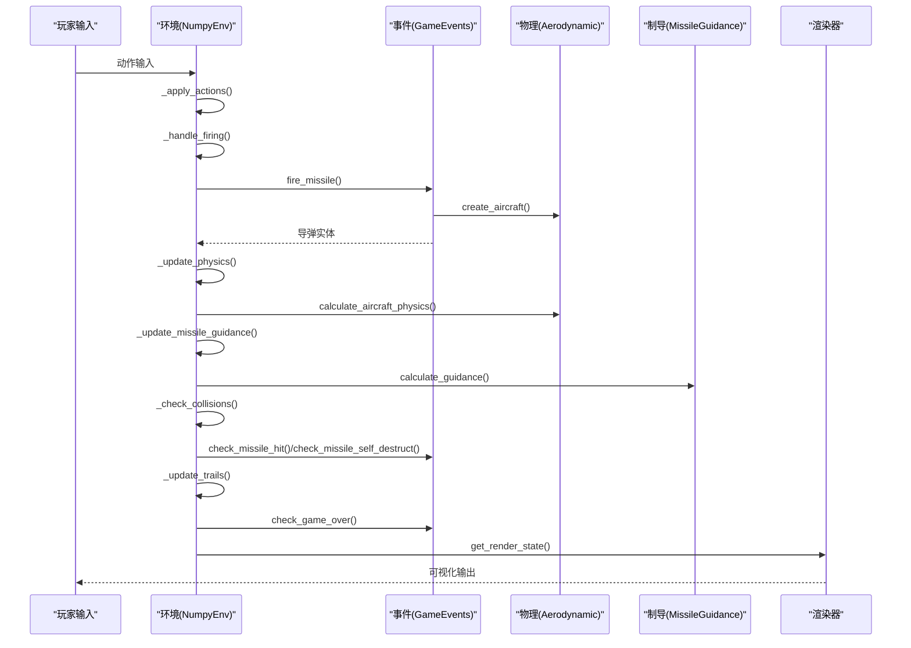
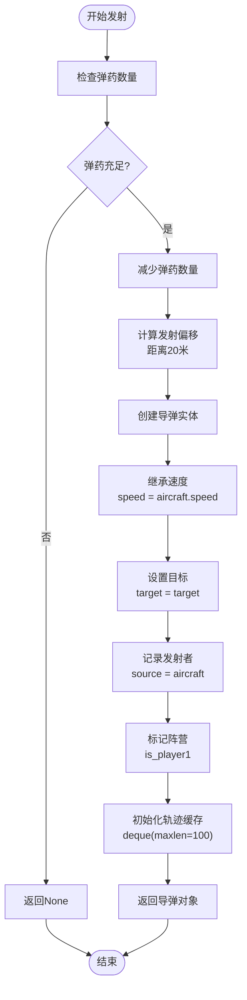
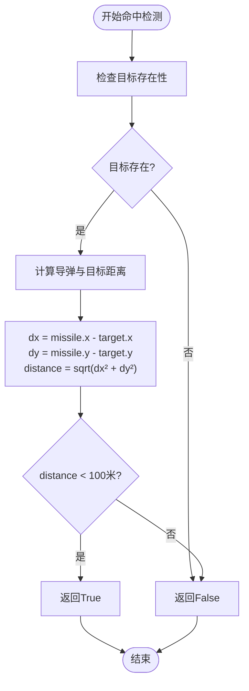
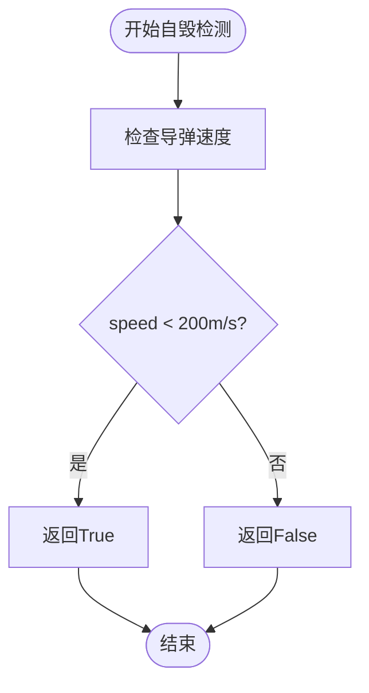
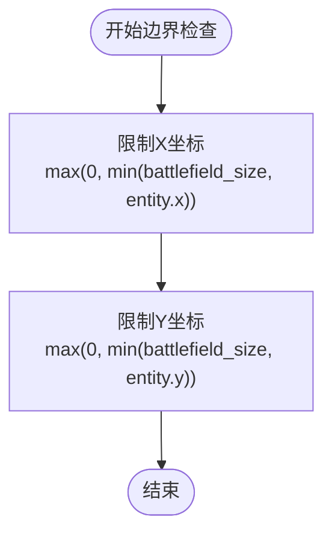
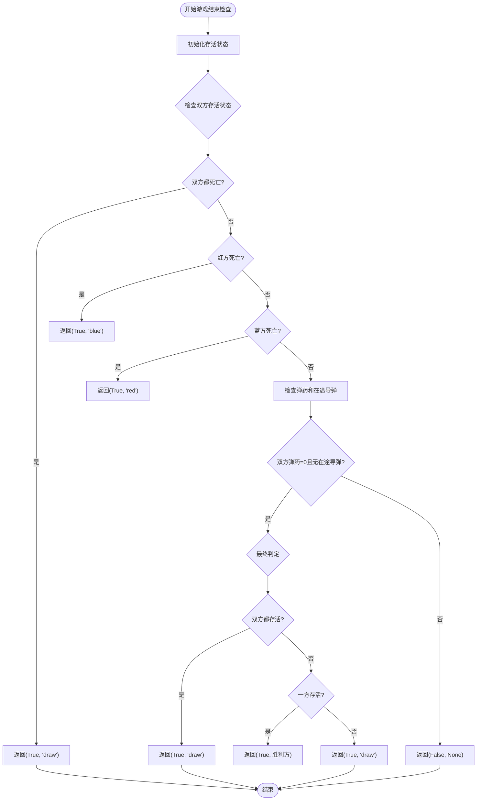
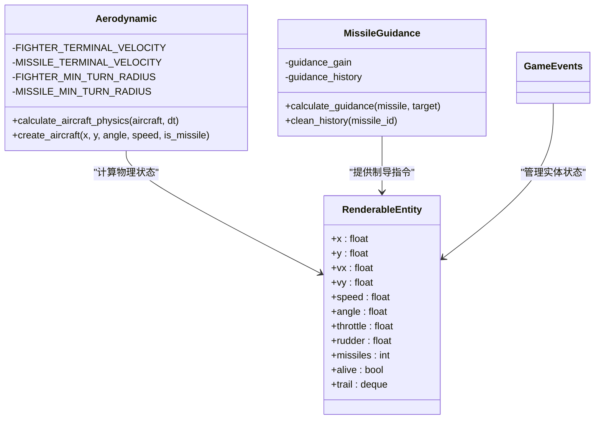
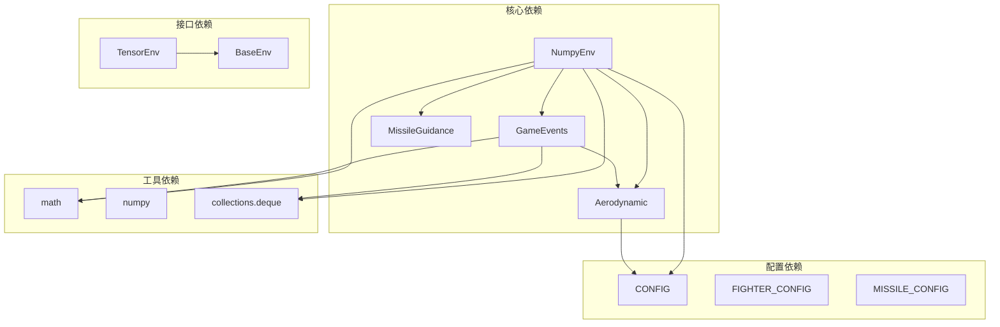

# 游戏事件系统

<cite>
**本文档引用的文件**
- [env_numpy/game_events.py](file://env_numpy/game_events.py)
- [env_numpy/numpy_env.py](file://env_numpy/numpy_env.py)
- [env_numpy/aerodynamic.py](file://env_numpy/aerodynamic.py)
- [env_numpy/missile_guidance.py](file://env_numpy/missile_guidance.py)
- [env_gym/base_env.py](file://env_gym/base_env.py)
- [env_gym/tensor_env.py](file://env_gym/tensor_env.py)
- [config.py](file://config.py)
- [game_play.py](file://game_play.py)
- [env_numpy/__init__.py](file://env_numpy/__init__.py)
</cite>

## 目录
1. [简介](#简介)
2. [项目结构](#项目结构)
3. [核心组件](#核心组件)
4. [架构概览](#架构概览)
5. [详细组件分析](#详细组件分析)
6. [依赖关系分析](#依赖关系分析)
7. [性能考量](#性能考量)
8. [故障排除指南](#故障排除指南)
9. [结论](#结论)
10. [附录](#附录)

## 简介
本文件全面介绍游戏事件系统的运行机制，重点解析GameEvents类如何管理导弹发射、命中判定、自毁条件和游戏结束逻辑。文档详细阐述fire_missile方法中导弹创建流程，包括发射偏移、速度继承、目标绑定和轨迹缓存（trail）的初始化；解释check_missile_hit方法基于100米命中半径的距离判定算法，以及check_missile_self_destruct方法通过速度阈值（200m/s）判断导弹失效的机制；描述update_battlefield_boundary方法如何限制实体在战场边界内，以及check_game_over方法综合存活状态、弹药数量和在途导弹来判定胜负的完整逻辑。同时说明事件系统与环境主循环的集成方式，并提供扩展自定义事件（如燃油耗尽）的编程指导。

## 项目结构
该项目采用模块化设计，主要包含以下核心模块：
- **env_numpy**: NumPy实现的环境封装，包含物理引擎、制导系统和事件管理
- **env_gym**: Gym接口实现，支持强化学习训练
- **rewards**: 奖励函数模块
- **agents**: 智能体模块（规则基础和学习型）
- **可视化**: Pygame图形界面



**图表来源**
- [env_numpy/numpy_env.py](file://env_numpy/numpy_env.py#L49-L95)
- [env_numpy/game_events.py](file://env_numpy/game_events.py#L7-L13)
- [config.py](file://config.py#L47-L52)

**章节来源**
- [env_numpy/numpy_env.py](file://env_numpy/numpy_env.py#L1-L365)
- [env_gym/base_env.py](file://env_gym/base_env.py#L1-L96)
- [config.py](file://config.py#L1-L52)

## 核心组件
游戏事件系统的核心由以下几个组件构成：

### GameEvents类
GameEvents类是事件系统的核心控制器，负责管理所有游戏事件：
- **导弹生命周期管理**: 发射、跟踪、销毁
- **战斗判定**: 命中检测、自毁判定
- **边界约束**: 实体边界保护
- **胜负判定**: 游戏结束条件

### RenderableEntity类
RenderableEntity是可渲染实体的基础类，提供统一的实体接口：
- **物理状态**: 位置、速度、角度、过载等
- **控制输入**: 油门、舵量、导弹数量
- **视觉属性**: 颜色、轨迹、存活状态

### Aerodynamic类
Aerodynamic类提供完整的气动和物理计算：
- **矢量物理**: 基于速度矢量的精确计算
- **参数配置**: 战斗机和导弹的物理参数
- **状态更新**: 速度、位置、角度的连续更新

**章节来源**
- [env_numpy/game_events.py](file://env_numpy/game_events.py#L7-L129)
- [env_numpy/numpy_env.py](file://env_numpy/numpy_env.py#L16-L47)
- [env_numpy/aerodynamic.py](file://env_numpy/aerodynamic.py#L16-L185)

## 架构概览
游戏事件系统采用分层架构设计，各层职责明确：



**图表来源**
- [env_numpy/numpy_env.py](file://env_numpy/numpy_env.py#L133-L176)
- [env_numpy/game_events.py](file://env_numpy/game_events.py#L14-L52)
- [env_numpy/aerodynamic.py](file://env_numpy/aerodynamic.py#L40-L185)

## 详细组件分析

### GameEvents类详细分析

#### 导弹发射流程（fire_missile方法）
fire_missile方法实现了完整的导弹创建和初始化过程：



**图表来源**
- [env_numpy/game_events.py](file://env_numpy/game_events.py#L14-L52)

**命中判定算法（check_missile_hit方法）**
命中判定基于100米命中半径的距离算法：



**图表来源**
- [env_numpy/game_events.py](file://env_numpy/game_events.py#L54-L71)

**自毁判定机制（check_missile_self_destruct方法）**
自毁判定基于速度阈值的简单算法：



**图表来源**
- [env_numpy/game_events.py](file://env_numpy/game_events.py#L73-L82)

#### 边界约束机制（update_battlefield_boundary方法）
边界约束确保实体不会飞出战场范围：



**图表来源**
- [env_numpy/game_events.py](file://env_numpy/game_events.py#L84-L91)

#### 胜负判定逻辑（check_game_over方法）
胜负判定综合多个条件：



**图表来源**
- [env_numpy/game_events.py](file://env_numpy/game_events.py#L93-L128)

**章节来源**
- [env_numpy/game_events.py](file://env_numpy/game_events.py#L14-L128)

### NumpyEnv类与事件系统集成

#### 环境主循环集成
NumpyEnv类将GameEvents与环境主循环紧密结合：

```mermaid
sequenceDiagram
participant Loop as "主循环"
participant Actions as "动作处理"
participant Firing as "发射处理"
participant Physics as "物理更新"
participant Collisions as "碰撞检测"
participant Trails as "轨迹更新"
participant GameOver as "胜负判定"
Loop->>Actions : _apply_actions()
Loop->>Firing : _handle_firing()
Firing->>GameEvents : fire_missile()
Loop->>Physics : _update_physics()
Loop->>Collisions : _check_collisions()
Collisions->>GameEvents : check_missile_hit()
Collisions->>GameEvents : check_missile_self_destruct()
Loop->>Trails : _update_trails()
Loop->>GameOver : _check_game_over()
```

**图表来源**
- [env_numpy/numpy_env.py](file://env_numpy/numpy_env.py#L133-L176)
- [env_numpy/game_events.py](file://env_numpy/game_events.py#L54-L128)

#### 导弹创建对比分析
比较GameEvents与NumpyEnv中的导弹创建实现：

| 组件 | GameEvents | NumpyEnv |
|------|------------|----------|
| **发射偏移** | 20米前移 | 20米前移 |
| **速度继承** | 继承飞机速度 | 继承飞机速度 |
| **目标绑定** | 设置target属性 | 设置target属性 |
| **阵营标记** | 设置is_player1 | 设置is_player1 |
| **轨迹初始化** | deque(maxlen=100) | deque(maxlen=100) |
| **引擎时间** | 10秒 | 10秒 |
| **调用时机** | 独立事件系统 | 环境主循环 |

**章节来源**
- [env_numpy/numpy_env.py](file://env_numpy/numpy_env.py#L235-L270)
- [env_numpy/game_events.py](file://env_numpy/game_events.py#L14-L52)

### Aerodynamic类与MissileGuidance类

#### 气动模型集成
Aerodynamic类提供精确的矢量物理计算，支持GameEvents的事件处理：



**图表来源**
- [env_numpy/aerodynamic.py](file://env_numpy/aerodynamic.py#L16-L185)
- [env_numpy/missile_guidance.py](file://env_numpy/missile_guidance.py#L7-L68)
- [env_numpy/numpy_env.py](file://env_numpy/numpy_env.py#L16-L47)

**章节来源**
- [env_numpy/aerodynamic.py](file://env_numpy/aerodynamic.py#L40-L185)
- [env_numpy/missile_guidance.py](file://env_numpy/missile_guidance.py#L17-L68)

## 依赖关系分析



**图表来源**
- [env_numpy/game_events.py](file://env_numpy/game_events.py#L3-L5)
- [env_numpy/numpy_env.py](file://env_numpy/numpy_env.py#L8-L13)
- [config.py](file://config.py#L47-L52)

**章节来源**
- [env_numpy/__init__.py](file://env_numpy/__init__.py#L7-L18)
- [env_gym/base_env.py](file://env_gym/base_env.py#L12-L95)

## 性能考量

### 算法复杂度分析
- **导弹发射**: O(1) - 固定的数学运算和属性设置
- **命中检测**: O(n) - 遍历所有激活导弹进行距离计算
- **自毁判定**: O(n) - 遍历所有激活导弹检查速度阈值
- **边界约束**: O(n) - 遍历所有实体限制坐标范围
- **胜负判定**: O(1) - 基于状态的直接判断

### 优化建议
1. **批量处理**: 将相似的检查操作合并，减少循环次数
2. **空间换时间**: 预分配导弹数组，避免动态扩容
3. **缓存机制**: 缓存常用计算结果，如角度转换
4. **早期退出**: 在满足条件时立即停止不必要的计算

## 故障排除指南

### 常见问题及解决方案

#### 导弹无法发射
**症状**: 发射按钮无效，弹药不减少
**原因分析**:
- 弹药数量不足
- 冷却时间未到
- 飞机处于非存活状态

**解决方法**:
1. 检查飞机的missiles属性
2. 验证冷却时间逻辑
3. 确认飞机alive状态

#### 命中判定不准确
**症状**: 导弹击中目标但不触发效果
**原因分析**:
- 命中半径配置错误
- 目标状态异常
- 数值精度问题

**解决方法**:
1. 验证命中半径配置
2. 检查目标alive属性
3. 调整距离计算精度

#### 自毁判定异常
**症状**: 导弹在低速时未自毁或过早自毁
**原因分析**:
- 速度阈值设置不当
- 速度计算错误
- 状态更新延迟

**解决方法**:
1. 检查速度阈值配置
2. 验证速度计算逻辑
3. 确认状态更新顺序

**章节来源**
- [env_numpy/numpy_env.py](file://env_numpy/numpy_env.py#L235-L347)
- [env_numpy/game_events.py](file://env_numpy/game_events.py#L54-L128)

## 结论
游戏事件系统通过GameEvents类实现了完整的导弹生命周期管理，包括发射、跟踪、命中和销毁等核心功能。系统采用模块化设计，各组件职责清晰，耦合度适中，便于扩展和维护。通过精确的物理计算和合理的算法设计，系统能够稳定地处理复杂的空战场景。未来可以在现有基础上进一步优化性能，增强事件系统的可扩展性，并提供更丰富的自定义事件支持。

## 附录

### 扩展自定义事件编程指导

#### 新增事件类型示例
要扩展自定义事件（如燃油耗尽），可以按照以下步骤进行：

1. **定义事件处理器**:
```python
def check_fuel_consumption(self, missile):
    """检查导弹燃油消耗"""
    if missile['engine_time'] <= 0:
        return True  # 燃油耗尽
    return False
```

2. **更新事件检查逻辑**:
```python
def _check_collisions(self):
    # ... 现有的碰撞检查 ...
    
    # 新增燃油耗尽检查
    if self.check_fuel_consumption(missile):
        missile.alive = False
        self.missiles.remove(missile)
```

3. **添加配置参数**:
```python
# 在配置文件中添加
MISSILE_FUEL_CONSUMPTION_RATE = 0.1  # 燃油消耗率
```

#### 事件系统最佳实践
- **单一职责**: 每个事件处理器专注于特定功能
- **幂等性**: 事件处理应该是幂等的，避免重复处理
- **性能优先**: 将昂贵的操作放在必要时才执行
- **错误处理**: 为所有事件处理添加适当的错误处理
- **日志记录**: 为关键事件添加日志记录以便调试