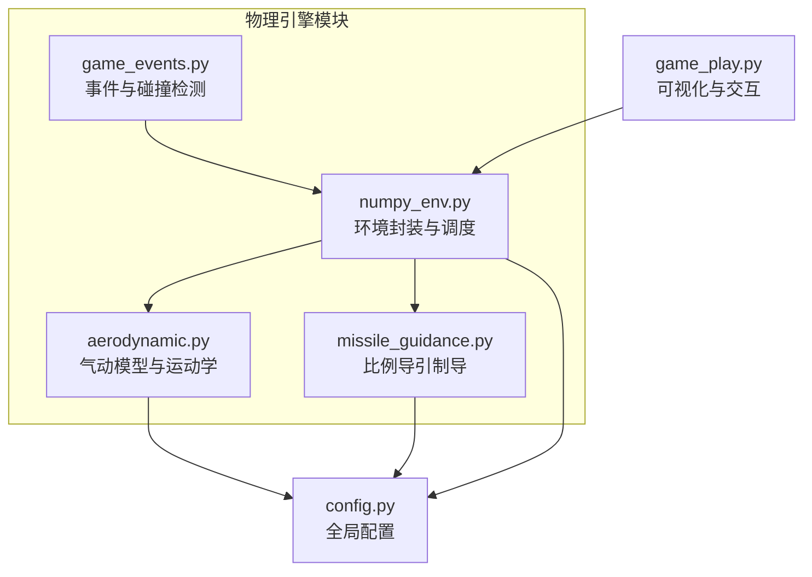
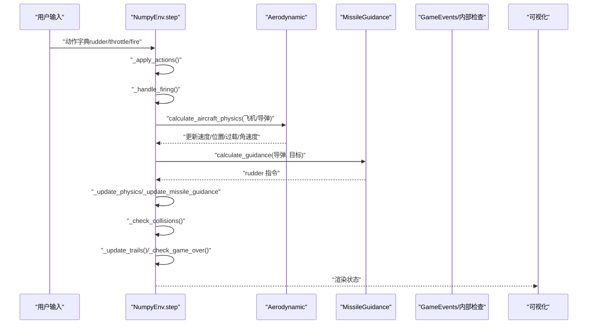
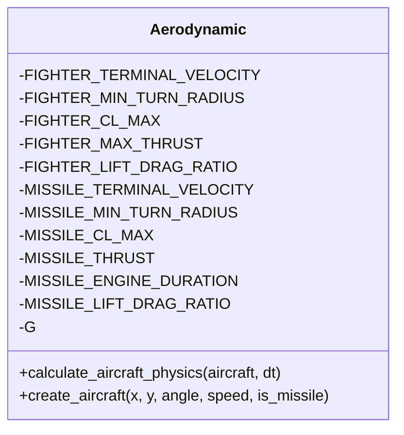
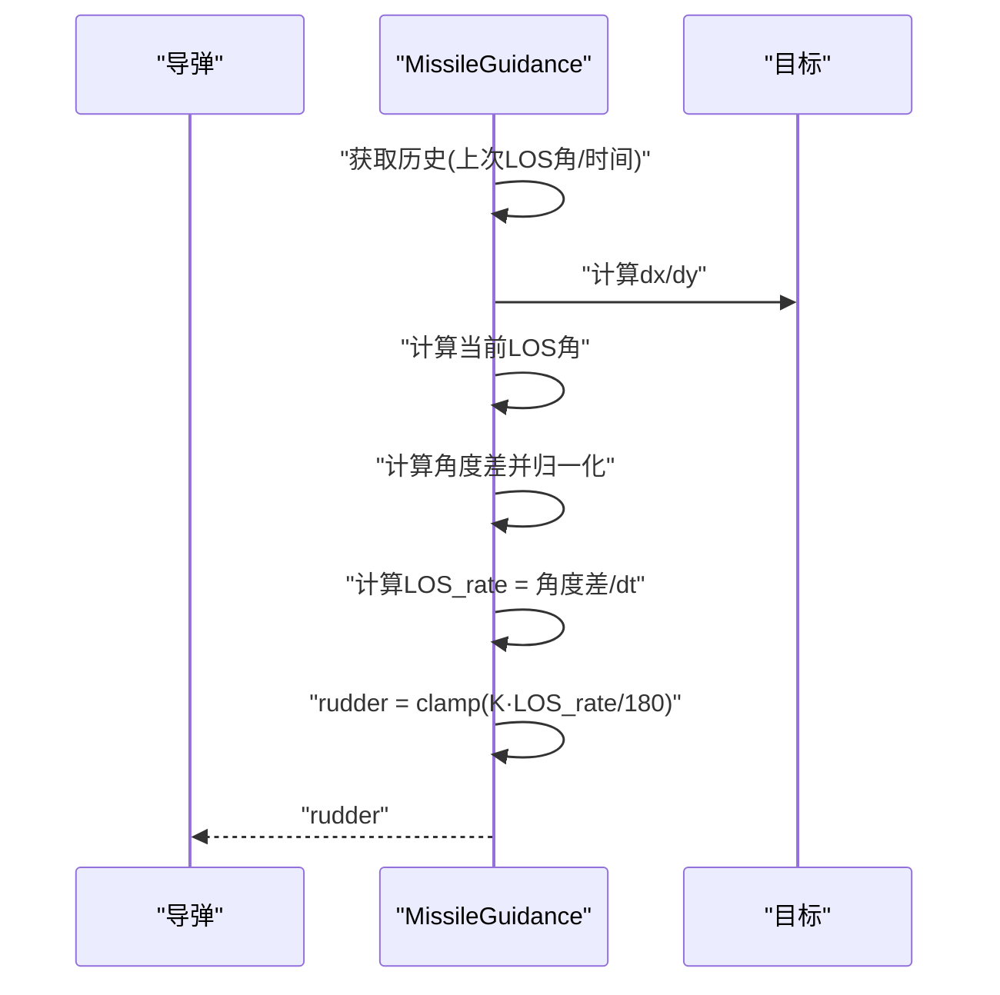
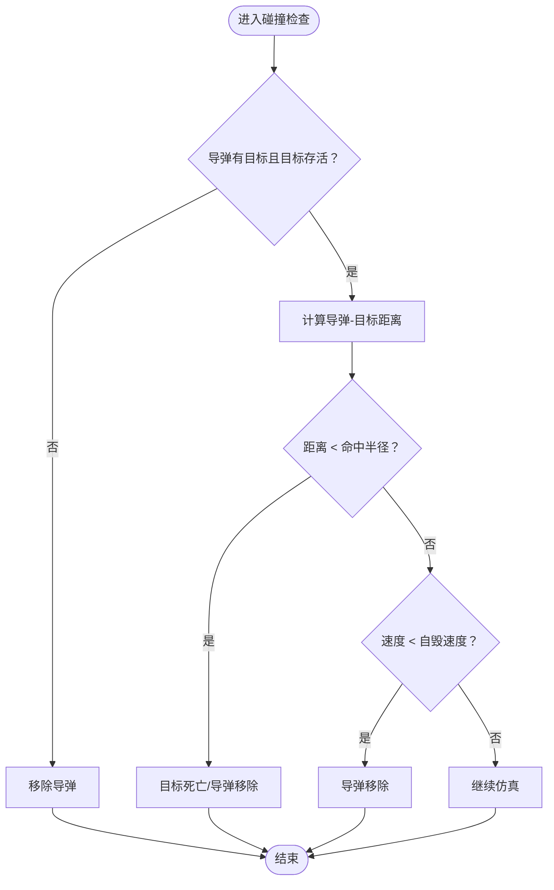
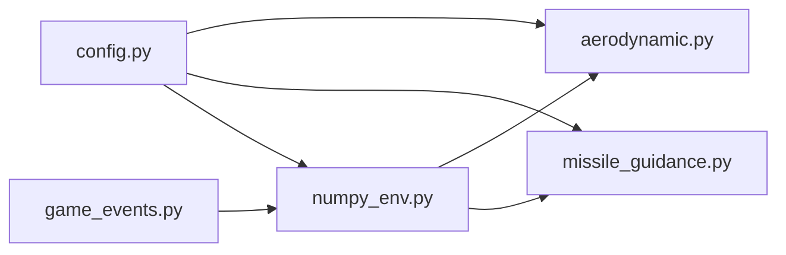

# 物理引擎

<cite>
**本文引用的文件**
- [aerodynamic.py](file://env_numpy/aerodynamic.py)
- [missile_guidance.py](file://env_numpy/missile_guidance.py)
- [game_events.py](file://env_numpy/game_events.py)
- [numpy_env.py](file://env_numpy/numpy_env.py)
- [config.py](file://config.py)
- [game_play.py](file://game_play.py)
</cite>

## 目录
1. [简介](#简介)
2. [项目结构](#项目结构)
3. [核心组件](#核心组件)
4. [架构总览](#架构总览)
5. [详细组件分析](#详细组件分析)
6. [依赖关系分析](#依赖关系分析)
7. [性能考量](#性能考量)
8. [故障排查指南](#故障排查指南)
9. [结论](#结论)

## 简介
本文件面向“中距空战”物理引擎的实现细节，围绕以下三个核心模块展开：
- 气动模型（升力、阻力、力矩）与攻角、马赫数等参数的关系
- 比例导引法（Proportional Navigation）的数学实现与制导逻辑
- 碰撞检测、导弹命中判定、燃油耗尽等事件的触发机制与处理流程

文档提供公式推导、参数调优建议与数值稳定性保障措施，确保模拟的真实性与可重复性。

## 项目结构
物理引擎相关代码集中在 env_numpy 目录，配合全局配置 config.py 提供统一参数来源。游戏入口 game_play.py 将环境封装为交互式可视化体验。

图表来源
- [aerodynamic.py](file://env_numpy/aerodynamic.py#L1-L239)
- [missile_guidance.py](file://env_numpy/missile_guidance.py#L1-L77)
- [game_events.py](file://env_numpy/game_events.py#L1-L129)
- [numpy_env.py](file://env_numpy/numpy_env.py#L1-L365)
- [config.py](file://config.py#L1-L52)
- [game_play.py](file://game_play.py#L1-L331)

章节来源
- [aerodynamic.py](file://env_numpy/aerodynamic.py#L1-L239)
- [missile_guidance.py](file://env_numpy/missile_guidance.py#L1-L77)
- [game_events.py](file://env_numpy/game_events.py#L1-L129)
- [numpy_env.py](file://env_numpy/numpy_env.py#L1-L365)
- [config.py](file://config.py#L1-L52)
- [game_play.py](file://game_play.py#L1-L331)

## 核心组件
- 气动模型 Aerodynamic：基于矢量速度与控制输入（舵量）计算阻力、升力与向心加速度，合成总加速度并更新位置与速度。
- 比例导引制导 MissileGuidance：通过视线角速度（LOS rate）与制导增益计算舵量指令，实现寻的制导。
- 事件系统 GameEvents：负责导弹发射、命中判定、自毁（低速）、边界约束与胜负判定。
- 环境封装 NumpyEnv：统一调度物理、制导、事件与渲染状态，提供 step 接口。

章节来源
- [aerodynamic.py](file://env_numpy/aerodynamic.py#L16-L185)
- [missile_guidance.py](file://env_numpy/missile_guidance.py#L7-L68)
- [game_events.py](file://env_numpy/game_events.py#L7-L128)
- [numpy_env.py](file://env_numpy/numpy_env.py#L49-L365)

## 架构总览
下图展示物理引擎在环境中的调用关系与数据流。

图表来源
- [numpy_env.py](file://env_numpy/numpy_env.py#L133-L176)
- [aerodynamic.py](file://env_numpy/aerodynamic.py#L40-L185)
- [missile_guidance.py](file://env_numpy/missile_guidance.py#L17-L68)

## 详细组件分析

### 气动模型与运动学（aerodynamic.py）
- 设计要点
  - 使用矢量速度（vx, vy）与控制输入（rudder ∈ [-1,1]）建模。
  - 通过“最小转弯半径”派生的 cl_max 间接控制向心加速度 a_c = v²·|rudder|·cl_max。
  - 阻力系数 Cd 由基础阻力 Cd0 与诱导阻力项组成，其中 k 与升阻比（L/D）相关。
  - 推力加速度根据实体类型（飞机/导弹）采用不同策略：飞机为油门缩放，导弹为发动机剩余时间控制。
  - 输出包含速度、马赫数、过载（n_load/g_load）、角速度（turn_rate）等辅助状态。

- 数学实现与公式推导
  - 速度与方向
    - v² = vx² + vy²，inv_v = 1/√(v²+ε)，nx = vx·inv_v，ny = vy·inv_v。
    - 垂直方向向量：pnx = -ny，pny = nx。
  - 阻力与升力
    - Cd0 = g / v_terminal²，k = 1/(4·Cd0·(L/D)² + ε)，Cd = Cd0 + k·Cl²。
    - 其中 Cl 与 |rudder| 成正比，Cl² 用于近似诱导阻力贡献。
  - 加速度分解
    - 平行加速度：a_par = thrust - Cd·v²。
    - 垂直加速度（向心）：a_cent = v²·cl_max·rudder。
    - 合加速度：ax = nx·a_par + pnx·a_cent，ay = ny·a_par + pny·a_cent。
  - 状态更新
    - 速度：vx_new = vx + ax·dt，vy_new = vy + ay·dt。
    - 位置：x = x + vx_new·dt，y = y + vy_new·dt。
  - 辅助量
    - 速度：speed = √(vx_new² + vy_new²)。
    - 马赫数：mach = speed / 340。
    - 过载：n_load = v²·cl_max / g。
    - 角速度：ω = v·cl_max·rudder（弧度/秒，再转换为度/秒）。

- 参数与稳定性
  - 防止除零：在计算 inv_v 时引入 ε=1e-7。
  - 舵量与推力限幅：rudder ∈ [-1,1]，推力随时间衰减（导弹）。
  - 初始状态：create_aircraft 将角度转为初速度矢量，附加辅助标量字段。

- 调优建议
  - 最小转弯半径与 cl_max：更小的 R_min → 更大的 cl_max，提升机动性但可能降低稳定性，需结合 L/D 与 Cd0 调整。
  - 升阻比（L/D）：增大 L/D 提高效率，但会放大 k，需平衡 Cd0 与 k 的关系。
  - 终端速度：影响 Cd0 与过载上限，需与真实飞行器参数匹配。
  - 时间步长：dt 过大可能导致数值不稳定，建议与制导增益协同调参。

章节来源
- [aerodynamic.py](file://env_numpy/aerodynamic.py#L16-L185)
- [config.py](file://config.py#L20-L39)

#### 类关系图（代码级）

图表来源
- [aerodynamic.py](file://env_numpy/aerodynamic.py#L16-L39)

### 比例导引制导（missile_guidance.py）
- 数学原理
  - 比例导引：rudder ∝ K·LOS_rate，其中 K 为制导增益，LOS_rate 为视线角速度。
  - LOS_rate 通过当前与上次弹目连线角度差除以时间间隔得到，并处理角度跨 360° 的跳变。
  - 输出 rudder 限幅至 [-1,1]，映射到实际控制量。

- 实现流程
  - 计算 dx/dy 与当前 LOS 角度。
  - 若存在历史，则计算角度差并归一化到 [-180,180]，得到度/秒的 LOS_rate。
  - rudder = clamp(K·LOS_rate/180)。
  - 历史管理：按导弹 id 存储 last_los_angle 与 last_time，支持 clean_history 清理。

- 参数与稳定性
  - 制导增益 K：过大易振荡，过小收敛慢；建议从经验值开始，结合 dt 与目标机动性微调。
  - 角度差处理：使用模运算保证连续性，避免角度突变导致的导引误差。
  - 时间戳：使用 time.time()，注意多线程/异步环境下的精度与单调性。

- 调优建议
  - K 与导弹速度、目标机动性、dt 相关；可按 K = K0·(v/300)·(1/dt) 的经验公式初调。
  - 若目标做快速机动，适当提高 K；若希望稳定，降低 K 并增加 dt。

章节来源
- [missile_guidance.py](file://env_numpy/missile_guidance.py#L7-L68)
- [config.py](file://config.py#L30-L39)

#### 序列图（制导指令计算）

图表来源
- [missile_guidance.py](file://env_numpy/missile_guidance.py#L17-L68)

### 事件系统与碰撞检测（game_events.py 与 numpy_env.py）
- 导弹发射
  - 检查飞机导弹数量与冷却时间，创建导弹实体并设置初始位置（略向前移），继承速度与目标，记录发射方与轨迹。
- 命中判定
  - 计算导弹与目标之间的欧氏距离，小于阈值（命中半径）即判定命中，目标标记死亡，导弹移除。
- 自毁机制
  - 当导弹速度低于阈值（自毁速度）时，导弹移除，避免无效弹药。
- 边界约束
  - 将实体坐标限制在战场范围内，防止越界。
- 胜负判定
  - 任一方被击毁则游戏结束；双方弹药耗尽且无在途导弹时判平局；否则继续。

- 内部检查与环境封装
  - NumpyEnv 在 step 中统一调用：_update_physics、_update_missile_guidance、_check_collisions、_update_trails、_check_game_over。
  - 命中半径与自毁速度来自配置，便于一致性与可重复性。

- 参数与稳定性
  - 命中半径与自毁速度：过小易误伤，过大易漏判；建议结合导弹速度与视觉效果调优。
  - 冷却时间：避免连续发射导致弹药瞬时耗尽或视觉混乱。

章节来源
- [game_events.py](file://env_numpy/game_events.py#L14-L128)
- [numpy_env.py](file://env_numpy/numpy_env.py#L235-L347)
- [config.py](file://config.py#L46-L52)

#### 流程图（命中与自毁检查）

图表来源
- [numpy_env.py](file://env_numpy/numpy_env.py#L290-L313)

## 依赖关系分析
- 模块耦合
  - NumpyEnv 同时依赖 Aerodynamic 与 MissileGuidance，形成“物理-制导-事件”的闭环。
  - GameEvents 与 NumpyEnv 在碰撞与胜负判定上存在协作关系。
- 外部依赖
  - NumPy（用于数组操作，虽未在上述文件直接导入，但在项目中广泛使用）。
  - 配置集中于 config.py，被各模块读取，确保参数一致性。
- 潜在环路
  - 未发现直接循环导入；制导依赖目标状态，但通过 id 历史避免强耦合。

图表来源
- [config.py](file://config.py#L46-L52)
- [aerodynamic.py](file://env_numpy/aerodynamic.py#L14-L19)
- [missile_guidance.py](file://env_numpy/missile_guidance.py#L8-L14)
- [numpy_env.py](file://env_numpy/numpy_env.py#L58-L94)
- [game_events.py](file://env_numpy/game_events.py#L8-L12)

章节来源
- [config.py](file://config.py#L1-L52)
- [aerodynamic.py](file://env_numpy/aerodynamic.py#L1-L239)
- [missile_guidance.py](file://env_numpy/missile_guidance.py#L1-L77)
- [game_events.py](file://env_numpy/game_events.py#L1-L129)
- [numpy_env.py](file://env_numpy/numpy_env.py#L1-L365)

## 性能考量
- 计算复杂度
  - Aerodynamic：O(1) 每实体每步，涉及少量三角函数与标量运算。
  - MissileGuidance：O(1) 每导弹每步，主要为标量运算与历史查询。
  - 碰撞检查：O(M)（M 为在途导弹数），建议在大规模场景中按区域裁剪。
- 数值稳定性
  - 引入 ε 防止除零；rudder 与推力限幅；角度差归一化避免跳变。
- 时间步长与制导增益
  - dt 与 K 需协同调参；过小 dt 增加计算负担，过大 dt 易失稳。
- 内存与缓存
  - 导弹轨迹使用固定长度队列，避免无限增长；历史缓存按 id 管理，必要时清理。

## 故障排查指南
- 导弹不动或漂移
  - 检查 rudder 是否被限幅至 0；确认推力是否因发动机耗尽而降为 0。
  - 核对速度与 Cd 的关系，避免阻力过大导致速度持续下降。
- 制导不生效或振荡
  - 检查 K 是否过大；确认 dt 与 LOS_rate 的计算是否合理。
  - 观察角度差归一化逻辑，避免跨 360° 导致的瞬时大变化。
- 命中不触发或误伤
  - 调整命中半径与自毁速度；核对距离计算与目标存活状态。
- 越界问题
  - 确认边界约束函数是否在每步调用；检查战场尺寸配置。

章节来源
- [aerodynamic.py](file://env_numpy/aerodynamic.py#L82-L185)
- [missile_guidance.py](file://env_numpy/missile_guidance.py#L48-L68)
- [game_events.py](file://env_numpy/game_events.py#L54-L128)
- [numpy_env.py](file://env_numpy/numpy_env.py#L272-L347)

## 结论
该物理引擎以简洁高效的矢量方法实现了近似真实空战的运动学与制导过程。通过合理的参数设计与数值稳定性保障，可在保证可重复性的同时提升模拟真实性。建议在实际部署中：
- 以配置为中心统一参数来源；
- 以经验公式与仿真结果迭代调优 K、R_min、L/D 与 dt；
- 在大规模场景中引入空间分区与事件裁剪，提升性能；
- 严格记录与复现实验参数，确保结果可重现。