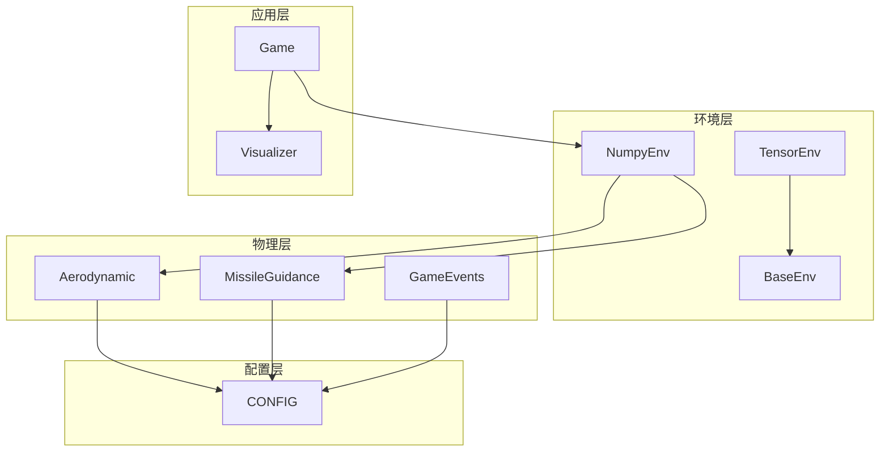
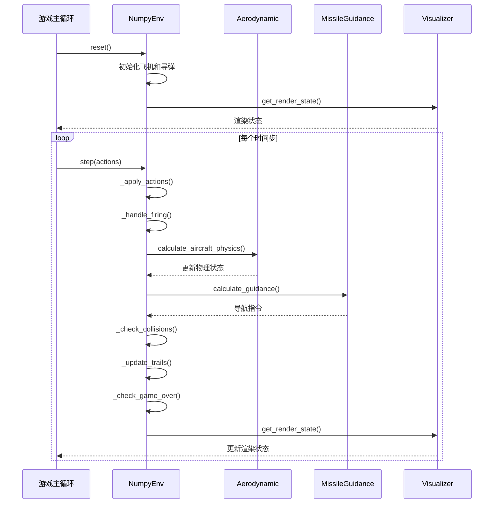
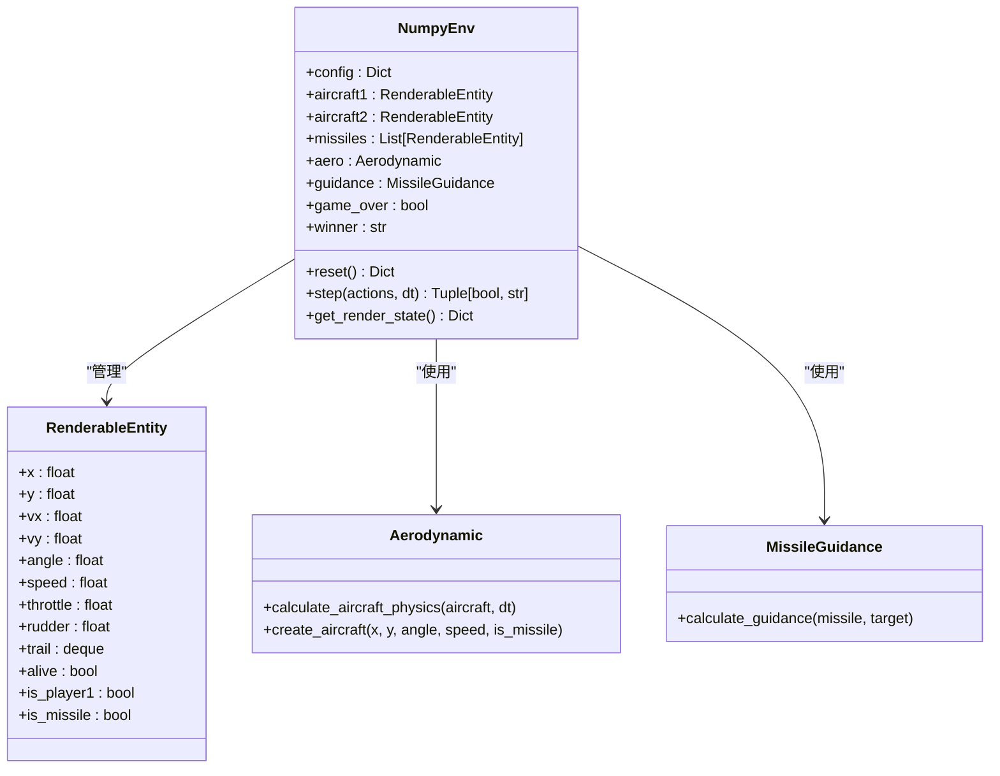
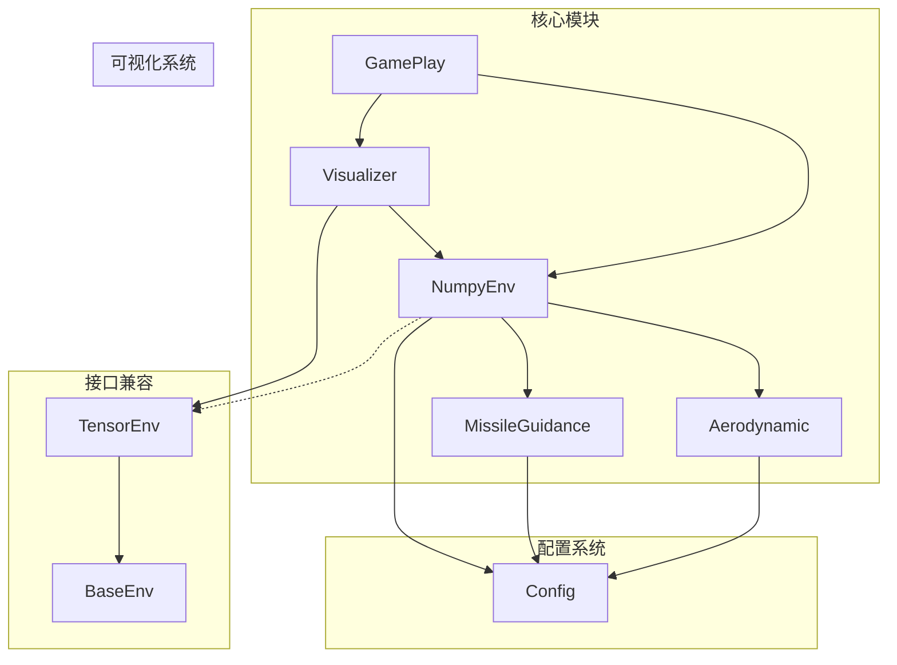

# Numpy环境

<cite>
**本文档引用的文件**
- [numpy_env.py](file://env_numpy/numpy_env.py)
- [aerodynamic.py](file://env_numpy/aerodynamic.py)
- [missile_guidance.py](file://env_numpy/missile_guidance.py)
- [game_events.py](file://env_numpy/game_events.py)
- [tensor_env.py](file://env_gym/tensor_env.py)
- [base_env.py](file://env_gym/base_env.py)
- [game_play.py](file://game_play.py)
- [visualization.py](file://visualization.py)
- [config.py](file://config.py)
</cite>

## 目录
1. [简介](#简介)
2. [项目结构](#项目结构)
3. [核心组件](#核心组件)
4. [架构概览](#架构概览)
5. [详细组件分析](#详细组件分析)
6. [依赖关系分析](#依赖关系分析)
7. [性能考量](#性能考量)
8. [故障排除指南](#故障排除指南)
9. [结论](#结论)
10. [附录](#附录)

## 简介
本文档详细介绍Numpy环境的实现，重点说明NumpyEnv类如何使用NumPy实现高精度物理模拟和实时可视化。文档涵盖面向对象设计、RenderableEntity可渲染实体类的结构和属性、reset()方法的初始化逻辑、step()方法的执行流程、_get_render_state()方法的状态构建过程，以及与TensorEnv的接口兼容性设计。同时，文档还说明了在game_play.py中用于算法验证和演示的使用场景。

## 项目结构
该项目采用模块化设计，将物理模拟、制导系统、可视化等功能分离到独立模块中，形成清晰的层次结构：



**图表来源**
- [numpy_env.py](file://env_numpy/numpy_env.py#L49-L95)
- [tensor_env.py](file://env_gym/tensor_env.py#L206-L242)
- [base_env.py](file://env_gym/base_env.py#L12-L95)

**章节来源**
- [numpy_env.py](file://env_numpy/numpy_env.py#L1-L365)
- [tensor_env.py](file://env_gym/tensor_env.py#L1-L772)
- [game_play.py](file://game_play.py#L1-L331)

## 核心组件
Numpy环境的核心由以下关键组件构成：

### NumpyEnv类
NumpyEnv是主要的环境控制器，负责：
- 环境状态管理
- 物理模拟执行
- 制导系统协调
- 渲染状态生成
- 游戏结束判定

### RenderableEntity类
RenderableEntity是可渲染实体的统一接口，包含：
- 位置坐标 (x, y)
- 速度向量 (vx, vy)
- 角度和速度
- 飞行动力学参数 (throttle, rudder, turn_rate, g_load)
- 可视化追踪 (trail)
- 存活状态 (alive)

### Aerodynamic模块
Aerodynamic模块提供高精度的气动计算：
- 基于矢量的物理计算
- 升阻比和推力计算
- 过载和角速度计算
- 最小转弯半径约束

### MissileGuidance模块
MissileGuidance模块实现比例导引：
- 视线角速度计算
- 制导增益控制
- 导弹轨迹预测

**章节来源**
- [numpy_env.py](file://env_numpy/numpy_env.py#L16-L47)
- [aerodynamic.py](file://env_numpy/aerodynamic.py#L16-L36)
- [missile_guidance.py](file://env_numpy/missile_guidance.py#L7-L16)

## 架构概览
Numpy环境采用分层架构设计，实现了完整的飞行模拟系统：



**图表来源**
- [numpy_env.py](file://env_numpy/numpy_env.py#L133-L176)
- [aerodynamic.py](file://env_numpy/aerodynamic.py#L40-L185)
- [missile_guidance.py](file://env_numpy/missile_guidance.py#L17-L68)

## 详细组件分析

### NumpyEnv类深度分析

#### 面向对象设计
NumpyEnv采用组合模式，将不同的功能模块组合在一起：



**图表来源**
- [numpy_env.py](file://env_numpy/numpy_env.py#L49-L95)
- [numpy_env.py](file://env_numpy/numpy_env.py#L16-L47)
- [aerodynamic.py](file://env_numpy/aerodynamic.py#L16-L36)
- [missile_guidance.py](file://env_numpy/missile_guidance.py#L7-L16)

#### reset()方法初始化逻辑
reset()方法负责环境的完全重置，包括：

1. **初始位置计算**：基于战场尺寸和初始距离比例计算红蓝双方的初始坐标
2. **初始朝向计算**：计算朝向战场中心的角度
3. **飞机创建**：初始化两个可渲染实体，设置初始速度和导弹数量
4. **状态重置**：清理导弹列表，重置游戏状态和计时器

```mermaid
flowchart TD
Start([reset()调用]) --> CalcPos["计算初始位置<br/>- 红方: (ratio*ratio)<br/>- 蓝方: ((1-ratio)*(1-ratio))"]
CalcPos --> CalcAngle["计算初始朝向<br/>- 朝向战场中心"]
CalcAngle --> CreateAircraft["创建飞机实体<br/>- 设置初始速度<br/>- 分配导弹数量"]
CreateAircraft --> ClearMissiles["清空导弹列表"]
ClearMissiles --> ResetState["重置游戏状态<br/>- game_over=False<br/>- winner=None<br/>- 游戏时间=0"]
ResetState --> ReturnState["返回渲染状态"]
ReturnState --> End([完成])
```

**图表来源**
- [numpy_env.py](file://env_numpy/numpy_env.py#L96-L131)

**章节来源**
- [numpy_env.py](file://env_numpy/numpy_env.py#L96-L131)

#### step()方法执行流程
step()方法是环境的核心更新逻辑，按顺序执行以下阶段：

1. **动作应用阶段**：处理玩家输入，实现舵量渐变和油门控制
2. **开火处理阶段**：检查冷却时间，创建新导弹
3. **物理更新阶段**：调用气动模型计算新的物理状态
4. **制导更新阶段**：计算导弹的导航指令
5. **碰撞检测阶段**：检查命中和自毁条件
6. **轨迹更新阶段**：维护实体的飞行轨迹
7. **游戏结束判定**：检查胜负和平局条件

```mermaid
flowchart TD
StepStart([step()开始]) --> CheckGameOver{"游戏是否已结束?"}
CheckGameOver --> |是| ReturnResult["返回当前结果"]
CheckGameOver --> |否| IncTime["增加游戏时间"]
IncTime --> ApplyActions["_apply_actions()<br/>- 舵量渐变<br/>- 油门控制"]
ApplyActions --> HandleFiring["_handle_firing()<br/>- 冷却时间检查<br/>- 创建导弹"]
HandleFiring --> UpdatePhysics["_update_physics()<br/>- 气动计算<br/>- 物理状态更新"]
UpdatePhysics --> UpdateGuidance["_update_missile_guidance()<br/>- 导弹制导<br/>- 导航指令"]
UpdateGuidance --> CheckCollisions["_check_collisions()<br/>- 命中检测<br/>- 自毁检查"]
CheckCollisions --> UpdateTrails["_update_trails()<br/>- 轨迹维护<br/>- 追踪点更新"]
UpdateTrails --> CheckGameOver2["_check_game_over()<br/>- 胜负判定<br/>- 平局检查"]
CheckGameOver2 --> ReturnResult
```

**图表来源**
- [numpy_env.py](file://env_numpy/numpy_env.py#L133-L176)

**章节来源**
- [numpy_env.py](file://env_numpy/numpy_env.py#L133-L176)

#### _apply_actions()方法详解
该方法实现精确的输入处理：

**舵量渐变机制**：
- 有输入时：以固定速率增加舵量，限制在[-1,1]范围内
- 无输入时：以固定速率回正，直到回到零点
- 回正过程包含死区检测，避免微小振荡

**油门控制机制**：
- 支持两种油门模式：增量控制和直接设置
- 增量模式：基于p1_throttle_delta和p2_throttle_delta
- 直接模式：基于p1_throttle和p2_throttle

**章节来源**
- [numpy_env.py](file://env_numpy/numpy_env.py#L178-L234)

#### _handle_firing()方法详解
开火处理包含完整的冷却机制：

**冷却时间管理**：
- 每个玩家独立的冷却计时器
- 基于_config中的fire_cooldown配置
- 只有当冷却时间到达且仍有导弹时才允许开火

**导弹创建过程**：
- 从发射点前移一定距离避免碰撞
- 继承发射飞机的速度和朝向
- 设置目标和颜色属性
- 初始化引擎工作时间和追踪队列

**章节来源**
- [numpy_env.py](file://env_numpy/numpy_env.py#L235-L270)

#### _update_physics()方法详解
物理更新基于Aerodynamic模块的矢量计算：

**矢量物理计算**：
- 计算速度平方和归一化速度向量
- 计算垂直方向向量用于向心加速度
- 计算阻力系数和推力加速度
- 合成总加速度矢量

**参数选择机制**：
- 根据实体类型选择相应参数
- 导弹使用引擎剩余时间控制推力
- 飞机使用油门控制推力

**章节来源**
- [numpy_env.py](file://env_numpy/numpy_env.py#L272-L281)
- [aerodynamic.py](file://env_numpy/aerodynamic.py#L40-L185)

#### _update_missile_guidance()方法详解
导弹制导实现比例导引：

**视线角速度计算**：
- 计算当前弹目连线角度
- 通过历史数据计算角速度
- 处理角度跨越360度的特殊情况

**制导指令生成**：
- 基于制导增益和角速度计算舵量
- 限制在[-1,1]范围内
- 无目标时自动回正

**章节来源**
- [numpy_env.py](file://env_numpy/numpy_env.py#L282-L288)
- [missile_guidance.py](file://env_numpy/missile_guidance.py#L17-L68)

#### _check_collisions()方法详解
碰撞检测包含双重机制：

**命中检测**：
- 计算导弹与目标之间的距离
- 当距离小于命中半径时判定命中
- 销毁目标和导弹实体

**自毁检测**：
- 检查导弹速度是否低于自毁阈值
- 速度过低时自动销毁导弹
- 避免无效导弹占用资源

**章节来源**
- [numpy_env.py](file://env_numpy/numpy_env.py#L290-L313)

#### _update_trails()方法详解
轨迹维护机制：

**轨迹更新策略**：
- 每经过固定间隔更新一次轨迹
- 使用deque维护固定长度的历史点
- 为每个实体独立维护轨迹

**更新频率控制**：
- 通过trail_update_count实现节流
- 默认每5帧更新一次轨迹
- 避免过度的内存分配

**章节来源**
- [numpy_env.py](file://env_numpy/numpy_env.py#L314-L324)

#### _check_game_over()方法详解
游戏结束判定逻辑：

**胜负判定**：
- 一方被击毁：另一方获胜
- 双方同时被击毁：平局
- 无目标：根据存活状态判定

**平局条件**：
- 双方弹药耗尽且无在途导弹
- 任意一方存活：该方获胜
- 双方都死亡：平局

**章节来源**
- [numpy_env.py](file://env_numpy/numpy_env.py#L326-L347)

#### _get_render_state()方法详解
渲染状态构建过程：

**状态数据组织**：
- 返回包含所有必要渲染信息的字典
- 包括两个飞机实体、所有激活的导弹
- 游戏结束标志和获胜者信息

**数据格式设计**：
- 使用统一的RenderableEntity接口
- 确保与TensorEnv的渲染接口兼容
- 提供完整的可视化所需的所有属性

**章节来源**
- [numpy_env.py](file://env_numpy/numpy_env.py#L348-L360)

### RenderableEntity类分析

#### 结构和属性设计
RenderableEntity类采用简洁而完整的设计：

**基础属性**：
- 位置坐标：x, y
- 速度向量：vx, vy
- 角度和速度：angle, speed

**控制参数**：
- throttle：油门（0-1）
- rudder：舵量（-1到1）
- turn_rate：角速度
- n_load/g_load：过载

**状态属性**：
- missiles：导弹数量
- alive：存活状态
- is_player1/is_missile：类型标识
- mach：马赫数

**可视化支持**：
- trail：轨迹队列
- color：颜色标识
- trail_update_count：轨迹更新计数

**章节来源**
- [numpy_env.py](file://env_numpy/numpy_env.py#L16-L47)

### Aerodynamic模块深度分析

#### 物理计算模型
Aerodynamic模块实现基于矢量的精确物理计算：

**核心计算流程**：
1. **状态获取**：从实体对象提取当前状态
2. **参数选择**：根据实体类型选择相应物理参数
3. **矢量分解**：计算速度向量及其正交分量
4. **阻力计算**：基于升阻比和速度计算阻力
5. **加速度合成**：合成平行和垂直方向的加速度
6. **状态更新**：更新速度和位置

**章节来源**
- [aerodynamic.py](file://env_numpy/aerodynamic.py#L40-L185)

#### 参数配置系统
模块支持灵活的参数配置：

**战斗机参数**：
- FIGHTER_TERMINAL_VELOCITY：终端速度
- FIGHTER_MIN_TURN_RADIUS：最小转弯半径
- FIGHTER_MAX_THRUST：最大推力
- FIGHTER_LIFT_DRAG_RATIO：升阻比

**导弹参数**：
- MISSILE_TERMINAL_VELOCITY：终端速度
- MISSILE_MIN_TURN_RADIUS：最小转弯半径
- MISSILE_THRUST：发动机推力
- MISSILE_ENGINE_DURATION：引擎工作时间

**章节来源**
- [aerodynamic.py](file://env_numpy/aerodynamic.py#L17-L36)
- [config.py](file://config.py#L20-L39)

### MissileGuidance模块分析

#### 制导算法实现
MissileGuidance模块实现经典的比例导引：

**LOS（Line-Of-Sight）制导**：
- 计算弹目连线角度
- 通过时间差分得到视线角速度
- 使用制导增益转换为舵量指令

**历史数据管理**：
- 为每个导弹维护独立的历史记录
- 存储上次LOS角度和时间戳
- 支持制导指令的连续计算

**章节来源**
- [missile_guidance.py](file://env_numpy/missile_guidance.py#L17-L68)

### 游戏事件系统

#### GameEvents模块功能
GameEvents模块提供独立的游戏事件处理：

**导弹发射**：
- 检查导弹库存和冷却状态
- 创建新的导弹实体
- 设置初始速度和目标

**碰撞检测**：
- 基于距离的命中判断
- 支持可配置的命中半径
- 自动销毁被击中的实体

**游戏结束**：
- 检查双方存活状态
- 处理弹药耗尽情况
- 确定获胜者

**章节来源**
- [game_events.py](file://env_numpy/game_events.py#L14-L128)

## 依赖关系分析

### 模块间依赖关系



**图表来源**
- [numpy_env.py](file://env_numpy/numpy_env.py#L12-L14)
- [tensor_env.py](file://env_gym/tensor_env.py#L12-L12)
- [game_play.py](file://game_play.py#L17-L19)

### 关键依赖链路

**物理计算链路**：
NumpyEnv → Aerodynamic → 物理参数配置

**制导链路**：
NumpyEnv → MissileGuidance → 制导参数配置

**渲染链路**：
NumpyEnv → Visualizer → Pygame

**章节来源**
- [numpy_env.py](file://env_numpy/numpy_env.py#L12-L14)
- [aerodynamic.py](file://env_numpy/aerodynamic.py#L14-L19)
- [missile_guidance.py](file://env_numpy/missile_guidance.py#L8-L14)

## 性能考量

### 计算复杂度分析
- **物理计算**：O(n) 每帧，n为实体数量
- **制导计算**：O(m) 每帧，m为激活导弹数量
- **碰撞检测**：O(m×k) 每帧，k为目标飞机数量
- **轨迹维护**：O(n) 每帧

### 优化策略
1. **批量处理**：利用NumPy向量化操作
2. **早退机制**：跳过已结束的实体计算
3. **缓存机制**：复用计算结果
4. **内存管理**：使用deque限制轨迹长度

### 内存使用
- 每个实体约占用200字节
- 轨迹队列占用约1000字节/实体
- 导弹历史记录占用约50字节/导弹

## 故障排除指南

### 常见问题诊断

**物理不稳定**：
- 检查dt值是否过大
- 验证速度向量是否合理
- 确认参数配置正确

**制导异常**：
- 检查LOS角度计算
- 验证制导增益设置
- 确认目标有效性

**渲染问题**：
- 检查实体存活状态
- 验证坐标变换
- 确认颜色配置

### 调试技巧
1. **逐步验证**：逐个阶段检查输出
2. **参数扫描**：调整关键参数观察效果
3. **可视化调试**：启用额外的可视化标记
4. **日志记录**：添加详细的调试信息

**章节来源**
- [numpy_env.py](file://env_numpy/numpy_env.py#L178-L234)
- [aerodynamic.py](file://env_numpy/aerodynamic.py#L82-L185)

## 结论
Numpy环境提供了完整的飞行模拟解决方案，具有以下特点：

1. **高精度物理模拟**：基于矢量的精确气动计算
2. **实时可视化**：高效的渲染管道和轨迹维护
3. **模块化设计**：清晰的功能分离和接口定义
4. **算法验证平台**：支持多种AI算法的测试和演示
5. **扩展性强**：易于添加新功能和修改参数

该环境为中距空战的算法研究提供了坚实的基础，既适合教学演示，也适合实际的强化学习研究。

## 附录

### 接口兼容性设计

#### 与TensorEnv的兼容性
NumpyEnv与TensorEnv在以下方面保持一致：
- 统一的动作接口格式
- 相同的渲染状态结构
- 一致的游戏结束判定逻辑
- 相同的颜色和属性约定

#### 渲染接口标准化
两个环境都提供相同的get_render_state()接口，确保可视化系统的通用性。

**章节来源**
- [numpy_env.py](file://env_numpy/numpy_env.py#L49-L95)
- [tensor_env.py](file://env_gym/tensor_env.py#L687-L758)

### 使用场景示例

#### game_play.py中的应用
game_play.py展示了Numpy环境在实际应用中的使用：

**交互式演示**：
- 支持键盘输入控制
- 实时可视化反馈
- 多种视图模式切换

**算法验证**：
- 支持人类玩家对战
- 便于算法性能对比
- 提供直观的评估界面

**章节来源**
- [game_play.py](file://game_play.py#L58-L331)