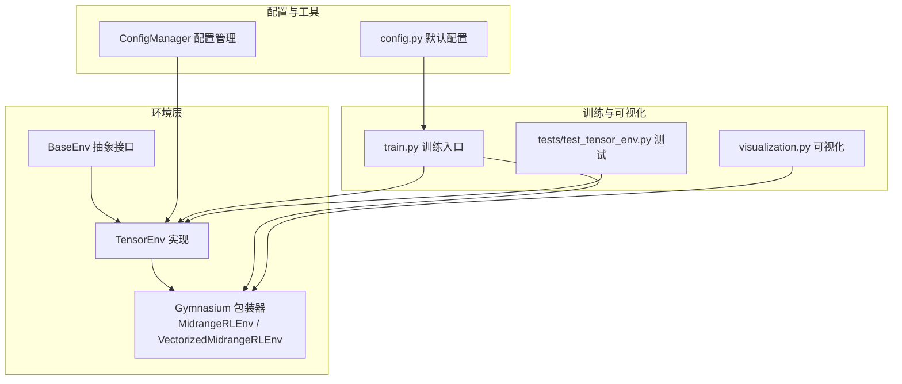
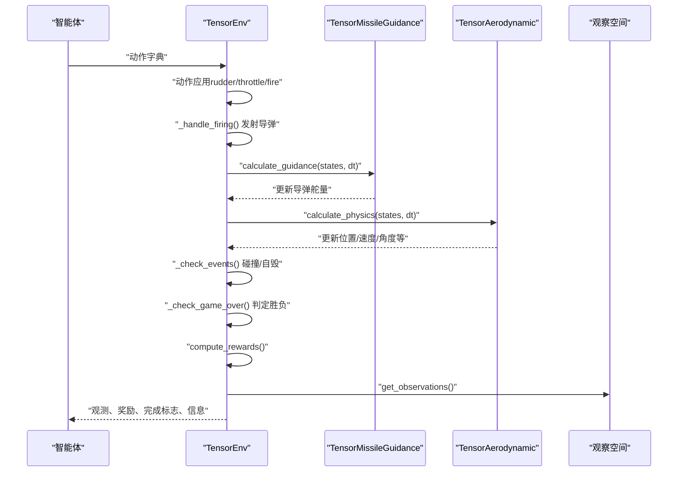
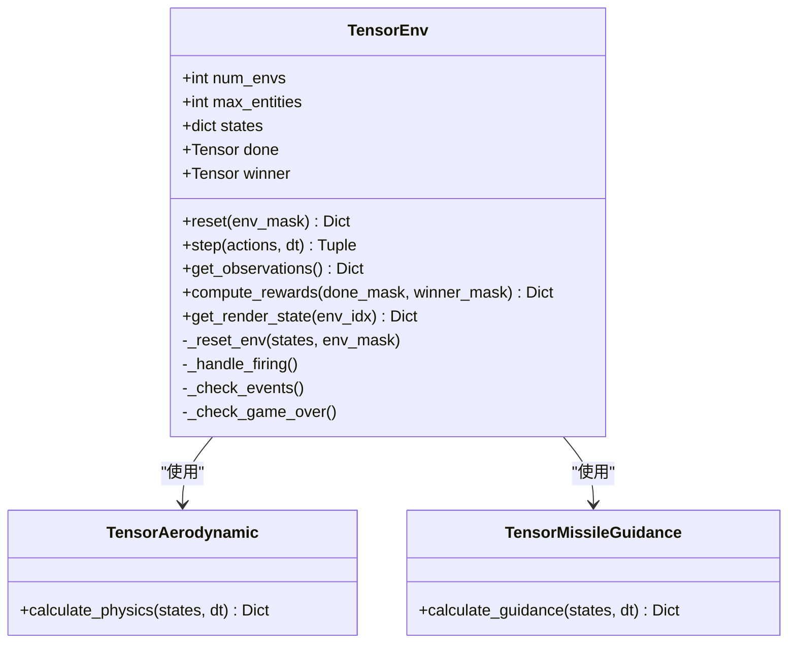
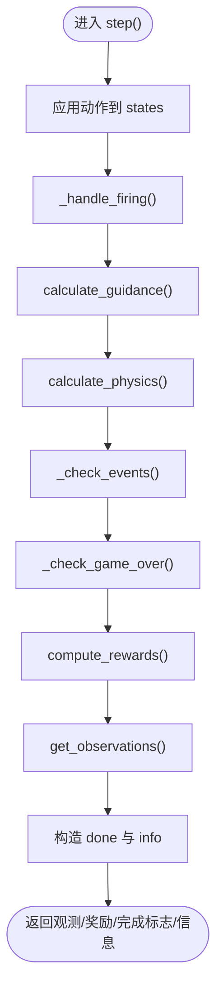
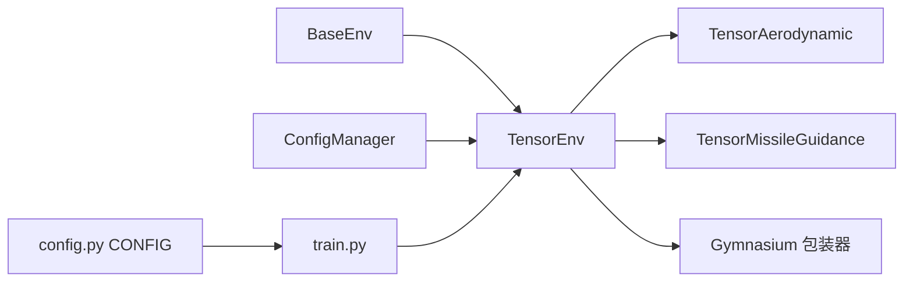

# Tensor环境

<cite>
**本文引用的文件**
- [env_gym/tensor_env.py](file://env_gym/tensor_env.py)
- [env_gym/base_env.py](file://env_gym/base_env.py)
- [env_gym/gym_wrapper.py](file://env_gym/gym_wrapper.py)
- [env_gym/config_manager.py](file://env_gym/config_manager.py)
- [env_gym/__init__.py](file://env_gym/__init__.py)
- [tests/test_tensor_env.py](file://tests/test_tensor_env.py)
- [train.py](file://train.py)
- [visualization.py](file://visualization.py)
- [config.py](file://config.py)
</cite>

## 目录
1. [简介](#简介)
2. [项目结构](#项目结构)
3. [核心组件](#核心组件)
4. [架构总览](#架构总览)
5. [详细组件分析](#详细组件分析)
6. [依赖关系分析](#依赖关系分析)
7. [性能考量](#性能考量)
8. [故障排查指南](#故障排查指南)
9. [结论](#结论)
10. [附录](#附录)

## 简介
本文件系统性阐述 Tensor 环境的设计与实现，重点说明 TensorEnv 如何基于 PyTorch 张量在 [num_envs, max_entities] 的统一状态张量上实现多环境并行训练。文档涵盖：
- 基于张量的状态管理机制与向量化计算
- reset() 与 step() 的完整流程：动作应用、导弹发射、制导计算、物理更新、事件检测、奖励计算
- 观察空间的归一化与相对位置编码策略
- get_render_state() 的单环境渲染状态生成
- 多环境训练的使用示例与单/多环境性能对比建议

## 项目结构
该项目围绕“环境”抽象构建，包含统一接口、Tensor 环境实现、Gymnasium 包装器、配置管理与训练脚本等模块。

图表来源
- [env_gym/base_env.py](file://env_gym/base_env.py#L12-L95)
- [env_gym/tensor_env.py](file://env_gym/tensor_env.py#L206-L772)
- [env_gym/gym_wrapper.py](file://env_gym/gym_wrapper.py#L15-L181)
- [env_gym/config_manager.py](file://env_gym/config_manager.py#L11-L102)
- [config.py](file://config.py#L46-L52)
- [train.py](file://train.py#L170-L374)
- [visualization.py](file://visualization.py#L8-L280)
- [tests/test_tensor_env.py](file://tests/test_tensor_env.py#L17-L139)

章节来源
- [env_gym/__init__.py](file://env_gym/__init__.py#L6-L18)

## 核心组件
- BaseEnv：定义统一的环境接口（reset、step、get_observations、compute_rewards、get_render_state 等），确保不同实现的一致性。
- TensorEnv：基于 PyTorch 张量的多环境并行实现，状态以 [num_envs, max_entities] 的张量组织，支持向量化动作应用、制导、物理更新与事件检测。
- TensorAerodynamic：气动与物理更新模块，面向多环境向量化计算。
- TensorMissileGuidance：导弹比例导引模块，面向多环境向量化制导。
- Gymnasium 包装器：MidrangeRLEnv 提供 Gymnasium 接口；VectorizedMidrangeRLEnv 保留多环境并行能力用于内部优化。
- ConfigManager：集中管理默认配置与加载/保存逻辑。
- 训练入口 train.py：演示多环境并行训练的主循环与参数配置。
- 可视化 visualization.py：提供渲染状态到屏幕绘制的桥接。

章节来源
- [env_gym/base_env.py](file://env_gym/base_env.py#L12-L95)
- [env_gym/tensor_env.py](file://env_gym/tensor_env.py#L206-L772)
- [env_gym/gym_wrapper.py](file://env_gym/gym_wrapper.py#L15-L181)
- [env_gym/config_manager.py](file://env_gym/config_manager.py#L11-L102)
- [train.py](file://train.py#L170-L374)
- [visualization.py](file://visualization.py#L8-L280)

## 架构总览
TensorEnv 将所有实体状态封装在一个统一的字典 states 中，键值均为 [num_envs, max_entities] 的张量。通过布尔掩码与索引选择，实现对“激活实体”的向量化操作，从而在单次 step 中完成多环境并行的物理更新、制导与事件检测。

图表来源
- [env_gym/tensor_env.py](file://env_gym/tensor_env.py#L351-L417)
- [env_gym/tensor_env.py](file://env_gym/tensor_env.py#L420-L502)
- [env_gym/tensor_env.py](file://env_gym/tensor_env.py#L503-L556)
- [env_gym/tensor_env.py](file://env_gym/tensor_env.py#L557-L591)
- [env_gym/tensor_env.py](file://env_gym/tensor_env.py#L593-L625)
- [env_gym/tensor_env.py](file://env_gym/tensor_env.py#L627-L685)

## 详细组件分析

### TensorEnv 类与状态张量结构
- 状态组织：states 字典中每个键都是 [num_envs, max_entities] 的张量，包含位置、速度、控制指令、目标索引、激活/导弹/玩家标记、速度/角度/过载/角速度等。
- 索引约定：P1_IDX=0、P2_IDX=1、FIRST_MISSILE_IDX=2，确保飞机与导弹槽位分离。
- 设备与形状：所有张量在构造时绑定到指定设备（如 CUDA），便于向量化计算。
- 初始化：_initialize_states() 负责分配并调用 _reset_env() 初始化双方飞机与初始导弹槽位。

图表来源
- [env_gym/tensor_env.py](file://env_gym/tensor_env.py#L206-L275)
- [env_gym/tensor_env.py](file://env_gym/tensor_env.py#L38-L118)
- [env_gym/tensor_env.py](file://env_gym/tensor_env.py#L134-L203)

章节来源
- [env_gym/tensor_env.py](file://env_gym/tensor_env.py#L206-L275)
- [env_gym/tensor_env.py](file://env_gym/tensor_env.py#L277-L349)
- [env_gym/tensor_env.py](file://env_gym/tensor_env.py#L250-L275)

### reset() 方法
- 输入：可选 env_mask 指定需要重置的环境集合。
- 行为：将被选中的环境重置为非激活状态，初始化双方飞机的位置、速度、控制指令、导弹数量与存活标记；随后重置其余槽位为默认值。
- 输出：返回初始观察空间（归一化后的 P1/P2 观测）。

章节来源
- [env_gym/tensor_env.py](file://env_gym/tensor_env.py#L340-L349)
- [env_gym/tensor_env.py](file://env_gym/tensor_env.py#L277-L349)

### step() 方法
- 动作应用：将动作字典转换为 [num_envs] 的张量，分别写入 P1/P2 的 rudder、throttle、fire_command。
- 导弹发射：_handle_firing() 检查可发射条件，寻找可用槽位，按需创建导弹实体并初始化其状态（位置、速度、目标、制导角度等）。
- 制导计算：TensorMissileGuidance.calculate_guidance() 对所有激活导弹计算视线角速度与制导舵量。
- 物理更新：TensorAerodynamic.calculate_physics() 基于 rudder、throttle、is_missile 等参数进行向量化物理积分。
- 事件检测：_check_events() 检测命中与自毁，更新 is_active/alive 状态。
- 游戏结束：_check_game_over() 判定双方存活、弹药耗尽与在途导弹情况，确定胜负。
- 奖励计算：compute_rewards() 根据胜负与生存状态计算奖励。
- 观察生成：get_observations() 返回归一化后的 P1/P2 观测。
- 信息返回：包含 winner、双方存活状态等。

图表来源
- [env_gym/tensor_env.py](file://env_gym/tensor_env.py#L351-L417)
- [env_gym/tensor_env.py](file://env_gym/tensor_env.py#L420-L502)
- [env_gym/tensor_env.py](file://env_gym/tensor_env.py#L503-L556)
- [env_gym/tensor_env.py](file://env_gym/tensor_env.py#L557-L591)
- [env_gym/tensor_env.py](file://env_gym/tensor_env.py#L593-L625)
- [env_gym/tensor_env.py](file://env_gym/tensor_env.py#L627-L685)

章节来源
- [env_gym/tensor_env.py](file://env_gym/tensor_env.py#L351-L417)

### 导弹发射处理（_handle_firing）
- 条件：飞机处于激活状态且非导弹、fire_command 为真、导弹数量大于 0。
- 槽位分配：为每个可发射飞机寻找可用槽位（非激活实体），按顺序分配导弹槽位。
- 初始化：复制源飞机的速度作为导弹初速，计算发射偏移位置，设定目标为对方飞机，初始化 engine_time、target_idx、prev_los_angle 等。
- 弹药消耗：每发射一枚导弹，对应飞机的 missile_count 减一，fire_command 复位。

章节来源
- [env_gym/tensor_env.py](file://env_gym/tensor_env.py#L420-L502)

### 制导计算（TensorMissileGuidance）
- 目标有效性：检查导弹目标索引有效且目标处于激活状态。
- 相对几何：计算导弹与目标的 dx/dy，得到当前视线角与视线角速度。
- 制导指令：根据比例导引增益计算舵量，限制在 [-1, 1]，更新 prev_los_angle 与 rudder。

章节来源
- [env_gym/tensor_env.py](file://env_gym/tensor_env.py#L134-L203)

### 物理更新（TensorAerodynamic）
- 参数选择：根据 is_missile 标记在飞机与导弹参数之间切换（终端速度、最小转弯半径、升阻比、推力等）。
- 推力/阻力：计算推力加速度与阻力加速度，合成总加速度矢量。
- 积分：对 vx/vy 进行积分得到新速度，再对 x/y 积分得到新位置。
- 标量更新：计算速度、角度、过载、角速度等辅助标量，并仅对激活实体更新。

章节来源
- [env_gym/tensor_env.py](file://env_gym/tensor_env.py#L38-L118)

### 事件检测与游戏结束
- 命中检测：计算导弹与目标之间的距离平方，若小于阈值且目标存活则双方失效。
- 自毁检测：若导弹速度过低且仍在激活状态，则自毁。
- 结束判定：双方均阵亡、仅一方阵亡、双方弹药耗尽且无在途导弹，或双方同时阵亡，分别赋值 done 与 winner。

章节来源
- [env_gym/tensor_env.py](file://env_gym/tensor_env.py#L503-L556)
- [env_gym/tensor_env.py](file://env_gym/tensor_env.py#L557-L591)

### 奖励计算
- 胜负奖励：根据 done_mask 与 winner_mask 分配 win/lose/draw 奖励。
- 生存奖励：对未完成的环境中存活的飞机给予微小正奖励，鼓励生存。

章节来源
- [env_gym/tensor_env.py](file://env_gym/tensor_env.py#L593-L625)

### 观察空间与归一化
- 归一化策略：位置除以 battlefield_size，速度除以 400，导弹数量除以 initial_missiles，角度归一化到 [0,1] 或 [-1,1] 区间。
- 相对位置：计算 P2 相对于 P1 的 dx/dy，得到距离与相对方位角，再转换为相对角度（以 P1 航向为基准）。
- 观测键：包含己方位置、角度、速度、导弹数量、存活状态，以及敌方相对距离、相对角度、速度、存活状态。

章节来源
- [env_gym/tensor_env.py](file://env_gym/tensor_env.py#L627-L685)

### 渲染状态（get_render_state）
- 单环境渲染：将 states 中的 P1/P2 飞机与激活导弹提取为可渲染对象，包含位置、角度、速度、存活/激活、颜色、轨迹、舵量、油门、角速度、导弹数量、马赫数、过载等。
- 返回结构：包含 aircraft1、aircraft2、missiles、game_over、winner 字段，便于可视化模块直接消费。

章节来源
- [env_gym/tensor_env.py](file://env_gym/tensor_env.py#L687-L758)

## 依赖关系分析
- TensorEnv 继承 BaseEnv，实现统一接口。
- TensorEnv 依赖 TensorAerodynamic 与 TensorMissileGuidance 进行物理与制导计算。
- Gymnasium 包装器提供 Gymnasium 接口与向量化包装器，便于与 RL 训练框架集成。
- ConfigManager 提供默认配置与加载/保存能力，train.py 使用 config.py 的 CONFIG 作为默认配置。

图表来源
- [env_gym/base_env.py](file://env_gym/base_env.py#L12-L95)
- [env_gym/tensor_env.py](file://env_gym/tensor_env.py#L206-L241)
- [env_gym/gym_wrapper.py](file://env_gym/gym_wrapper.py#L15-L181)
- [env_gym/config_manager.py](file://env_gym/config_manager.py#L11-L102)
- [config.py](file://config.py#L46-L52)
- [train.py](file://train.py#L350-L354)

章节来源
- [env_gym/__init__.py](file://env_gym/__init__.py#L6-L18)

## 性能考量
- 向量化优先：所有状态与操作均以张量形式进行，避免 Python 循环，充分利用 GPU 并行。
- 掩码与索引：通过布尔掩码与 nonzero 索引选择激活实体，减少无效计算。
- 设备一致性：状态与计算均在指定设备上执行，避免频繁主机/设备拷贝。
- 事件检测：仅对激活导弹进行命中与自毁检测，降低计算量。
- 观察归一化：统一缩放减少数值不稳定风险，提升学习稳定性。

[本节为通用性能讨论，不直接分析特定文件]

## 故障排查指南
- 环境重置异常：确认 env_mask 类型与设备一致，确保 _reset_env() 能正确写入 P1/P2 初始状态。
- 动作越界：step() 中对 rudder 限制在 [-1,1]，throttle 限制在 [0,1]，检查输入张量是否正确。
- 导弹发射失败：检查 fire_command、missile_count、is_active 与槽位可用性；确认 _handle_firing() 的可用槽位查找逻辑。
- 制导无效：确认导弹 is_active 且目标有效；检查目标索引与目标 is_active。
- 命中误判：检查 hit_radius 与距离平方比较逻辑；确认目标存活标志。
- 观察维度不匹配：核对 get_observations() 返回的键与形状，确保与智能体期望一致。

章节来源
- [env_gym/tensor_env.py](file://env_gym/tensor_env.py#L351-L417)
- [env_gym/tensor_env.py](file://env_gym/tensor_env.py#L420-L502)
- [env_gym/tensor_env.py](file://env_gym/tensor_env.py#L503-L556)
- [env_gym/tensor_env.py](file://env_gym/tensor_env.py#L627-L685)

## 结论
TensorEnv 通过统一的 [num_envs, max_entities] 张量状态结构，结合布尔掩码与索引选择，实现了高效的多环境并行训练。其向量化动作应用、制导与物理更新、事件检测与奖励计算，构成完整的 RL 训练闭环。配合 Gymnasium 包装器与训练脚本，可快速开展大规模并行训练。get_render_state() 为可视化提供简洁的单环境渲染状态，便于调试与展示。

[本节为总结性内容，不直接分析特定文件]

## 附录

### 多环境训练使用示例
- 基本用法：在训练入口中创建 TensorEnv（指定 num_envs 与 device），在主循环中交替调用两个智能体的 act()，构造完整动作字典，传入 env.step()，合并环境奖励与自定义奖励，按 done_mask 重置完成的环境。
- 示例路径：
  - 训练入口与主循环：[train.py](file://train.py#L170-L327)
  - 环境创建与参数：[train.py](file://train.py#L350-L354)
  - 测试脚本（单/多环境与发射测试）：[tests/test_tensor_env.py](file://tests/test_tensor_env.py#L17-L139)

章节来源
- [train.py](file://train.py#L170-L327)
- [tests/test_tensor_env.py](file://tests/test_tensor_env.py#L17-L139)

### 单环境 vs 多环境性能差异
- 单环境（num_envs=1）：适合调试与小规模实验，计算开销较小，但样本效率低。
- 多环境（num_envs>1）：显著提升样本收集效率，GPU 并行优势明显，适合大规模 RL 训练。
- 建议：在具备足够显存的前提下，优先使用较大的 num_envs；若显存受限，可适当降低 num_envs 或增大 batch 步长。

[本节为通用建议，不直接分析特定文件]