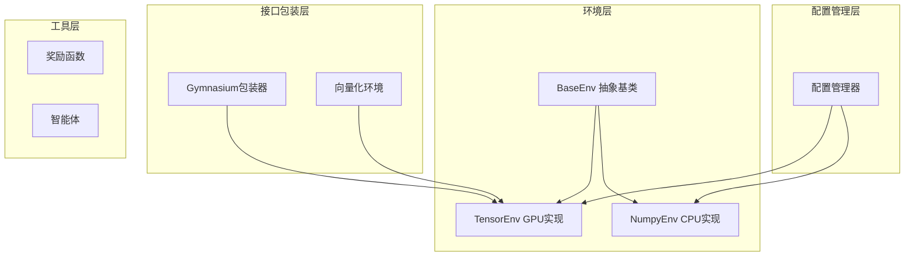
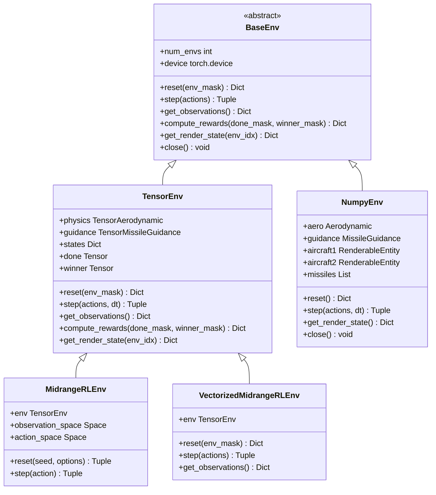
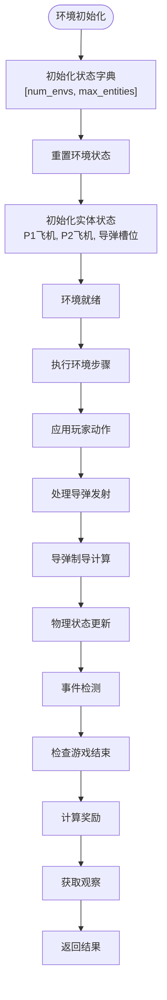
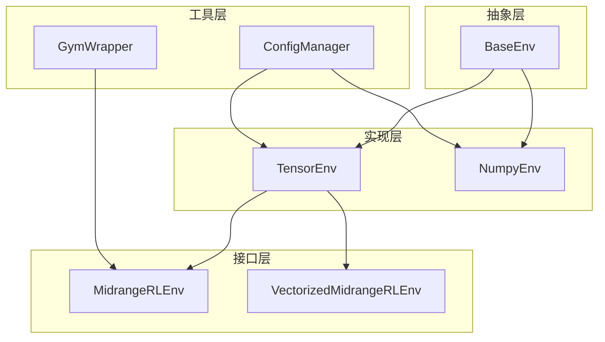

# 基础环境

<cite>
**本文档引用的文件**
- [env_gym/base_env.py](file://env_gym/base_env.py)
- [env_gym/tensor_env.py](file://env_gym/tensor_env.py)
- [env_gym/gym_wrapper.py](file://env_gym/gym_wrapper.py)
- [env_gym/config_manager.py](file://env_gym/config_manager.py)
- [env_numpy/numpy_env.py](file://env_numpy/numpy_env.py)
- [README.md](file://README.md)
- [tests/test_tensor_env.py](file://tests/test_tensor_env.py)
- [env_gym/__init__.py](file://env_gym/__init__.py)
- [env_numpy/__init__.py](file://env_numpy/__init__.py)
</cite>

## 目录
1. [简介](#简介)
2. [项目结构](#项目结构)
3. [核心组件](#核心组件)
4. [架构概览](#架构概览)
5. [详细组件分析](#详细组件分析)
6. [依赖关系分析](#依赖关系分析)
7. [性能考虑](#性能考虑)
8. [故障排除指南](#故障排除指南)
9. [结论](#结论)

## 简介

基础环境（BaseEnv）是midrangeRL项目中强化学习环境的核心抽象层，它定义了所有环境实现必须遵循的标准接口契约。该抽象基类作为TensorEnv和潜在其他环境实现的共同父类，确保了不同后端（如tensor和numpy）的环境实现能够被统一调用，实现了代码复用和接口一致性。

BaseEnv的设计目的是为强化学习环境提供一个标准化的接口规范，使得开发者可以轻松地在不同的环境实现之间切换，而无需修改上层的训练代码。这种设计特别适用于双后端架构，其中TensorEnv提供高性能的GPU并行计算能力，而NumpyEnv提供稳定的CPU单环境实现用于可视化验证。

## 项目结构

该项目采用模块化的双后端架构设计，主要包含以下核心模块：

**图表来源**
- [env_gym/base_env.py](file://env_gym/base_env.py#L12-L95)
- [env_gym/tensor_env.py](file://env_gym/tensor_env.py#L206-L242)
- [env_gym/gym_wrapper.py](file://env_gym/gym_wrapper.py#L15-L47)

**章节来源**
- [README.md](file://README.md#L64-L95)
- [env_gym/__init__.py](file://env_gym/__init__.py#L6-L18)
- [env_numpy/__init__.py](file://env_numpy/__init__.py#L7-L18)

## 核心组件

### BaseEnv抽象基类

BaseEnv是整个环境系统的抽象基类，定义了强化学习环境中必须实现的核心方法契约。该类通过Python的abc模块实现了真正的抽象方法，确保所有子类都必须实现这些方法。

#### 核心方法定义

BaseEnv定义了四个必须实现的抽象方法：

1. **reset()** - 环境重置方法
2. **step()** - 环境执行一步的方法  
3. **get_observations()** - 获取当前观察空间的方法
4. **compute_rewards()** - 计算奖励的方法

此外，BaseEnv还提供了两个可选的抽象方法：

1. **get_render_state()** - 获取渲染状态的方法（默认抛出NotImplementedError）
2. **close()** - 关闭环境释放资源的方法（默认空实现）

#### 属性系统

BaseEnv提供了两个重要的属性：

1. **num_envs** - 返回并行环境数量，默认为1
2. **device** - 返回计算设备，默认为CPU设备

**章节来源**
- [env_gym/base_env.py](file://env_gym/base_env.py#L12-L95)

### TensorEnv实现

TensorEnv是BaseEnv的具体实现，专门针对GPU并行计算进行了优化。它支持多环境并行（num_envs），使用统一的实体槽位系统，实现了完整的RL接口。

#### 主要特性

1. **多环境并行** - 支持数千个环境同时运行
2. **统一实体槽位系统** - 充分利用GPU并行能力
3. **完整的RL接口** - 包含奖励函数、观察空间
4. **高性能物理计算** - 使用PyTorch张量进行批量计算

**章节来源**
- [env_gym/tensor_env.py](file://env_gym/tensor_env.py#L206-L242)
- [README.md](file://README.md#L91-L94)

### NumpyEnv实现

NumpyEnv是BaseEnv的另一个具体实现，专门为CPU单环境计算设计，主要用于可视化验证和手动对抗游戏。

#### 主要特性

1. **CPU单环境实现** - 稳定可靠
2. **可视化支持** - 专为游戏演示设计
3. **简化逻辑** - 相比TensorEnv更加简洁
4. **手动控制** - 支持人类玩家参与

**章节来源**
- [env_numpy/numpy_env.py](file://env_numpy/numpy_env.py#L49-L95)

## 架构概览

BaseEnv作为整个环境系统的抽象层，建立了清晰的层次结构：

**图表来源**
- [env_gym/base_env.py](file://env_gym/base_env.py#L12-L95)
- [env_gym/tensor_env.py](file://env_gym/tensor_env.py#L206-L242)
- [env_numpy/numpy_env.py](file://env_numpy/numpy_env.py#L49-L95)
- [env_gym/gym_wrapper.py](file://env_gym/gym_wrapper.py#L15-L47)

## 详细组件分析

### BaseEnv接口契约详解

BaseEnv定义了强化学习环境的标准接口契约，确保了不同环境实现之间的兼容性。

#### reset()方法规范

reset()方法负责将环境重置到初始状态，支持可选的环境掩码参数来指定需要重置的特定环境。

**预期行为：**
- 清除所有环境状态
- 初始化新的随机状态
- 支持部分环境重置（通过env_mask参数）
- 返回初始观察空间

**返回值规范：**
- 类型：Dict[str, torch.Tensor]
- 结构：包含p1和p2玩家的观察空间
- 形状：[num_envs, ...]，其中num_envs为并行环境数量

#### step()方法规范

step()方法执行环境的一次状态更新，这是强化学习中最核心的方法。

**输入参数规范：**
- 类型：Dict[str, torch.Tensor]
- 键：'p1_rudder', 'p1_throttle', 'p1_fire', 'p2_rudder', 'p2_throttle', 'p2_fire'
- 形状：每个张量的形状为[num_envs]

**预期行为：**
- 应用玩家动作
- 更新物理状态
- 检测游戏事件
- 计算奖励
- 检查游戏结束条件

**返回值规范：**
- 观察空间：Dict[str, Dict[str, torch.Tensor]]
- 奖励：Dict[str, torch.Tensor]，键为'p1'和'p2'
- 完成标志：torch.Tensor，形状为[num_envs]
- 信息字典：Dict[str, Any]

#### get_observations()方法规范

get_observations()方法返回当前环境状态的观察表示，这是智能体决策的基础。

**预期行为：**
- 提供归一化的状态信息
- 包含相对位置和相对角度
- 包含敌我双方的状态信息
- 支持批量环境的观察

**返回值规范：**
- 类型：Dict[str, Dict[str, torch.Tensor]]
- 结构：{'p1': {...}, 'p2': {...}}
- 每个玩家的观察包含：x, y, angle, speed, missiles, alive, enemy_distance, enemy_relative_angle, enemy_speed, enemy_alive

#### compute_rewards()方法规范

compute_rewards()方法计算基于环境状态的奖励信号，这是强化学习的核心反馈机制。

**输入参数规范：**
- done_mask：完成环境的掩码
- winner_mask：可选的胜利者掩码

**预期行为：**
- 基于游戏结束条件计算奖励
- 考虑生存奖励
- 处理平局情况
- 支持批量环境的奖励计算

**返回值规范：**
- 类型：Dict[str, torch.Tensor]
- 键：'p1'和'p2'
- 形状：[num_envs]

**章节来源**
- [env_gym/base_env.py](file://env_gym/base_env.py#L15-L64)

### TensorEnv实现分析

TensorEnv是BaseEnv的高性能GPU实现，专门针对强化学习训练进行了优化。

#### 状态管理系统

TensorEnv使用统一的状态字典来管理所有实体的状态，包括飞机、导弹等。

**图表来源**
- [env_gym/tensor_env.py](file://env_gym/tensor_env.py#L250-L417)

#### 物理计算模块

TensorEnv包含两个主要的物理计算模块：

1. **TensorAerodynamic** - 气动力学计算模块
2. **TensorMissileGuidance** - 导弹制导模块

这两个模块都支持多环境并行计算，使用PyTorch张量进行高效的批量运算。

**章节来源**
- [env_gym/tensor_env.py](file://env_gym/tensor_env.py#L15-L118)
- [env_gym/tensor_env.py](file://env_gym/tensor_env.py#L121-L204)

### Gymnasium包装器

为了与Gymnasium生态系统兼容，项目提供了两个包装器类：

#### MidrangeRLEnv

MidrangeRLEnv是标准的Gymnasium环境包装器，支持单环境模式。

#### VectorizedMidrangeRLEnv

VectorizedMidrangeRLEnv是向量化环境包装器，专门用于多环境并行训练。

**章节来源**
- [env_gym/gym_wrapper.py](file://env_gym/gym_wrapper.py#L15-L181)

## 依赖关系分析

BaseEnv系统建立了清晰的依赖关系层次：

**图表来源**
- [env_gym/base_env.py](file://env_gym/base_env.py#L12-L95)
- [env_gym/tensor_env.py](file://env_gym/tensor_env.py#L206-L242)
- [env_gym/gym_wrapper.py](file://env_gym/gym_wrapper.py#L15-L47)
- [env_gym/config_manager.py](file://env_gym/config_manager.py#L11-L102)

### 双后端架构的优势

双后端架构通过BaseEnv抽象层实现了以下优势：

1. **代码复用** - 上层训练代码无需修改即可在不同后端间切换
2. **接口一致性** - 所有环境实现遵循相同的接口契约
3. **性能优化** - TensorEnv专注于高性能GPU计算，NumpyEnv专注于稳定性
4. **开发效率** - 支持并行训练和可视化验证两种不同的开发需求

**章节来源**
- [README.md](file://README.md#L96-L104)

## 性能考虑

### GPU并行优化

TensorEnv通过以下方式实现高性能：

1. **批量张量计算** - 使用PyTorch张量进行批量物理计算
2. **内存优化** - 统一的状态字典减少了内存碎片
3. **向量化操作** - 避免Python循环，充分利用GPU并行能力

### 内存管理

BaseEnv提供了标准的资源管理接口：

- **close()方法** - 释放环境占用的GPU/CPU内存
- **设备属性** - 明确指定计算设备，避免设备不匹配问题

## 故障排除指南

### 常见问题及解决方案

#### 环境重置问题

**问题**：环境重置后状态异常
**解决方案**：检查env_mask参数是否正确传递，确保重置逻辑覆盖所有必要的状态字段

#### 性能问题

**问题**：训练速度慢
**解决方案**：确认使用TensorEnv而非NumpyEnv，检查GPU内存使用情况，适当调整num_envs参数

#### 接口不兼容

**问题**：自定义环境无法通过BaseEnv测试
**解决方案**：确保实现所有抽象方法，检查返回值类型和形状是否符合规范

**章节来源**
- [tests/test_tensor_env.py](file://tests/test_tensor_env.py#L17-L139)

## 结论

BaseEnv抽象基类的设计成功地解决了强化学习环境实现中的接口标准化问题。通过定义清晰的方法契约和属性规范，它实现了以下目标：

1. **接口一致性** - 确保所有环境实现遵循相同的标准
2. **代码复用** - 支持不同后端的环境实现被统一调用
3. **可扩展性** - 为未来添加新的环境实现提供了清晰的框架
4. **双后端支持** - 平衡了性能和稳定性需求

BaseEnv的设计体现了良好的软件工程实践，通过抽象层分离了具体的实现细节，使得上层的训练代码、智能体算法和可视化工具都能独立发展，同时保持高度的兼容性和互操作性。

这种架构不仅适用于当前的midrangeRL项目，也为构建更复杂的强化学习系统提供了坚实的基础。通过继续遵循BaseEnv的接口契约，开发者可以轻松地扩展系统以支持更多的环境类型、智能体算法和可视化需求。