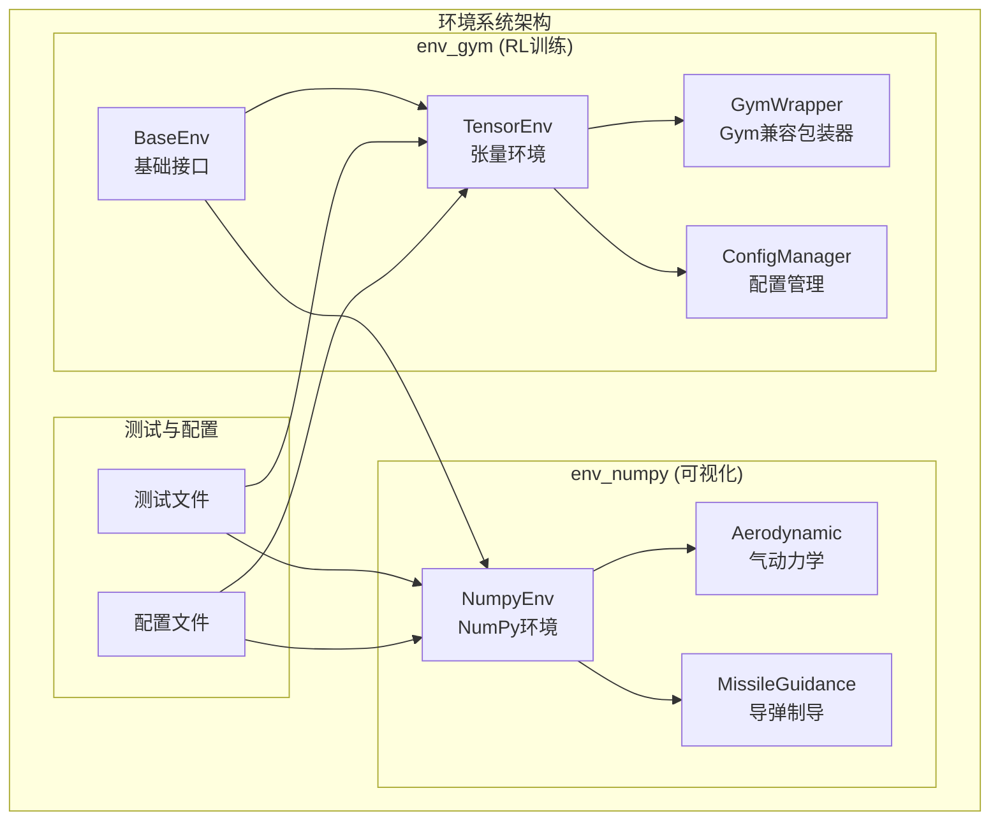
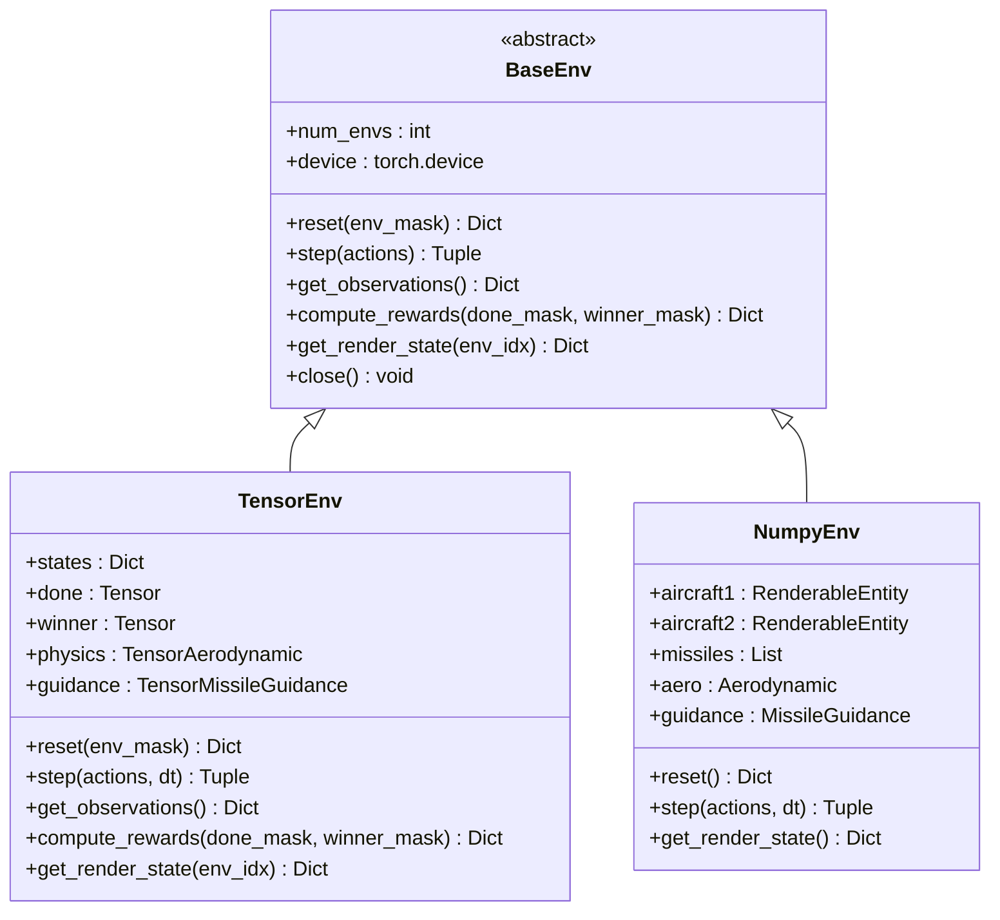
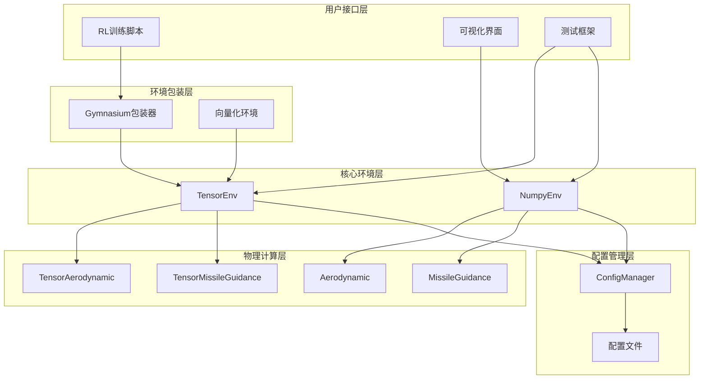
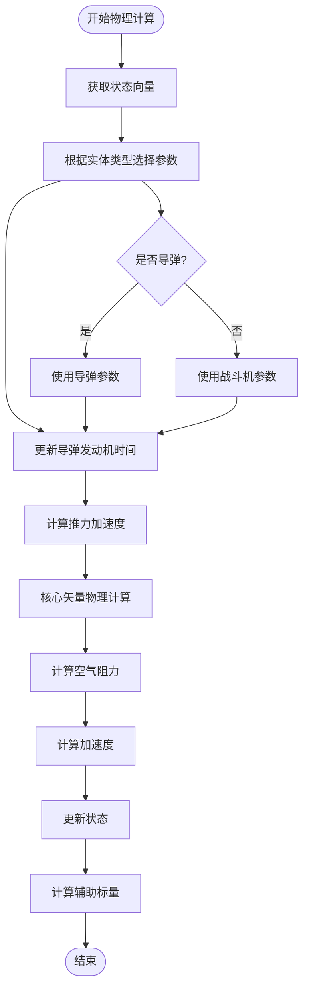
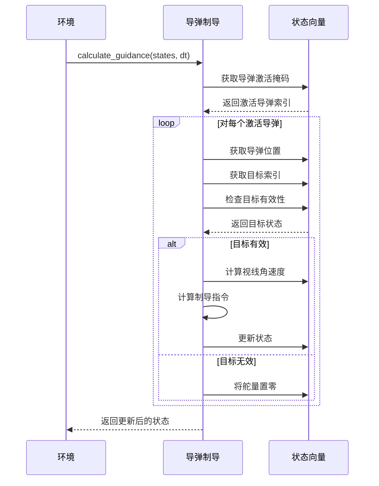
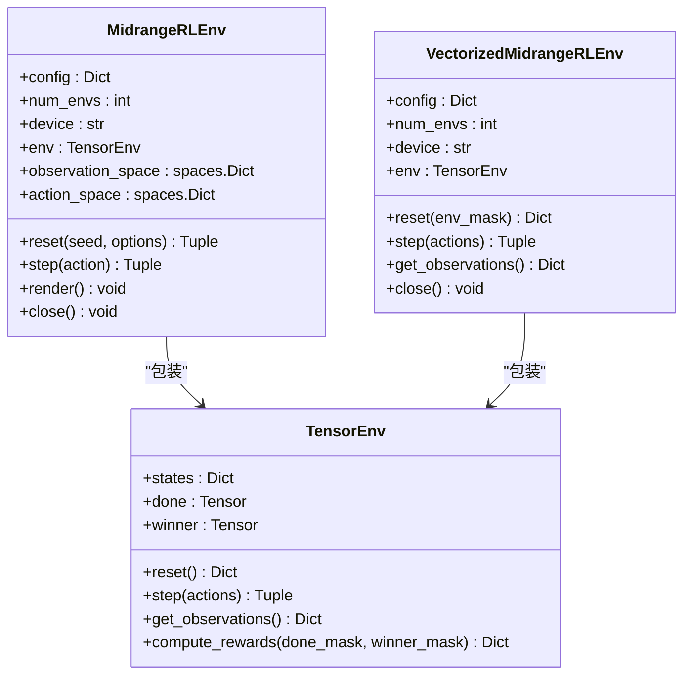
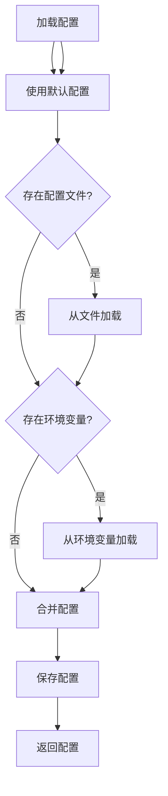
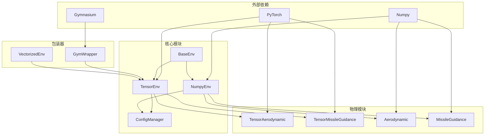
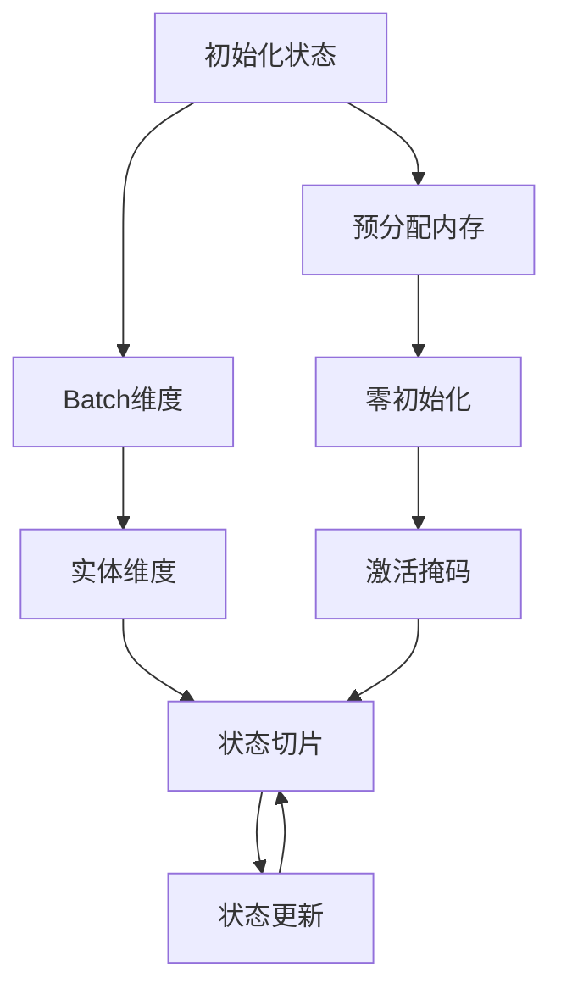

# 环境系统

<cite>
**本文档引用的文件**
- [base_env.py](file://env_gym/base_env.py)
- [tensor_env.py](file://env_gym/tensor_env.py)
- [numpy_env.py](file://env_numpy/numpy_env.py)
- [gym_wrapper.py](file://env_gym/gym_wrapper.py)
- [config_manager.py](file://env_gym/config_manager.py)
- [aerodynamic.py](file://env_numpy/aerodynamic.py)
- [missile_guidance.py](file://env_numpy/missile_guidance.py)
- [test_tensor_env.py](file://tests/test_tensor_env.py)
- [config.py](file://config.py)
- [README.md](file://README.md)
</cite>

## 目录
1. [简介](#简介)
2. [项目结构](#项目结构)
3. [核心组件](#核心组件)
4. [架构概览](#架构概览)
5. [详细组件分析](#详细组件分析)
6. [依赖关系分析](#依赖关系分析)
7. [性能考虑](#性能考虑)
8. [故障排除指南](#故障排除指南)
9. [结论](#结论)

## 简介

环境系统是midrangeRL项目的核心基础设施，为强化学习训练和可视化游戏提供了统一的环境抽象。该系统采用双后端架构设计，既支持基于PyTorch的高性能张量并行化环境（env_gym），也支持基于NumPy的高精度物理模拟环境（env_numpy）。

**主要特性：**
- **统一接口设计**：通过BaseEnv基类定义标准化的环境接口
- **双后端架构**：PyTorch张量环境用于大规模强化学习训练，NumPy环境用于高精度物理模拟
- **张量并行化**：支持数千个环境同时运行，充分利用GPU计算能力
- **Gymnasium兼容**：提供标准的OpenAI Gym接口，便于集成主流RL库
- **集中配置管理**：统一的配置管理系统确保参数一致性

## 项目结构

项目采用模块化设计，将不同的环境实现分离到独立的包中：

**图表来源**
- [base_env.py](file://env_gym/base_env.py#L12-L95)
- [tensor_env.py](file://env_gym/tensor_env.py#L206-L772)
- [numpy_env.py](file://env_numpy/numpy_env.py#L49-L365)

**章节来源**
- [README.md](file://README.md#L64-L88)

## 核心组件

### BaseEnv 基础接口

BaseEnv定义了所有环境实现必须遵循的标准接口，确保了环境系统的统一性和可扩展性：

**图表来源**
- [base_env.py](file://env_gym/base_env.py#L12-L95)
- [tensor_env.py](file://env_gym/tensor_env.py#L206-L772)
- [numpy_env.py](file://env_numpy/numpy_env.py#L49-L365)

**章节来源**
- [base_env.py](file://env_gym/base_env.py#L12-L95)

### TensorEnv 张量环境

TensorEnv是基于PyTorch的高性能环境实现，专门用于大规模强化学习训练：

**核心特性：**
- **多环境并行**：支持数千个环境同时运行
- **统一实体槽位系统**：充分利用GPU并行能力
- **完整的RL接口**：包含奖励函数和观察空间
- **张量并行化物理计算**：所有物理计算都基于张量运算

**章节来源**
- [tensor_env.py](file://env_gym/tensor_env.py#L206-L772)

### NumpyEnv NumPy环境

NumpyEnv是基于NumPy的环境实现，专注于高精度物理模拟和可视化：

**核心特性：**
- **高精度物理计算**：使用纯Python实现，数值稳定性更好
- **完整的可视化支持**：提供详细的渲染状态
- **稳定的单环境运行**：适合调试和演示
- **详细的轨迹记录**：支持战斗回放功能

**章节来源**
- [numpy_env.py](file://env_numpy/numpy_env.py#L49-L365)

## 架构概览

环境系统采用分层架构设计，确保了清晰的职责分离和良好的可扩展性：

**图表来源**
- [gym_wrapper.py](file://env_gym/gym_wrapper.py#L15-L181)
- [tensor_env.py](file://env_gym/tensor_env.py#L206-L772)
- [numpy_env.py](file://env_numpy/numpy_env.py#L49-L365)
- [config_manager.py](file://env_gym/config_manager.py#L11-L102)

## 详细组件分析

### TensorAerodynamic 气动力学模块

TensorAerodynamic实现了基于张量的气动力学计算，支持多环境并行：

**图表来源**
- [tensor_env.py](file://env_gym/tensor_env.py#L38-L118)

**章节来源**
- [tensor_env.py](file://env_gym/tensor_env.py#L15-L119)

### TensorMissileGuidance 导弹制导模块

TensorMissileGuidance实现了基于张量的导弹制导算法：

**图表来源**
- [tensor_env.py](file://env_gym/tensor_env.py#L134-L203)

**章节来源**
- [tensor_env.py](file://env_gym/tensor_env.py#L121-L204)

### GymWrapper Gymnasium兼容包装器

GymWrapper提供了标准的OpenAI Gym接口，便于集成主流RL库：

**图表来源**
- [gym_wrapper.py](file://env_gym/gym_wrapper.py#L15-L181)

**章节来源**
- [gym_wrapper.py](file://env_gym/gym_wrapper.py#L15-L181)

### ConfigManager 配置管理系统

ConfigManager提供了统一的配置管理机制，确保不同后端之间的一致性：

**图表来源**
- [config_manager.py](file://env_gym/config_manager.py#L48-L95)

**章节来源**
- [config_manager.py](file://env_gym/config_manager.py#L11-L102)

## 依赖关系分析

环境系统具有清晰的依赖层次结构，确保了模块间的松耦合：

**图表来源**
- [tensor_env.py](file://env_gym/tensor_env.py#L9-L12)
- [numpy_env.py](file://env_numpy/numpy_env.py#L12-L13)
- [gym_wrapper.py](file://env_gym/gym_wrapper.py#L7-L12)

**章节来源**
- [tensor_env.py](file://env_gym/tensor_env.py#L9-L12)
- [numpy_env.py](file://env_numpy/numpy_env.py#L12-L13)
- [gym_wrapper.py](file://env_gym/gym_wrapper.py#L7-L12)

## 性能考虑

### 张量并行化优势

TensorEnv通过以下机制实现高性能：

1. **批量计算**：所有环境状态在同一张量中处理
2. **GPU加速**：利用CUDA并行计算能力
3. **内存优化**：统一的实体槽位系统减少内存碎片
4. **向量化操作**：避免Python循环，使用高效的张量运算

### 内存管理策略

**章节来源**
- [tensor_env.py](file://env_gym/tensor_env.py#L250-L275)

### 数据同步与状态一致性

系统通过以下机制确保不同后端之间的数据一致性：

1. **统一配置源**：所有模块使用相同的配置字典
2. **标准化接口**：BaseEnv定义的统一接口确保行为一致性
3. **状态映射规则**：明确的实体状态映射规则
4. **边界条件处理**：一致的边界检测和处理逻辑

## 故障排除指南

### 常见问题诊断

**问题1：GPU内存不足**
- 检查num_envs参数设置
- 确认max_entities_per_env配置
- 验证设备可用性

**问题2：环境重置异常**
- 检查env_mask参数格式
- 验证配置参数完整性
- 确认设备设置正确

**问题3：物理计算不稳定**
- 检查时间步长设置
- 验证参数范围合理性
- 确认数值精度设置

### 调试工具

系统提供了多种调试和测试工具：

**章节来源**
- [test_tensor_env.py](file://tests/test_tensor_env.py#L17-L139)

## 结论

midrangeRL的环境系统通过精心设计的双后端架构，成功平衡了性能和精度的需求。TensorEnv为大规模强化学习训练提供了强大的GPU加速能力，而NumpyEnv则确保了高精度的物理模拟和稳定的可视化体验。

**系统优势：**
- **统一接口**：BaseEnv确保了环境的一致性和可扩展性
- **双后端设计**：满足不同应用场景的需求
- **高性能实现**：TensorEnv支持数千个环境并行运行
- **易于集成**：GymWrapper提供标准的OpenAI Gym接口
- **配置管理**：ConfigManager确保参数一致性

**未来发展方向：**
- 扩展更多物理模块
- 优化内存使用效率
- 增强可视化功能
- 支持更多RL算法框架

该环境系统为中距空战AI强化学习提供了一个强大而灵活的基础平台，既适合学术研究，也适合实际应用开发。