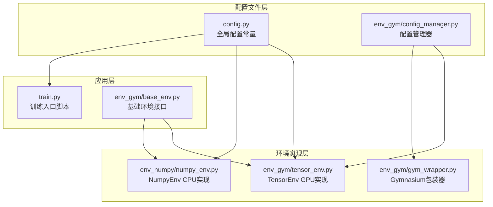
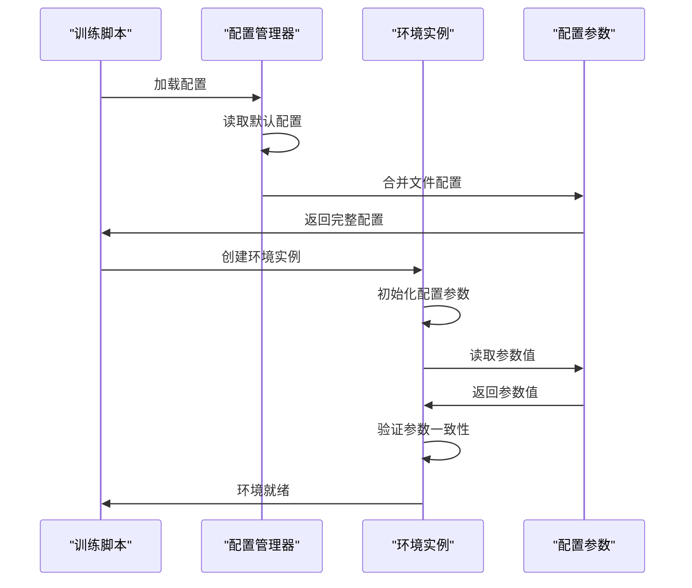
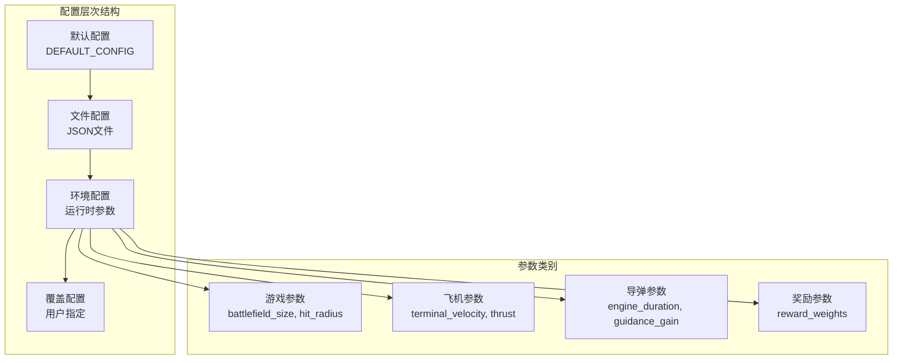
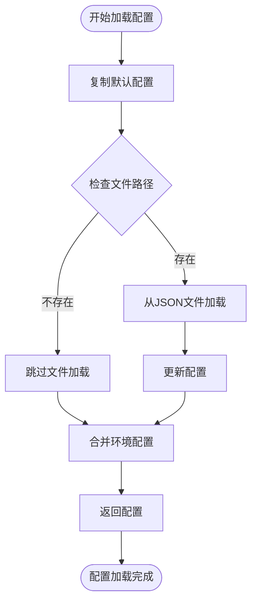
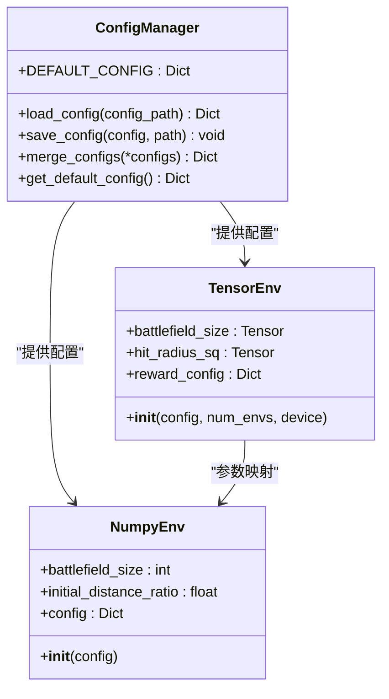
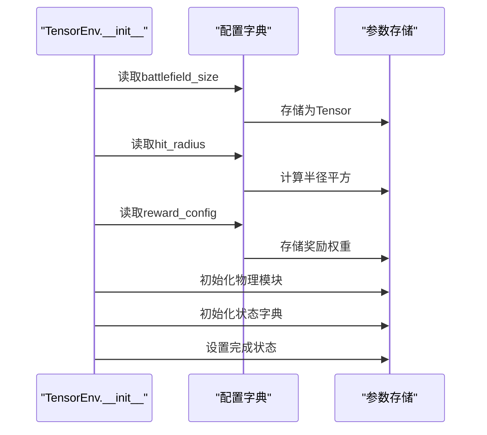
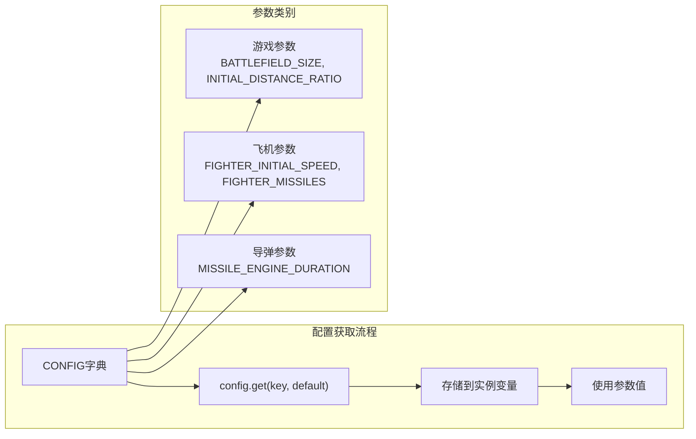
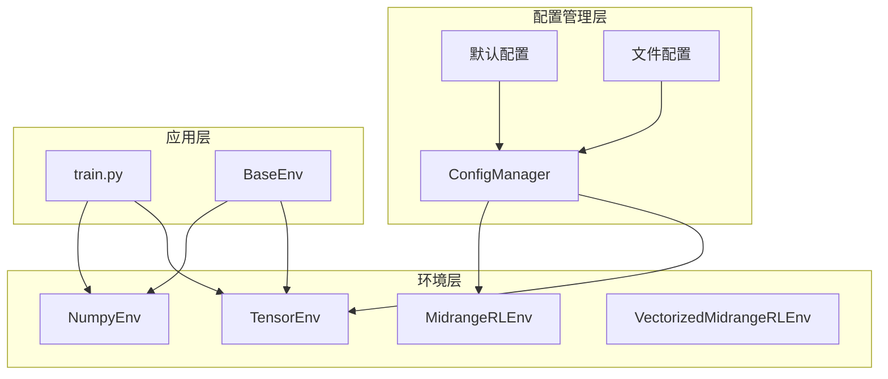
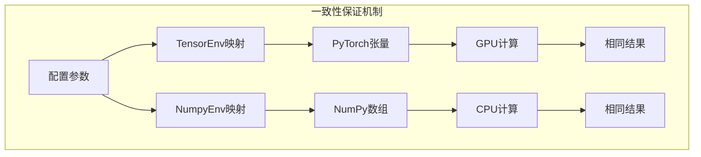

# 配置管理

<cite>
**本文档引用的文件**
- [config.py](file://config.py)
- [env_gym/config_manager.py](file://env_gym/config_manager.py)
- [env_gym/tensor_env.py](file://env_gym/tensor_env.py)
- [env_numpy/numpy_env.py](file://env_numpy/numpy_env.py)
- [train.py](file://train.py)
- [env_gym/gym_wrapper.py](file://env_gym/gym_wrapper.py)
- [env_gym/base_env.py](file://env_gym/base_env.py)
- [env_gym/__init__.py](file://env_gym/__init__.py)
</cite>

## 目录
1. [简介](#简介)
2. [项目结构](#项目结构)
3. [核心组件](#核心组件)
4. [架构概览](#架构概览)
5. [详细组件分析](#详细组件分析)
6. [依赖关系分析](#依赖关系分析)
7. [性能考虑](#性能考虑)
8. [故障排除指南](#故障排除指南)
9. [结论](#结论)

## 简介

配置管理是中距空战RL项目的核心基础设施，负责集中管理环境的可配置参数。该项目实现了双后端架构，包括基于PyTorch的TensorEnv（GPU加速）和基于NumPy的NumpyEnv（CPU实现），通过统一的配置管理系统确保两个后端使用一致的参数设置，维护双后端之间的行为一致性。

配置管理器不仅支持从JSON文件加载配置，还提供了默认配置机制、配置合并功能，以及与训练脚本的无缝集成。这种设计使得研究人员能够灵活地调整环境行为，进行不同参数组合的实验对比。

## 项目结构

项目采用模块化的文件组织结构，配置管理相关的文件分布如下：

**图表来源**
- [config.py](file://config.py#L1-L52)
- [env_gym/config_manager.py](file://env_gym/config_manager.py#L1-L102)
- [env_gym/tensor_env.py](file://env_gym/tensor_env.py#L1-L772)
- [env_numpy/numpy_env.py](file://env_numpy/numpy_env.py#L1-L365)
- [train.py](file://train.py#L1-L374)

**章节来源**
- [config.py](file://config.py#L1-L52)
- [env_gym/config_manager.py](file://env_gym/config_manager.py#L1-L102)
- [env_gym/__init__.py](file://env_gym/__init__.py#L1-L20)

## 核心组件

### 配置管理器（ConfigManager）

ConfigManager是配置管理的核心组件，提供了完整的配置生命周期管理：

- **默认配置系统**：定义了完整的参数默认值集合
- **文件配置加载**：支持从JSON文件加载配置
- **配置合并机制**：允许多个配置源的合并
- **兼容性支持**：提供向后兼容的配置获取方法

### 全局配置常量（CONFIG）

全局配置常量提供了游戏的基本物理参数，包括：
- 游戏基本配置：战场尺寸、窗口设置、视图参数
- 飞机参数：终端速度、最小转弯半径、最大推力、升阻比
- 导弹参数：发动机推力、工作时间、导引增益
- 物理常数：重力加速度

### 环境配置映射

TensorEnv和NumpyEnv都实现了配置参数的映射机制，确保双后端的一致性。

**章节来源**
- [env_gym/config_manager.py](file://env_gym/config_manager.py#L11-L101)
- [config.py](file://config.py#L7-L52)

## 架构概览

配置管理架构采用了分层设计，确保配置的统一性和一致性：

**图表来源**
- [train.py](file://train.py#L351-L354)
- [env_gym/config_manager.py](file://env_gym/config_manager.py#L48-L69)
- [env_gym/tensor_env.py](file://env_gym/tensor_env.py#L209-L242)

### 配置层次结构

配置系统采用了多层继承的设计模式：

**图表来源**
- [env_gym/config_manager.py](file://env_gym/config_manager.py#L14-L46)
- [env_gym/tensor_env.py](file://env_gym/tensor_env.py#L217-L232)

## 详细组件分析

### ConfigManager类分析

ConfigManager实现了完整的配置管理功能：

#### 默认配置结构

默认配置包含了所有必要的参数类别：

| 参数类别 | 关键参数 | 默认值 |
|---------|---------|--------|
| 游戏基本配置 | battlefield_size, hit_radius, self_destruct_speed | 50000, 100, 200 |
| 飞机参数 | FIGHTER_TERMINAL_VELOCITY, FIGHTER_MIN_TURN_RADIUS | 400, 1000 |
| 导弹参数 | MISSILE_THRUST, MISSILE_ENGINE_DURATION | 15×9.8, 10.0 |
| 制导参数 | guidance_gain | 5.0 |
| 奖励权重 | reward_hit_enemy, reward_win, reward_lose | 100.0, 500.0, -500.0 |

#### 配置加载流程

**图表来源**
- [env_gym/config_manager.py](file://env_gym/config_manager.py#L48-L69)

#### 配置合并机制

配置合并支持多源配置的优先级处理：

**图表来源**
- [env_gym/config_manager.py](file://env_gym/config_manager.py#L11-L101)
- [env_gym/tensor_env.py](file://env_gym/tensor_env.py#L209-L242)
- [env_numpy/numpy_env.py](file://env_numpy/numpy_env.py#L58-L95)

**章节来源**
- [env_gym/config_manager.py](file://env_gym/config_manager.py#L11-L101)

### TensorEnv配置集成

TensorEnv实现了配置参数的完整集成：

#### 参数初始化流程

**图表来源**
- [env_gym/tensor_env.py](file://env_gym/tensor_env.py#L209-L242)

#### 参数映射策略

TensorEnv使用了智能的参数映射策略：

| 配置键 | TensorEnv参数 | 映射方式 |
|-------|-------------|---------|
| battlefield_size | battlefield_size | 直接映射为Tensor |
| hit_radius | hit_radius_sq | 计算平方值 |
| reward_hit_enemy | reward_config['hit_enemy'] | 字典存储 |
| FIGHTER_TERMINAL_VELOCITY | FIGHTER_TERMINAL_VELOCITY | 参数类属性 |

**章节来源**
- [env_gym/tensor_env.py](file://env_gym/tensor_env.py#L209-L242)

### NumpyEnv配置集成

NumpyEnv同样实现了配置参数的集成：

#### 参数获取策略

NumpyEnv采用了直接参数获取的方式：

**图表来源**
- [env_numpy/numpy_env.py](file://env_numpy/numpy_env.py#L68-L95)

**章节来源**
- [env_numpy/numpy_env.py](file://env_numpy/numpy_env.py#L58-L95)

## 依赖关系分析

配置管理系统的依赖关系体现了清晰的分层架构：

**图表来源**
- [env_gym/config_manager.py](file://env_gym/config_manager.py#L1-L102)
- [env_gym/tensor_env.py](file://env_gym/tensor_env.py#L1-L772)
- [env_numpy/numpy_env.py](file://env_numpy/numpy_env.py#L1-L365)
- [train.py](file://train.py#L1-L374)

### 关键依赖关系

1. **ConfigManager依赖关系**：ConfigManager独立于具体环境实现，提供通用的配置管理功能
2. **环境依赖关系**：TensorEnv和NumpyEnv都依赖ConfigManager提供的配置
3. **应用依赖关系**：训练脚本通过ConfigManager获取配置，然后创建环境实例

**章节来源**
- [env_gym/__init__.py](file://env_gym/__init__.py#L6-L18)
- [train.py](file://train.py#L18-L25)

## 性能考虑

配置管理在性能方面采用了多项优化策略：

### 内存优化

- **延迟加载**：配置参数按需转换为相应的数据类型
- **设备优化**：TensorEnv将参数存储在GPU内存中以提高计算性能
- **缓存机制**：配置参数在环境初始化时一次性加载到内存

### 计算效率

- **向量化操作**：TensorEnv使用PyTorch张量进行批量计算
- **参数预计算**：如半径平方等参数在初始化时预计算
- **最小化转换**：减少配置参数在不同后端间的转换次数

### 双后端一致性

为了确保TensorEnv和NumpyEnv的行为一致性，配置系统采用了以下策略：

**图表来源**
- [env_gym/tensor_env.py](file://env_gym/tensor_env.py#L217-L242)
- [env_numpy/numpy_env.py](file://env_numpy/numpy_env.py#L68-L95)

## 故障排除指南

### 常见配置问题

#### 配置加载失败

**问题描述**：配置文件无法正确加载
**解决方案**：
1. 检查JSON文件格式是否正确
2. 验证文件路径是否存在
3. 确认文件编码为UTF-8

#### 参数类型不匹配

**问题描述**：配置参数类型与预期不符
**解决方案**：
1. 检查配置参数的数据类型
2. 确认TensorEnv和NumpyEnv的参数映射
3. 验证参数范围的有效性

#### 双后端不一致

**问题描述**：TensorEnv和NumpyEnv产生不同的结果
**排查步骤**：
1. 对比两个后端的配置参数
2. 检查参数映射的一致性
3. 验证数值精度差异

**章节来源**
- [env_gym/config_manager.py](file://env_gym/config_manager.py#L48-L69)

### 调试技巧

1. **配置验证**：使用`ConfigManager.load_config()`验证配置加载
2. **参数检查**：通过环境实例的属性检查参数值
3. **日志输出**：在关键节点添加配置信息的日志输出

## 结论

配置管理系统成功实现了中距空战RL项目的参数集中管理需求。通过ConfigManager的统一管理、双后端的一致性保证，以及灵活的配置层次结构，项目为研究人员提供了强大的实验平台。

该系统的主要优势包括：
- **统一性**：所有环境共享相同的配置参数
- **灵活性**：支持多种配置源和动态修改
- **一致性**：确保TensorEnv和NumpyEnv的行为相同
- **可扩展性**：易于添加新的配置参数和后端支持

未来可以考虑的改进方向：
- 添加配置验证机制
- 实现配置热重载功能
- 增强配置版本管理
- 提供配置模板系统