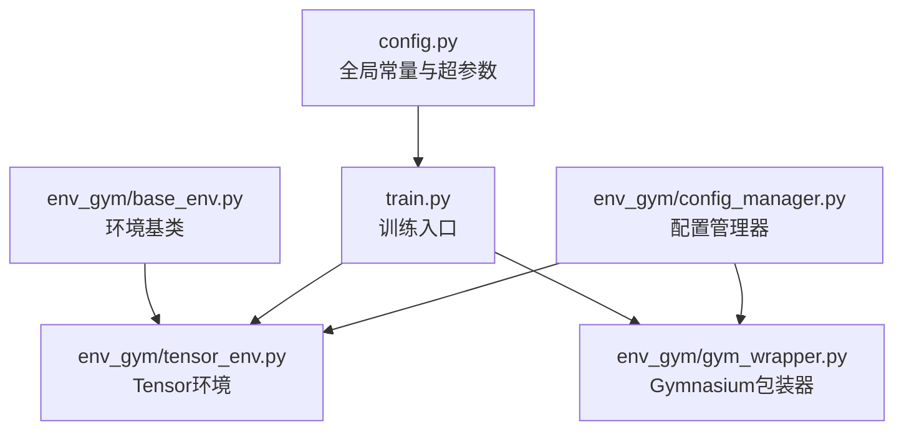
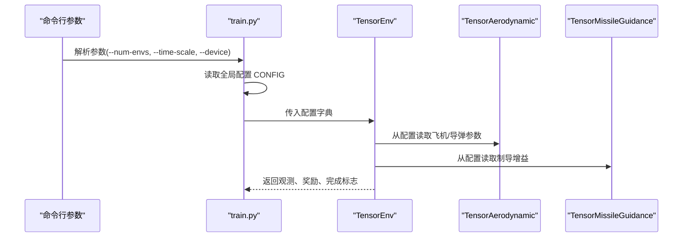
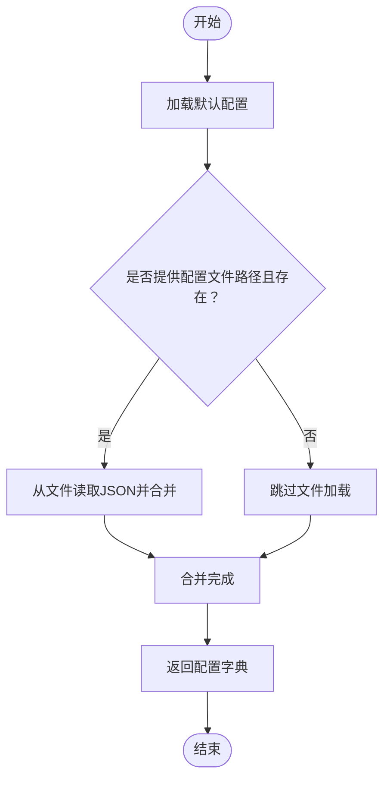
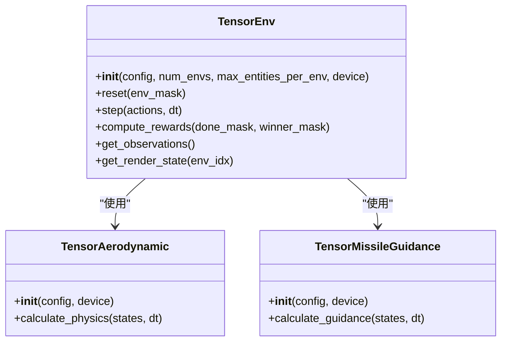
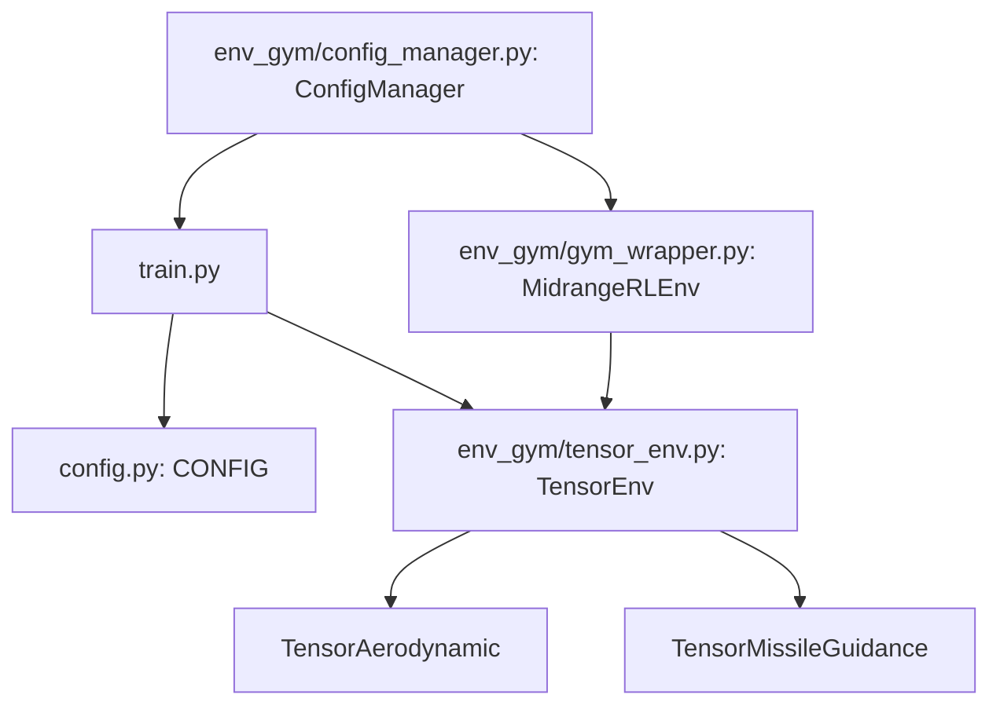

# 配置管理

<cite>
**本文引用的文件**
- [config.py](file://config.py)
- [env_gym/config_manager.py](file://env_gym/config_manager.py)
- [env_gym/tensor_env.py](file://env_gym/tensor_env.py)
- [env_gym/gym_wrapper.py](file://env_gym/gym_wrapper.py)
- [env_gym/base_env.py](file://env_gym/base_env.py)
- [train.py](file://train.py)
- [README.md](file://README.md)
</cite>

## 目录
1. [简介](#简介)
2. [项目结构](#项目结构)
3. [核心组件](#核心组件)
4. [架构总览](#架构总览)
5. [详细组件分析](#详细组件分析)
6. [依赖关系分析](#依赖关系分析)
7. [性能考量](#性能考量)
8. [故障排查指南](#故障排查指南)
9. [结论](#结论)
10. [附录](#附录)

## 简介
本专项文档聚焦于项目的配置管理体系，涵盖以下内容：
- 全局配置文件 config.py 中定义的常量与超参数（物理常数、飞机/导弹性能参数、基础游戏参数等）
- 环境配置管理器 env_gym/config_manager.py 的动态加载、参数验证与环境间配置同步机制
- 配置文件的层级结构、优先级规则与热更新机制
- 最佳实践建议：如何安全调整气动模型参数、如何为不同实验设置独立配置文件、如何通过命令行参数覆盖默认值

## 项目结构
配置相关的文件分布如下：
- config.py：集中定义全局常量与超参数，供训练脚本与环境模块共享
- env_gym/config_manager.py：统一的配置管理器，负责默认配置、文件加载、合并与保存
- env_gym/tensor_env.py：基于配置构建气动与制导模块，体现配置在运行期的使用
- env_gym/gym_wrapper.py：Gymnasium包装器，展示配置在不同环境后端中的传递
- train.py：训练入口，演示命令行参数与配置的结合使用
- env_gym/base_env.py：环境抽象基类，定义统一接口，便于配置驱动行为

图表来源
- [config.py](file://config.py#L1-L52)
- [env_gym/config_manager.py](file://env_gym/config_manager.py#L1-L102)
- [env_gym/tensor_env.py](file://env_gym/tensor_env.py#L1-L772)
- [env_gym/gym_wrapper.py](file://env_gym/gym_wrapper.py#L1-L181)
- [env_gym/base_env.py](file://env_gym/base_env.py#L1-L96)
- [train.py](file://train.py#L1-L374)

章节来源
- [config.py](file://config.py#L1-L52)
- [env_gym/config_manager.py](file://env_gym/config_manager.py#L1-L102)
- [env_gym/tensor_env.py](file://env_gym/tensor_env.py#L1-L772)
- [env_gym/gym_wrapper.py](file://env_gym/gym_wrapper.py#L1-L181)
- [env_gym/base_env.py](file://env_gym/base_env.py#L1-L96)
- [train.py](file://train.py#L1-L374)

## 核心组件
- 全局配置模块 config.py
  - 定义 GAME_CONFIG、FIGHTER_CONFIG、MISSILE_CONFIG、PHYSICS_CONSTANTS 与合并后的 CONFIG
  - 提供统一的全局常量访问入口
- 配置管理器 env_gym/config_manager.py
  - 默认配置 DEFAULT_CONFIG
  - 加载 load_config：从文件加载并合并到默认配置
  - 保存 save_config：将配置写回 JSON 文件
  - 合并 merge_configs：多配置字典合并
- 环境模块
  - TensorEnv：从配置读取参数，构建气动与制导模块
  - Gymnasium包装器：在不同后端中传递配置
  - 基类 BaseEnv：定义统一接口，便于配置驱动行为

章节来源
- [config.py](file://config.py#L1-L52)
- [env_gym/config_manager.py](file://env_gym/config_manager.py#L11-L101)
- [env_gym/tensor_env.py](file://env_gym/tensor_env.py#L206-L242)
- [env_gym/gym_wrapper.py](file://env_gym/gym_wrapper.py#L15-L47)
- [env_gym/base_env.py](file://env_gym/base_env.py#L12-L96)

## 架构总览
配置在系统中的流转路径：
- 训练入口 train.py 读取命令行参数，构造配置字典并传递给 TensorEnv
- TensorEnv 从配置字典读取参数，初始化气动与制导模块
- Gymnasium包装器在创建底层 TensorEnv 时同样接收配置字典
- 配置管理器提供默认配置与文件加载能力，便于实验化配置管理

图表来源
- [train.py](file://train.py#L329-L374)
- [env_gym/tensor_env.py](file://env_gym/tensor_env.py#L206-L242)
- [env_gym/tensor_env.py](file://env_gym/tensor_env.py#L15-L118)
- [env_gym/tensor_env.py](file://env_gym/tensor_env.py#L121-L204)

## 详细组件分析

### 全局配置文件 config.py
- 分层组织
  - GAME_CONFIG：游戏世界尺寸、窗口尺寸、视图参数、网格间距、锚点等
  - FIGHTER_CONFIG：战斗机终端速度、最小转弯半径、最大推力、升阻比、初始速度、导弹数量等
  - MISSILE_CONFIG：导弹终端速度、最小转弯半径、推力、发动机工作时间、升阻比、初始速度、制导增益等
  - PHYSICS_CONSTANTS：重力加速度等物理常数
  - CONFIG：合并上述配置，形成全局访问入口
- 参数用途
  - 用于训练脚本与环境初始化，确保一致性
  - 作为默认配置的一部分，便于命令行覆盖与文件覆盖

章节来源
- [config.py](file://config.py#L8-L52)

### 配置管理器 env_gym/config_manager.py
- 默认配置 DEFAULT_CONFIG
  - 包含游戏基本配置、飞机/导弹参数、制导参数与奖励权重
- 动态加载 load_config
  - 以默认配置为基础，加载 JSON 文件并合并
  - 保留注释提示可通过环境变量扩展加载（未在代码中实现）
- 保存 save_config
  - 将配置字典写回 JSON 文件
- 合并 merge_configs
  - 以默认配置为基础，依次覆盖传入的配置字典

图表来源
- [env_gym/config_manager.py](file://env_gym/config_manager.py#L48-L69)

章节来源
- [env_gym/config_manager.py](file://env_gym/config_manager.py#L11-L101)

### 环境模块中的配置使用
- TensorEnv
  - 从配置读取 battlefield_size、hit_radius、self_destruct_speed、initial_missiles、missile_launch_offset、奖励权重等
  - 初始化气动模块 TensorAerodynamic 与制导模块 TensorMissileGuidance
- TensorAerodynamic
  - 从配置读取飞机/导弹的终端速度、最小转弯半径、最大推力、升阻比等
  - 将参数转换为张量并注入设备
- TensorMissileGuidance
  - 从配置读取制导增益（并进行单位换算）
- Gymnasium包装器
  - 在创建底层 TensorEnv 时接收配置字典，保证与训练入口一致

图表来源
- [env_gym/tensor_env.py](file://env_gym/tensor_env.py#L206-L242)
- [env_gym/tensor_env.py](file://env_gym/tensor_env.py#L15-L118)
- [env_gym/tensor_env.py](file://env_gym/tensor_env.py#L121-L204)

章节来源
- [env_gym/tensor_env.py](file://env_gym/tensor_env.py#L206-L242)
- [env_gym/tensor_env.py](file://env_gym/tensor_env.py#L15-L118)
- [env_gym/tensor_env.py](file://env_gym/tensor_env.py#L121-L204)

### 训练入口中的配置与命令行参数
- 命令行参数
  - agent/opponent/reward：选择智能体与奖励类型
  - num-envs/time-scale/device：并行环境数、时间加速倍率、计算设备
  - max-steps/episode-max-steps/seed/verbose：训练步数、单局最大步数、随机种子、日志级别
- 配置传递
  - 训练入口读取全局 CONFIG 并传递给 TensorEnv
  - 通过命令行参数覆盖部分行为（如设备、并行数），而物理/性能参数由配置字典决定

章节来源
- [train.py](file://train.py#L70-L147)
- [train.py](file://train.py#L329-L374)

## 依赖关系分析
- 训练入口 train.py 依赖全局配置 CONFIG 与环境模块
- TensorEnv 依赖配置字典，内部进一步依赖气动与制导模块
- Gymnasium包装器依赖 TensorEnv，并在初始化时接收配置字典
- 配置管理器提供默认配置与文件加载能力，便于实验化配置管理

图表来源
- [train.py](file://train.py#L19-L25)
- [train.py](file://train.py#L352-L353)
- [env_gym/tensor_env.py](file://env_gym/tensor_env.py#L206-L242)
- [env_gym/gym_wrapper.py](file://env_gym/gym_wrapper.py#L20-L39)
- [env_gym/config_manager.py](file://env_gym/config_manager.py#L11-L101)

章节来源
- [train.py](file://train.py#L19-L25)
- [env_gym/tensor_env.py](file://env_gym/tensor_env.py#L206-L242)
- [env_gym/gym_wrapper.py](file://env_gym/gym_wrapper.py#L20-L39)
- [env_gym/config_manager.py](file://env_gym/config_manager.py#L11-L101)

## 性能考量
- 配置参数的张量化
  - TensorEnv 将配置参数转换为张量并绑定到设备，避免 Python 层频繁访问带来的性能损耗
- 并行环境与配置一致性
  - 通过统一配置字典传递，确保多环境并行时参数一致，减少分支判断与数据拷贝
- 文件加载与合并
  - 配置管理器采用浅合并策略，优先级为：文件配置 > 默认配置；建议在实验中尽量使用文件配置，避免重复硬编码

## 故障排查指南
- 配置项缺失
  - 现象：环境初始化时报错或行为异常
  - 排查：确认配置字典包含必需键（如飞机/导弹参数、奖励权重等）
  - 处理：使用配置管理器的默认配置作为基准，仅覆盖必要字段
- 参数范围不合理
  - 现象：仿真不稳定、数值溢出或收敛困难
  - 排查：检查终端速度、最小转弯半径、推力与升阻比之间的匹配关系
  - 处理：按物理意义调整参数，避免极端值
- 设备与张量不匹配
  - 现象：GPU/CPU 张量设备不一致导致错误
  - 排查：确认配置参数在初始化时绑定到正确设备
  - 处理：在配置管理器或环境初始化处统一设备绑定
- 文件路径问题
  - 现象：无法加载配置文件
  - 排查：确认文件路径存在且为合法 JSON
  - 处理：使用配置管理器的加载方法并检查返回结果

章节来源
- [env_gym/config_manager.py](file://env_gym/config_manager.py#L48-L69)
- [env_gym/tensor_env.py](file://env_gym/tensor_env.py#L15-L118)

## 结论
本项目的配置管理采用“全局常量 + 配置管理器”的双轨设计：
- 全局常量提供稳定的默认值与清晰的参数分类
- 配置管理器提供灵活的文件加载、合并与保存能力
- 环境模块通过统一配置字典实现参数驱动，确保训练与可视化的一致性

建议在后续迭代中：
- 明确配置项的优先级与校验规则
- 增强环境间配置同步与热更新能力
- 提供更丰富的命令行覆盖选项与配置模板

## 附录

### 配置层级结构与优先级规则
- 层级结构
  - 默认配置 DEFAULT_CONFIG（配置管理器内置）
  - 文件配置（JSON 文件，可选）
  - 全局配置 CONFIG（全局常量模块）
  - 命令行参数（训练入口）
- 优先级
  - 文件配置 > 默认配置
  - 全局配置 CONFIG > 默认配置
  - 命令行参数 > 全局配置 CONFIG
- 环境间配置同步
  - 通过统一配置字典传递，确保 TensorEnv 与 Gymnasium包装器使用一致配置
  - 如需热更新，可在训练循环中重新加载配置并重建环境实例

章节来源
- [env_gym/config_manager.py](file://env_gym/config_manager.py#L48-L69)
- [train.py](file://train.py#L352-L353)
- [env_gym/gym_wrapper.py](file://env_gym/gym_wrapper.py#L20-L39)

### 最佳实践建议
- 安全调整气动模型参数
  - 保持终端速度与最小转弯半径的合理比例，避免过大的升阻比导致数值不稳定
  - 推力与质量（通过升阻比间接体现）需匹配，避免过高的加速度导致仿真发散
- 为不同实验设置独立配置文件
  - 以 DEFAULT_CONFIG 为基准，仅覆盖差异化的参数，便于复现实验
  - 使用配置管理器的保存功能固化实验配置
- 通过命令行参数覆盖默认值
  - 使用训练入口的命令行参数控制并行数、时间尺度与设备，避免修改全局配置
  - 对于物理/性能参数，建议通过配置文件覆盖，而非硬编码

章节来源
- [env_gym/config_manager.py](file://env_gym/config_manager.py#L71-L81)
- [train.py](file://train.py#L70-L147)