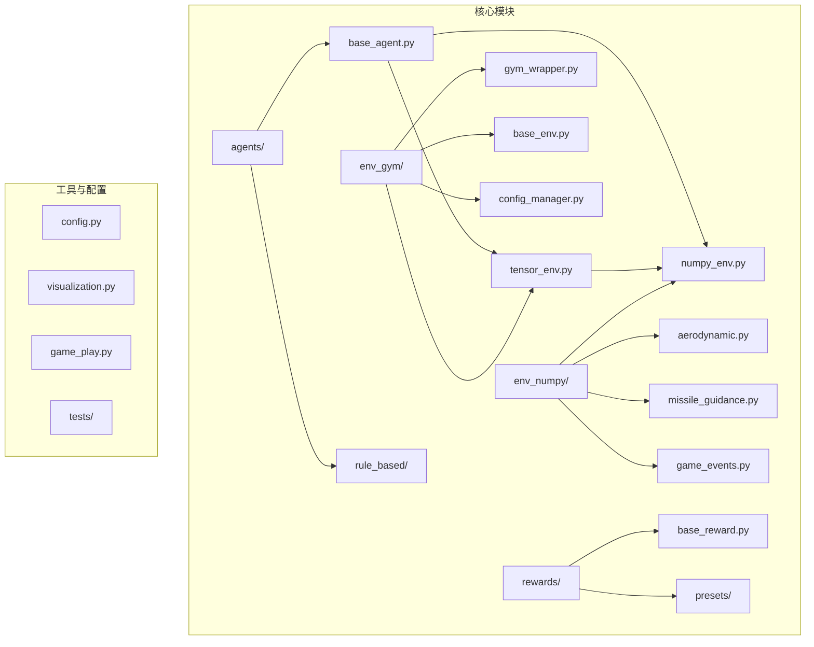
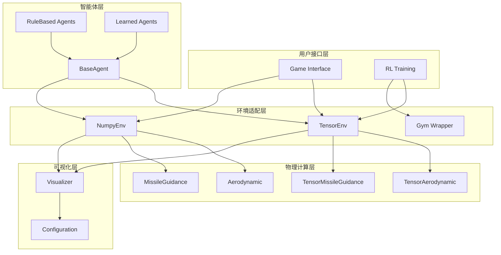
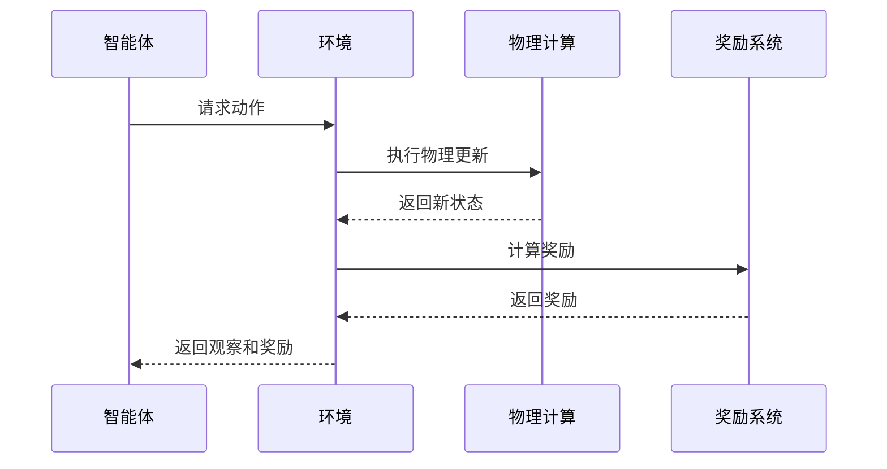
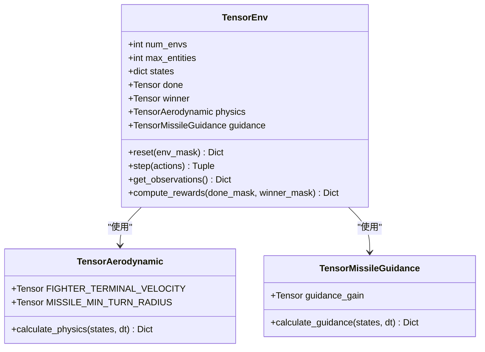
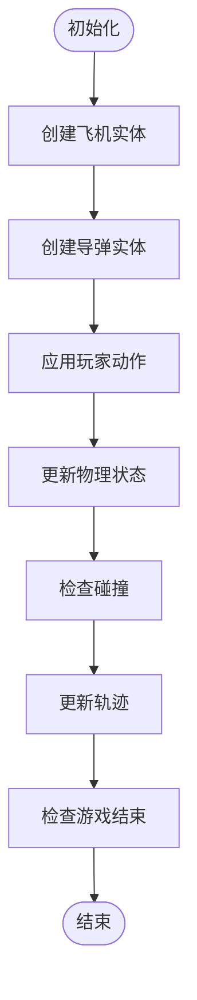
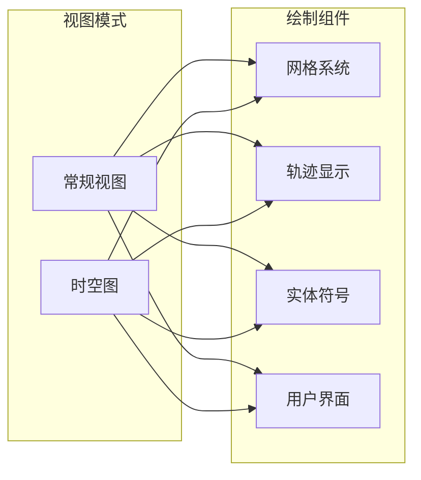
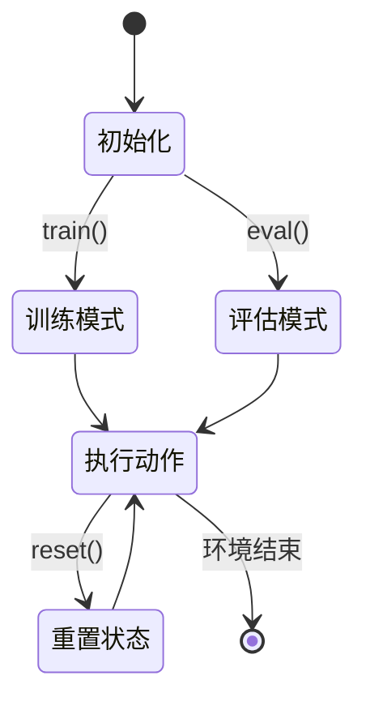
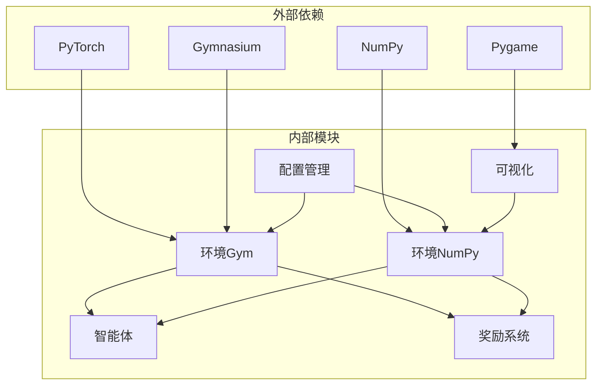
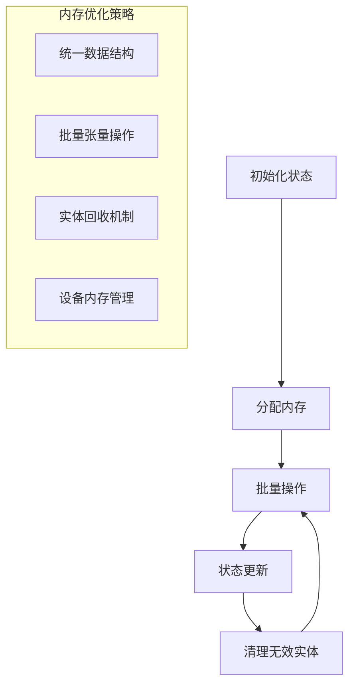

# 项目概述

<cite>
**本文档引用的文件**
- [README.md](file://README.md)
- [config.py](file://config.py)
- [env_gym/base_env.py](file://env_gym/base_env.py)
- [env_gym/tensor_env.py](file://env_gym/tensor_env.py)
- [env_gym/gym_wrapper.py](file://env_gym/gym_wrapper.py)
- [env_gym/config_manager.py](file://env_gym/config_manager.py)
- [env_numpy/numpy_env.py](file://env_numpy/numpy_env.py)
- [env_numpy/aerodynamic.py](file://env_numpy/aerodynamic.py)
- [env_numpy/missile_guidance.py](file://env_numpy/missile_guidance.py)
- [env_numpy/game_events.py](file://env_numpy/game_events.py)
- [agents/base_agent.py](file://agents/base_agent.py)
- [visualization.py](file://visualization.py)
- [game_play.py](file://game_play.py)
- [tests/test_tensor_env.py](file://tests/test_tensor_env.py)
</cite>

## 目录
1. [简介](#简介)
2. [项目结构](#项目结构)
3. [核心组件](#核心组件)
4. [架构概览](#架构概览)
5. [详细组件分析](#详细组件分析)
6. [依赖关系分析](#依赖关系分析)
7. [性能考量](#性能考量)
8. [故障排除指南](#故障排除指南)
9. [结论](#结论)

## 简介

midrangeRL是一个中距空战AI强化学习平台，专注于提供精确的2D空战模拟环境。该项目的核心特色是"时空图"UI界面，用于直观估计导弹的真实射程。项目支持两种计算后端：PyTorch张量后端（用于高性能强化学习训练）和NumPy数值后端（用于稳定的可视化游戏体验）。

该项目的设计目标是为智能体-环境-奖励闭环提供完整的基础设施，支持算法验证、多环境并行训练和实时交互等多种应用场景。通过抽象工厂模式和策略模式等架构设计，项目实现了高度的可扩展性和可维护性。

## 项目结构

项目采用模块化设计，按照功能域进行组织：

**图表来源**
- [env_gym/base_env.py](file://env_gym/base_env.py#L12-L96)
- [env_gym/tensor_env.py](file://env_gym/tensor_env.py#L206-L772)
- [env_numpy/numpy_env.py](file://env_numpy/numpy_env.py#L49-L365)

**章节来源**
- [README.md](file://README.md#L64-L74)
- [config.py](file://config.py#L1-L52)

## 核心组件

### 环境系统

项目实现了双环境架构，满足不同场景的需求：

1. **TensorEnv（PyTorch后端）**
   - 支持多环境并行训练
   - 统一实体槽位系统
   - GPU加速计算
   - 完整的RL接口

2. **NumpyEnv（NumPy后端）**
   - 稳定的可视化游戏体验
   - CPU计算
   - 适合手动游戏和演示

### Agent抽象层

BaseAgent定义了统一的智能体接口，支持规则智能体和强化学习智能体：

- 标准化输入输出格式
- 支持批量操作
- 设备无关的计算
- 模式切换（train/eval）

### 配置管理系统

ConfigManager提供灵活的配置管理：
- 默认配置模板
- JSON文件支持
- 环境变量集成
- 配置合并机制

**章节来源**
- [env_gym/base_env.py](file://env_gym/base_env.py#L12-L96)
- [agents/base_agent.py](file://agents/base_agent.py#L13-L118)
- [env_gym/config_manager.py](file://env_gym/config_manager.py#L11-L102)

## 架构概览

项目采用了分层架构设计，通过抽象工厂模式和策略模式实现松耦合：

**图表来源**
- [env_gym/tensor_env.py](file://env_gym/tensor_env.py#L206-L242)
- [env_numpy/numpy_env.py](file://env_numpy/numpy_env.py#L49-L95)
- [visualization.py](file://visualization.py#L8-L51)

### 数据流架构

**图表来源**
- [env_gym/tensor_env.py](file://env_gym/tensor_env.py#L351-L417)
- [env_gym/base_env.py](file://env_gym/base_env.py#L27-L64)

## 详细组件分析

### TensorEnv核心实现

TensorEnv是项目的核心组件，实现了完整的强化学习环境：

#### 实体槽位系统

**图表来源**
- [env_gym/tensor_env.py](file://env_gym/tensor_env.py#L206-L242)
- [env_gym/tensor_env.py](file://env_gym/tensor_env.py#L15-L37)

#### 物理计算优化

TensorEnv采用向量化计算实现高性能：
- 批量状态更新
- GPU并行计算
- 统一的数据结构
- 优化的数学运算

**章节来源**
- [env_gym/tensor_env.py](file://env_gym/tensor_env.py#L38-L118)

### NumPy环境实现

NumpyEnv提供了稳定的可视化游戏体验：

#### 实体管理

**图表来源**
- [env_numpy/numpy_env.py](file://env_numpy/numpy_env.py#L133-L176)

**章节来源**
- [env_numpy/numpy_env.py](file://env_numpy/numpy_env.py#L49-L365)

### 可视化系统

Visualizer模块提供了丰富的图形界面：

#### 视图模式

**图表来源**
- [visualization.py](file://visualization.py#L8-L51)

**章节来源**
- [visualization.py](file://visualization.py#L8-L280)

### 智能体系统

BaseAgent定义了统一的智能体接口：

#### 智能体生命周期

**图表来源**
- [agents/base_agent.py](file://agents/base_agent.py#L72-L110)

**章节来源**
- [agents/base_agent.py](file://agents/base_agent.py#L13-L118)

## 依赖关系分析

项目采用清晰的依赖层次结构：

**图表来源**
- [README.md](file://README.md#L13-L15)
- [env_gym/gym_wrapper.py](file://env_gym/gym_wrapper.py#L7-L12)

### 关键依赖特性

1. **设备无关性**：通过BaseAgent抽象，智能体可以在不同设备间迁移
2. **接口一致性**：所有环境实现遵循统一的接口规范
3. **配置驱动**：通过ConfigManager实现灵活的参数配置
4. **模块解耦**：各模块间依赖关系清晰，便于独立开发和测试

**章节来源**
- [env_gym/base_env.py](file://env_gym/base_env.py#L12-L96)
- [env_gym/config_manager.py](file://env_gym/config_manager.py#L11-L102)

## 性能考量

### GPU加速优化

TensorEnv通过以下方式实现高性能：

1. **向量化计算**：使用PyTorch张量进行批量操作
2. **内存优化**：统一的实体槽位系统减少内存碎片
3. **并行处理**：多环境并行训练提升效率
4. **设备选择**：自动选择CUDA或CPU设备

### 内存管理

**图表来源**
- [env_gym/tensor_env.py](file://env_gym/tensor_env.py#L250-L275)

## 故障排除指南

### 常见问题诊断

1. **GPU内存不足**
   - 检查num_envs参数设置
   - 确认设备可用性
   - 适当减少并行环境数量

2. **环境重置问题**
   - 验证env_mask参数格式
   - 检查完成状态标志
   - 确认winner状态正确

3. **可视化异常**
   - 检查Pygame初始化
   - 验证配置参数
   - 确认实体状态有效

**章节来源**
- [tests/test_tensor_env.py](file://tests/test_tensor_env.py#L17-L139)

### 调试建议

1. **单元测试**：使用现有测试套件验证核心功能
2. **日志记录**：在关键节点添加调试信息
3. **配置验证**：确保配置参数合理有效
4. **性能监控**：监控内存和计算资源使用情况

## 结论

midrangeRL项目展现了优秀的软件工程实践，通过精心设计的架构实现了以下目标：

1. **技术平衡**：在性能和稳定性之间找到最佳平衡点
2. **架构优雅**：采用抽象工厂和策略模式实现高内聚低耦合
3. **扩展性强**：模块化设计支持功能扩展和定制
4. **易用性好**：提供清晰的API和丰富的示例

项目的核心价值在于为中距空战强化学习研究提供了一个可靠、高效且易于使用的平台。通过双后端架构设计，既满足了高性能训练需求，又保证了用户体验的稳定性。

对于初学者，项目提供了清晰的学习路径和丰富的示例；对于高级开发者，项目展示了现代强化学习环境设计的最佳实践。随着项目的持续发展，预计将在AI空战领域发挥重要作用。