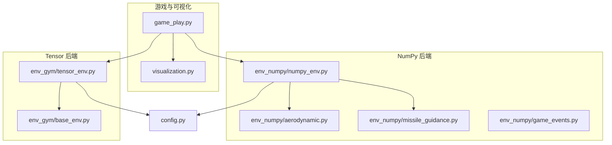
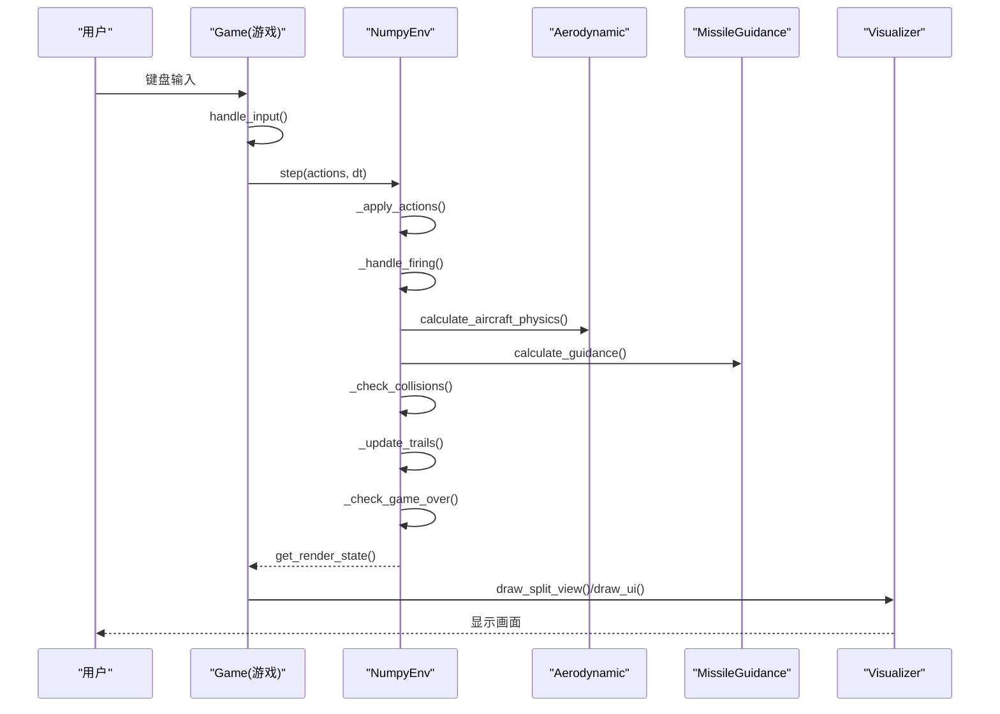
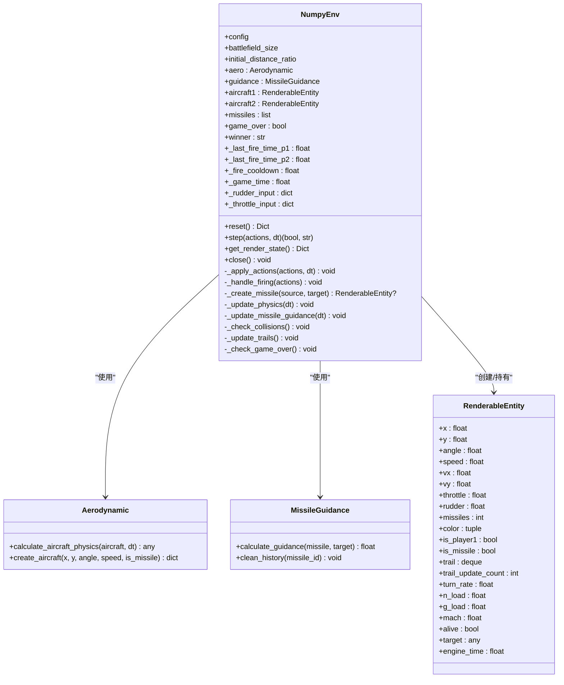
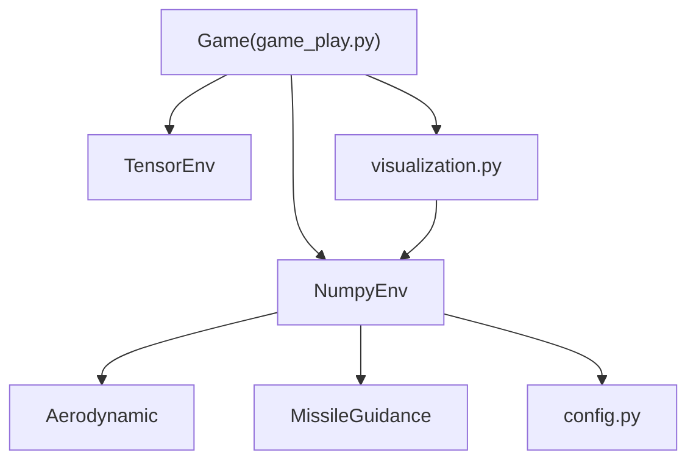

# NumPy后端

<cite>
**本文引用的文件**
- [numpy_env.py](file://env_numpy/numpy_env.py)
- [aerodynamic.py](file://env_numpy/aerodynamic.py)
- [missile_guidance.py](file://env_numpy/missile_guidance.py)
- [game_events.py](file://env_numpy/game_events.py)
- [game_play.py](file://game_play.py)
- [visualization.py](file://visualization.py)
- [config.py](file://config.py)
- [tensor_env.py](file://env_gym/tensor_env.py)
- [base_env.py](file://env_gym/base_env.py)
</cite>

## 目录
1. [简介](#简介)
2. [项目结构](#项目结构)
3. [核心组件](#核心组件)
4. [架构概览](#架构概览)
5. [详细组件分析](#详细组件分析)
6. [依赖关系分析](#依赖关系分析)
7. [性能考量](#性能考量)
8. [故障排查指南](#故障排查指南)
9. [结论](#结论)

## 简介
本文件全面解析 NumPy 后端（env_numpy/numpy_env.py）的设计目标与实现细节，重点说明其作为可视化与交互式调试工具的角色。NumpyEnv 类封装了 Aerodynamic 与 MissileGuidance 模块，构建了一个与 TensorEnv 接口兼容的单环境模拟器，用于游戏演示与策略验证。文档详细阐述其在 game_play.py 中的应用，如何通过 get_render_state 方法为 PyGame 可视化提供包含飞机、导弹与游戏状态的渲染数据；解释其设计如何优先考虑代码的可读性与调试便利性（例如使用独立的实体对象 RenderableEntity 而非张量），以及如何实现平滑的舵量与油门输入响应；最后总结其在算法开发周期中的关键作用：先在 NumPy 后端直观验证与调试智能体策略，确保物理模拟与游戏逻辑正确后再迁移到高性能的 Tensor 后端进行大规模训练。

## 项目结构
该仓库采用模块化组织方式：
- env_numpy：包含 NumPy 后端的环境实现与物理/制导模块
- env_gym：包含 Tensor 后端的高性能实现与 Gymnasium 兼容包装
- 游戏与可视化：game_play.py 与 visualization.py 提供交互式演示
- 配置：config.py 提供统一的游戏参数配置

图表来源
- [game_play.py](file://game_play.py#L1-L331)
- [numpy_env.py](file://env_numpy/numpy_env.py#L1-L365)
- [aerodynamic.py](file://env_numpy/aerodynamic.py#L1-L239)
- [missile_guidance.py](file://env_numpy/missile_guidance.py#L1-L77)
- [game_events.py](file://env_numpy/game_events.py#L1-L129)
- [tensor_env.py](file://env_gym/tensor_env.py#L1-L200)
- [base_env.py](file://env_gym/base_env.py#L39-L95)
- [config.py](file://config.py#L1-L52)

章节来源
- [game_play.py](file://game_play.py#L1-L331)
- [numpy_env.py](file://env_numpy/numpy_env.py#L1-L365)
- [config.py](file://config.py#L1-L52)

## 核心组件
- NumpyEnv：封装物理与制导模块，提供与 TensorEnv 兼容的接口，负责环境状态管理、动作应用、物理更新、制导更新、碰撞检测、轨迹维护与游戏结束判定。
- RenderableEntity：可渲染实体类，统一 visualization 接口所需的属性（位置、速度、角度、过载、角速度等），便于 PyGame 可视化。
- Aerodynamic：实现基于矢量的速度与加速度合成的气动力学模型，分别处理飞机与导弹的不同参数。
- MissileGuidance：实现比例导引法的导弹制导，计算视线角速度并生成舵量指令。
- GameEvents：提供发射导弹、碰撞检测、自毁判断与边界约束等游戏事件逻辑（在 numpy_env 中被整合进 NumpyEnv 的流程中）。
- Game（game_play.py）：提供交互式演示，支持 NumPy 与 Tensor 后端切换，处理键盘输入、调用环境 step/get_render_state，并驱动 PyGame 可视化。

章节来源
- [numpy_env.py](file://env_numpy/numpy_env.py#L16-L42)
- [numpy_env.py](file://env_numpy/numpy_env.py#L49-L95)
- [aerodynamic.py](file://env_numpy/aerodynamic.py#L16-L186)
- [missile_guidance.py](file://env_numpy/missile_guidance.py#L7-L68)
- [game_events.py](file://env_numpy/game_events.py#L7-L129)
- [game_play.py](file://game_play.py#L58-L121)

## 架构概览
NumPy 后端通过 NumpyEnv 将 Aerodynamic 与 MissileGuidance 两个子模块整合为统一的环境接口，同时与 TensorEnv 保持接口兼容，从而在 game_play.py 中实现无缝切换。NumpyEnv 的 get_render_state 输出包含飞机、导弹与游戏状态的数据结构，供 visualization.py 直接消费，完成双视图渲染与 UI 展示。

图表来源
- [game_play.py](file://game_play.py#L122-L317)
- [numpy_env.py](file://env_numpy/numpy_env.py#L133-L176)
- [aerodynamic.py](file://env_numpy/aerodynamic.py#L40-L185)
- [missile_guidance.py](file://env_numpy/missile_guidance.py#L17-L68)
- [visualization.py](file://visualization.py#L163-L280)

## 详细组件分析

### NumpyEnv 类分析
NumpyEnv 是 NumPy 后端的核心，负责：
- 初始化与配置：读取配置、创建 Aerodynamic 与 MissileGuidance 实例，初始化游戏状态与冷却时间。
- 环境重置：计算初始位置与朝向，创建两架飞机，清空导弹列表，重置游戏状态。
- 步进执行：应用动作、处理开火、更新物理、更新制导、检查碰撞、更新轨迹、检查游戏结束。
- 渲染状态：提供 get_render_state，输出飞机、导弹与游戏状态，供 PyGame 可视化使用。

图表来源
- [numpy_env.py](file://env_numpy/numpy_env.py#L16-L42)
- [numpy_env.py](file://env_numpy/numpy_env.py#L49-L95)
- [numpy_env.py](file://env_numpy/numpy_env.py#L133-L176)
- [aerodynamic.py](file://env_numpy/aerodynamic.py#L16-L186)
- [missile_guidance.py](file://env_numpy/missile_guidance.py#L7-L68)

章节来源
- [numpy_env.py](file://env_numpy/numpy_env.py#L49-L365)

### RenderableEntity 设计要点
- 使用独立的实体对象而非张量，便于可视化与调试。
- 统一暴露 x/y/angle/speed/vx/vy 等属性，满足 visualization.py 的绘制需求。
- 内置轨迹队列（deque）与更新计数，降低渲染开销。
- 包含飞机与导弹共有的属性（如过载、角速度、M 数等），便于 UI 展示。

章节来源
- [numpy_env.py](file://env_numpy/numpy_env.py#L16-L42)
- [visualization.py](file://visualization.py#L163-L200)

### Aerodynamic 气动力学模型
- 基于矢量的速度与加速度合成，分别处理飞机与导弹参数。
- 计算阻力系数、诱导阻力、平行与垂直加速度，合成总加速度并更新速度与位置。
- 计算并存储辅助标量（速度、角度、过载、角速度等），供渲染与 UI 使用。
- 支持导弹发动机工作时间与推力变化，区分飞机油门与导弹引擎状态。

章节来源
- [aerodynamic.py](file://env_numpy/aerodynamic.py#L40-L185)

### MissileGuidance 制导逻辑
- 使用比例导引法，计算视线角速度并生成舵量指令。
- 维护每个导弹的制导历史（上次 LOS 角度与时间），处理角度跨越与时间差。
- 将制导指令限制在 [-1, 1] 范围内，适配 RenderableEntity 的 rudder 字段。

章节来源
- [missile_guidance.py](file://env_numpy/missile_guidance.py#L17-L68)

### 游戏事件与碰撞检测
- 发射冷却：根据冷却时间限制发射频率。
- 碰撞检测：当导弹与目标距离小于命中半径时，双方均失效。
- 自毁判断：当导弹速度低于阈值时自毁。
- 游戏结束：任一方被击毁或双方弹药耗尽且无在途导弹时结束。

章节来源
- [numpy_env.py](file://env_numpy/numpy_env.py#L235-L347)

### 与 TensorEnv 的接口兼容性
- game_play.py 中通过 _create_env 支持 'numpy' 与 'tensor' 两种后端。
- NumpyEnv 的 step 返回 (game_over, winner)，与 TensorEnv 的返回格式不同，但 Game.update_render_state 能够适配两种后端的差异。
- get_render_state 输出统一的渲染状态结构，保证可视化层无需关心后端差异。

章节来源
- [game_play.py](file://game_play.py#L112-L121)
- [game_play.py](file://game_play.py#L294-L309)
- [base_env.py](file://env_gym/base_env.py#L66-L80)

## 依赖关系分析
- NumpyEnv 依赖 Aerodynamic 与 MissileGuidance，二者均依赖 config.py 中的配置参数。
- game_play.py 依赖 NumpyEnv 与 TensorEnv（通过 Gym 包装器），并依赖 visualization.py 进行渲染。
- visualization.py 依赖 RenderableEntity 的属性进行绘制，包括轨迹、速度矢量与标签。

图表来源
- [numpy_env.py](file://env_numpy/numpy_env.py#L12-L13)
- [aerodynamic.py](file://env_numpy/aerodynamic.py#L14-L19)
- [missile_guidance.py](file://env_numpy/missile_guidance.py#L1-L7)
- [game_play.py](file://game_play.py#L17-L19)
- [visualization.py](file://visualization.py#L1-L280)

章节来源
- [numpy_env.py](file://env_numpy/numpy_env.py#L12-L13)
- [aerodynamic.py](file://env_numpy/aerodynamic.py#L14-L19)
- [missile_guidance.py](file://env_numpy/missile_guidance.py#L1-L7)
- [game_play.py](file://game_play.py#L17-L19)
- [visualization.py](file://visualization.py#L1-L280)

## 性能考量
- NumPy 后端优先保证可读性与调试便利性，适合交互式演示与策略验证。
- Aerodynamic 与 MissileGuidance 的计算为纯 Python，适合小规模单环境仿真。
- visualization.py 使用 PyGame 进行渲染，建议在调试阶段使用较低分辨率或简化视图。
- 当需要大规模训练时，应切换至 TensorEnv 后端，利用 GPU 加速与批量并行能力。

## 故障排查指南
- 输入响应异常：检查 game_play.py 中 handle_input 的边缘检测与渐变逻辑，确认 NumPy 后端与 Tensor 后端的差异处理。
- 导弹未发射：确认发射冷却时间与按键状态，检查 NumpyEnv._handle_firing 的条件判断。
- 碰撞不生效：核对命中半径与距离计算，检查 _check_collisions 的逻辑分支。
- 可视化异常：确认 get_render_state 输出的字段与 visualization.py 的访问一致，检查 RenderableEntity 的属性是否存在。

章节来源
- [game_play.py](file://game_play.py#L122-L220)
- [numpy_env.py](file://env_numpy/numpy_env.py#L235-L347)
- [visualization.py](file://visualization.py#L163-L280)

## 结论
NumPy 后端通过 NumpyEnv 将 Aerodynamic 与 MissileGuidance 模块整合为统一的环境接口，并与 TensorEnv 保持接口兼容，为交互式演示与策略调试提供了强大的基础。其设计强调可读性与调试便利性，使用独立的 RenderableEntity 对象替代张量，使可视化与 UI 展示更加直观。在算法开发周期中，NumPy 后端允许开发者快速验证物理模拟与游戏逻辑的正确性，再将经过验证的策略迁移到高性能的 Tensor 后端进行大规模训练，形成“从简单到复杂”的开发闭环。