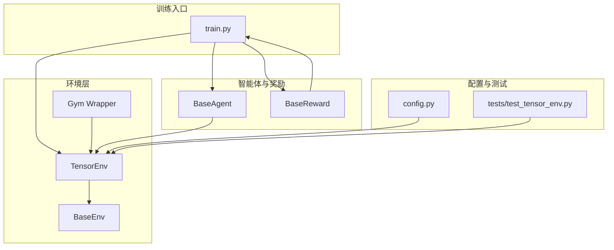
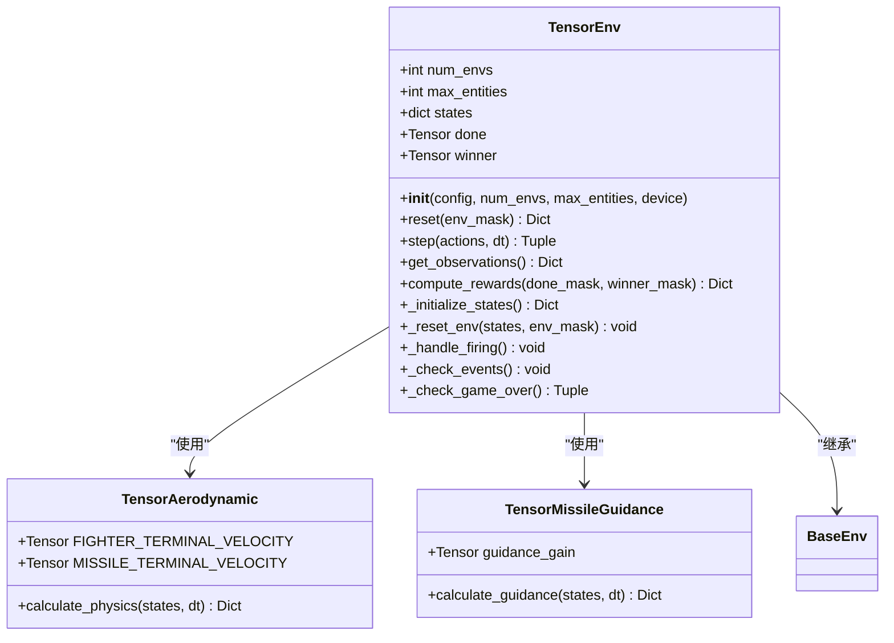
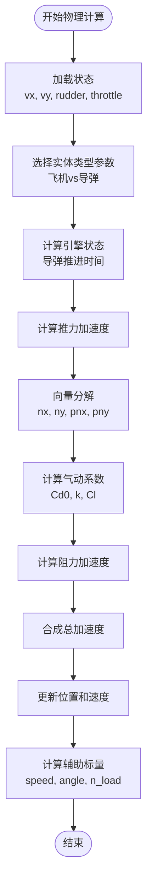
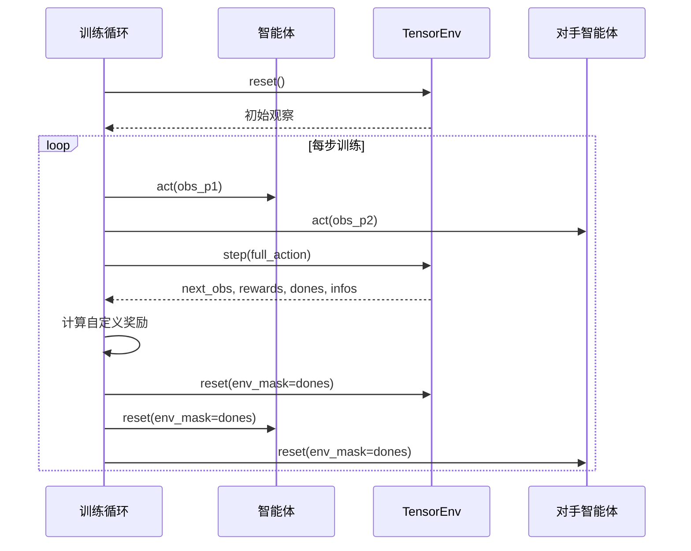
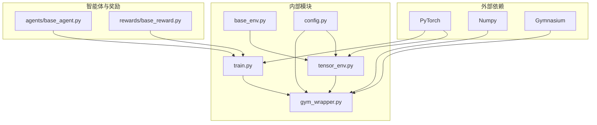

# Tensor后端

<cite>
**本文引用的文件**
- [env_gym/tensor_env.py](file://env_gym/tensor_env.py)
- [env_gym/base_env.py](file://env_gym/base_env.py)
- [env_gym/gym_wrapper.py](file://env_gym/gym_wrapper.py)
- [train.py](file://train.py)
- [config.py](file://config.py)
- [agents/base_agent.py](file://agents/base_agent.py)
- [rewards/base_reward.py](file://rewards/base_reward.py)
- [tests/test_tensor_env.py](file://tests/test_tensor_env.py)
- [README.md](file://README.md)
</cite>

## 目录
1. [简介](#简介)
2. [项目结构](#项目结构)
3. [核心组件](#核心组件)
4. [架构概览](#架构概览)
5. [详细组件分析](#详细组件分析)
6. [依赖关系分析](#依赖关系分析)
7. [性能考量](#性能考量)
8. [故障排查指南](#故障排查指南)
9. [结论](#结论)
10. [附录](#附录)

## 简介
本文件深入分析Tensor后端（env_gym/tensor_env.py）的设计与实现，重点阐述其作为支持多环境并行的强化学习训练核心的优势。TensorEnv类通过PyTorch张量在GPU上实现大规模并行计算，利用统一的实体槽位系统（[num_envs, max_entities]）高效管理多个并行环境中的飞机和导弹。其完整的RL接口设计包括：
- get_observations方法生成归一化的相对观察空间
- compute_rewards方法根据游戏结束状态和生存时间计算奖励
- 与PyTorch生态无缝集成，支持自动微分和梯度计算，为大规模、高效率的强化学习算法训练提供基础

## 项目结构
该项目采用模块化设计，核心训练环境位于env_gym目录，提供GPU加速的Tensor后端；同时保留CPU版本的env_numpy用于可视化和演示。训练入口脚本train.py展示了如何配置num_envs参数以启动多环境训练，并在典型调用流程中体现TensorEnv的使用方式。



**图表来源**
- [train.py](file://train.py#L1-L374)
- [env_gym/tensor_env.py](file://env_gym/tensor_env.py#L1-L772)
- [env_gym/base_env.py](file://env_gym/base_env.py#L1-L96)
- [env_gym/gym_wrapper.py](file://env_gym/gym_wrapper.py#L1-L181)
- [config.py](file://config.py#L1-L52)
- [tests/test_tensor_env.py](file://tests/test_tensor_env.py#L1-L139)

**章节来源**
- [README.md](file://README.md#L64-L88)
- [train.py](file://train.py#L1-L374)

## 核心组件
Tensor后端的核心组件包括：
- TensorEnv：支持多环境并行的强化学习环境
- TensorAerodynamic：气动力学计算模块
- TensorMissileGuidance：导弹制导模块
- BaseEnv：统一的环境接口基类
- Gym包装器：Gymnasium兼容接口

这些组件通过统一的实体槽位系统实现高效的并行计算，每个环境的实体状态都存储在二维张量中，便于GPU并行处理。

**章节来源**
- [env_gym/tensor_env.py](file://env_gym/tensor_env.py#L206-L242)
- [env_gym/base_env.py](file://env_gym/base_env.py#L12-L91)

## 架构概览
Tensor后端采用分层架构设计，实现了从底层物理计算到高层RL接口的完整链路：

```mermaid
graph TB
subgraph "RL训练层"
TRAIN[训练循环<br/>train.py]
AGENT[智能体<br/>BaseAgent]
REWARD[奖励函数<br/>BaseReward]
end
subgraph "环境抽象层"
BASE[BaseEnv<br/>统一接口]
WRAP[Gym包装器<br/>Gym兼容]
end
subgraph "物理计算层"
TENV[TensorEnv<br/>多环境并行]
AERO[TensorAerodynamic<br/>气动力学]
GUID[TensorMissileGuidance<br/>制导]
end
subgraph "数据存储层"
STATE[状态字典<br/>[num_envs, max_entities]]
DEVICE[设备管理<br/>CUDA/CPU]
end
TRAIN --> AGENT
TRAIN --> REWARD
TRAIN --> TENV
AGENT --> TENV
REWARD --> TRAIN
TENV --> BASE
WRAP --> TENV
TENV --> AERO
TENV --> GUID
TENV --> STATE
TENV --> DEVICE
AERO --> STATE
GUID --> STATE
```

**图表来源**
- [train.py](file://train.py#L170-L327)
- [env_gym/tensor_env.py](file://env_gym/tensor_env.py#L206-L242)
- [env_gym/base_env.py](file://env_gym/base_env.py#L12-L91)
- [env_gym/gym_wrapper.py](file://env_gym/gym_wrapper.py#L15-L181)

## 详细组件分析

### TensorEnv类设计
TensorEnv是整个系统的中心，负责管理多环境并行状态和执行RL接口方法。

#### 实体槽位系统
TensorEnv采用统一的实体槽位系统，每个环境的实体状态都存储在二维张量中：
- 形状：[num_envs, max_entities]
- 支持：飞机（P1、P2）+ 导弹（从索引2开始）
- 状态字段：位置、速度、角度、速度、导弹数量、激活状态等



**图表来源**
- [env_gym/tensor_env.py](file://env_gym/tensor_env.py#L206-L242)
- [env_gym/tensor_env.py](file://env_gym/tensor_env.py#L15-L37)
- [env_gym/tensor_env.py](file://env_gym/tensor_env.py#L121-L133)

#### 多环境并行实现
TensorEnv通过以下机制实现高效的多环境并行：
- 使用PyTorch张量进行批量操作
- 统一的实体槽位系统避免了动态内存分配
- GPU加速的数学运算
- 向量化状态更新和事件检测

**章节来源**
- [env_gym/tensor_env.py](file://env_gym/tensor_env.py#L209-L242)
- [env_gym/tensor_env.py](file://env_gym/tensor_env.py#L250-L275)

### 气动力学模块
TensorAerodynamic模块实现了支持多环境的气动力学计算，关键特性包括：

#### 参数化设计
- 支持飞机和导弹不同参数
- 使用条件张量操作选择合适参数
- 统一的物理公式应用于所有实体

#### 核心计算流程


**图表来源**
- [env_gym/tensor_env.py](file://env_gym/tensor_env.py#L38-L118)

**章节来源**
- [env_gym/tensor_env.py](file://env_gym/tensor_env.py#L15-L37)
- [env_gym/tensor_env.py](file://env_gym/tensor_env.py#L38-L118)

### 导弹制导模块
TensorMissileGuidance模块实现了基于比例导引的导弹制导算法：

#### 制导算法
- 使用比例导引：rudder = gain × los_rate
- 视线角速度计算：los_rate = (current_los - prev_los) / dt
- 角度处理：规范化到[-π, π]范围
- 舵量限制：[-1, 1]

#### 并行处理
- 使用布尔掩码筛选激活导弹
- 通过张量索引实现批量制导计算
- 支持无效目标的自动处理

**章节来源**
- [env_gym/tensor_env.py](file://env_gym/tensor_env.py#L121-L133)
- [env_gym/tensor_env.py](file://env_gym/tensor_env.py#L134-L203)

### RL接口设计
TensorEnv实现了完整的RL接口，包括观察空间、奖励函数和环境交互。

#### 观察空间生成
get_observations方法生成归一化的相对观察空间：
- 己方状态：位置、角度、速度、导弹数量、存活状态
- 敌方相对状态：距离、相对角度、速度、存活状态
- 归一化处理：位置按战场尺寸归一化，速度按400m/s归一化

#### 奖励计算
compute_rewards方法根据游戏结束状态计算奖励：
- 胜负奖励：根据winner_mask分配
- 生存奖励：按存活时间累积
- 弹药消耗：惩罚未使用的导弹

**章节来源**
- [env_gym/tensor_env.py](file://env_gym/tensor_env.py#L627-L685)
- [env_gym/tensor_env.py](file://env_gym/tensor_env.py#L593-L625)

### 训练循环集成
训练脚本展示了TensorEnv在实际训练中的使用方式：

#### 环境配置
- 通过命令行参数配置num_envs（默认32）
- 支持CUDA/CPU设备选择
- 时间加速倍率控制（time_scale）

#### 主训练流程


**图表来源**
- [train.py](file://train.py#L170-L327)

**章节来源**
- [train.py](file://train.py#L351-L369)
- [train.py](file://train.py#L219-L316)

## 依赖关系分析



**图表来源**
- [env_gym/tensor_env.py](file://env_gym/tensor_env.py#L9-L12)
- [env_gym/gym_wrapper.py](file://env_gym/gym_wrapper.py#L7-L12)
- [train.py](file://train.py#L13-L26)

**章节来源**
- [env_gym/tensor_env.py](file://env_gym/tensor_env.py#L1-L13)
- [env_gym/gym_wrapper.py](file://env_gym/gym_wrapper.py#L1-L12)
- [train.py](file://train.py#L13-L26)

## 性能考量
Tensor后端在性能方面具有显著优势：

### GPU并行优势
- **批量计算**：所有环境的状态更新在同一张量上并行执行
- **内存效率**：预分配固定大小的张量，避免动态内存分配
- **向量化操作**：使用PyTorch的向量化操作替代Python循环

### 内存管理
- 固定大小的max_entities确保内存布局连续
- 统一的数据类型减少内存碎片
- 设备无关的张量操作

### 计算优化
- 条件张量操作避免分支预测问题
- 数学运算在GPU上执行
- 矢量化状态更新减少Python解释开销

## 故障排查指南

### 常见问题诊断
1. **CUDA内存不足**：检查num_envs和max_entities设置
2. **设备不匹配**：确保所有张量在同一设备上
3. **维度错误**：验证动作张量的形状与num_envs匹配

### 调试技巧
- 使用测试脚本验证基本功能
- 检查状态张量的激活掩码
- 验证观察空间的归一化范围

**章节来源**
- [tests/test_tensor_env.py](file://tests/test_tensor_env.py#L17-L139)

## 结论
Tensor后端通过精心设计的实体槽位系统和PyTorch张量并行计算，为强化学习训练提供了高性能的基础。其优势体现在：
- 大规模并行计算能力
- 统一的RL接口设计
- 与PyTorch生态的无缝集成
- 完善的测试和文档支持

这种设计使得复杂的中距空战环境能够在GPU上高效运行，为大规模强化学习算法提供了坚实的技术基础。

## 附录

### 配置参数说明
- **num_envs**：并行环境数量，默认32
- **max_entities_per_env**：每环境最大实体数，默认20
- **device**：计算设备，'cuda'或'cpu'

### 代码示例路径
- [配置并启动多环境训练](file://README.md#L34-L51)
- [训练循环调用流程](file://train.py#L351-L369)
- [观察空间生成逻辑](file://env_gym/tensor_env.py#L627-L685)
- [奖励计算实现](file://env_gym/tensor_env.py#L593-L625)