# 双后端架构

<cite>
**本文档引用的文件**
- [env_gym/tensor_env.py](file://env_gym/tensor_env.py)
- [env_numpy/numpy_env.py](file://env_numpy/numpy_env.py)
- [env_gym/base_env.py](file://env_gym/base_env.py)
- [game_play.py](file://game_play.py)
- [config.py](file://config.py)
- [env_numpy/aerodynamic.py](file://env_numpy/aerodynamic.py)
- [env_numpy/missile_guidance.py](file://env_numpy/missile_guidance.py)
- [visualization.py](file://visualization.py)
- [README.md](file://README.md)
</cite>

## 目录
1. [简介](#简介)
2. [项目结构](#项目结构)
3. [核心组件](#核心组件)
4. [架构概览](#架构概览)
5. [详细组件分析](#详细组件分析)
6. [双后端对比分析](#双后端对比分析)
7. [接口兼容性设计](#接口兼容性设计)
8. [工作流支持](#工作流支持)
9. [性能考量](#性能考量)
10. [故障排除指南](#故障排除指南)
11. [结论](#结论)

## 简介

midrangeRL是一个中距空战AI强化学习平台，采用了独特的双后端架构设计。该项目的核心创新在于实现了两种完全不同的环境实现方式：tensor后端（env_gym/tensor_env.py）和numpy后端（env_numpy/numpy_env.py），它们通过兼容的接口实现了无缝切换，为用户提供从算法开发、可视化调试到大规模训练的完整工作流程。

tensor后端利用PyTorch实现GPU加速和自动微分，支持多环境并行，适用于大规模RL训练；numpy后端则提供直观的调试体验和实时交互，专为game_play.py中的可视化验证而设计。这种架构设计使得开发者可以在不同阶段使用最适合的工具，既保证了开发效率，又确保了训练性能。

## 项目结构

项目采用模块化设计，主要包含以下核心目录和文件：

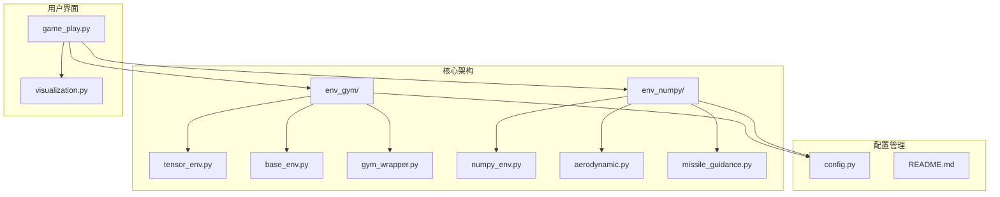

**图表来源**
- [env_gym/tensor_env.py](file://env_gym/tensor_env.py#L1-L772)
- [env_numpy/numpy_env.py](file://env_numpy/numpy_env.py#L1-L365)
- [env_gym/base_env.py](file://env_gym/base_env.py#L1-L96)
- [game_play.py](file://game_play.py#L1-L331)

**章节来源**
- [README.md](file://README.md#L64-L74)

## 核心组件

### 基础环境接口

项目的核心是统一的环境接口基类，定义了所有环境实现必须遵循的标准规范：

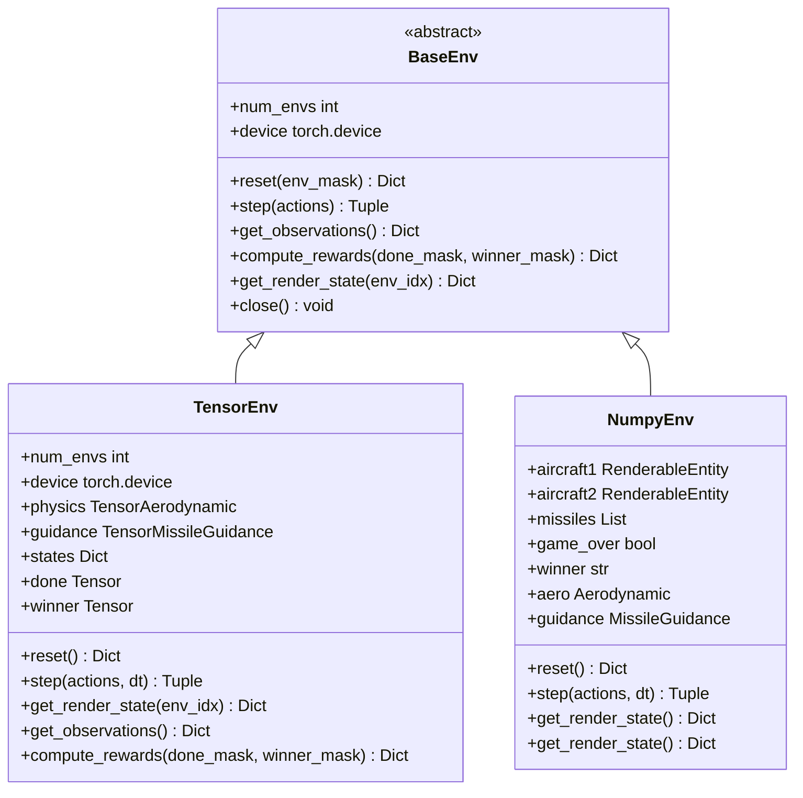

**图表来源**
- [env_gym/base_env.py](file://env_gym/base_env.py#L12-L95)
- [env_gym/tensor_env.py](file://env_gym/tensor_env.py#L206-L248)
- [env_numpy/numpy_env.py](file://env_numpy/numpy_env.py#L49-L94)

### 物理计算模块

两个后端都实现了相似的物理计算框架，但采用了不同的实现方式：

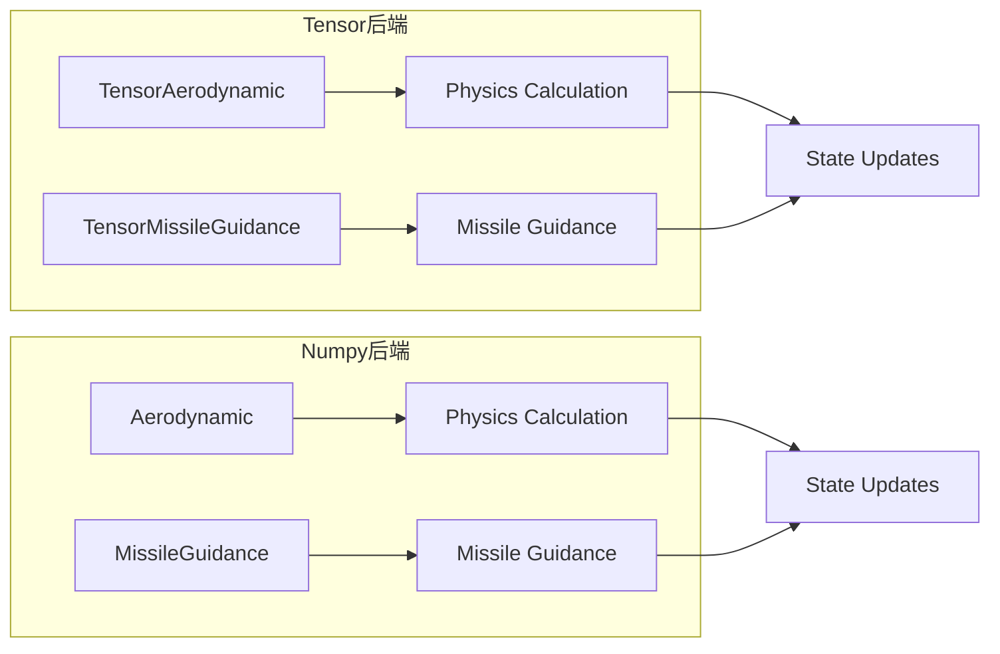

**图表来源**
- [env_gym/tensor_env.py](file://env_gym/tensor_env.py#L15-L118)
- [env_numpy/aerodynamic.py](file://env_numpy/aerodynamic.py#L16-L185)

**章节来源**
- [env_gym/base_env.py](file://env_gym/base_env.py#L12-L95)
- [env_gym/tensor_env.py](file://env_gym/tensor_env.py#L15-L248)
- [env_numpy/numpy_env.py](file://env_numpy/numpy_env.py#L49-L94)

## 架构概览

双后端架构的核心设计理念是"统一接口，差异化实现"。通过继承统一的BaseEnv基类，两种后端实现了完全一致的API，使得用户可以在不同后端之间无缝切换。

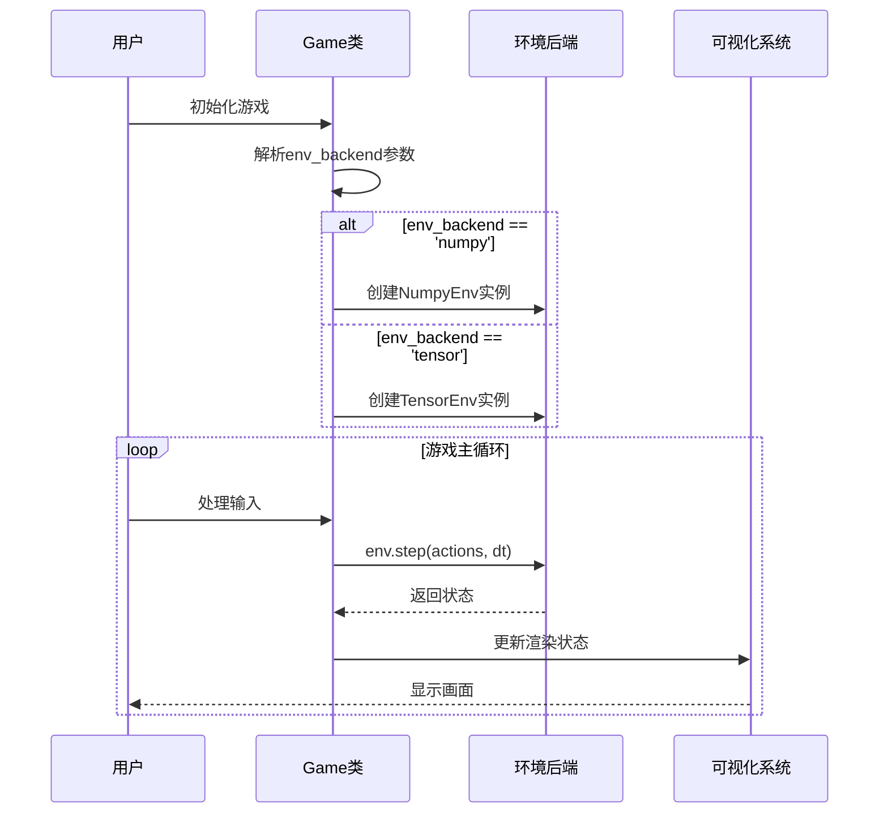

**图表来源**
- [game_play.py](file://game_play.py#L112-L121)
- [game_play.py](file://game_play.py#L290-L309)

## 详细组件分析

### Tensor后端实现

Tensor后端是整个系统的核心，专门针对大规模RL训练进行了优化：

#### 核心特性

1. **多环境并行**：支持同时运行数千个环境实例
2. **GPU加速**：利用PyTorch的CUDA能力实现高性能计算
3. **自动微分**：为强化学习算法提供梯度计算支持
4. **批量处理**：所有计算都以张量形式进行，充分利用硬件并行性

#### 关键组件

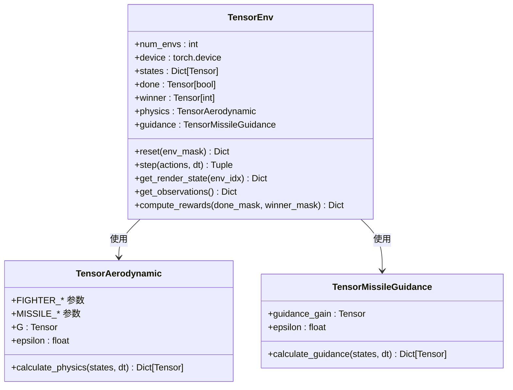

**图表来源**
- [env_gym/tensor_env.py](file://env_gym/tensor_env.py#L206-L248)
- [env_gym/tensor_env.py](file://env_gym/tensor_env.py#L15-L118)
- [env_gym/tensor_env.py](file://env_gym/tensor_env.py#L121-L204)

#### 物理计算流程

Tensor后端的物理计算采用了高度优化的向量化实现：

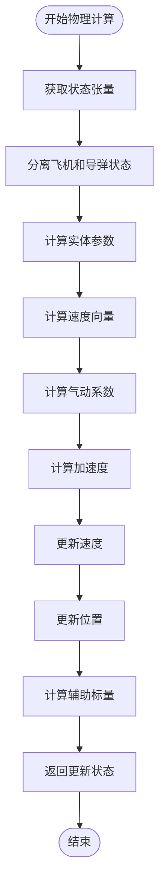

**图表来源**
- [env_gym/tensor_env.py](file://env_gym/tensor_env.py#L38-L118)

**章节来源**
- [env_gym/tensor_env.py](file://env_gym/tensor_env.py#L206-L772)

### Numpy后端实现

Numpy后端专注于提供最佳的用户体验和调试能力：

#### 核心特性

1. **直观的数据结构**：使用Python字典和类，便于理解和调试
2. **实时交互**：为game_play提供了流畅的用户交互体验
3. **详细的可视化**：支持丰富的渲染状态和轨迹追踪
4. **稳定的性能**：在单环境场景下表现稳定可靠

#### 关键组件

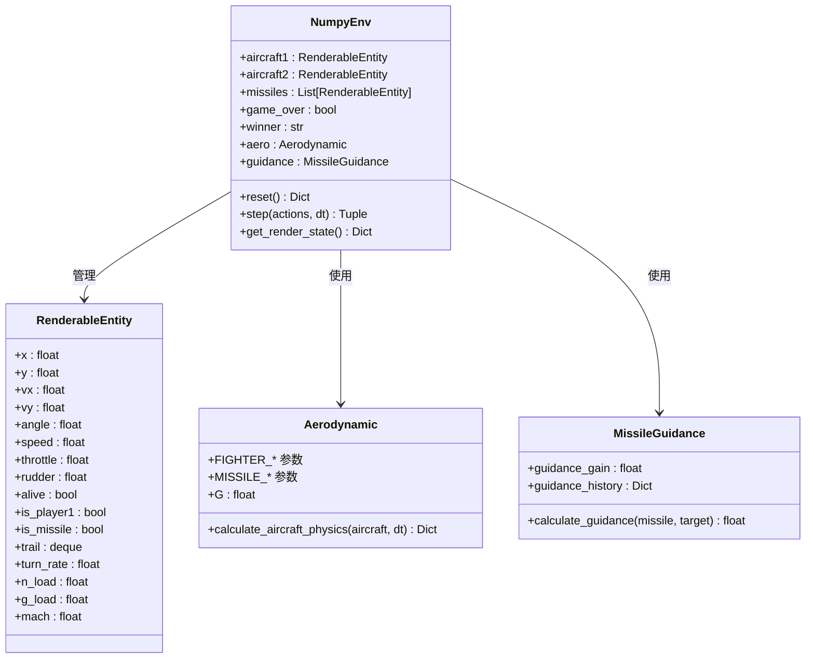

**图表来源**
- [env_numpy/numpy_env.py](file://env_numpy/numpy_env.py#L49-L94)
- [env_numpy/numpy_env.py](file://env_numpy/numpy_env.py#L16-L47)
- [env_numpy/aerodynamic.py](file://env_numpy/aerodynamic.py#L16-L39)
- [env_numpy/missile_guidance.py](file://env_numpy/missile_guidance.py#L7-L16)

**章节来源**
- [env_numpy/numpy_env.py](file://env_numpy/numpy_env.py#L49-L365)
- [env_numpy/aerodynamic.py](file://env_numpy/aerodynamic.py#L16-L239)
- [env_numpy/missile_guidance.py](file://env_numpy/missile_guidance.py#L7-L77)

## 双后端对比分析

### 性能对比

| 特性 | Tensor后端 | Numpy后端 |
|------|------------|-----------|
| **计算设备** | GPU (CUDA) | CPU |
| **并行能力** | 多环境并行 (数千个) | 单环境 |
| **内存使用** | 高 (GPU内存) | 低 (CPU内存) |
| **计算速度** | 极高 (GPU并行) | 中等 (CPU串行) |
| **开发效率** | 较低 (复杂API) | 高 (直观易用) |

### 功能对比

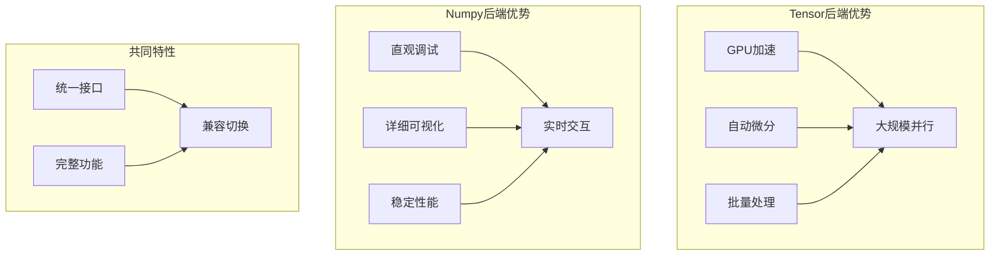

### 适用场景

- **Tensor后端**：RL算法训练、大规模仿真、性能基准测试
- **Numpy后端**：算法开发调试、可视化演示、教学展示

**章节来源**
- [README.md](file://README.md#L96-L104)

## 接口兼容性设计

双后端架构最核心的设计是实现了完全一致的接口，使得用户无需修改代码即可在不同后端之间切换。

### 统一接口规范

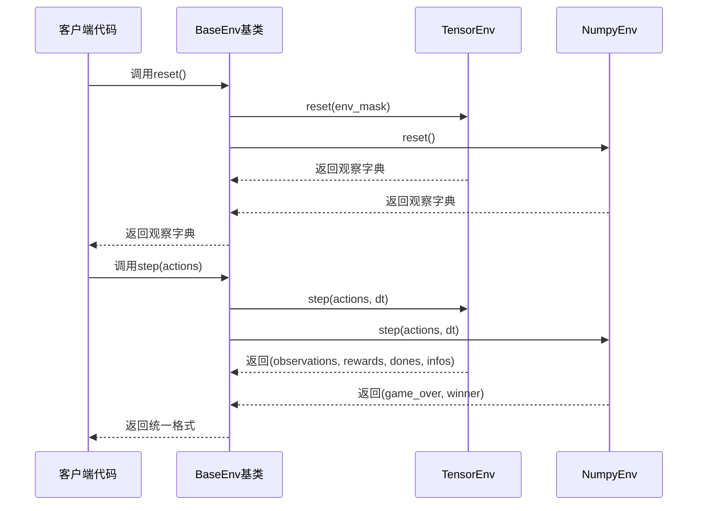

**图表来源**
- [env_gym/base_env.py](file://env_gym/base_env.py#L15-L64)
- [env_gym/tensor_env.py](file://env_gym/tensor_env.py#L340-L417)
- [env_numpy/numpy_env.py](file://env_numpy/numpy_env.py#L96-L176)

### 动态环境创建

game_play.py展示了如何根据env_backend参数动态创建相应的环境实例：

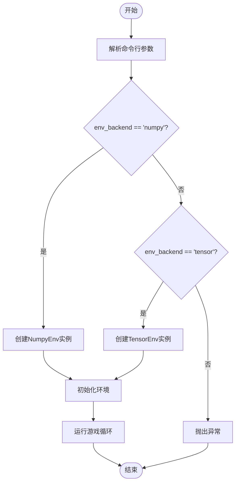

**图表来源**
- [game_play.py](file://game_play.py#L112-L121)

**章节来源**
- [game_play.py](file://game_play.py#L112-L121)
- [env_gym/base_env.py](file://env_gym/base_env.py#L15-L64)

## 工作流支持

双后端架构完美支持从算法开发到大规模训练的完整工作流程：

### 开发阶段

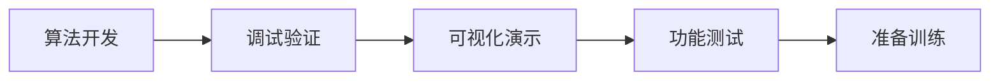

### 训练阶段

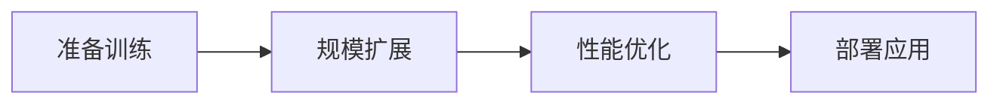

### 具体实现

1. **算法开发**：使用Numpy后端进行快速迭代和调试
2. **功能验证**：通过可视化界面确认算法行为
3. **性能测试**：在Tensor后端上进行大规模并行测试
4. **生产部署**：根据需求选择合适的后端进行部署

**章节来源**
- [README.md](file://README.md#L28-L62)

## 性能考量

### Tensor后端性能优化

Tensor后端采用了多项性能优化技术：

1. **向量化计算**：所有物理计算都使用PyTorch张量进行
2. **GPU并行**：充分利用CUDA核心进行并行计算
3. **内存优化**：合理管理GPU内存，避免内存泄漏
4. **批处理优化**：最大化利用硬件并行能力

### Numpy后端性能特点

Numpy后端虽然在绝对性能上不如Tensor后端，但具有以下优势：

1. **开发效率**：代码简洁，易于理解和调试
2. **稳定性**：在单环境场景下表现稳定可靠
3. **资源占用**：CPU占用率低，适合长时间运行
4. **兼容性**：与Python生态系统兼容性好

## 故障排除指南

### 常见问题及解决方案

#### 环境切换问题

**问题**：切换后端时出现接口不匹配错误

**解决方案**：
1. 确保使用统一的BaseEnv接口
2. 检查环境初始化参数
3. 验证返回值格式一致性

#### 性能问题

**问题**：Tensor后端运行缓慢

**解决方案**：
1. 检查GPU驱动和CUDA版本
2. 优化batch大小
3. 确保正确使用GPU内存

#### 内存问题

**问题**：GPU内存不足

**解决方案**：
1. 减少并行环境数量
2. 优化张量形状
3. 及时清理不需要的张量

**章节来源**
- [env_gym/tensor_env.py](file://env_gym/tensor_env.py#L206-L248)
- [env_numpy/numpy_env.py](file://env_numpy/numpy_env.py#L49-L94)

## 结论

midrangeRL的双后端架构设计体现了现代AI系统开发的最佳实践。通过统一接口设计和差异化实现，该项目成功地平衡了开发效率和运行性能。

### 主要优势

1. **灵活性**：用户可以根据需求在不同后端之间无缝切换
2. **完整性**：支持从开发调试到大规模训练的完整工作流程
3. **可扩展性**：基于统一接口的设计便于未来功能扩展
4. **教育价值**：清晰的架构设计有助于理解双后端系统的原理

### 技术亮点

1. **接口抽象**：通过BaseEnv基类实现了完美的接口抽象
2. **性能优化**：Tensor后端充分利用了现代硬件的并行能力
3. **用户体验**：Numpy后端提供了优秀的开发和调试体验
4. **架构设计**：模块化设计便于维护和扩展

这种双后端架构为其他AI项目提供了宝贵的参考，展示了如何在保持功能完整性的同时实现最佳的开发和运行体验。