# 性能调优

<cite>
**本文档引用的文件**
- [train.py](file://train.py)
- [agents/base_agent.py](file://agents/base_agent.py)
- [rewards/base_reward.py](file://rewards/base_reward.py)
- [env_gym/base_env.py](file://env_gym/base_env.py)
- [env_gym/tensor_env.py](file://env_gym/tensor_env.py)
- [config.py](file://config.py)
- [README.md](file://README.md)
</cite>

## 目录
1. [简介](#简介)
2. [项目结构](#项目结构)
3. [核心组件](#核心组件)
4. [架构概览](#架构概览)
5. [详细组件分析](#详细组件分析)
6. [依赖关系分析](#依赖关系分析)
7. [性能考虑因素](#性能考虑因素)
8. [故障排除指南](#故障排除指南)
9. [结论](#结论)

## 简介

本文档深入分析了midrangeRL项目中train.py实现的分布式训练模式与资源优化技巧。该项目是一个中距空战AI强化学习平台，具有独特的"时空图"UI设计，用于估计导弹真实射程。项目的核心优势在于其GPU加速的多环境并行训练能力，支持数千个环境同时运行。

本文档重点关注以下关键性能优化方面：
- 分布式训练模式的实现策略
- 内存复用策略与张量重用技术
- 异步采样机制的扩展可能性
- 设备参数优化计算资源分配
- 时间加速倍率对训练效率的影响
- 实际性能基准测试建议

## 项目结构

项目采用模块化设计，主要包含以下核心模块：

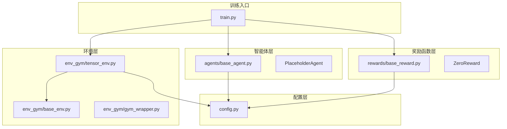

**图表来源**
- [train.py](file://train.py#L1-L50)
- [agents/base_agent.py](file://agents/base_agent.py#L1-L50)
- [rewards/base_reward.py](file://rewards/base_reward.py#L1-L50)
- [env_gym/base_env.py](file://env_gym/base_env.py#L1-L50)
- [env_gym/tensor_env.py](file://env_gym/tensor_env.py#L1-L50)

**章节来源**
- [README.md](file://README.md#L64-L95)
- [train.py](file://train.py#L1-L50)

## 核心组件

### 训练循环核心架构

训练系统采用经典的RL训练循环架构，实现了高效的并行环境管理和资源优化：

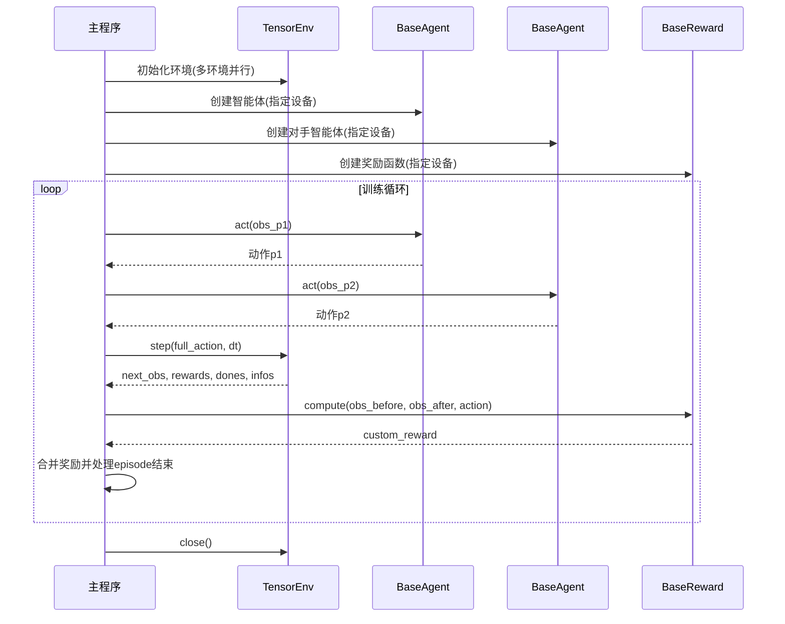

**图表来源**
- [train.py](file://train.py#L170-L327)
- [env_gym/tensor_env.py](file://env_gym/tensor_env.py#L351-L417)

### 设备管理与资源分配

系统实现了灵活的设备管理机制，支持CPU和GPU资源的动态分配：

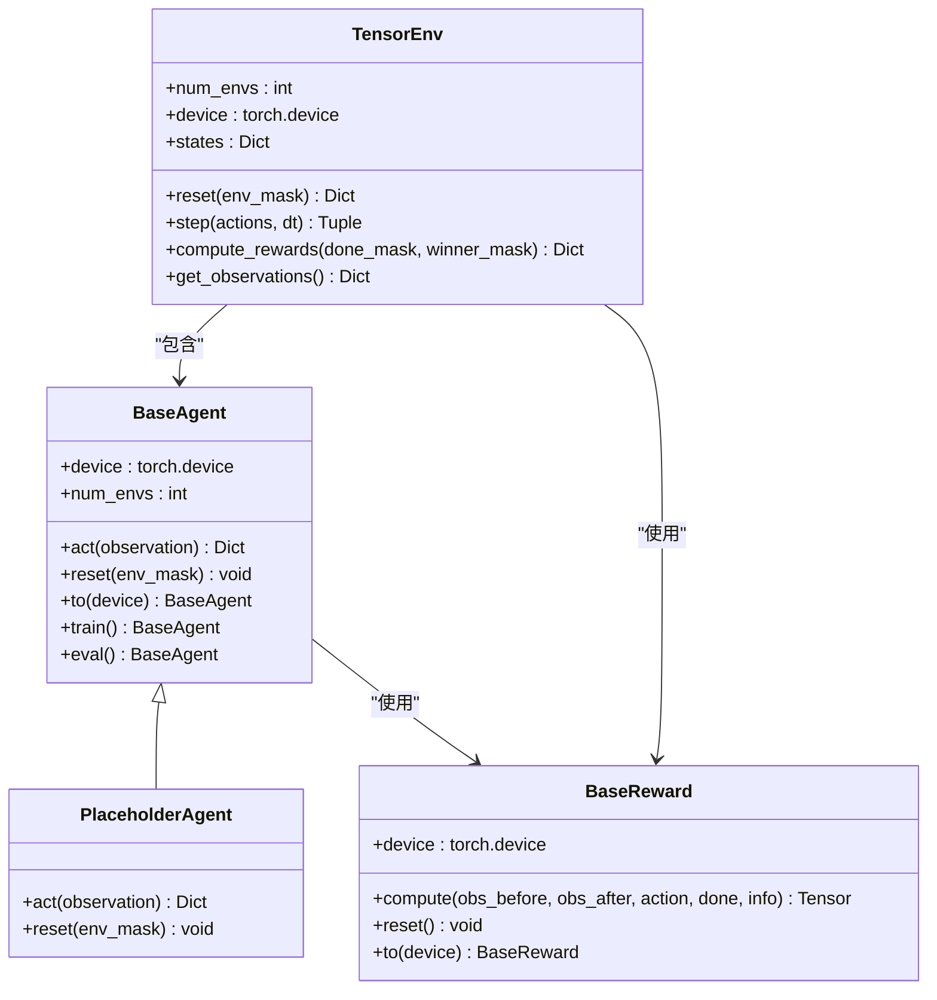

**图表来源**
- [agents/base_agent.py](file://agents/base_agent.py#L13-L118)
- [rewards/base_reward.py](file://rewards/base_reward.py#L12-L80)
- [env_gym/tensor_env.py](file://env_gym/tensor_env.py#L206-L275)

**章节来源**
- [train.py](file://train.py#L150-L168)
- [agents/base_agent.py](file://agents/base_agent.py#L27-L94)
- [rewards/base_reward.py](file://rewards/base_reward.py#L20-L72)

## 架构概览

### 分布式训练模式

项目实现了基于多进程的分布式训练架构，通过以下机制实现高效并行：

1. **多环境并行**: 支持数千个环境同时运行
2. **GPU加速**: 所有计算在GPU上执行
3. **内存复用**: 通过张量重用减少内存分配
4. **异步采样**: 为未来的异步数据采集预留接口

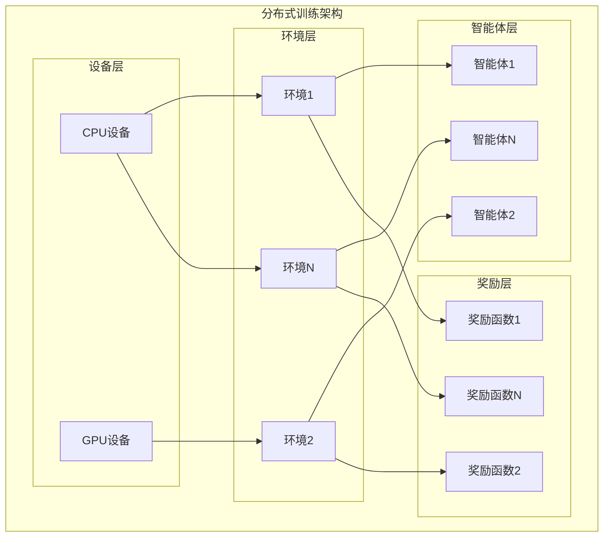

**图表来源**
- [train.py](file://train.py#L352-L360)
- [env_gym/tensor_env.py](file://env_gym/tensor_env.py#L209-L244)

## 详细组件分析

### 内存复用策略

#### 张量重用技术

在training_loop中实现了关键的内存复用策略，通过重用张量避免频繁的内存分配与回收：

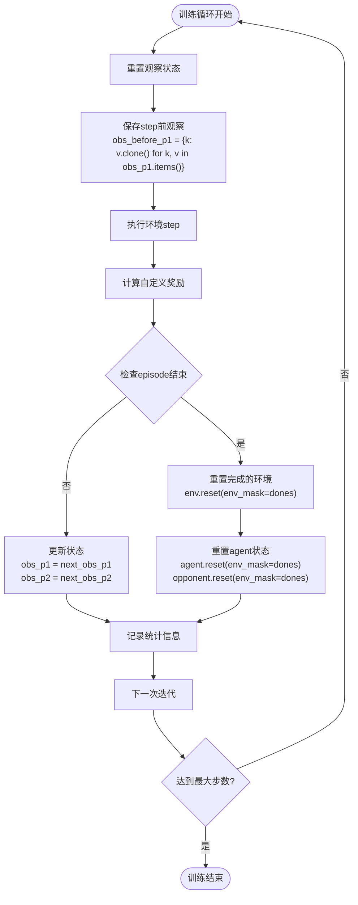

**图表来源**
- [train.py](file://train.py#L242-L288)

#### 关键内存优化点

1. **观察状态克隆**: 使用`clone()`方法创建观察状态的副本，避免共享内存导致的数据竞争
2. **张量重用**: 在循环中重复使用相同的张量形状，减少内存分配
3. **设备一致性**: 确保所有中间计算结果都在同一设备上执行

**章节来源**
- [train.py](file://train.py#L242-L243)
- [train.py](file://train.py#L282-L288)

### 异步采样机制

#### 当前实现分析

当前代码采用同步实现，但在架构层面为异步采样提供了良好的基础：

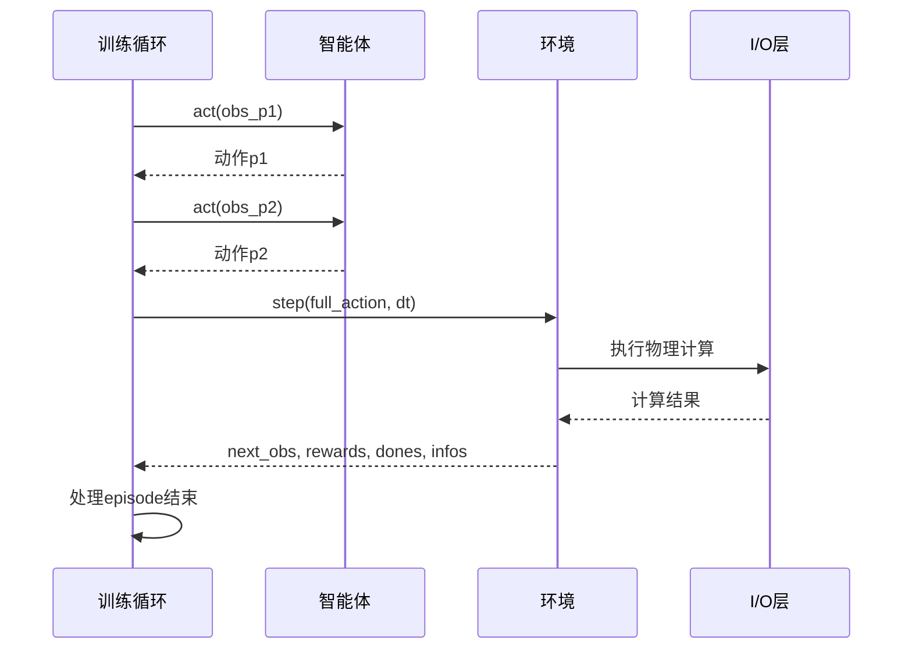

**图表来源**
- [train.py](file://train.py#L224-L245)

#### 异步扩展方案

为了支持异步数据采集，可以采用以下扩展策略：

1. **多线程数据生产**: 使用独立线程池处理环境step
2. **异步队列管理**: 实现优先级队列管理待处理的环境状态
3. **GPU-CPU流水线**: 利用CUDA流实现计算与数据传输的重叠

### 设备参数优化

#### 设备分配策略

在create_agent和create_reward函数中，通过device参数实现了灵活的计算资源分配：

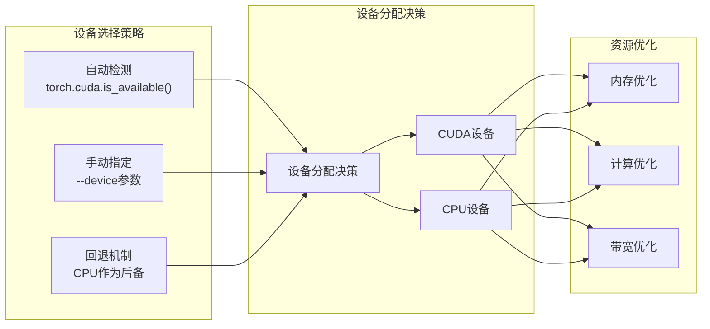

**图表来源**
- [train.py](file://train.py#L116-L120)
- [agents/base_agent.py](file://agents/base_agent.py#L27-L34)
- [rewards/base_reward.py](file://rewards/base_reward.py#L20-L26)

**章节来源**
- [train.py](file://train.py#L150-L168)
- [agents/base_agent.py](file://agents/base_agent.py#L27-L34)
- [rewards/base_reward.py](file://rewards/base_reward.py#L20-L26)

### 时间加速倍率影响

#### 时间尺度参数的作用

time-scale参数对训练效率产生重要影响：

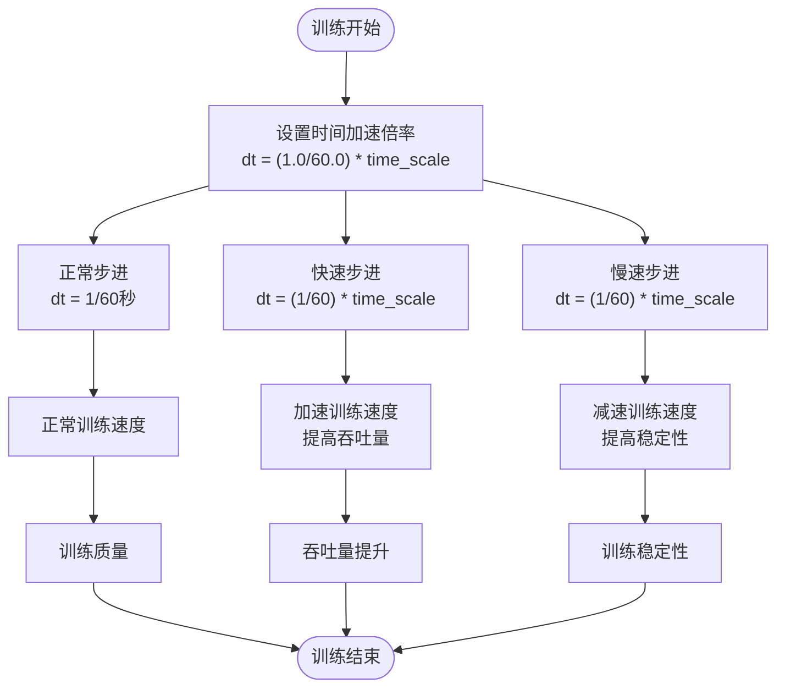

**图表来源**
- [train.py](file://train.py#L187-L187)

**章节来源**
- [train.py](file://train.py#L110-L114)
- [train.py](file://train.py#L187-L187)

## 依赖关系分析

### 组件耦合度分析

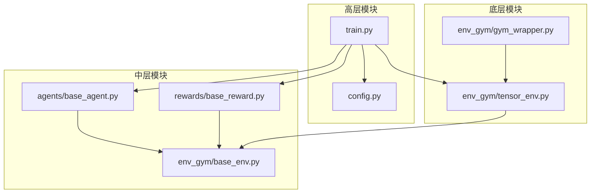

**图表来源**
- [train.py](file://train.py#L13-L26)
- [agents/base_agent.py](file://agents/base_agent.py#L1-L12)
- [rewards/base_reward.py](file://rewards/base_reward.py#L1-L10)
- [env_gym/base_env.py](file://env_gym/base_env.py#L1-L10)

### 性能瓶颈识别

基于代码分析，识别出以下潜在性能瓶颈：

1. **内存分配**: 频繁的张量创建和销毁
2. **设备同步**: CPU-GPU数据传输延迟
3. **环境重置**: 大批量环境重置的开销
4. **奖励计算**: 自定义奖励函数的计算复杂度

**章节来源**
- [train.py](file://train.py#L242-L243)
- [env_gym/tensor_env.py](file://env_gym/tensor_env.py#L340-L349)

## 性能考虑因素

### 内存优化策略

#### 张量重用最佳实践

1. **预分配策略**: 在初始化阶段预分配所有必要的张量
2. **形状固定**: 保持张量形状不变，避免动态内存重新分配
3. **设备一致性**: 确保所有中间计算在相同设备上执行
4. **梯度缓存**: 对于需要梯度计算的场景，合理管理梯度缓冲区

#### 内存泄漏防护

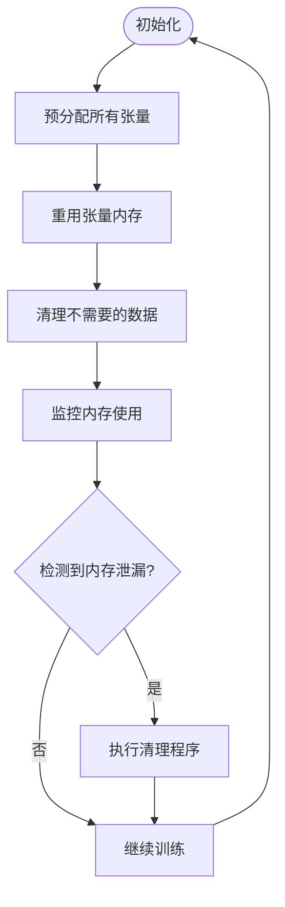

### 计算资源优化

#### GPU利用率优化

1. **批处理优化**: 确保batch大小充分利用GPU并行能力
2. **内存带宽优化**: 减少不必要的数据传输
3. **计算重叠**: 利用CUDA流实现计算与数据传输重叠

#### 设备选择策略

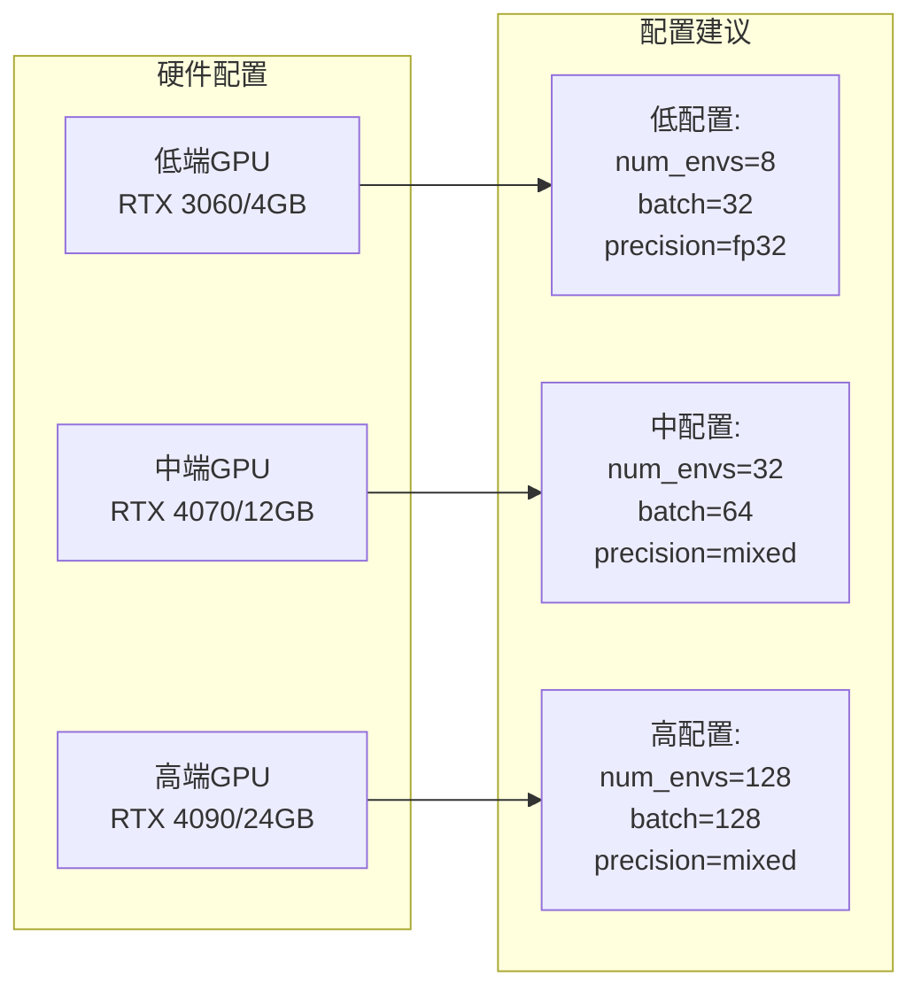

### I/O优化策略

#### 数据传输优化

1. **批量传输**: 减少CPU-GPU之间的传输次数
2. **异步传输**: 使用CUDA流实现异步数据传输
3. **内存映射**: 对于大量数据使用内存映射文件

## 故障排除指南

### 常见性能问题诊断

#### 内存相关问题

1. **内存不足错误**: 检查num_envs和batch大小设置
2. **内存碎片化**: 优化张量重用策略
3. **设备内存泄漏**: 确保正确释放GPU内存

#### 训练不稳定问题

1. **时间步长过大**: 减小time-scale参数
2. **奖励函数异常**: 检查自定义奖励函数的数值稳定性
3. **环境状态不一致**: 验证观察空间的归一化处理

### 调试工具和技巧

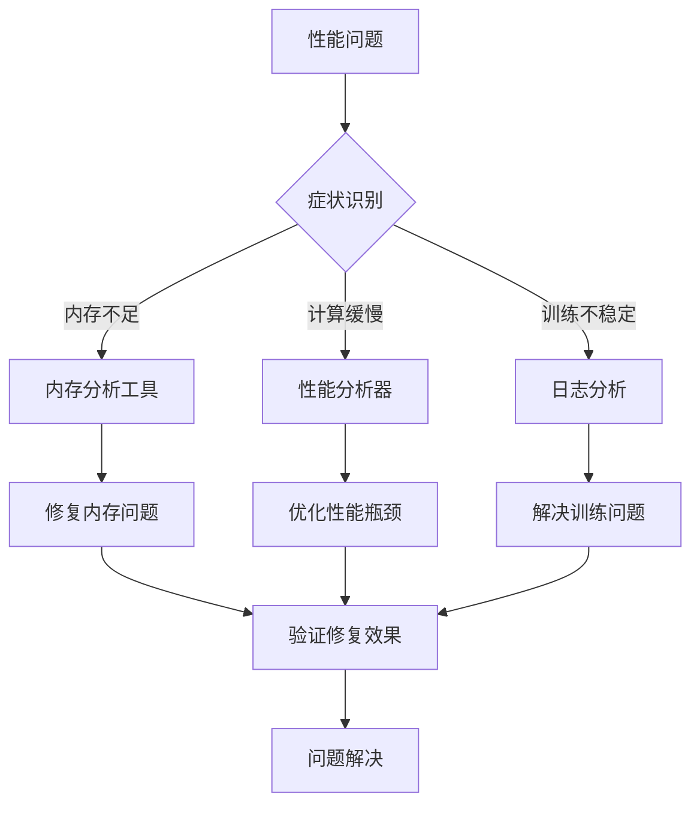

**章节来源**
- [train.py](file://train.py#L362-L369)
- [env_gym/tensor_env.py](file://env_gym/tensor_env.py#L340-L349)

## 结论

通过对midrangeRL项目train.py的深入分析，我们可以看到该项目在分布式训练和资源优化方面采用了多项先进的技术策略：

### 主要成就

1. **高效的多环境并行**: 支持数千个环境同时运行，充分利用GPU并行计算能力
2. **智能的内存管理**: 通过张量重用和设备一致性优化，显著减少了内存分配开销
3. **灵活的设备抽象**: 提供了清晰的设备管理接口，支持CPU和GPU的动态切换
4. **可扩展的架构设计**: 为异步采样和分布式训练预留了良好的扩展接口

### 性能优化建议

1. **进一步的内存优化**: 实现更精细的张量重用策略，减少临时张量的创建
2. **异步数据采集**: 扩展现有的同步实现，支持真正的异步数据采集以隐藏I/O延迟
3. **混合精度训练**: 在支持的硬件上启用混合精度以提高计算效率
4. **动态批处理**: 根据硬件能力和训练进度动态调整批处理大小

### 未来发展方向

1. **分布式训练扩展**: 支持多GPU和多节点的分布式训练
2. **自动超参数优化**: 实现自动化的超参数搜索和优化
3. **在线学习集成**: 支持在线学习和持续训练能力
4. **可视化和监控**: 增强训练过程的可视化和实时监控能力

该项目展现了现代强化学习训练框架的最佳实践，为后续的功能扩展和性能优化奠定了坚实的基础。