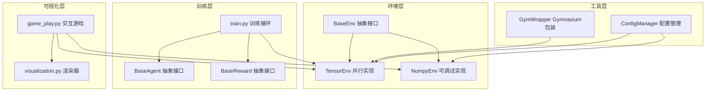
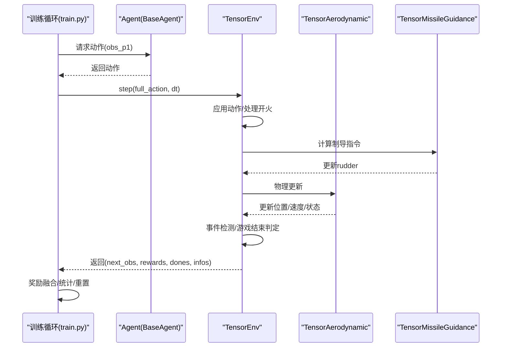
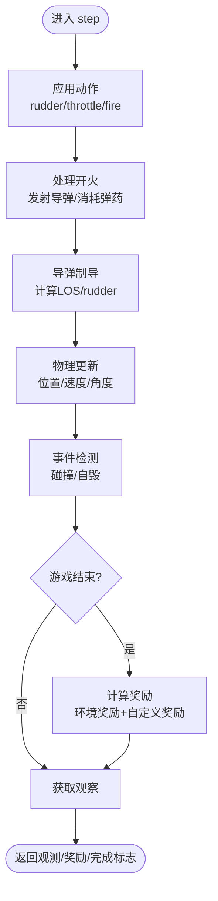
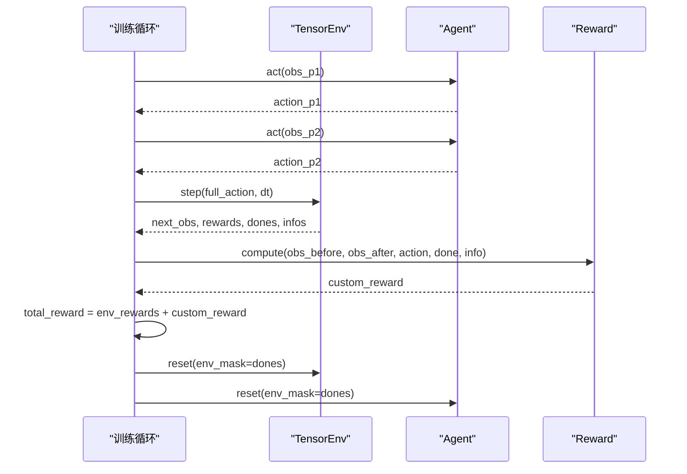
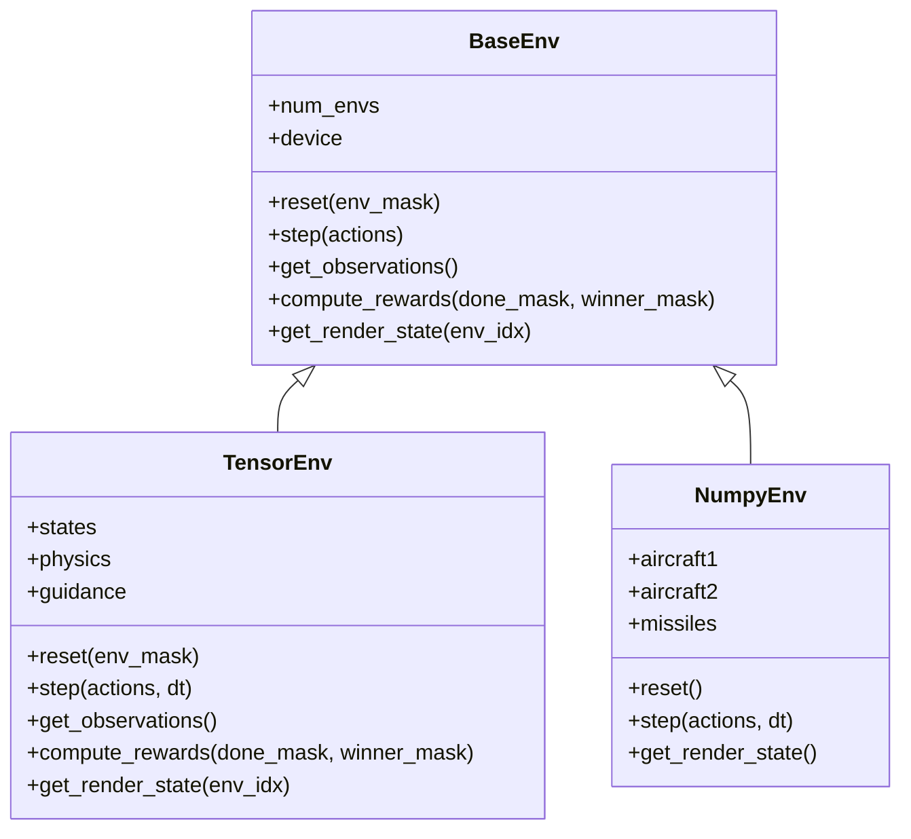
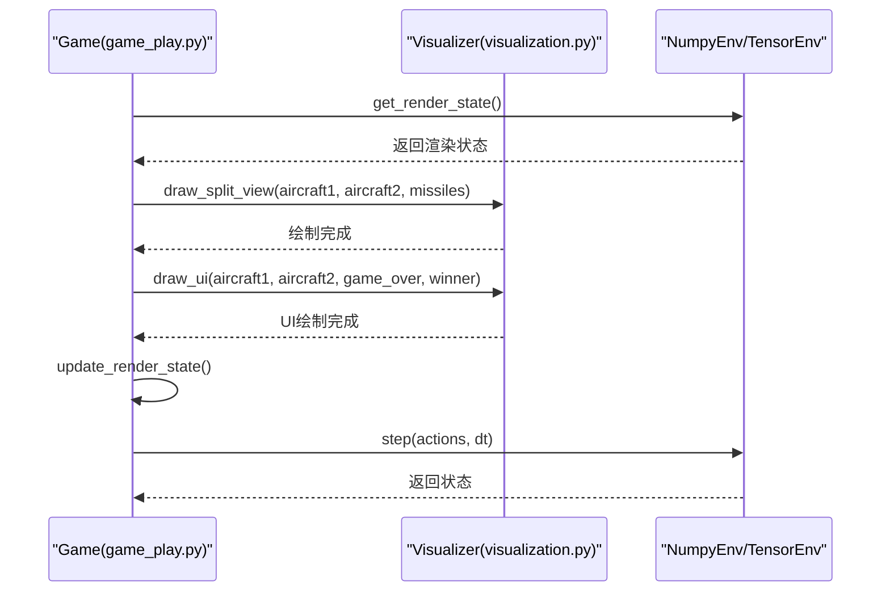
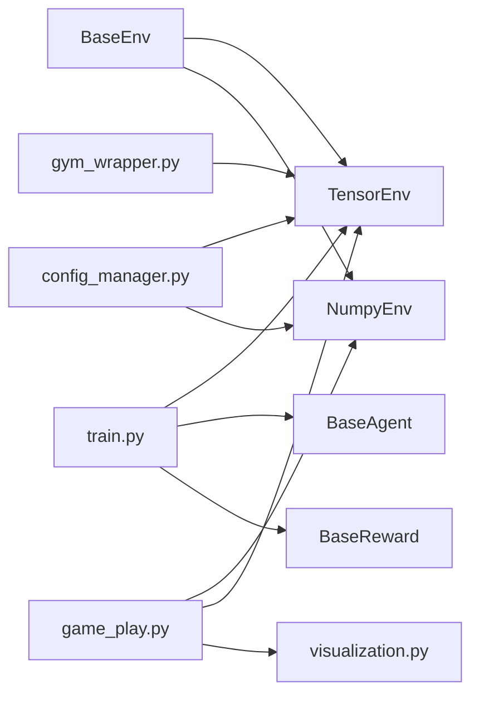

# 高级主题

<cite>
**本文引用的文件**
- [env_gym/tensor_env.py](file://env_gym/tensor_env.py)
- [env_gym/base_env.py](file://env_gym/base_env.py)
- [env_gym/gym_wrapper.py](file://env_gym/gym_wrapper.py)
- [env_gym/config_manager.py](file://env_gym/config_manager.py)
- [env_numpy/numpy_env.py](file://env_numpy/numpy_env.py)
- [train.py](file://train.py)
- [game_play.py](file://game_play.py)
- [visualization.py](file://visualization.py)
- [agents/base_agent.py](file://agents/base_agent.py)
- [rewards/base_reward.py](file://rewards/base_reward.py)
- [config.py](file://config.py)
- [tests/test_tensor_env.py](file://tests/test_tensor_env.py)
</cite>

## 目录
1. [简介](#简介)
2. [项目结构](#项目结构)
3. [核心组件](#核心组件)
4. [架构总览](#架构总览)
5. [详细组件分析](#详细组件分析)
6. [依赖关系分析](#依赖关系分析)
7. [性能考量](#性能考量)
8. [故障排查指南](#故障排查指南)
9. [结论](#结论)
10. [附录](#附录)

## 简介
本高级主题文档聚焦于多环境并行训练机制在 tensor_env 中的实现，涵盖张量批处理、状态隔离与梯度同步策略；对比双后端架构（tensor 后端的高性能与 numpy 后端的可调试性）的设计权衡；解析 train.py 中分布式训练模式与资源优化技巧（如内存复用、异步采样）；说明 game_play.py 中分屏渲染与实时状态监控的实现原理及其在算法行为分析与故障诊断中的作用。

## 项目结构
该项目围绕“统一环境接口 + 双后端实现 + 可视化与训练管线”组织：
- 环境层：抽象基类定义统一接口，tensor_env 提供高性能并行实现，numpy_env 提供可调试的纯 Python 实现。
- 训练层：train.py 提供训练循环骨架，支持多环境并行、奖励融合与统计输出。
- 可视化层：game_play.py 提供交互式分屏渲染，支持两种后端切换与轨迹维护。
- 工具层：gym_wrapper 提供 Gymnasium 兼容包装，config_manager 提供统一配置管理。

图表来源
- [env_gym/base_env.py](file://env_gym/base_env.py#L12-L95)
- [env_gym/tensor_env.py](file://env_gym/tensor_env.py#L206-L772)
- [env_numpy/numpy_env.py](file://env_numpy/numpy_env.py#L49-L365)
- [train.py](file://train.py#L170-L374)
- [game_play.py](file://game_play.py#L58-L331)
- [visualization.py](file://visualization.py#L8-L280)
- [env_gym/gym_wrapper.py](file://env_gym/gym_wrapper.py#L15-L181)
- [env_gym/config_manager.py](file://env_gym/config_manager.py#L11-L102)

章节来源
- [env_gym/base_env.py](file://env_gym/base_env.py#L12-L95)
- [env_gym/tensor_env.py](file://env_gym/tensor_env.py#L206-L772)
- [env_numpy/numpy_env.py](file://env_numpy/numpy_env.py#L49-L365)
- [train.py](file://train.py#L170-L374)
- [game_play.py](file://game_play.py#L58-L331)
- [visualization.py](file://visualization.py#L8-L280)
- [env_gym/gym_wrapper.py](file://env_gym/gym_wrapper.py#L15-L181)
- [env_gym/config_manager.py](file://env_gym/config_manager.py#L11-L102)

## 核心组件
- 统一环境接口：定义了 reset、step、get_observations、compute_rewards、get_render_state 等标准方法，确保 tensor_env 与 numpy_env 的接口一致性。
- TensorEnv 并行实现：基于 PyTorch 的多环境并行，使用统一的实体槽位系统与张量批处理，支持状态隔离与事件检测。
- NumpyEnv 可调试实现：纯 Python 实现，便于人类可读的调试与可视化，适合教学与验证。
- 训练循环：在 train.py 中实现多环境并行训练骨架，支持奖励融合、统计输出与环境重置。
- 可视化与交互：game_play.py 提供分屏渲染与实时状态监控，支持两种后端切换与轨迹维护。
- Gymnasium 兼容包装：gym_wrapper 提供 Gymnasium 接口，便于集成主流 RL 框架。
- 配置管理：config_manager 提供统一配置加载、保存与合并能力。

章节来源
- [env_gym/base_env.py](file://env_gym/base_env.py#L12-L95)
- [env_gym/tensor_env.py](file://env_gym/tensor_env.py#L206-L772)
- [env_numpy/numpy_env.py](file://env_numpy/numpy_env.py#L49-L365)
- [train.py](file://train.py#L170-L374)
- [game_play.py](file://game_play.py#L58-L331)
- [env_gym/gym_wrapper.py](file://env_gym/gym_wrapper.py#L15-L181)
- [env_gym/config_manager.py](file://env_gym/config_manager.py#L11-L102)

## 架构总览
TensorEnv 采用“模块化物理与制导 + 统一状态字典 + 批处理”的设计，将气动、制导、事件检测与奖励计算解耦为独立模块，通过张量批处理实现多环境并行。训练循环通过统一接口与奖励融合实现分布式训练模式，可视化层提供分屏渲染与轨迹维护，便于算法行为分析与故障诊断。

图表来源
- [train.py](file://train.py#L170-L327)
- [env_gym/tensor_env.py](file://env_gym/tensor_env.py#L351-L417)
- [env_gym/tensor_env.py](file://env_gym/tensor_env.py#L15-L118)
- [env_gym/tensor_env.py](file://env_gym/tensor_env.py#L121-L203)

## 详细组件分析

### 多环境并行训练机制与张量批处理
- 统一状态字典：TensorEnv 使用统一的实体槽位系统，状态以张量字典形式存储，维度为 [num_envs, max_entities]，实现状态隔离与批处理。
- 批处理与向量化：动作输入、状态更新、事件检测与奖励计算均通过张量广播与掩码操作实现，避免显式循环。
- 状态隔离：通过布尔掩码与逻辑运算区分激活实体与非激活实体，确保多环境状态互不影响。
- 实体槽位系统：固定索引（如 P1_IDX、P2_IDX、FIRST_MISSILE_IDX）保证玩家与导弹在统一空间内的定位与追踪。

图表来源
- [env_gym/tensor_env.py](file://env_gym/tensor_env.py#L351-L417)
- [env_gym/tensor_env.py](file://env_gym/tensor_env.py#L419-L502)
- [env_gym/tensor_env.py](file://env_gym/tensor_env.py#L503-L556)
- [env_gym/tensor_env.py](file://env_gym/tensor_env.py#L557-L591)
- [env_gym/tensor_env.py](file://env_gym/tensor_env.py#L593-L625)

章节来源
- [env_gym/tensor_env.py](file://env_gym/tensor_env.py#L250-L275)
- [env_gym/tensor_env.py](file://env_gym/tensor_env.py#L351-L417)
- [env_gym/tensor_env.py](file://env_gym/tensor_env.py#L419-L502)
- [env_gym/tensor_env.py](file://env_gym/tensor_env.py#L503-L556)
- [env_gym/tensor_env.py](file://env_gym/tensor_env.py#L557-L591)
- [env_gym/tensor_env.py](file://env_gym/tensor_env.py#L593-L625)

### 状态隔离与梯度同步策略
- 状态隔离：通过布尔掩码与逻辑运算区分激活实体与非激活实体，确保多环境状态互不影响；done 掩码与 winner 掩码用于区分已完成的环境。
- 梯度同步策略：在训练循环中，通过统一接口与奖励融合实现分布式训练模式。训练循环中对已完成的环境进行重置，避免梯度传播到已完成的样本上，从而实现“软同步”。

图表来源
- [train.py](file://train.py#L170-L327)

章节来源
- [train.py](file://train.py#L170-L327)

### 双后端架构的设计权衡
- Tensor 后端（高性能）：基于 PyTorch 的张量批处理，支持大规模并行与 GPU 加速，适合高吞吐量训练；但调试困难，需依赖日志与可视化。
- Numpy 后端（可调试性）：纯 Python 实现，便于人类可读的调试与可视化，适合教学与验证；但无法直接并行，性能受限。
- 设计权衡：通过统一接口与 Gymnasium 包装，可在训练阶段使用 tensor 后端，在调试与可视化阶段切换到 numpy 后端。

图表来源
- [env_gym/base_env.py](file://env_gym/base_env.py#L12-L95)
- [env_gym/tensor_env.py](file://env_gym/tensor_env.py#L206-L772)
- [env_numpy/numpy_env.py](file://env_numpy/numpy_env.py#L49-L365)

章节来源
- [env_gym/tensor_env.py](file://env_gym/tensor_env.py#L206-L772)
- [env_numpy/numpy_env.py](file://env_numpy/numpy_env.py#L49-L365)
- [env_gym/base_env.py](file://env_gym/base_env.py#L12-L95)

### 分布式训练模式与资源优化技巧
- 分布式训练模式：通过统一接口与 Gymnasium 包装，支持在单机多卡或多机多卡环境下扩展；训练循环中对已完成的环境进行重置，避免无效样本参与训练。
- 资源优化技巧：
  - 内存复用：统一状态字典与张量形状，避免频繁分配与释放内存。
  - 异步采样：通过多环境并行与批处理，减少采样等待时间；在 game_play.py 中通过轨迹维护与边缘检测实现更自然的交互体验。
  - 奖励融合：将环境奖励与自定义奖励相加，便于快速迭代奖励设计。

章节来源
- [train.py](file://train.py#L170-L327)
- [env_gym/gym_wrapper.py](file://env_gym/gym_wrapper.py#L15-L181)

### 分屏渲染与实时状态监控
- 分屏渲染：game_play.py 通过 visualization.py 提供左右分屏视图，分别跟随红方与蓝方视角，支持网格、轨迹、速度矢量与标签显示。
- 实时状态监控：game_play.py 维护轨迹队列与状态更新计数器，定期更新飞机与导弹的轨迹，便于算法行为分析与故障诊断。
- 后端切换：game_play.py 支持 numpy 与 tensor 后端切换，便于在可调试与高性能之间权衡。

图表来源
- [game_play.py](file://game_play.py#L265-L319)
- [visualization.py](file://visualization.py#L163-L280)

章节来源
- [game_play.py](file://game_play.py#L58-L331)
- [visualization.py](file://visualization.py#L8-L280)

## 依赖关系分析
- 统一接口：BaseEnv 定义了所有环境实现必须遵循的标准接口，确保 TensorEnv 与 NumpyEnv 的可替换性。
- 训练循环依赖：train.py 依赖 BaseEnv、BaseAgent、BaseReward 与 TensorEnv，形成完整的训练闭环。
- 可视化依赖：game_play.py 依赖 NumpyEnv/TensorEnv 与 visualization.py，实现交互式分屏渲染。
- Gymnasium 兼容：gym_wrapper 依赖 TensorEnv，提供 Gymnasium 接口，便于集成主流 RL 框架。
- 配置管理：config_manager 为 TensorEnv 与 NumpyEnv 提供统一配置，支持加载、保存与合并。

图表来源
- [env_gym/base_env.py](file://env_gym/base_env.py#L12-L95)
- [env_gym/tensor_env.py](file://env_gym/tensor_env.py#L206-L772)
- [env_numpy/numpy_env.py](file://env_numpy/numpy_env.py#L49-L365)
- [train.py](file://train.py#L170-L374)
- [game_play.py](file://game_play.py#L58-L331)
- [visualization.py](file://visualization.py#L8-L280)
- [env_gym/gym_wrapper.py](file://env_gym/gym_wrapper.py#L15-L181)
- [env_gym/config_manager.py](file://env_gym/config_manager.py#L11-L102)

章节来源
- [env_gym/base_env.py](file://env_gym/base_env.py#L12-L95)
- [env_gym/tensor_env.py](file://env_gym/tensor_env.py#L206-L772)
- [env_numpy/numpy_env.py](file://env_numpy/numpy_env.py#L49-L365)
- [train.py](file://train.py#L170-L374)
- [game_play.py](file://game_play.py#L58-L331)
- [visualization.py](file://visualization.py#L8-L280)
- [env_gym/gym_wrapper.py](file://env_gym/gym_wrapper.py#L15-L181)
- [env_gym/config_manager.py](file://env_gym/config_manager.py#L11-L102)

## 性能考量
- 张量批处理：通过统一状态字典与向量化操作，最大化利用 GPU 并行能力，减少 Python 层循环开销。
- 内存复用：统一状态字典与固定实体槽位，避免频繁分配与释放内存，降低 GC 压力。
- 异步采样：多环境并行与批处理减少采样等待时间，提高吞吐量。
- 可视化性能：分屏渲染与轨迹维护采用队列与定时更新，避免每帧重复计算，提升渲染效率。

## 故障排查指南
- 状态异常：检查 done 掩码与 winner 掩码，确认已完成的环境已被正确重置。
- 奖励异常：核对环境奖励与自定义奖励的融合方式，确保奖励符号与数值合理。
- 可视化问题：检查轨迹队列与状态更新计数器，确认轨迹数据与实体状态一致。
- 配置问题：通过 config_manager 加载/保存配置，确保参数与预期一致。

章节来源
- [train.py](file://train.py#L266-L288)
- [game_play.py](file://game_play.py#L230-L264)
- [env_gym/config_manager.py](file://env_gym/config_manager.py#L48-L95)

## 结论
本项目通过统一环境接口与双后端实现，实现了高性能并行训练与可调试性的平衡。TensorEnv 的张量批处理与状态隔离为分布式训练提供了坚实基础；train.py 的训练循环与奖励融合支持高效的资源优化；game_play.py 的分屏渲染与实时状态监控为算法行为分析与故障诊断提供了直观手段。通过 Gymnasium 包装与配置管理，项目具备良好的扩展性与可维护性。

## 附录
- 测试用例：tests/test_tensor_env.py 提供单环境、多环境并行与导弹发射的测试，验证核心功能。
- 配置示例：config.py 与 config_manager.py 提供默认配置与加载/保存能力，便于快速启动与定制。

章节来源
- [tests/test_tensor_env.py](file://tests/test_tensor_env.py#L17-L139)
- [config.py](file://config.py#L7-L52)
- [env_gym/config_manager.py](file://env_gym/config_manager.py#L48-L95)